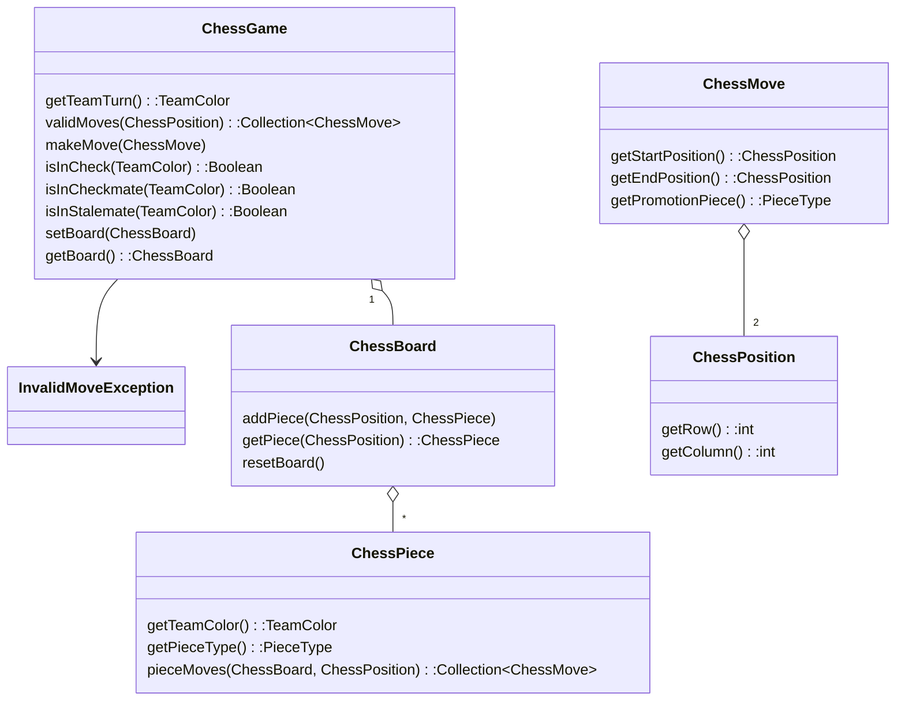

# ♕ Phase 0: Chess Moves

- [Chess Application Overview](../chess.md)
- 🖥️ [Videos](#videos)
- [TA Tips](../../instruction/chess-tips/chess-tips.md#phase-0---chess-moves): A collection of common problems for this phase

In this part of the Chess Project, you will implement a basic representation of the game of chess. This includes the setting up of the board and defining how pieces move.

> [!NOTE]
>
> Review the [Game of Chess](the-game-of-chess.md) instruction to learn how to set up the board and how each of the pieces move.

## Getting Started
To get started complete the follow the instructions:
[Getting Started](getting-started.md)

## Starter Code

To begin building your chess application, you must first follow the instructions in the [Getting Started Document](getting-started.md).

This provides you with an IntelliJ project that contains the following three modules.

| Phase      | Description                                                                                                                                                                         |
| ---------- | ----------------------------------------------------------------------------------------------------------------------------------------------------------------------------------- |
| **Server** | A program that handles network requests to create and play games. It stores games persistently in a database and sends out notifications to all the players of a game.              |
| **Client** | The command line program that players use to create and play a game of chess. The client communicates with your server over the network in order to play a game with other clients. |
| **Shared** | A code library that contains the rules and representation of a chess game that both the `client` and `server` use to exercise and validate game play.                               |


In this phase you will implement the shared code that defines the board, pieces, and the rules of chess. In later phases you will use the code you create to create a fully playable game.

The starter code contains the classes defined by the following diagram. However, instead of a full implementation, the methods all simply throw an exception if invoked. The classes are found in the `shared/src/main/java/chess` directory.



> [!NOTE]
>
> You are not limited to this representation. However, you must not change the existing class names or method signatures since they are used by the pass off tests. You will likely need to add new classes and methods to complete the work required by this phase.

## Chess Classes

### ChessGame

This class serves as the top-level management of the chess game. It is responsible for executing moves as well as recording the game status.

> [!IMPORTANT]
>
> Although the `ChessGame` class is presented now, it will not be used until **Phase 1. ChessGame**. Related tests will be [added to the working directory](../1-chess-game/getting-started.md) later.

### ChessBoard

This class stores all the uncaptured pieces in a Game. It needs to support adding and removing pieces for testing, as well as a `resetBoard()` method that sets the standard Chess starting configuration.

### ChessPiece

This class represents a single chess piece, with its corresponding type and team color. It contains the `PieceType` enumeration that defines the different types of pieces.

```java
public enum PieceType {
    KING,
    QUEEN,
    BISHOP,
    KNIGHT,
    ROOK,
    PAWN
}
```

`ChessPiece` implements rules that define how a piece moves independent of other chess rules such as whose turn it is, check, stalemate, or checkmate.

#### Key Methods

- **`pieceMoves`**: Given a board configuration, this method returns all the moves a specific piece can legally make independant of whose turn it is or if the King is being attacked. It considers the edges of the board and the location of both enemy and friendly pieces. In the next phase, you will implement `ChessGame.validMoves`, which considers not only how a piece moves, but all of the rules of chess.

### ChessMove

This class represents a possible move a chess piece could make. It contains the starting and ending positions. It also contains a field for the type of piece a pawn is being promoted to. If the move would not result in a pawn being promoted, the promotion type field should be null.

### ChessPosition

This represents a location on the chessboard. This should be represented as a row number from 1-8, and a column number from 1-8. For example, (1,1) corresponds to the bottom left corner (which in chess notation is denoted `a1`). (8,8) corresponds to the top right corner (`h8` in chess notation).

> [!NOTE]
>
> If you implement your Chess Board with an array or a similar data structure accessed with an index, remember that those indexes start with 0, where Chess Positions should go from 1 to 8. Make sure you account for the difference between these two numbers and how you translate between them, such as using a Chess Position to get a Piece from the Board.

## Object Overrides

In order for the tests to pass, you are required to override the `equals()` and `hashCode()` methods in your class implementations as necessary. This includes the `ChessPosition`, `ChessPiece`, `ChessMove`, and `ChessBoard` classes in particular. To do this automatically in IntelliJ, right click on the class code and select `Code > Generate... > equals() and hashCode()`. It is a good idea to generate these methods fairly early. However, IntelliJ will not be able to generate them properly until you have added the required fields to the class.

In most cases, the default methods provided by IntelliJ will suffice. However, there are cases when the generated code will not completely work. You should fully understand all code in your project, even code that was generated for you. Take the time to carefully review and debug what the generated code does. Add a breakpoint, inspect the variables, and step through each line.

The tests and autograder rely on these methods in order to compare your objects. If you can't pass any tests even though the output seems the same check to make sure that these methods are created and working properly.

To understand why we need to override the `equals()` and `hashCode()` methods, see the instruction page on [Java Object Class](../../instruction/java-object-class/java-object-class.md).

> [!TIP]
>
> Debugging is often much easier if you also override the `toString()` method and return a concise representation of the object. This is not required, but highly recommended. This can be generated in the same way that the `equals()` and `hashcode()` were.

## Testing

The test cases found in `src/test/java/passoff/chess` contain a collection of tests that assert the correct movement of individual pieces.

To run the tests, you can click the play icon next to an individual test, or you can right click on a package or class and select `Debug` or `Debug Tests in …`


## Recommended Development Process

For this project, you are free to implement the classes described above in whatever order you choose. However, it is suggested that you follow the principles of test driven development. Each test is designed for a specific aspect of the overall project. You should look at what each test needs to function, and build piece by piece to the functionality of the project.

A good process for this is to:

- Identify a test that you feel is the simplest or next in the process.
- Add the code for the functionality
- Run the test, debug, and continue implementing until the test passes.
- Ensure you did not break any tests you previously passed.
- Commit your changes to GitHub. Smaller changes will be much easier to follow and verify for this project.
- Repeat the above process for each of the tests until they all pass.

If you are confused at what a test is doing reread the specs to understand what functionality it is looking for, and you can ask for clarification on Slack or to a TA.

## Code Quality

You want to write quality code that promotes consistency and readability for all team members. Code quality is discussed in a future [instruction topic](../../instruction/quality-code/quality-code.md), and you will be graded on quality starting with phase 3. However, you can use the auto grader at any time to check your chess repositories quality. The rubric used to evaluate code quality is found here: [Rubric](../code-quality-rubric.md).


## ☑ Deliverable

### Pass Off, Submission, and Grading

All of the tests in your project must succeed in order to complete this phase.

To pass off this assignment use the course [auto-grading](https://cs240.click/) tool. If your code passes then your grade will automatically be entered in Canvas.

### Grading Rubric

> [!IMPORTANT]
>
> You are required to commit to GitHub with every minor milestone. For example, after you successfully pass a test. This should result in a commit history that clearly details your work on this phase. If your Git history does not demonstrate your efforts then your submission may be rejected.

| Category       | Criteria                                                                                          |       Points |
| :------------- | :------------------------------------------------------------------------------------------------ | -----------: |
| GitHub History | At least 8 GitHub commits evenly spread over the assignment period that demonstrate proof of work | Prerequisite |
| Functionality  | All pass off test cases succeed                                                                   |          125 |
|                | **Total**                                                                                         |      **125** |

## Videos

- 🎥 [Phase 0 Overview (21.17)](https://youtu.be/mTtK8iRXsZo) - transcript
- 🎥 [Phase 0 Design Tips (5:31)](https://byu.hosted.panopto.com/Panopto/Pages/Viewer.aspx?id=88653eac-78a8-4f59-a12a-b170014f61f1) - [[transcript]](https://github.com/user-attachments/files/17706812/CS_240_Phase_0_Design_Tips_Transcript.pdf)
- 🎥 [Phase 0 Creating Chess GitHub Repository (4:34)](https://www.loom.com/share/2b2dd64e7b524b3f9b396318cf140159?sid=a6c1b75f-a73f-455e-976c-ba19052117a6) - [[transcript]](creating-chess-github-repo-transcript.txt)
