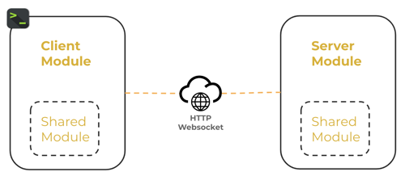
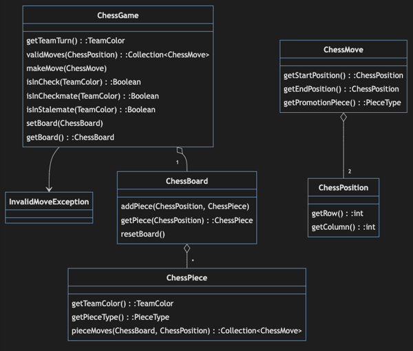
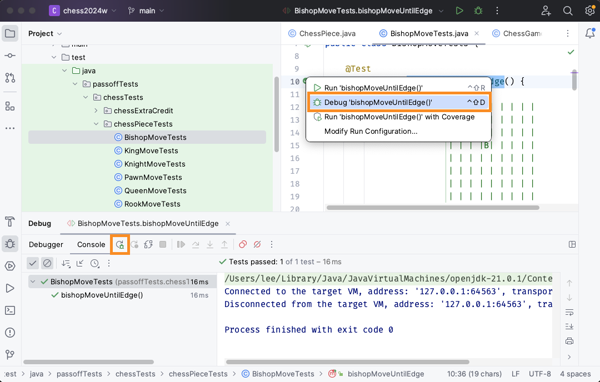

# ♕ Phase 0: Chess Moves

- [Chess Application Overview](../chess.md)
- [Getting Started](getting-started.md)
- [Starter Code](starter-code)

In this part of the Chess Project, you will implement a basic representation of the game of chess. This includes the setting up of the board and defining how pieces move.

⚠ Review the [Game of Chess](the-game-of-chess.md) instruction to learn how to set up the board and how each of the pieces move.

🖥️ This [video](https://youtu.be/N5oKyY1yQk0) demonstrates the concepts discussed in this section.

## Starter Code

To begin building your chess application, you must first follow the instructions in the [Getting Started Document](getting-started.md).

This provides you with an IntelliJ project that contains the following three modules.

| Phase      | Description                                                                                                                                                                         |
| ---------- | ----------------------------------------------------------------------------------------------------------------------------------------------------------------------------------- |
| **Server** | A program that handles network requests to create and play games. It stores games persistently in a database and sends out notifications to all the players of a game.              |
| **Client** | The command line program that players use to create and play a game of chess. The client communicates with your server over the network in order to play a game with other clients. |
| **Shared** | A code library that contains the rules and representation of a chess game that both the `client` and `server` use to exercise and validate game play.                               |



In this phase you will implement the shared code that defines the board, pieces, and the rules of chess. In later phases you will use the code you create to create a fully playable game.

The starter code contains the classes defined by the following diagram. However, instead of a full implementation, the methods all simply throw an exception if invoked. The classes are found in the `shared/src/main/java/chess` directory.



**⚠ NOTE**: You are not limited to this representation. However, you must not change the existing class names or method signatures since they are used by the pass off tests. You will likely need to add new classes and methods to complete the work required by this phase.

## Chess Classes

### ChessGame

This class serves as the top-level management of the chess game. It is responsible for executing moves as well as recording the game status.

You will not need to implement any code in this class for this phase.

#### Key Methods

- **validMoves**: Takes as input a position on the chessboard and returns all moves the piece there can legally make. If there is no piece at that location, this method returns `null`.
- **makeMove**: Receives a given move and executes it, provided it is a legal move. If the move is illegal, it throws an `InvalidMoveException`. A move is illegal if the chess piece cannot move there, if the move leaves the team’s king in danger, or if it’s not the corresponding team's turn.
- **isInCheck**: Returns true if the specified team’s King could be captured by an opposing piece.
- **isInCheckmate**: Returns true if the given team has no way to protect their king from being captured.
- **isInStalemate**: Returns true if the given team has no legal moves and it is currently that team’s turn.

### ChessBoard

This class stores all the uncaptured pieces in a Game. It needs to support adding and removing pieces for testing, as well as a `resetBoard()` method that sets the standard Chess starting configuration.

### ChessPiece

This class represents a single chess piece, with its corresponding type and team color. It contains the `PieceType` enumeration that defines the different types of pieces.

```java
public enum PieceType {
    KING,
    QUEEN,
    BISHOP,
    KNIGHT,
    ROOK,
    PAWN
}
```

#### Key Methods

- **pieceMoves**: This method is similar to `ChessGame.validMoves`, except it does not honor whose turn it is or check if the king is being attacked. This method does account for enemy and friendly pieces blocking movement paths. The `pieceMoves` method will need to take into account the type of piece, and the location of other pieces on the board.

### ChessMove

This class represents a possible move a chess piece could make. It contains the starting and ending positions. It also contains a field for the type of piece a pawn is being promoted to. If the move would not result in a pawn being promoted, the promotion type field should be null.

### ChessPosition

This represents a location on the chessboard. This should be represented as a row number from 1-8, and a column number from 1-8. For example, (1,1) corresponds to the bottom left corner (which in chess notation is denoted `a1`). (8,8) corresponds to the top right corner (`h8` in chess notation).

## Testing

The test cases found in `src/test/java/passoff/chess/piece` contain a collection of tests that assert the correct movement of individual pieces.

To run the tests, you can click the play icon next to an individual test, or you can right click on a package or class and select `Debug` or `Debug Tests in …`



## Recommended Development Process

For this project, you are free to implement the classes described above in whatever order. However, it is suggested that you follow the principles of test driven development.

- Start by executing the `BishopMoveTests.bishopMoveUntilEdge` test.
- Observe what code is throwing a `Not implemented` exception.
- Replace the code that is throwing the exception with something reasonable.
- Rerun the test, debug, and continue implementing until the test passes.
- Commit your changes to GitHub.
- Repeat the above process for each of the tests until they all pass.

## Object Overrides

In order for the tests to pass, you are required to override the `equals()` and `hashCode()` methods in your class implementations as necessary. This includes the ChessPosition, ChessPiece, ChessMove, and ChessBoard classes in particular. To do this automatically in IntelliJ, right click on the class code and select `Code > Generate... > equals() and hashCode()`. It is a good idea to generate these methods fairly early. However, IntelliJ will not be able to generate them properly until you have added the required fields to the class.

In most cases, the default methods provided by IntelliJ will suffice. However, there are cases when the generated code will not completely work. You should fully understand all code in your project. Even code that was generated for you. Take the time to carefully review and debug what the generated code does. Add a breakpoint, inspect the variables, and step through each line.

⚠ Protip: Debugging is often much easier if you also override the `toString()` method and return a concise representation of the object. This is not required, but highly recommended.

## ☑ Deliverable

### Pass Off, Submission, and Grading

All of the tests in your project must succeed in order to complete this phase.

To pass off this assignment use the course [auto-grading](https://cs240.click/) tool. If your code passes then your grade will automatically be entered in Canvas.

### Grading Rubric

**⚠ NOTE**: You are required to commit to GitHub with every minor milestone. For example, after you successfully pass a test. This should result in a commit history that clearly details your work on this phase. If your Git history does not demonstrate your efforts then your submission may be rejected.

| Category       | Criteria                                                                                           |       Points |
| :------------- | :------------------------------------------------------------------------------------------------- | -----------: |
| GitHub History | At least 10 GitHub commits evenly spread over the assignment period that demonstrate proof of work | Prerequisite |
| Functionality  | All pass off test cases succeed                                                                    |          125 |
|                | Total                                                                                              |          125 |
