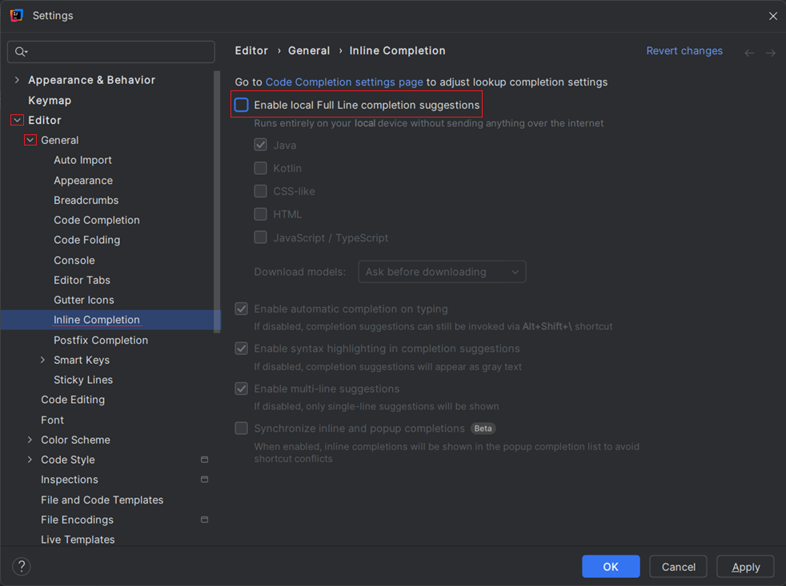

# Getting Started

📁 [Starter code](https://github.com/softwareconstruction240/chess)

At this point, you have already made your own copy of the [Chess GitHub Repository](../chess-github-repository/chess-github-repository.md) and made changes from the command line. Now, we will open the project in an Integrated Development Environment (IDE). IDE's greatly help and assist the developer while working on large software projects.

Take the following steps to set up your Chess project.

## Open With IntelliJ

Open the project directory in IntelliJ to start developing, running, and debugging your code using an IDE. Make sure you **OPEN** the project rather than creating a new project.

1. Open IntelliJ. We assume you already have the IDE downloaded from previous required coursework.
2. Choose File > Open > and select the chess folder in the location you created it earlier.

The contents of the folder already contain IntelliJ configuration files and creating a new project rather than opening an existing one will cause various errors.

> [!NOTE]
>
> If you get a prompt asking you to build with Maven, then make sure you skip that action.

Your project should look like this when it opens with the client, server, and shared folders having a blue square and being at the root level. There should be no folder called chess showing up in your Intellij project, only the items inside of the chess folder should be visible.

## Turn off AI

> [!WARNING]
>
> **Using AI generated code in this course is not permitted.** Failing to follow the instruction in this section will be considered **cheating**.

All AI coding tools need to be turned off for this project. We want you to understand the code you write, and having AI author the code for you can be a hinderance to your learning. If you have some sort of AI coding assistant (like Copilot) that comes by default with your IDE, you need to turn that **off**. Using AI to write your code may flag our plagiarism detection system. If you are unsure about your use of AI, check the syllabus in Canvas, or ask one of the instructors.

Specifically, if you are using the IntelliJ Ultimate Edition, it comes by default with a local deep learning model, and possibly a cloud LLM that will help finish lines. (This feature does not come with the Community edition). To turn off Full Line code completion, follow these steps:

1. Go to IntelliJ Settings by either pressing `ctrl`/`⌘` + `,` or by going to File > Settings.
1. A new _Settings_ window should have opened. Select Editor > General > Inline Completion on the left-hand side.
1. Disable the checkbox **Enable local Full Line completion suggestions**. If there is a checkbox about cloud completion, disable that as well.
1. Click **OK** to save the changes to the setting.

