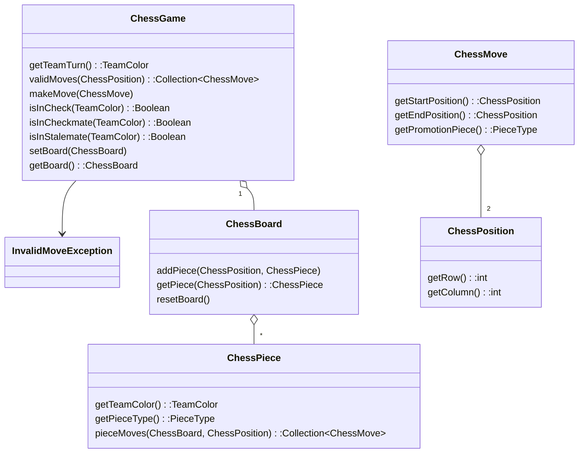

# ♕ Phase 1: Chess Game

- [Chess Application Overview](../chess.md)
- [Getting Started](getting-started.md)
- 🖥️ [Slides: Design Principles (Chess Examples)](https://docs.google.com/presentation/d/1dncxSAgnIqjV9RNzGR94EWVltJiCApqC3EvNPqz97-E/edit?usp=sharing)
- 🖥️ [Videos](#videos)

In the previous phase you implemented the board and pieces along with the rules for setting up the board and moving pieces. In this phase you will implement the `ChessGame` so that you can play a game by making moves and determining check, stalemate, and checkmate.

## Code Class Structure

**⚠ NOTE**: You are not limited to this representation. However, you must not change the existing class names or method signatures since they are used by the pass off tests. You will likely need to add new classes and methods to complete the work required by this phase.

## Class Summaries

### ChessGame

This class serves as the top-level management of the Chess Game. It is responsible for executing moves as well as reporting the game status.

By default, a new `ChessGame` represents an immediately playable board with the pieces in their default locations and the starting player set to WHITE.

`ChessGame` functionality will now implement the rules of Chess not handled by the `ChessPiece` class. This will involve removing moves returned from `ChessPiece.validMoves()` that violate game rules.

**Key Methods**:

- **validMoves**: Takes as input a position on the chessboard and returns all moves the piece there can legally make. If there is no piece at that location, this method returns `null`. A move is valid if it is a "piece move" for the piece at the input location _and_ making that move would not leave the team’s king in danger of check.
- **makeMove**: Receives a given move and executes it, provided it is a legal move. If the move is illegal, it throws an `InvalidMoveException`. A move is illegal if it is not a "valid" move for the piece at the starting location, _or_ if it’s not the corresponding team's turn.
- **isInCheck**: Returns true if the specified team’s King could be captured by an opposing piece.
- **isInCheckmate**: Returns true if the given team has no way to protect their king from being captured.
- **isInStalemate**: Returns true if the given team has no legal moves but their king is not in immediate danger.

## Extra Credit Moves

If you would like to fully implement the rules of chess you need to provide support for `En Passant` and `Castling`.

You do not have to implement these moves, but if you go the extra mile and successfully implement them, you’ll earn 5 extra credit points for each move (10 total) on this assignment.

**`Castling`**

This is a special move where the King and a Rook move simultaneously. The castling move can only be taken when 4 conditions are met:

1. Neither the King nor Rook have moved since the game started
2. There are no pieces between the King and the Rook
3. The King is not in Check
4. Both your Rook and King will be safe after making the move (cannot be captured by any enemy pieces).

To Castle, the King moves 2 spaces towards the Rook, and the Rook "jumps" the king moving to the position next to and on the other side of the King. This is represented in a ChessMove as the king moving 2 spaces to the side.

**`En Passant`**

This is a special move taken by a Pawn in response to your opponent double moving a Pawn. If your opponent double moves a pawn so it ends next to yours (skipping the position where your pawn could have captured their pawn), then on your immediately following turn your pawn may capture their pawn as if their pawn had only moved 1 square. This is as if your pawn is capturing their pawn mid motion, or `In Passing`.

## ☑ Deliverable

### Pass Off Tests

The test cases for this assignment are in the `passoff/chess/game` directory and represent the tests for the overall gameplay. You will need to pass all these tests to pass off this assignment.

Additionally, if you are implementing `Castling` and `En Passant` then include the tests from the starter code in the `extracredit` package. Successfully passing these will earn you some extra credit on this assignment, but are not required for pass off.

To run the tests, you can click the play icon next to an individual test, or you can right click on a package or class and select `Run` or `Run Tests in …`

### Pass Off, Submission, and Grading

All of the tests in your project must succeed in order to complete this phase. If you do not want to complete the extra credit moves then remove those tests from your project.

To pass off this assignment use the course [auto-grading](https://cs240.click/) tool. If your code passes then your grade will automatically be entered in Canvas.

### Grading Rubric

**⚠ NOTE**: You are required to commit to GitHub with every minor milestone. For example, after you successfully pass a test. This should result in a commit history that clearly details your work on this phase. If your Git history does not demonstrate your efforts then your submission may be rejected.

| Category       | Criteria                                                                                          |       Points |
| :------------- | :------------------------------------------------------------------------------------------------ | -----------: |
| GitHub History | At least 8 GitHub commits evenly spread over the assignment period that demonstrate proof of work | Prerequisite |
| Functionality  | All pass off test cases succeed                                                                   |          125 |
| Extra Credit   | `extracredit` test cases succeed                                                                  |    bonus +10 |
|                | Total                                                                                             |          125 |

## Videos (6:13)

- 🎥 [Phase 1 Overview (6:13)](https://byu.hosted.panopto.com/Panopto/Pages/Viewer.aspx?id=f2342f5a-8513-44fe-b5cc-b1700151beac)
