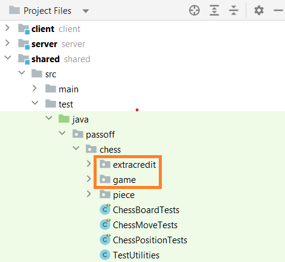

# Chess Game - Getting Started

Complete the following steps to move the starter code into your project for this phase.

1. Open your chess project directory.
1. Copy the the `starter-code/1-chess-game/passoff/chess/game` directory to the `shared/src/test/java/passoff/chess` directory.
1. **Optional**: If you want to implement castling and en passant for extra credit, then you also need to copy the `starter-code/1-chess-gamepassoff/chess/extracredit/ `directory to your project's `shared/src/test/java/passoff/chess` directory. Do not copy this directory if you do not successfully implement the tests.

When you are done you should be able to open IntelliJ and see the following structure.

