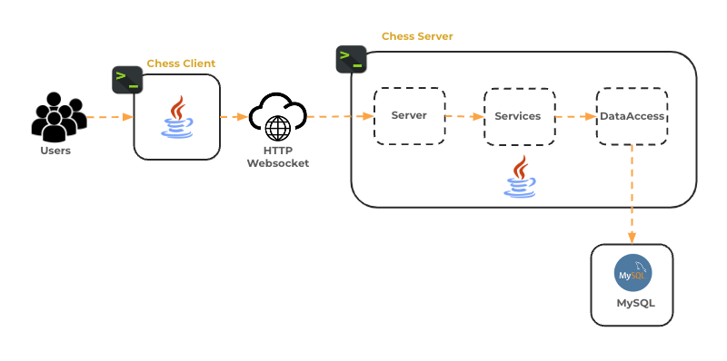
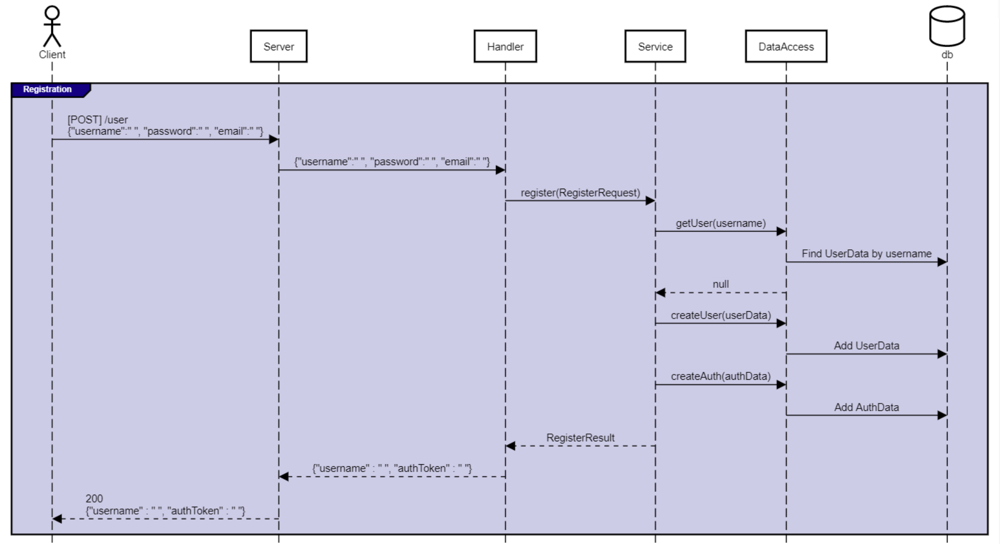
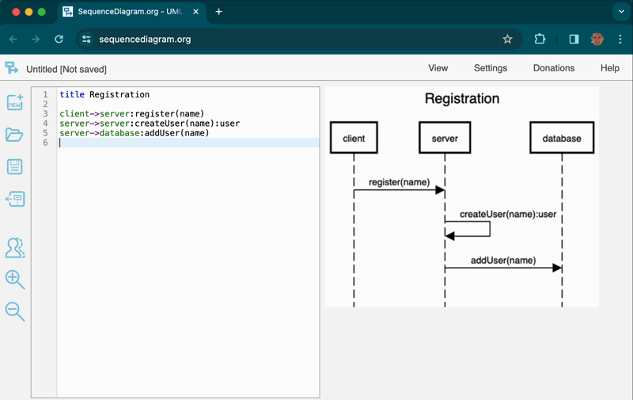

# ♕ Phase 2: Chess Server Design

- [Chess Application Overview](../chess.md)
- _This phase has no starter code._
- 🖥️ [Slides](https://docs.google.com/presentation/d/12zsEJ-at5DsbKNy7a0Eac0D1ZWa4RBIC/edit?usp=sharing&ouid=117271818978464480745&rtpof=true&sd=true)
- 🖥️ [Videos](#videos)

In this part of the Chess Project, you will create a [sequence diagram](https://en.wikipedia.org/wiki/Sequence_diagram) that represents the design of your chess server. Your chess server exposes seven endpoints. An endpoint is a URL that maps to a method that handles HTTP network requests. Your chess client calls the endpoints in order to play a game of chess. Each of these endpoints convert the HTTP network request into service object method calls, that in turn read and write data from data access objects. The data access objects persistently store data in a database. The service object method uses the information from the request and the data access objects to create a response that is sent back to the chess client through the HTTP server.

## Application Components

The chess application components are demonstrated by the following diagram and description.



| Component    | Sub-Component | Description                                                                                                                                                                                                                                                       |
| ------------ | ------------- | ----------------------------------------------------------------------------------------------------------------------------------------------------------------------------------------------------------------------------------------------------------------- |
| Chess Client |               | A terminal based program that allows a user to play a game of chess. This includes actions to login, create, and play games. The client exchanges messages over the network with the chess server.                                                                |
| Chess Server |               | A command line program that accepts network requests from the chess client to login, create, and play games. Users and games are stored in the database. The server also sends game play commands to the chess clients that are participating in a specific game. |
|              | Server        | Receives network requests and locates correct endpoints.                                                                                                                                                                                                          |
|              | Handlers      | Deserialize information into java objects. Call service methods sending the objects to satisfy requests.                                                                                                                                                          |
|              | Services      | Process the business logic for the application. This includes registering and logging in users and creating, listing, and playing chess games. Call the data access methods to retrieve and persist application data.                                             |
|              | DataAccess    | Provide methods that persistently store and retrieve the application data.                                                                                                                                                                                        |
| Database     |               | Stores data persistently.                                                                                                                                                                                                                                         |

> [!NOTE]
> that while we have the Handlers as distinct components here and later in the diagram, it is not required to have specific handler classes. You may implement this functionality directly in the lambda functions for the endpoints of your server.

## Application Programming Interface (API)

As a first step for creating your design diagram, you need to carefully read the [Phase 3: Web API](../3-web-api/web-api.md) requirements so that you can internalize what each of the server endpoints do. This will help you understand the purpose and structure of the classes you are designing in this phase.

The server endpoints are summarized below, but it is critical that you completely understand their purpose, the data they expect, and the data that they return.

| Endpoint    | Description                                                                                                                     |
| ----------- | ------------------------------------------------------------------------------------------------------------------------------- |
| Clear       | Clears the database. Removes all users, games, and authTokens.                                                                  |
| Register    | Register a new user.                                                                                                            |
| Login       | Logs in an existing user (returns a new authToken).                                                                             |
| Logout      | Logs out the user represented by the provided authToken.                                                                        |
| List Games  | Verifies the provided authToken and gives a list of all games.                                                                  |
| Create Game | Verifies the provided authToken and creates a new game.                                                                         |
| Join Game   | Verifies the provided authToken. Checks that the specified game exists, and adds the caller as the requested color to the game. |

## Data Model Classes

The different components in your architecture will operate on three data model objects that your application must implement. This includes the following.

| Object   | Description                                                                                                                                   |
| -------- | --------------------------------------------------------------------------------------------------------------------------------------------- |
| UserData | A user is registered and authenticated as a player or observer in the application.                                                            |
| AuthData | The association of a username and an authorization token that represents that the user has previously been authorized to use the application. |
| GameData | The information about the state of a game. This includes the players, the board, and the current state of the game.                           |

These objects represent the core of what you are passing between your server, service, and data access components.

## Creating Sequence Diagrams

Based upon your understanding of the requirements provided by [Phase 3](../3-web-api/web-api.md) you now must create a sequence diagram for each endpoint that demonstrates the flow of interactions between your application objects. The diagram must include the successful happy path flow for each endpoint, but should also include the error paths so that you can fully design your server.

### SequenceDiagram.Org

You will create your sequence diagram using a simple web based editing tool found at [sequencediagram.org](https://sequencediagram.org). The [instructions](https://sequencediagram.org/instructions.html) for using the tool document all of the basic elements necessary to create your diagram. It is not necessary for you to fully understand all the details of UML sequence diagrams, but it should be obvious from your diagrams what your application is designed to do.

A basic sequence diagram uses object names separated by arrows that show the direction of the sequence. This is followed by a colon separated description of the sequence action. The following is a simple diagram for taking a class.

```uml
actor Student

group #green Take class #white
Student -> University:register(className)
Student -> Class:attend(date)
Class --> Student:knowledge
end
```

### Register Example

To get you started on creating your sequence diagrams, we have provided you with a template that already contains a possible solution for the `register` endpoint and place holders for the other six endpoints.

> [!IMPORTANT]
> Here is a link to your [Starter Diagram](https://sequencediagram.org/index.html#initialData=IYYwLg9gTgBAwgGwJYFMB2YBQAHYUxIhK4YwDKKUAbpTngUSWDABLBoAmCtu+hx7ZhWqEUdPo0EwAIsDDAAgiBAoAzqswc5wAEbBVKGBx2ZM6MFACeq3ETQBzGAAYAdAE5M9qBACu2GADEaMBUljAASij2SKoWckgQaIEA7gAWSGBiiKikALQAfOSUNFAAXDAA2gAKAPJkACoAujAA9D4GUAA6aADeAETtlMEAtih9pX0wfQA0U7jqydAc45MzUyjDwEgIK1MAvpjCJTAFrOxclOX9g1AjYxNTs33zqotQyw9rfRtbO58HbE43FgpyOonKUCiMUyUAAFJForFKJEAI4+NRgACUh2KohOhVk8iUKnU5XsKDAAFUOrCbndsYTFMo1Kp8UYdKUAGJITgwamURkwHRhOnAUaYRnElknUG4lTlNA+BAIHEiFRsyXM0kgSFyFD8uE3RkM7RS9Rs4ylBQcDh8jqM1VUPGnTUk1SlHUoPUKHxgVKw4C+1LGiWmrWs06W622n1+h1g9W5U6Ai5lCJQpFQSKqJVYFPAmWFI6XGDXDp3SblVZPQN++oQADW6ErU32jsohfgyHM5QATE4nN0y0MxWMYFXHlNa6l6020C3Vgd0BxTF5fP4AtB2OSYAAZCDRJIBNIZLLdvJF4ol6p1JqtAzqBJoIei0azF5vDhLzir7x+QJeCg6B7gevjMMe6SZJg2TmGyxZphU0gAKK7kh9RIc0LQPqoT7dNOs7oGYP6eH+G6Qrau7QjAADio6shBp7QeezCytQ17UWhmH2KOeFBgRaBESuJHroE2A+FA2DcPAuqZDRo4pJBZ45Cxl5sQhtQNFxPHBHxjboEO3GjAAcqO35CWu-4BJYKDKhAyQwAAUhAPJyaMgQ6AgoANkxylwVe6mUneLSGSgvF1npz69JJwDWVAcAQAg0CzCFACS0hmb+IkBF4MVdl6sDANgkmEPEiQKYxMEXkUanlIhKFoRhrTGIJmBAA).
> When you are done editing your diagram make sure you export a link as described in the **Deliverable** section below.



This example diagram represents the following sequence for registering and authorizing a player.

1. A `client`, acting as a chess player, calls the `register` endpoint. This request is made as an HTTP network request with the `/user` URL path and a body that contains her username, password, and email in a JSON representation.
2. The `server` gets the body with its information from the HTTP request and matches it to the correct handler.
3. The `handler` takes the JSON information and creates an object to hold it and sends it to the correct service class.
   > [!TIP]
   > You are not required to create your handlers in their own distinct classes. You may implement this functionality directly in the lambda functions for the endpoints of your server.
4. The `service` calls a data access method in order to determine if there is already a user with that username.
5. The `data access` method checks the database and returns that there is no user with that name (null).
6. The `service` then calls another data access method to create a new user with the given name and password.
7. The `data access` method inserts the user into the database.
8. The `service` then calls another data access method to create and store an authorization token (authToken) for the user. The authToken can be used on subsequent endpoint calls to represent that the user has already been authenticated.
9. The `data access` method stores the username and associated authToken in the database.
10. The `service` returns a result object containing the username and authToken.
11. The `handler` converts the object into JSON text.
12. The `server` returns this to the client.

> [!NOTE]
> Note that the diagram includes simple representations of HTTP and database requests. You will learn how to use these technologies in later phases. You just need to understand that the `server` receives HTTP network requests and the database persistently stores your application data. It is also not important that you use correct UML Sequence diagram syntax for your diagrams. You just need to show that you understand what each of the endpoints are doing inside your code.

## Classes

Using your sequence diagram, you should be able to envision the Java classes and methods that are necessary for handling the interactions between your server, services, and data access components. You will create and implement these classes in the next phase.

The following is a recommended class structure:


This architecture includes a handler method for each server endpoint that calls a corresponding service method. Each service method takes a request object and returns a response object. The service method interacts with the data access methods to store and retrieve data from the database. The application model objects serve as the primary data representations that are passed between the server, services, and data access components.

You can decompose your handlers, services, and data access components into multiple classes or leave them as a single class as your design requires in order to meet the principles of good software design.

## ☑ Deliverable

### Pass Off, Submission, and Grading

Once you have created your diagram you can create a URL that represents it by selecting the `export diagram` tool found on the toolbar to the left of the application. In the export dialog select `Presentation Mode Link` and copy the URL. Submit the URL to the `Chess Server Design` Canvas Assignment.



Make sure you save a copy of your sequence diagram URL in your GitHub repository. A good place for this is in the README.md file of your project.

### Grading Rubric

When initially graded, your design will be given one of three scores:

| Criteria                                                                                                                                                                                                                                          | Score |
| :------------------------------------------------------------------------------------------------------------------------------------------------------------------------------------------------------------------------------------------------ | ----: |
| Your design is mostly correct with only minor adjustments needed. Read TA suggestions for improvement in Canvas.                                                                                                                                  |    50 |
| Your design has significant deficiencies. Meet with a TA to discuss your design, ideally the same TA who originally graded your design. Improve and resubmit your design within one week of initial grading, and receive a maximum score of 100%. |    25 |
| The submitted design was not a serious attempt at doing the assignment correctly. Resubmit your design within one week of initial grading and receive a maximum score of 50%.                                                                     |     0 |

## <a name="videos"></a>Videos (1:31:43)

- 🎥 [Chess Server Design - Introduction (16:15)](https://byu.hosted.panopto.com/Panopto/Pages/Viewer.aspx?id=bd253d7a-375d-4833-87e0-b17e015a6b7f)
- 🎥 [Chess Server Design - Software Design Principles (2:16)](https://byu.hosted.panopto.com/Panopto/Pages/Viewer.aspx?id=c8afd967-18dc-4396-b92e-b17e015f13b9)
- 🎥 [Chess Server Design - Web API Functions (10:49)](https://byu.hosted.panopto.com/Panopto/Pages/Viewer.aspx?id=c5c80f46-0abc-4f9d-bb19-b17e015ffab0)
- 🎥 [Chess Server Design - Model Classes (7:43)](https://byu.hosted.panopto.com/Panopto/Pages/Viewer.aspx?id=789ab87f-a7b7-4b71-b8cd-b17e016353d9)
- 🎥 [Chess Server Design - Data Access Classes (14:31)](https://byu.hosted.panopto.com/Panopto/Pages/Viewer.aspx?id=b9cdbf1f-e8de-4da4-ad17-b17e0165ee50)
- 🎥 [Chess Server Design - Service and Request/Result Classes (11:25)](https://byu.hosted.panopto.com/Panopto/Pages/Viewer.aspx?id=983ebf64-8210-454c-b28d-b17e016a588a)
- 🎥 [Chess Server Design - Server Class and HTTP Handler Classes (7:24)](https://byu.hosted.panopto.com/Panopto/Pages/Viewer.aspx?id=8f6c6bb0-5528-4a0b-a6c0-b17e016deda3)
- 🎥 [Chess Server Design - Frequently Asked Questions (6:55)](https://byu.hosted.panopto.com/Panopto/Pages/Viewer.aspx?id=89324a09-d550-4fbd-8d9f-b17e01704a5a)
- 🎥 [Phase 2 Overview (14:25)](https://byu.hosted.panopto.com/Panopto/Pages/Viewer.aspx?id=1b3ed136-4ef1-41d0-8e6c-b17e0172c0bf)
