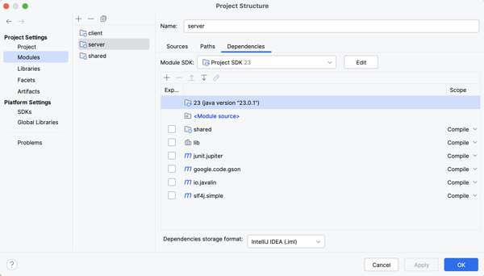
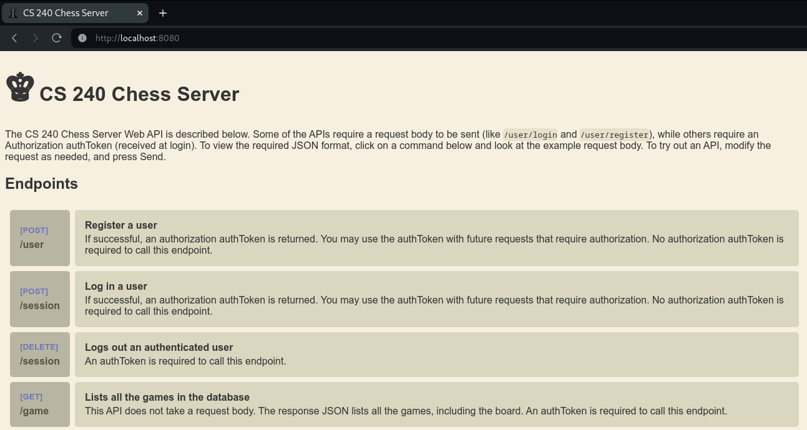

# Getting Started

The Starter Code has four folders: `dataAccess`, `passoff`, `resources`, and `server`. Complete the following steps to move the starter code into your project for this phase.

1. Open your chess project directory.
1. Copy the `starter-code/3-web-api/server` folder into the `server/src/main/java` folder. This contains a basic implementation of an HTTP server that allows the pass off tests to programmatically start and stop your server, as well as the code to host a web browser interface for experimenting with your endpoints.
1. Copy the `starter-code/3-web-api/dataaccess` folder into the `server/src/main/java` folder. This contains an exception class that you will throw whenever there is a data access error.
1. Create the folder `server/src/test/java`. Right click on the folder and select the option to mark the directory as `Test sources root`. This tells IntelliJ where to look for code to run as tests.

   

1. Copy the `starter-code/3-web-api/passoff` folder into the `server/src/test/java` folder. The `passoff/server` folder contains the server test cases.
1. Create the folder `server/src/main/resources`. Right click on the folder and select the option to mark the directory as `Resources root`. This tells IntelliJ that it should include the directory when compiling the code to your `out` directory.
1. Copy the `starter-code/3-web-api/resources/web` folder to the `server/src/main/resources` folder. The `web` folder contains the files that implement the web browser interface for experimenting with your endpoints.

This should result in the following additions to your project.

```txt
└── server
    └── src
        ├── main
        │   ├── java
        │   │   ├── Main.java
        │   │   ├── server
        │   │   │   └── Server.java
        │   │   └── dataaccess
        │   │       └── DataAccessException.java
        │   └── resources
        │       └── web
        │           ├── favicon.ico
        │           ├── index.css
        │           ├── index.html
        │           └── index.js
        └── test
            └── java
                └── passoff
                    └── server
                        └── StandardAPITests.java
```

## Dependencies

There is a lot of 3rd party code that you can download and include in your Java applications. As part of the starter project, we already included packages that run your JUnit tests, process JSON, handle logging, and make HTTP network requests.

The autograder will only add dependencies that we specify in the project. If you try to add a dependency that we don't specify you can use, your tests may fail or your code might not compile. 

The starter chess repository already included all the necessary dependencies that you need to this point. You can view these dependencies using IntelliJ by opening the `Project Structure` dialog, going to the `modules` tab, and selecting the `server` module.



## Getting the Webpage for Testing Setup

Once you have completed **all** of the previous steps you should be able to launch your server and access a testing HTML page. This is a simple frontend that was made to help with basic testing of your server endpoints.

Inside of `server/src/main/java/Main.java` in the main method, replace the code that is there with the creation of the Server object. Then call the server's run method. The run method needs the port you will run your server on, which typically for testing is 8080.

```java
import server.Server;

public class Main {
    public static void main(String[] args) {
        Server server = new Server();
        server.run(8080);

        System.out.println("♕ 240 Chess Server");
    }
}
```

When you run the main method it will start the server. Intelij will display several informational lines of red text in the **Run** window , but if no errors are reported you should be fine.

Open a browser and go to `localhost:8080` (If you picked another port replace 8080 with that instead). If everything is setup correctly you should be able to see this webpage.



You can use this to test your endpoints as you are coding the project.

If you want to see how this works in greater depth or need help troubleshooting, take a look at [this page](../../instruction/web-api/web-api.md).
