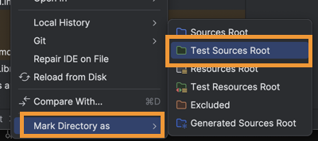
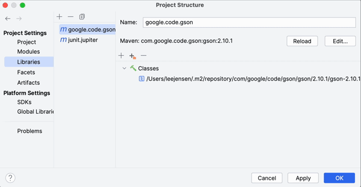

# Getting Started

📁 [Starter code](starter-code)

The Starter Code has three folders: `dataAccess`, `serverTests`, and `web`. Do the following to move them into your project:

1. Copy the [dataAccess](starter-code/dataAccess/) folder into the `server/src/main/java` folder. This contains an exception class that you will throw whenever there is a data access error.
1. Create the folder `server/src/test/java`. Right click on the folder and select the option to mark the directory as `test sources root`. This tells IntelliJ where to look for code to run as tests.

   

1. Copy the [serverTests](starter-code/serverTests/) folder to the `server/src/test/java/passoffTests` folder. The `serverTests` folder contains the server test cases.
1. Create the folder `server/src/main/resources`. Right click on the folder and select the option to mark the directory as `resources root`. This tells IntelliJ that it should include the directory when it compiling the code to your `out` directory.
1. Copy the [web](starter-code/web/) folder to the `server/src/main/resources` folder. The `web` folder contains the files that implement the server’s web page.

START HERE: Match what is in the project. include reading the location of the web files.

    NWhen you create your server class, you will need to specify the `web` folder’s path for static files, as shown below. In order for your code to find this directory

```java
Spark.externalStaticFileLocation("web");
```

This should result in the following additions to your project.

```txt
└── server
    └── src
        ├── main
        │   ├── java
        │   │   └── dataAccess
        │   │       └── DataAccessException.java
        │   └── resources
        │       └── web
        │           ├── favicon.ico
        │           ├── index.css
        │           ├── index.html
        │           └── index.js
        └── test
            └── java
                └── passoffTests
                    └── serverTests
                        └── StandardAPITests.java
```

## Dependencies

There is a lot of 3rd party code that you can download and include your Java applications. As part of the starter project, we already included packages that run your JUnit tests and process JSON. We now need to install another third party package to help us create an HTTP server.

We are going to use a cloud based package repository called Maven. Using IntelliJ, you can add a package by opening the project settings and going to the `libraries` tab. Press the `+` button and select `from Maven...`. You then supply the name of the library you want to download. Finally, you specify which module will use the dependency.



Add the dependencies for using JavaSpark and associate it with your `server` module.

- `com.sparkjava:spark-core:2.9.3`

  Handles HTTP requests and registers handlers for endpoints.

- `org.slf4j:slf4j-simple:1.7.36`

  Logger for SparkJava.
