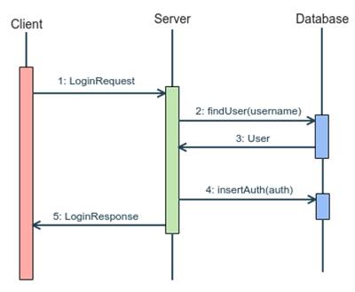

# ♕ Phase 3: Chess Web API

In this part of the Chess Project, you will create your Chess server and implement eight different Web API functions that clients will use to communicate with your server. This will include finishing your DAO classes, creating your Server class, creating a Handler class for each Web API, and creating Service classes to execute the Web APIs. You will also write automated tests for your Service classes.


> _Figure 1: Server Class Structure_



> _Figure 2: Client/Server/Database Login Example Interaction_

## Required Web APIs

An API is a command a server makes available to the public. For your server these API’s will be accessed via the HTTP protocol. Often the Server requires some data when a client uses an API. For an HTTP request this data can be stored in HTTP Headers, in the URL, and in the request body. The Server then sends back data to the client, including a value in the HTTP Response Header (indicating if there was any error with the HTTP protocol), and any needed information in the HTTP Response Body. For your server, you will use JSON strings for the Request and Response bodies.

## API Details

### Clear application

| property             | value                                                          |
| -------------------- | -------------------------------------------------------------- |
| **Description**      | Clears the database. Removes all users, games, and authTokens. |
| **URL path**         | `/db`                                                          |
| **HTTP Method**      | `DELETE`                                                       |
| **Success response** | [200]                                                          |
| **Failure response** | [500] `{ "message": "Error: description" }`                    |

### Register

| property             | value                                          |
| -------------------- | ---------------------------------------------- |
| **Description**      | Register a new user.                           |
| **URL path**         | `/user`                                        |
| **HTTP Method**      | `POST`                                         |
| **Body**             | `{ "username":"", "password":"", "email":"" }` |
| **Success response** | [200] `{ "username":"", "authToken":"" }`      |
| **Failure response** | [400] `{ "message": "Error: bad request" }`    |
| **Failure response** | [403] `{ "message": "Error: already taken" }`  |
| **Failure response** | [500] `{ "message": "Error: description" }`    |

### Login

| property             | value                                      	     |
| -------------------- | --------------------------------------------------- |
| **Description**      | Logs in an existing user (returns a new authToken). |
| **URL path**         | `/session`                                  	     |
| **HTTP Method**      | `POST`                                     	     |
| **Body**             | `{ "username":"", "password":"" }`                  |
| **Success response** | [200] `{ "username":"", "authToken":"" }`           |
| **Failure response** | [401] `{ "message": "Error: unauthorized" }`        |
| **Failure response** | [500] `{ "message": "Error: description" }` 	     |

### Logout

| property             | value                                           |
| -------------------- | ----------------------------------------------- |
| **Description**      | Logs out the user represented by the authToken. |
| **URL path**         | `/session`                                      |
| **HTTP Method**      | `DELETE`                                        |
| **Headers**          | `authorization: <authToken>`                    |
| **Success response** | [200]                                           |
| **Failure response** | [401] `{ "message": "Error: unauthorized" }`    |
| **Failure response** | [500] `{ "message": "Error: description" }`     |

### List Games

Note that `whiteUsername` and `blackUsername` may be `null`.

| property             | value                                                                                    |
| -------------------- | ---------------------------------------------------------------------------------------- |
| **Description**      | Gives a list of all games.                                                               |
| **URL path**         | `/game`                                                                                  |
| **HTTP Method**      | `GET`                                                                                    |
| **Headers**          | `authorization: <authToken>`                                                             |
| **Success response** | [200] `{ "games": ["gameID":, "whiteUsername":"", "blackUsername":"", "gameName:""} ]}`  |
| **Failure response** | [401] `{ "message": "Error: unauthorized" }`                                             |
| **Failure response** | [500] `{ "message": "Error: description" }`                                              |

### Create Game

| property             | value                                        |
| -------------------- | -------------------------------------------- |
| **Description**      | Creates a new game.                          |
| **URL path**         | `/game`                                      |
| **HTTP Method**      | `POST`                                       |
| **Headers**          | `authorization: <authToken>`                 |
| **Body**             | `{ "gameName":"" }`                          |
| **Success response** | [200] `{ "gameID": }`                        |
| **Failure response** | [401] `{ "message": "Error: unauthorized" }` |
| **Failure response** | [500] `{ "message": "Error: description" }`  |

### Join Game

| property             | value                                                                                                                                                                                                              |
| -------------------- | ------------------------------------------------------------------------------------------------------------------------------------------------------------------------------------------------------------------ |
| **Description**      | Verifies that the specified game exists, and, if a color is specified, adds the caller as the requested color to the game. If no color is specified the user is joined as an observer. This request is idempotent. |
| **URL path**         | `/game`                                                                                                                                                                                                            |
| **HTTP Method**      | `PUT`                                                                                                                                                                                                              |
| **Headers**          | `authorization: <authToken>`                                                                                                                                                                                       |
| **Body**             | `{ "playerColor":"WHITE/BLACK", "gameID": }`                                                                                                                                                                       |
| **Success response** | [200] `{}`                                                                                                                                                                                                         |
| **Failure response** | [400] `{ "message": "Error: bad request" }`                                                                                                                                                                        |
| **Failure response** | [401] `{ "message": "Error: unauthorized" }`                                                                                                                                                                       |
| **Failure response** | [403] `{ "message": "Error: already taken" }`                                                                                                                                                                      |
| **Failure response** | [500] `{ "message": "Error: description" }`                                                                                                                                                                        |

## Required Classes

The following sections describe the various classes that are depicted in the architecture diagram above.

### Model Classes

Previously, you created a `chess` package that contains the model classes that represent the core data and algorithms for Chess. Now you need to create additional model classes that represent the core data and algorithms needed to implement a `chess server`, including: User, Game, and AuthToken.

**User**

| Field    | Type   |
| -------- | ------ |
| userID   | int    |
| username | String |
| password | String |
| email    | String |

**Game**

| Field         | Type        		     |
| ------------- | -------------------------- |
| gameID        | int      		     |
| whitePlayerID | int     		     |
| blackPlayerID | int    		     |
| gameName      | string   		     |
| game          | `ChessGame` implementation |

**AuthToken**

| Field     | Type   |
| --------- | ------ |
| authToken | String |
| userID    | int    |

### Data Access Classes (DAOs)

Data Access Classes (or Objects) are responsible for storing and retrieving the server’s data (users, games, etc.).

Create a package of DAO classes that provide all data storage and retrieval operations needed by your server. For now your DAO classes will store your server’s data in main memory (RAM) using standard data structures (maps, sets, lists). Later in the project you will re-implement your DAO classes to store all data in an external database instead of in main memory. The method interfaces on your DAO classes shouldn’t need to change when they are re-implemented, because the rest of your server code should be unaware of where data is being stored (main memory vs. database).

For the most part, the methods on your DAO classes will be `CRUD` operations that: 1) Create objects in the data store, 2) Read (or query) objects from the data store, 3) Update objects already in the data store, and 4) Delete objects from the data store. Often times, the parameters and return values of your DAO methods will be the model objects described in the previous section (User, Game, AuthToken). For example, your DAO classes will certainly need to provide a method for creating new User objects in the data store. This method might have a signature that looks like this:

```java
void CreateUser(User u) throws DataAccessException
```

One of the provided classes is dataAccess.DataAccessException. This exception should be thrown by DAO methods that could fail. For example, inserting a second user with the same username shouldn’t be allowed, so in your design add `throws DataAccessException` to the function stub for that method. Think about where you think this could happen and add it accordingly. Eventually, your DAO class methods will access a MySQL relational database, in which case any of your DAO methods could potentially fail. Therefore, you might want to add `throws DataAccessException` to all of your DAO methods now.

Here are some examples of the kinds of methods your DAO classes will need to support. If a method cannot be completed, it should throw a `DataAccessException` (e.g., trying to update a non-existent game). This list is not exhaustive.

- **Insert**: A method for inserting a new game into the database.
- **Find**: A method for retrieving a specified game from the database by gameID.
- **FindAll**: A method for retrieving all games from the database
- **ClaimSpot**: A method/methods for claiming a spot in the game. The playerID is given as an integer and should be saved as either the whitePlayer or blackPlayer in the database.
- **UpdateGame**: A method for updating a chessGame in the database. It should replace the chessGame string corresponding to a given gameID with a new chessGame string.
- **Remove**: A method for removing a game from the database
- **Clear**: A method for clearing all data from the database

### Service Classes

The Service classes implement the actual functionality of the server. More specifically, the Service classes implement the logic associated with the web APIs.

Each service is responsible for executing a web API. A simple implementation of this is to have a separate Service class for each web API, with each Service class having a single public method. You may also put multiple service methods in one class if that makes more sense to you, but whatever you do should comply with the Single Responsibility Principle. For example, a LoginService class might have the following public interface:

```java
class LoginService {
	public LoginResult login(LoginRequest request);
}
```

Each service method receives a Request object containing all the information it needs to do its work. After performing its function it returns a corresponding Result object containing the output of the method. To do their work Service classes need to make heavy use of the Model classes and Data Access classes described above.

### Request and Result Classes

As described in the previous section, Service class methods receive Request objects as input, and return Result objects as output. The contents of these classes can be derived from the JSON inputs and outputs of the web APIs documented in the `Required Web APIs` section of this document. For example, the `login` web API accepts the following JSON object as input:

```java
{
    "username":"your_username",
    "password": `your_password`
}
```

From this you can derive the following LoginRequest class:

```java
	class LoginRequest {
		private String username;
		private String password;
		public LoginRequest() {…}
		// … Getters and Setters for username and password properties
	}
```

Similarly, the `login` web API returns a JSON object of the following format, depending on whether the login operation succeeded or failed:

**Success**

```json
{
  "authToken": "example_auth",
  "username": "example_username"
}
```

**Error**

```json
{
  "message": "Error: description"
}
```

From this you can derive the following LoginResult class:

```java
	class LoginResult {
		private String message;
		private String authToken;
		private String username;
		public LoginResult() { … }
		// … Getters and Setters for message, authToken, and username properties
	}
```

You will be using the GSON library for serialization and deserialization. GSON can take a Java Object and convert its contents to a JSON string. In the other direction, GSON can take a JSON string and a class type, and create a new instance of that class with any matching fields being initialized from the JSON string. For this process to work properly, the field names in your Request and Result classes must match exactly the property names in the JSON strings, including capitalization.

It is recommended that you create a Request class for each API that has a request body, and a Response class for each API. However, if two Response bodies have the same structure, one class may suffice for both.

### Handler Classes

Handler classes serve as a translator between HTTP and Java. Your Handlers will convert an HTTP request into Java usable objects & data. That data can then be passed to the services to execute the API. Finally, your Handlers will convert the data returned by Services into an HTTP result.

### Server Class

The Server acts as the director of traffic. It receives HTTP requests and sends them to the correct Handler for processing. Due to the bulk of the action happening in the Handlers and Services, the Server class will likely be quite simple.

## Unit Tests

Good tests extensively show that we get the expected behavior. This could be asserting that data put into the database is really there, or that a function throws an error when it should. Write a positive and a negative JUNIT test case for each public method on your Service classes, except for Clear which only needs a positive test case. A positive test case is one for which the action happens successfully (e.g., successfully claiming a spot in a game). A negative test case is one for which the operation fails (e.g., trying to claim an already claimed spot).

## Pass Off Tests

The provided tests for this assignment are in the StandardAPITests class. These test the server-side functionality of the API’s. To run the tests first start your server, and then run StandardAPITests.

For the tests to work properly, our test classes need to know which port you are running your server on. We default to port 8080, but if you need to change this edit `TestFactory::getServerPort()` in the `passoffTests` package to return the port you are using.
