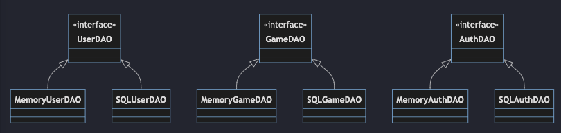
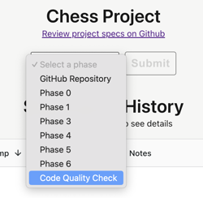

# ♕ Phase 3: Chess Web API

- [Chess Application Overview](../chess.md)
- 🖥️ [Slides: Server Implementation Tips](https://docs.google.com/presentation/d/1am-_YWoZ1AX5_oZZAORjzsLbb8dy0_2S)
- 🖥️ [Videos](#videos)
- [TA Tips](../../instruction/chess-tips/chess-tips.md#phase-3---web-api): A collection of common problems for this phase

In this phase, you will create your Chess server and implement seven HTTP endpoints that the chess client will use to communicate with your server. This will include creating your server, service, and data access classes. You will also write unit tests for your service classes.


## Getting Started
Complete the [Getting Started](getting-started.md) instructions before working on this phase.


## Required HTTP Endpoints

An endpoint is a URL that your server exposes so that clients can make Hypertext Transfer Protocol (HTTP) requests to your server. Often the server requires some data when a client calls an endpoint. For an HTTP request this data can be stored in HTTP Headers, in the URL, and/or in the request body. The Server then sends back data to the client, including a value in the HTTP Response Code (indicating if the command was completed successfully), and any needed information in the HTTP Response Body. For your server, you will use JSON strings to encode the objects we include in the Request and Response bodies.

## Authentication Tokens

Many of the HTTP endpoints return or provide a randomized string of characters that uniquely represents that a user has been authenticated with their username and password. This string is known as an authentication token (authToken). For example, the register and login endpoints return an `authToken` in the body of their responses, and the list games endpoint provides an `authToken` in the HTTP authorization header.

As part of the work for this phase, you need to create an authentication token when a user registers or logs in. That token is stored in an `AuthData` model object that associates the token with a username for future verification.

One easy way to create an `authToken` is to use the JDK `UUID.randomUUID()` method. For example:

```java
import java.util.UUID;

// ...

public static String generateToken() {
    return UUID.randomUUID().toString();
}
```

## Endpoint specifications

The following defines the endpoints that your server is required to implement. Your server must accept the URL, HTTP Method, Headers, and body that the endpoint defines. Likewise you must return the specified status codes and body for the endpoint.

### Clear application

| property             | value                                                          |
| -------------------- | -------------------------------------------------------------- |
| **Description**      | Clears the database. Removes all users, games, and authTokens. |
| **URL path**         | `/db`                                                          |
| **HTTP Method**      | `DELETE`                                                       |
| **Success response** | [200] `{}`                                                     |
| **Failure response** | [500] `{ "message": "Error: (description of error)" }`         |

### Register

| property             | value                                                  |
| -------------------- | ------------------------------------------------------ |
| **Description**      | Register a new user.                                   |
| **URL path**         | `/user`                                                |
| **HTTP Method**      | `POST`                                                 |
| **Body**             | `{ "username":"", "password":"", "email":"" }`         |
| **Success response** | [200] `{ "username":"", "authToken":"" }`              |
| **Failure response** | [400] `{ "message": "Error: bad request" }`            |
| **Failure response** | [403] `{ "message": "Error: already taken" }`          |
| **Failure response** | [500] `{ "message": "Error: (description of error)" }` |

### Login

| property             | value                                                  |
| -------------------- | ------------------------------------------------------ |
| **Description**      | Logs in an existing user (returns a new authToken).    |
| **URL path**         | `/session`                                             |
| **HTTP Method**      | `POST`                                                 |
| **Body**             | `{ "username":"", "password":"" }`                     |
| **Success response** | [200] `{ "username":"", "authToken":"" }`              |
| **Failure response** | [400] `{ "message": "Error: bad request" }`            |
| **Failure response** | [401] `{ "message": "Error: unauthorized" }`           |
| **Failure response** | [500] `{ "message": "Error: (description of error)" }` |

### Logout

| property             | value                                                  |
| -------------------- | ------------------------------------------------------ |
| **Description**      | Logs out the user represented by the authToken.        |
| **URL path**         | `/session`                                             |
| **HTTP Method**      | `DELETE`                                               |
| **Headers**          | `authorization: <authToken>`                           |
| **Success response** | [200] `{}`                                             |
| **Failure response** | [401] `{ "message": "Error: unauthorized" }`           |
| **Failure response** | [500] `{ "message": "Error: (description of error)" }` |

### List Games

Note that `whiteUsername` and `blackUsername` may be `null`.

| property             | value                                                                                         |
| -------------------- | --------------------------------------------------------------------------------------------- |
| **Description**      | Gives a list of all games.                                                                    |
| **URL path**         | `/game`                                                                                       |
| **HTTP Method**      | `GET`                                                                                         |
| **Headers**          | `authorization: <authToken>`                                                                  |
| **Success response** | [200] `{ "games": [{"gameID": 1234, "whiteUsername":"", "blackUsername":"", "gameName:""} ]}` |
| **Failure response** | [401] `{ "message": "Error: unauthorized" }`                                                  |
| **Failure response** | [500] `{ "message": "Error: (description of error)" }`                                        |

### Create Game

| property             | value                                                  |
| -------------------- | ------------------------------------------------------ |
| **Description**      | Creates a new game.                                    |
| **URL path**         | `/game`                                                |
| **HTTP Method**      | `POST`                                                 |
| **Headers**          | `authorization: <authToken>`                           |
| **Body**             | `{ "gameName":"" }`                                    |
| **Success response** | [200] `{ "gameID": 1234 }`                             |
| **Failure response** | [400] `{ "message": "Error: bad request" }`            |
| **Failure response** | [401] `{ "message": "Error: unauthorized" }`           |
| **Failure response** | [500] `{ "message": "Error: (description of error)" }` |

### Join Game

| property             | value                                                                                           |
| -------------------- | ----------------------------------------------------------------------------------------------- |
| **Description**      | Verifies that the specified game exists and adds the caller as the requested color to the game. |
| **URL path**         | `/game`                                                                                         |
| **HTTP Method**      | `PUT`                                                                                           |
| **Headers**          | `authorization: <authToken>`                                                                    |
| **Body**             | `{ "playerColor":"WHITE/BLACK", "gameID": 1234 }`                                               |
| **Success response** | [200] `{}`                                                                                      |
| **Failure response** | [400] `{ "message": "Error: bad request" }`                                                     |
| **Failure response** | [401] `{ "message": "Error: unauthorized" }`                                                    |
| **Failure response** | [403] `{ "message": "Error: already taken" }`                                                   |
| **Failure response** | [500] `{ "message": "Error: (description of error)" }`                                          |

## Required Classes

The following sections describe the various classes that are depicted in the architecture diagram above.

### Data Model Classes

Your project's `shared` module contains classes that represent all of the data and algorithmic functionality that is shared by your chess client and server.

As part of this phase, you need to create [record](../../instruction/records/records.md) classes and add them to the `shared` module that represent the classes used for the chess application's core data objects. This includes the following.

**UserData**

| Field    | Type   |
| -------- | ------ |
| username | String |
| password | String |
| email    | String |

**GameData**

| Field         | Type      |
| ------------- | --------- |
| gameID        | int       |
| whiteUsername | String    |
| blackUsername | String    |
| gameName      | String    |
| game          | ChessGame |

**AuthData**

| Field     | Type   |
| --------- | ------ |
| authToken | String |
| username  | String |

> [!IMPORTANT]
>
> You must place these three record classes in a folder named `shared/src/main/java/model`.

### Data Access Classes

Classes that represent the access to your database are often called `Data Access Objects` (DAOs). Create your data access classes in the `server/src/main/java/dataaccess` package. Data access classes are responsible for storing and retrieving the server’s data (users, games, etc.).

For the most part, the methods on your DAO classes will be `CRUD` operations that:

- **Create** objects in the data store
- **Read** objects from the data store
- **Update** objects already in the data store
- **Delete** objects from the data store

Oftentimes, the parameters and return values of your DAO methods will be the model objects described in the previous section (UserData, GameData, and AuthData). For example, your DAO classes will certainly need to provide a method for creating new UserData objects in the data store. This method might have a signature that looks like this:

```java
void insertUser(UserData u) throws DataAccessException
```

### DataAccessException

The starter code includes a `dataAccess.DataAccessException`. This exception should be thrown by data access methods that could fail. If a method call fails, it should throw a `DataAccessException`. For example, the `DataAccessException` is thrown if a user attempts to update a non-existent game. If you like, feel free to create subclasses of DataAccessException that represent more specific errors relating to data access.

### Example Data Access Methods

Here are some examples of the kinds of methods your DAOs will need to support. This list is not exhaustive. You should consult your server design in order to determine all of the methods you need to provide.

- **clear**: A method for clearing all data from the database. This is used during testing.
- **createUser**: Create a new user.
- **getUser**: Retrieve a user with the given username.
- **createGame**: Create a new game.
- **getGame**: Retrieve a specified game with the given game ID.
- **listGames**: Retrieve all games.
- **updateGame**: Updates a chess game. It should replace the chess game string corresponding to a given gameID. This is used when players join a game or when a move is made.
- **createAuth**: Create a new authorization.
- **getAuth**: Retrieve an authorization given an authToken.
- **deleteAuth**: Delete an authorization so that it is no longer valid.

### DataAccess Interface

In order to abstract from your services where data is actually being stored, you must create a Java interface that hides all of the implementation details for accessing and retrieving data. In this phase you will create an implementation of your data access interface that stores your server’s data in main memory (RAM) using standard data structures (maps, sets, lists). In the next phase you will create an implementation of the data access interface that uses an external SQL database.



By using an interface you can hide, or encapsulate, how your data access works from the code that does not need to be aware of those details. This creates a flexible architecture that allows you to change how things work without rewriting all of your code. We see the benefits of this pattern in two ways.

1. You can quickly implement our services without having to implement a backing SQL database. This lets us focus on the HTTP part of our server during this phase and then move over to SQL without changing any of our service code.
2. You can write data access tests against the memory implementation of the interface and then reuse those tests when you create the SQL implementation.

> [!IMPORTANT]
>
> You must place your data access classes in a folder named `server/src/main/java/dataaccess`.

### Service Classes

The Service classes implement the actual functionality of the server. More specifically, the Service classes implement the logic associated with the web endpoints.

A simple implementation of this is to have a separate Service class for each group of related endpoints. For example, a `UserService` class might look like this:

```java
public class UserService {
	public RegisterResult register(RegisterRequest registerRequest) {}
	public LoginResult login(LoginRequest loginRequest) {}
	public void logout(LogoutRequest logoutRequest) {}
}
```

Each service method receives a Request object containing all the information it needs to do its work. After performing its purpose, it returns a corresponding Result object containing the output of the method. These request and result objects would contain fields pertaining to each of the endpoints above. (Note: request and result classes do not need to be specifically created to what is shown in the specifications, it is up to your design on how you want to implement these methods). To do their work, service classes need to make heavy use of the Model classes and Data Access classes described above.

> [!IMPORTANT]
>
> You must place your service classes in a folder named `server/src/main/java/service`.

### Request and Result Classes

As described in the previous section, service class methods receive request objects as input, and return result objects as output. The contents of these classes can be derived from the JSON inputs and outputs of the web endpoints documented above. For example, the `login` endpoint accepts the following JSON object as input:

```json
{
  "username": "your_username",
  "password": "your_password"
}
```

From this you can derive the following LoginRequest class:

```java
	record LoginRequest(
		String username,
		String password){
	}
```

Alternatively, you could use the model `UserData` object that you will also use when you call your data access layer. Reusing these objects can create confusion with what the method needs to operate, but it does simplify your architecture by reducing the duplication of primary model objects.

```java
	record UserData(
		String username,
		String password,
		String email){
	}
```

Similarly, the `login` endpoint returns a JSON object of the following format, depending on whether the login operation succeeded or failed:

**Success**

```json
{
  "authToken": "example_auth",
  "username": "example_username"
}
```

**Error**

```json
{
  "message": "Error: description"
}
```

From this you can derive the following LoginResult record class:

```java
	record LoginResult(String username, String authToken) {}
```

and in the case where the service fails, it can throw an exception that the server handles by returning the proper error message and HTTP status code.

### Serialization

You will be using the Gson library for serialization and deserialization. Gson can take a Java Object and convert its contents to a JSON string. In the other direction, Gson can take a JSON string and a class type, and create a new instance of that class with any matching fields being initialized from the JSON string. For this process to work properly, the field names in your Request and Result classes must match exactly the property names in the JSON strings, including capitalization.

Here is an example of using Gson to serialize and deserialize a ChessGame.

```java
var serializer = new Gson();

var game = new ChessGame();

// serialize to JSON
var json = serializer.toJson(game);

// deserialize back to ChessGame
game = serializer.fromJson(json, ChessGame.class);
```

We install the third party package already in your project as part of its initial configuration and so you are ready to start using Gson in your code.

### Server Handler Classes

The server handler classes serve as a translator between HTTP and Java. Your handlers will convert an HTTP request into Java usable objects & data. The handler then calls the appropriate service. When the service responds, the handler converts the response object back to JSON and sends the HTTP response. This could include converting thrown exception types into the appropriate HTTP status codes if necessary.

You need to create the number of handler classes that are appropriate for your server design. For a simple server this could be a single class with a few handler methods, or for a complex application it could be dozens of classes each representing a different group of cohesive endpoints.

### Server Class

The Server receives network HTTP requests and sends them to the correct handler for processing. The server should also handle all unhandled exceptions that your application generates and return the appropriate HTTP status code.

> [!IMPORTANT]
>
> For the pass off tests to work properly, your server class must be named `Server` and provide a `run` method that has a desired port parameter, and a `stop` method that shuts your HTTP server down.

The starter code contains the `Server` class that you should use as the base for your HTTP server. For the pass off tests to work properly, you must keep the `Server` class in a folder named `server/src/main/java/server`, and do not remove the provided code.

```java
public class Server {

    private final Javalin javalin;

    public Server() {
        javalin = Javalin.create(config -> config.staticFiles.add("web"));

        // Register your endpoints and exception handlers here.

    }

    public int run(int desiredPort) {
        javalin.start(desiredPort);
        return javalin.port();
    }

    public void stop() {
        javalin.stop();
    }
}
```

The `Server` class provides a `run` method that attempts to start the HTTP server on a desired port parameter. From your main function you should start the server on port 8080. The unit tests will start the server on port 0. This directs the Javalin code to discover and use a random open port. The port that is actually used is returned by the `Javalin.port` method after initialization has completed. The starter code also provides a `stop` method that shuts the HTTP server down. This is necessary to control the starting and stopping of your server when running tests.

### Web Browser Interface

The starter code provides a simple web browser interface for calling your server endpoints. This is useful for experimentation while you are developing your endpoints. The starter code already configures your server to load static files from the `web` resources directory.

```java
javalin = Javalin.create(config -> config.staticFiles.add("web"));
```

When you use a browser to access your server the web interface will display by default.

## Service Unit Tests

In addition to the HTTP server pass off tests provided in the starter code, you need to write tests that execute directly against your service classes. These tests skip the HTTP server network communication and will help you in the development of your service code for this phase.

Good tests extensively show that we get the expected behavior. This could be asserting that data put into the database is really there, or that a function throws an error when it should. Write a positive and a negative JUNIT test case for each public method on your Service classes, except for Clear which only needs a positive test case. A positive test case is one for which the action happens successfully (e.g., successfully claiming a spot in a game). A negative test case is one for which the operation fails (e.g., trying to claim an already claimed spot).

The service unit tests must directly call the methods on your service classes. They should not use the HTTP server pass off test code that is provided with the starter code.

> [!IMPORTANT]
>
> You must place your service test cases in a folder named `server/src/test/java/service`.

## Server Directory Structure

After you have created all the classes necessary for this phase you should have a server directory structure that looks like the following.

```txt
├─ server
│  └─ src
│     ├─ main
│     │  └─ java
│     │     ├─ dataAccess
│     │     ├─ server
│     │     └─ service
│     └─ test
│        └─ java
│           ├─ passoff
│           │  └─ server
│           └─ service
└─ shared
   └─ src
      └─ main
         └─ java
            └─ model
```

## Suggested Implementation Order

You can create and test your code in whatever order you would like. However, if you are trying to figure out how to get started, you might consider the following order.

1. Set up your starter code so that your server runs properly, and make sure the testing webpage loads.
1. Use your sequence diagrams and the class diagram at the top of this page to guide the decision for what classes you might need.
1. Create packages for where these classes will go, if you haven't already done so.
1. Pick one Web API endpoint and get it working end-to-end. We recommend starting with `clear` or `register`.
   1. Create the classes you need to implement the endpoint.
   1. Write a service test or two to make sure the service and data access parts of your code are working as you expect.
   1. Make sure you can hit your endpoint from the test page on a browser or Curl. Verify the response is what you expect it to be.
1. Repeat this process for all other endpoints.

Once you have written the `clear` and `register` endpoints, you can run the `StandardAPITests` as a sanity check. However, if you need to debug something, you should use your unit tests, Curl, or the test webpage to do so. Some tests call multiple endpoints, and your problem will be much easier to solve if you can figure out which endpoint is the source of the bug.

## Relevant Instruction Topics

- [Web API](../../instruction/web-api/web-api.md): Creating an HTTP server.
- [Single Responsibility Principle](../../instruction/design-principles/design-principles.md#single-responsibility-principle): Organizing many server responsibilities into comprehensible units
- [Dependency Inversion Principle](../../instruction/design-principles/design-principles.md#dependency-inversion-principle): Organizing the layers of the server.
- [Interface Segregation Principle](../../instruction/design-principles/design-principles.md#interface-segregation-principle): Organizing the DAO interfaces.
- [PetShop Server Architecture](../../petshop/petshop.md): Layer organization and component architecture.

## ☑ Deliverable

### Pass Off Tests

Successfully run the provided tests for this assignment are in the `StandardAPITests` class. These tests make HTTP requests to test your server.

### Service Unit Tests

Successfully run the service unit tests that you created. They must directly call the methods on your service classes. They should not call your HTTP server. They should not use the HTTP server test code that is provided with the starter code.

### Code Quality

For this phase the auto grader will grade the quality of all your project's source code. The rubric used to evaluate code quality can be found here: [Rubric](../code-quality-rubric.md). You can also test your quality with the auto grader independent of a specific phase submission.



### Pass Off, Submission, and Grading

All of the tests in your project must succeed in order to complete this phase.

To pass off this assignment use the course [auto-grading](https://cs240.click/) tool. If your code passes then your grade will automatically be entered in Canvas.

After your code has successfully been auto-graded, a TA will review the code in your GitHub repository in order to determine its quality.

### Grading Rubric

> [!IMPORTANT]
>
> You are required to commit to GitHub with every minor milestone. For example, after you successfully pass a test. This should result in a commit history that clearly details your work on this phase. If your Git history does not demonstrate your efforts then your submission may be rejected.

| Category       | Criteria                                                                                                                                                                                         |       Points |
| :------------- | :----------------------------------------------------------------------------------------------------------------------------------------------------------------------------------------------- | -----------: |
| GitHub History | At least 12 GitHub commits evenly spread over the assignment period that demonstrate proof of work                                                                                               | Prerequisite |
| Web API Works  | All pass off test cases succeed                                                                                                                                                                  |          125 |
| Code Quality   | [Rubric](../code-quality-rubric.md)                                                                                                                                                              |           30 |
| Unit Tests     | All test cases pass<br/>Each public method on your **Service classes** has two test cases, one positive test and one negative test<br/>Every test case includes an Assert statement of some type |           25 |
|                | **Total**                                                                                                                                                                                        |      **180** |

## Videos

- 🎥 [Phase 3 Overview (19:26)](https://byu.hosted.panopto.com/Panopto/Pages/Viewer.aspx?id=edaa730e-e247-4356-9cf4-b2cd014ecf59) - [[transcript]](https://github.com/user-attachments/files/17707002/CS_240_Chess_Phase_3_Transcript.pdf)
- 🎥 [Chess Server Implementation Tips (18:43)](https://byu.hosted.panopto.com/Panopto/Pages/Viewer.aspx?id=2528dac9-1689-4e75-aff1-b2cd014e3b13) - [[transcript]](https://github.com/user-attachments/files/17707009/CS_240_Chess_Server_Implementation_Tips_Transcript.pdf)
