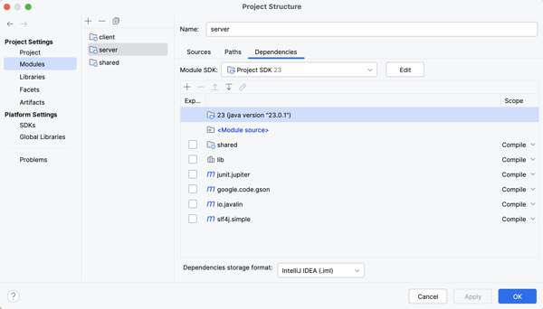
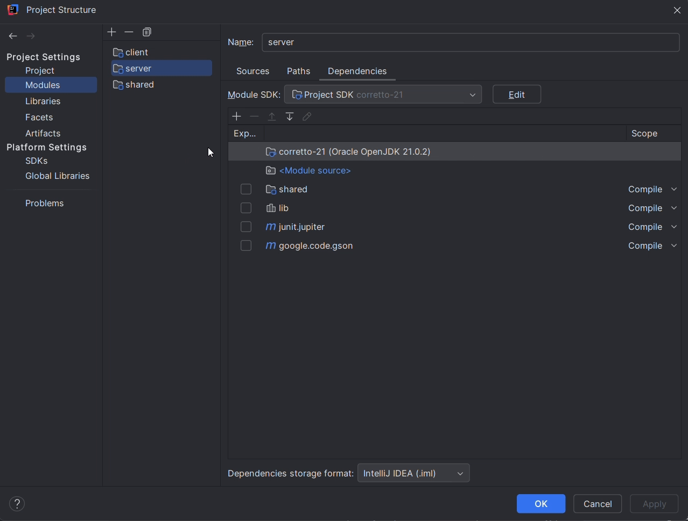

# Getting Started

The Starter Code has three folders, `resources`, `dataaccess`, and `passoff/server`. Complete the following steps to move the starter code into your project for this phase.

1. Open your chess project directory.
1. Copy the `starter-code/4-database/resources/db.properties` file into your project’s `server/src/main/resources` folder. This contains your database configuration settings. You will need to replace the values with your database username and password.
1. Copy the `starter-code/4-database/dataaccess/DatabaseManager.java` file from the starter-code into your project's `server/src/main/java/dataaccess` folder. This contains code that will read your database configuration settings and create connections to your database server.
1. Copy the `starter-code/4-database/passoff/server/DatabaseTests.java` file into your project’s `server/src/test/java/passoff/server` folder. This contains a test that makes sure you are persisting information to your database.

This should result in the following additions to your project.

```txt
└── server
    └── src
        ├── main
        │   ├── java
        │   │   └── dataaccess
        │   │       └── DatabaseManager.java
        │   └── resources
        │       └── db.properties
        └── test
            └── java
                └── passoff
                    └── server
                        └── DatabaseTests.java
```

## Dependencies

We use a cloud based package repository called Maven to manage our dependencies. The starter chess repository already included all the necessary dependencies that you needed for Phase 3. You can view these dependencies using IntelliJ by opening the `Project Structure` dialog, going to the `modules` tab, and selecting the `server` module.



To include additional dependencies, select the module you wish to add a dependency to. Press the `+` button and select `Library/from Maven...`. You then supply the name of the library you want to download. Once it is added, you can specify the `scope` for the dependency. Most dependencies for this class will be with scope "compile", meaning that the dependency is available to all the code in the module when it compiles. There are a few others, including "test", which means it is only available for code used to test the code in the module.



Add the dependency for the MySQL driver and BCrypt. Associate them with your `server` module.

- com.mysql:mysql-connector-j:9.4.0

  - Scope: Compile

- org.mindrot:jbcrypt:0.4

  - Scope: Compile
