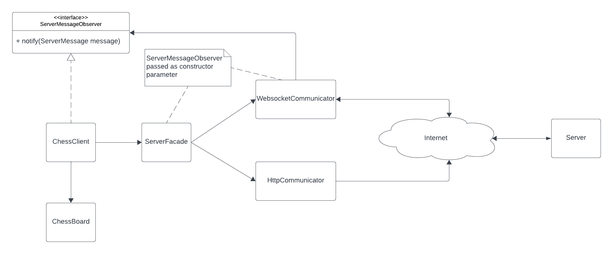
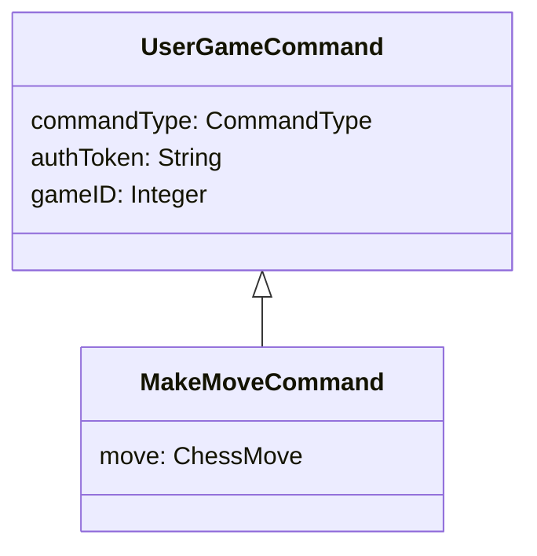
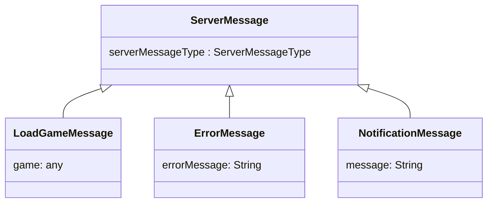

# ♕ Phase 6: Chess Gameplay

- [Chess Application Overview](../chess.md)
- [Getting Started](getting-started.md)
- 🖥️ [Videos](#videos)

For the final part of the Chess Project, you will implement gameplay. Gameplay will use WebSocket to communicate between client and server (instead of Web APIs). When a user begins playing or observes a game, their client should establish a WebSocket connection with the server. The WebSocket connection exchanges messages between client and server (and vice versa). Figure 1 shows a recommended design for the chess client.



_Figure 1: Recommended Chess Client Design_

## Gameplay Functionality

The gameplay UI should draw the current state of the chess board from the side the user is playing. If playing white, white pieces should be drawn on bottom. If playing black, black pieces should be drawn on bottom. If the user is observing the game, white pieces should be drawn on bottom.

The gameplay UI should support the following user commands:

| Command                   | Description                                                                                                                                                                                                                                        |
| ------------------------- | -------------------------------------------------------------------------------------------------------------------------------------------------------------------------------------------------------------------------------------------------- |
| **Help**                  | Displays text informing the user what actions they can take.                                                                                                                                                                                       |
| **Redraw Chess Board**    | Redraws the chess board upon the user’s request.                                                                                                                                                                                                   |
| **Leave**                 | Removes the user from the game (whether they are playing or observing the game). The client transitions back to the Post-Login UI.                                                                                                                 |
| **Make Move**             | Allow the user to input what move they want to make. The board is updated to reflect the result of the move, and the board automatically updates on all clients involved in the game.                                                              |
| **Resign**                | Prompts the user to confirm they want to resign. If they do, the user forfeits the game and the game is over. Does not cause the user to leave the game.                                                                                           |
| **Highlight Legal Moves** | Allows the user to input the piece for which they want to highlight legal moves. The selected piece’s current square and all squares it can legally move to are highlighted. This is a local operation and has no effect on remote users’ screens. |


_Figure 2: Example Highlight Move_

### Notifications

When the following events occur, notification messages should be displayed on the screen of each player that is involved in the game (player or observer).

1. A user connected to the game as a player (black or white). The notification message should include the player’s name and which side they are playing (black or white).
1. A user connected to the game as an observer. The notification message should include the observer’s name.
1. A player made a move. The notification message should include the player’s name and a description of the move that was made. (This is in addition to the board being updated on each player’s screen.)
1. A player left the game. The notification message should include the player’s name.
1. A player resigned the game. The notification message should include the player’s name.
1. A player is in check. The notification message should include the player’s name (this notification is generated by the server).
1. A player is in checkmate. The notification message should include the player’s name (this notification is generated by the server).

## WebSocket

During gameplay all communication between the players is implemented by sending WebSocket messages between clients and the server. Using WebSocket allows the server to send a message at anytime to any of the connected clients. For example, a player sends a move message to the server. The server then asynchronously broadcast the move to everyone in the game.

When a user begins playing or observing a game, their **client** will do the following:

1. Call the server join HTTP API to join them to the game. This step is only done for players. Observers do not need to make the join HTTP API request.
1. Open a WebSocket connection with the server (using the `/ws` endpoint) so it can send and receive gameplay messages.
1. Send a CONNECT WebSocket message to the server.
1. Transition to the gameplay UI. The gameplay UI draws the chess board and allows the user to perform the gameplay commands described in the previous section.

The following sections describe the messages that will be exchanged between client and server (or vice versa) to implement the gameplay functionality.

## WebSocket Messages

Some WebSocket messages are sent from the client to server. As defined by the Chess application design, these are called `user game commands`. Other WebSocket messages are sent from the server to client. These are called `server messages`. In code, each of these message types are represented as a Java class that can be serialized and deserialized to and from JSON (similar to the Request and Result classes you created for the server’s Web API). The provided starter code includes a class named `UserGameCommand` which defines the required messages that originate from the client, and a class named `ServerMessage` which defines the required messages that originate from the server.

The `UserGameCommand` and `ServerMessage` classes are provided in the starter code, but you can extend these classes to provide functionality according the specifics of your design.

## User Game Commands

The following is a simplified representation of the `UserGameCommand` found in the starter code.

```java
public class UserGameCommand {
    public enum CommandType {
        CONNECT,
        MAKE_MOVE,
        LEAVE,
        RESIGN
    }

    public CommandType commandType;
    public String authToken;
    public Integer gameID;
}
```

Here are the different command types that a user game command can represent.

| Command       | Required Additional Fields | Description                                                                          |
| ------------- | -------------------------- | ------------------------------------------------------------------------------------ |
| **CONNECT**   |                            | Used for a user to make a WebSocket connection as a player or observer.              |
| **MAKE_MOVE** | ChessMove move             | Used to request to make a move in a game.                                            |
| **LEAVE**     |                            | Tells the server you are leaving the game so it will stop sending you notifications. |
| **RESIGN**    |                            | Forfeits the match and ends the game (no more moves can be made).                    |

The following diagram represents a possible extension of the `UserGameCommand` class that you could make in order to support the required `ChessMove` field of the MAKE_MOVE command. You are free to follow this design, or come up with a representation of your own.



In the end, the important thing is that your design supports the additional `move` field when serializing the `MAKE_MOVE` command over the WebSocket. This must result in something like the following:

```json
{
  "commandType": "MAKE_MOVE",
  "authToken": "tokengoeshere",
  "gameID": "337",
  "move": { "start": { "row": 3, "col": 3 }, "end": { "row": 5, "col": 5 } }
}
```

## Server Messages

The following is a simplified representation of the `ServerMessage` found in the starter code.

```java
public class ServerMessage {
   public enum ServerMessageType {
       LOAD_GAME,
       ERROR,
       NOTIFICATION
   }

   ServerMessageType serverMessageType;
}
```

Here are the different command types that a user game command can represent.

| Command          | Required Fields                                        | Description                                                                                                                         |
| ---------------- | ------------------------------------------------------ | ----------------------------------------------------------------------------------------------------------------------------------- |
| **LOAD_GAME**    | game (can be any type, just needs to be called `game`) | Used by the server to send the current game state to a client. When a client receives this message, it will redraw the chess board. |
| **ERROR**        | String errorMessage                                    | This message is sent to a client when it sends an invalid command. The message must include the word `Error`.                       |
| **NOTIFICATION** | String message                                         | This is a message meant to inform a player when another player made an action.                                                      |

The following diagram represents possible extensions of the `ServerMessage` class that you could use to support the different `ServerMessage` commands. You are free to follow this design, or come up with a representation of your own. Just make sure the the required fields are included in your JSON serialization.



## WebSocket Interactions

A client will instigate all gameplay interactions by sending a CONNECT `UserGameCommand` to the server. We refer to the instigating client as the `Root Client`. The server will receive this Command and send appropriate `ServerMessages` to all clients connected to that game.

When sending a `Notification` that refers to one of the clients, the message should use the Clients username. (E.g., `Bob left the game`).

If a `UserGameCommand` is invalid (e.g. invalid authToken or gameID doesn’t exist) the server should only send an `Error` message informing the Root Client what went wrong. No messages should be sent to the other Clients. The Error message must contain the word `error` (case doesn’t matter).

**Root Client sends CONNECT**

1. Server sends a `LOAD_GAME` message back to the root client.
1. Server sends a `Notification` message to all **other clients** in that game informing them the root client connected to the game, either as a player (in which case their color must be specified) or as an observer.

**Root Client sends MAKE_MOVE**

1. Server verifies the validity of the move.
1. Game is updated to represent the move. Game is updated in the database.
1. Server sends a `LOAD_GAME` message to all clients in the game (including the root client) with an updated game.
1. Server sends a `Notification` message to all **other clients** in that game informing them what move was made.
1. If the move results in check, checkmate or stalemate the server sends a `Notification` message to **all clients**.

**Root Client sends LEAVE**

1. If a player is leaving, then the game is updated to remove the root client. Game is updated in the database.
1. Server sends a `Notification` message to all **other clients** in that game informing them that the root client left. This applies to both players and observers.

**Root Client sends RESIGN**

1. Server marks the game as over (no more moves can be made). Game is updated in the database.
1. Server sends a `Notification` message to **all clients** in that game informing them that the root client resigned. This applies to both players and observers.

Here is a [sequence diagram](https://sequencediagram.org/index.html?presentationMode=readOnly#initialData=C4S2BsFMAIHEEMC2MAK54E8BQWB2B7YGfAN0gCdoBlCs8gLmgCFwBXGcEXSAZ2nMgAHAT0i5g0ABIAVaSmjIePeAHNeAOgA6uWALHRO3PgOG8xEgOqQARlXwBjANaQJi5Wp45B8cqHshvcWpaCix4e2B8SjRMCgBGMIio6BiMCgAmRMjKAHlrUXI6BKwAXhKAGXwVLjKAYjTwcHwAdyw8gqKAWlrrNkgAPhpCinpK6txodpDyOOhvJWaogBMsVIzu3vZB6dGqrhT0NPJ0ufgF5dXD+I2+7eGGMf21mdPz8hXSkoRkaHsBeFA+FwdQaTVazziNy2Qzo9AAwv8iHAkJAEhCoQMYSMAFL4fbfVHQCySACS0gAopdYjNuio9Lg7rC4TkAHIs8lw6RYLHkWn0-oQ0Y5ACCABEAPqwYUAWUpz3SGMZI3KIB4wCpRwVPVuPPouPxKNmTHKwrhAGkNetanTIGIlQxmWyOVyeXzbQz5UKxZKZZTXdb+YKWTlpCSAGIkuHC0Os6AACgAVniJvLoL1wo4AJRtfLTSHa6E7FVqnMda4FzHTUt5t123WO9mc7nTWsMqb3OJeiVS2XN+6tgVXGb0YOhiNRmMs+NJ-btorQfC5+7Z-02u2e0fhyPRkmxxPJyZL+eLsvkbOfAlzQ4gyCNFqWmkB932+jS4Vm8ni6U5ABq5OgkDpJAAAsfZ0AOgrlCK3a+mBFAQUO6Rdj6varvyc7xMhPZ+i2T7rohI4hluE67lOcaIKQMCASBK64WubZHphm7jjue4UWQAFAcB55lJe9hAvYbA8CAQI3ne4KIQOuoAErklQJKwCycG8nhHpDp2zHbpO8YiCAKgpohtH9qpg7UkhmkkXuun6QcZlGeBJkYcOFmsWR1kGXZODylJRbksKf7KQh1IaURLHaXGUDwBx8r2fBjmMc5oVaaR8aRdFhk4NWHY+fcox+QFaHPkGSWWWRaUwE5cTnplQA) that demonstrates the player communications.

## Relevant Instruction Topics

- [Console UI](../../instruction/console-ui/console-ui.md): Reading from the keyboard and writing out fancy text.
- [WebSocket](../../instruction/websocket/websocket.md): Making WebSocket client and server requests.
- [Debugging](../../instruction/debugging/debugging.md): Debugging multiple applications that communication over the network is a critical software engineering skill that you will need to master to complete this phase. Make sure you review the topics on how to debug both [multiple applications](../../instruction/debugging/debugging.md#executing-multiple-processes) and also how to debug multiple concurrent instances of [same application](../../instruction/debugging/debugging.md#executing-the-same-process-multiple-times).

## ☑ Deliverable

> [!IMPORTANT]
> You are required to commit to GitHub with every minor milestone. For example, after you implement each player action. This should result in a commit history that clearly details your work on this phase. If your Git history does not demonstrate your efforts then your submission may be rejected.

### Pass Off Tests

The provided tests for this assignment are in the `WebSocketTests` class. These test the `WebSocket` interactions between client and server. To run the tests first start your server, and then run `WebSocketTests`.

### Code Quality

For this phase the auto grader will grade the quality of your project's source code. The rubric used to evaluate code quality can be found here: [Rubric](../code-quality-rubric.md)

### Pass Off, Submission, and Grading

All of the tests in your project must succeed in order to complete this phase.

To pass off this assignment submit your work to the course [auto-grading](https://cs240.click/) tool. When that is done, meet with a TA and demonstrate that your Chess client and server meet all requirements and assign you a final grade.

### Grading Rubric

| Category                      | Criteria                                                                                                                                      |       Points |
| ----------------------------- | --------------------------------------------------------------------------------------------------------------------------------------------- | -----------: |
| GitHub History                | At least 12 GitHub commits evenly spread over the assignment period that demonstrate proof of work.                                           | Prerequisite |
| Automated Pass Off Test Cases | Each provided test case passed is worth a proportional number of points ((passed / total) \* 50).                                             |           50 |
| Help Text                     | Useful help text is displayed informing the user what actions they can take.                                                                  |            5 |
| Observer Connect              | Observers can connect to a game. Notification sent and board drawn.                                                                           |            5 |
| Observer Leave Game           | Observers can leave games. Notification sent.                                                                                                 |            5 |
| Player Connect                | Players can connect to a game as a specified color. Notification sent and board drawn.                                                        |            5 |
| Player Move Piece             | Players can move pieces. Illegal moves rejected. Notification sent (including check or checkmate notification if applicable) and board drawn. |           15 |
| Player Leave Game             | Players can leave games. Notification sent.                                                                                                   |            5 |
| Player Resign Game            | Players can resign from games. Notification sent.                                                                                             |            5 |
| Display Legal Moves           | Any player or observer can display the legal moves available to any piece on the board regardless of whose turn it is.                        |           10 |
| Redraw Board                  | The board redraws when requested by the user (player or observer).                                                                            |            5 |
| Game completion               | No moves after game completion due to resignation, checkmate, or stalemate.                                                                   |           15 |
| Code Quality                  | [Rubric](../code-quality-rubric.md)                                                                                                           |           30 |
|                               | Total                                                                                                                                         |          155 |

## <a name="videos"></a>Videos (10:39)

- 🎥 [Phase 6 Overview (10:39)](https://byu.hosted.panopto.com/Panopto/Pages/Viewer.aspx?id=46d6e11c-7744-450d-964e-b1a10160f0c7)
- [CS_240_Phase_6_Chess_Gameplay_Transcript.pdf](https://github.com/user-attachments/files/17707162/CS_240_Phase_6_Chess_Gameplay_Transcript.pdf)
