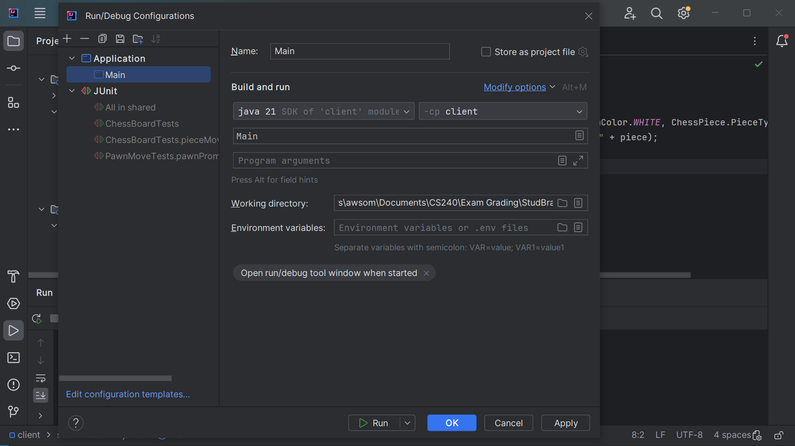
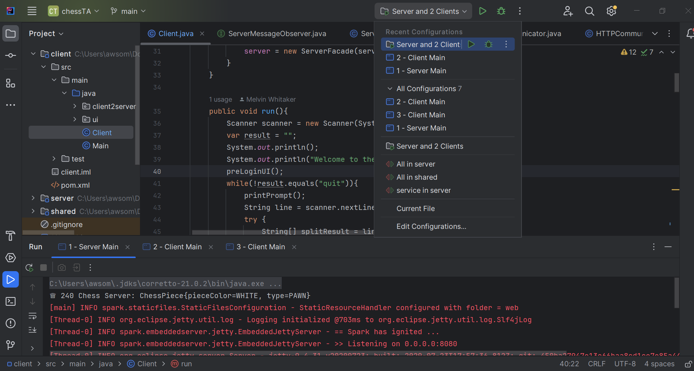
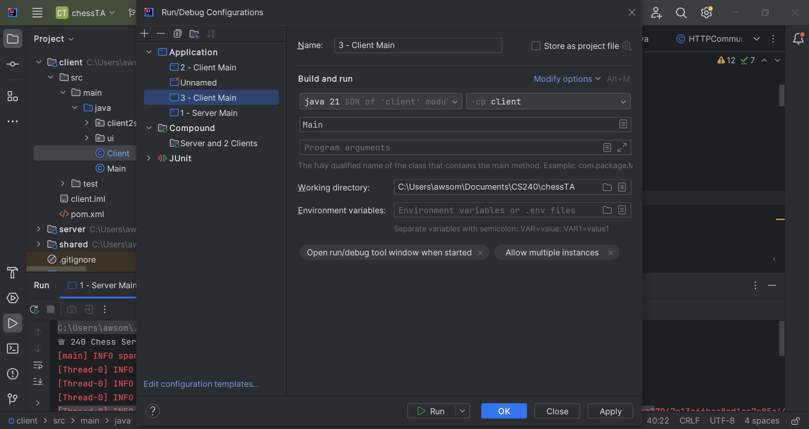
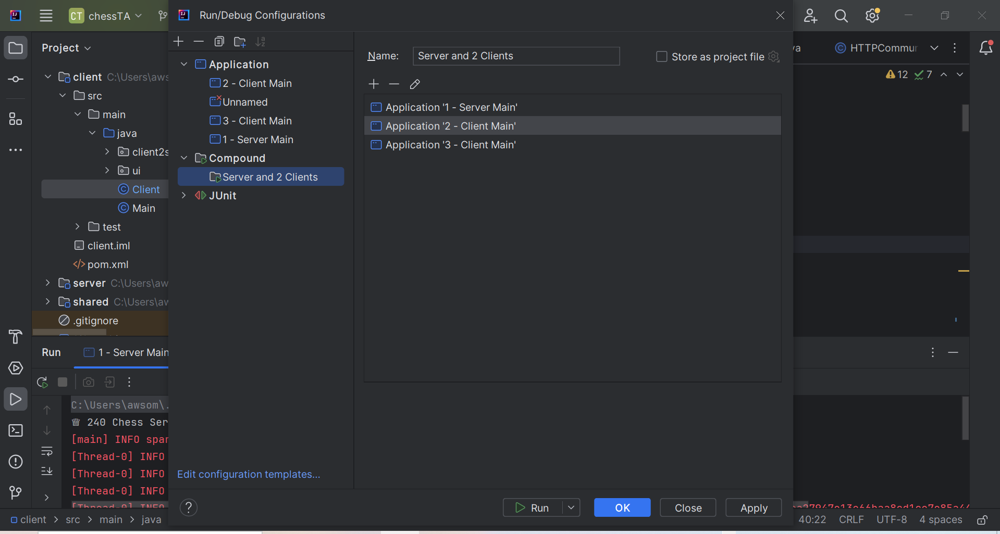

# Run Configurations
Testing Phase 6 is important!

You’ll need to make additional changes to your settings to allow Intelli-J to start multiple instances of your client (you’ll still only need at most 1 server running) to properly test the websocket notifications. By this time, you should have already disconnected entirely your client from your server so that starting a client does not start the server automatically (this begins to be important now).

There are multiple approaches for doing this, here are a few approaches which we will go into more detail for:
1. Allowing Multiple Instances.
2. Creating Compound Configurations.

## Allowing Multiple Instances
By default, Intelli-J only allows one instance of each run configuration to be active at a time. In our case, we need at least 3 instances of the client active (but only one server to manage them all). Follow the instructions below to enable multiple instances of the client:
1. Edit the “Client” run configuration. This can be done by first running the client main then going to the top of the window in Intelli-J and clicking on the current configuration. Click on "Edit Configurations..." and a new window should open up.

2. Click on “Modify options”.
3. Choose “Enable multiple instances”, then click "Apply" and "OK".

## Creating Compound Configurations
It may become tedious to manually run the server main and the client main when trying to debug or passoff; what you can do to mitigate this process is by making a "compound configuration". Follow the instructions below to create a compound configuration:
1. Go to the top of the window in Intelli-J and click on the current configuration. Then, click on "Edit Configurations..." and a new window should open up.

2. Click on the + sign on the top left of the new window, then click on "Compound".
3. Add the appropriate applications for the compound configuration. This is done by clicking on the Application tab in the window. If you do not see the configurations for both the client and the server then rerun both the server and the client main. Name the configurations appropriately. If done correctly, it will look like this:

4. Go back to the compound configuration and add the application configurations by clicking the + sign underneath the compound configuration's name. 
5. Add the server and the client configuration. If done correctly, it will look like this:

6. If you want to run two or more clients, you'll simply have to create more application configurations that are the same as the first client configuration for each additional client you want to run.
> [!IMPORTANT]
> The compound configuration will open the applications alphabetically, if you want to open the server before the client you can add a number at the start of the name in the order that you want.