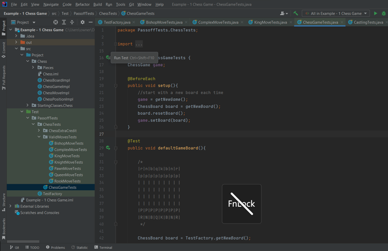
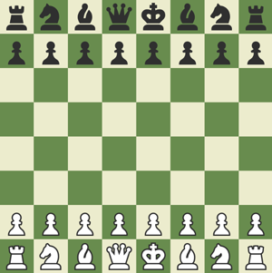

# Chess Game

In this part of the Chess Project, you will create the base Chess Game behavior. To do this you will create the following 10 implementation classes that implement the provided interfaces: A Chess Game class, a Chess Board class, a Chess Position class, a Chess Move class, and 6 Chess Piece classes. In later assignments you will use this code to create a fully playable game.

## Code Class Structure


**NOTE**: You are not limited to these functions. These functions are required to be able to run the automated tests. You will likely need to create additional methods.

## Class Summaries

### ChessGame

This class serves as the top-level management of the Chess Game. It is responsible for executing moves as well as reporting the game status.

**Key Methods**:

- **validMoves**: Takes as input a position on the Chess Board and returns all moves the piece there can legally make. If there is no piece at that location, this method returns `null`.
- **makeMove**: Receives a given move and executes it, provided it is a legal move. If the move is illegal, it throws a `InvalidMoveException`. A move is illegal if the chess piece cannot move there, if the move leaves the team’s king in danger, or if it’s not the corresponding teams turn.
- **isInCheck**: Returns true if the specified team’s King could be captured by an opposing piece.
- **isInCheckmate**: Returns true if the given team has no way to protect their king from being captured.
- **isInStalemate**: Returns true if the given team has no legal moves and it is currently that team’s turn.

### ChessBoard

This class stores all the uncaptured pieces in a Game. It needs to support adding and removing pieces for testing, as well as a `resetBoard()` method that sets the standard Chess starting configuration.

### ChessPiece

This class represents a single chess piece, with its corresponding type and team color. There are 6 different types of pieces: King, Queen, Bishop, Knight, Rook, and Pawn.

**Key Methods**:

- **pieceMoves**: This method is similar to `ChessGame::validMoves`, except it does not check the turn or Check (king safety) constraints. This method does account for enemy and friendly pieces blocking movement paths. Each of the 6 different implementations of this class will need a unique pieceMoves method to calculate valid moves for that type of piece. See later in the specs for rules on how each piece moves, as well as a couple special moves that can be implemented for extra credit.

### ChessMove

This class represents a possible move a chess piece could make. It contains the starting and ending positions. It also contains a field for the type of piece a pawn is being promoted to. This field for promotion type should be null for all moves other than when a pawn is being promoted.

### ChessPosition

This represents a location on the Chess Board. This should be represented as a row number from 1-8, and a column number from 1-8. (1,1) corresponds to the bottom left corner (which in chess notation is denoted `a1`). (8,8) corresponds to the top right corner (`h8` in chess notation).

## Recommended Order

For this project, you are free to implement the classes above in whatever order makes sense to you. However, for those who may be stuck on where to go from here, below is a good order of implementation:

- Simple class that require little to no logic (Board, Move, Position)
- Each piece and its respective `pieceMoves()` method
- Game

## Testing

For the pass off tests to be able to instantiate your classes, you will need to fill in some Factory methods. In the `test` folder, go to passoffTests / TestFactory. Inside the TestFactory class are 5 methods you will need to fill in for the tests to work properly. These methods are in the `Chess Functions` section of TestFactory. Each method has a `FIXME` comment that describes what the method needs to return. The other methods in TestFactory will be used in future assignments and can be ignored for now.

The test cases for this assignment are in passoffTests → chessTests. ValidMoveTests has a collection of tests for the movement of individual pieces, and ChessGameTests has tests for the overall gameplay. You will need to pass all these tests to pass off this assignment.

The Tests in ChessExtraCredit are for the `Castling` and `En Passant` moves. Successfully passing these will earn you some extra credit on this assignment, but are not required for pass off.

To run the tests, you can click the play icon next to an individual test, or you can right click on a package or class and select `Run` or `Run Tests in …`




## Chess Rules

### Summary

Chess is a strategy game where 2 players take turn moving pieces and capturing enemy pieces with the goal of trapping the enemy king. Each of the 6 types of pieces has a unique way of moving/capturing. A piece captures an enemy piece when moving to the enemy piece’s location, after which the enemy piece is removed from the game. You win when your opponent has no way to avoid you being able to capture their king.

### Movement

**`King`**

Kings may move 1 square in any direction (including diagonal) to either a position occupied by an enemy piece (capturing the enemy piece), or to an unoccupied position. A player is not allowed to make any move that would allow the opponent to capture their King. If your King is in danger of being captured on your turn, you must make a move that removes your King from Immediate danger.

**`Pawn`**

Pawns normally may move forward one square if that square is unoccupied, though if it is the first time that pawn is being moved, it may be moved forward 2 squares (provided both squares are unoccupied).
Pawns cannot capture forward, but instead capture forward diagonally (1 square forward and 1 square sideways). They may only move diagonally like this if capturing an enemy piece.
When a pawn moves to the end of the board (row 8 for white and row 1 for black), they get promoted and are replaced with the players choice of Rook, Knight, Bishop, or Queen (they cannot stay a Pawn or become King).

**`Rook`**

Rooks may move in straight lines as far as there is open space. If there is an enemy piece at the end of the line, rooks may move to that position and capture the enemy piece.

**`Knight`**

Knight’s move in an “L” shape, moving 2 squares in one direction and 1 square in the other direction. Knights are the only piece that can ignore pieces in the in-between squares (they can “Jump” over other pieces). They can move to squares occupied by an enemy piece and capture the enemy piece, or to unoccupied squares.

**`Bishop`**

Bishops move in diagonal lines as far as there is open space. If there is an enemy piece at the end of the diagonal, the bishop may move to that position and capture the enemy piece.

**`Queen`**

Queens are the most powerful piece and may move in straight lines and diagonals as far as there is open space. If there is an enemy piece at the end of the line, they may move to that position and capture the enemy piece. (In simpler terms, Queens can take all moves a Rook or Bishop could take from the Queens position).

### Board Setup

Each player starts with 8 pawns, 1 King, 1 Queen, 2 Bishops, 2 Knight, and 2 Rooks, totaling 16 pieces per player. White’s pawns span row 2, while Black’s pawns span row 7. The rest of the pieces are lined up across row 1 for white and row 8 for black in the following columns: 1: Rook, 2: Knight, 3: Bishop, 4: Queen, 5: King, 6: Bishop, 7: Knight, 8: Rook.

Below is the setup using the first letter to denote each piece (using “n” for knight). Capital letters represent white pieces and lowercase letters represent black pieces.

```sh
|r|n|b|q|k|b|n|r|
|p|p|p|p|p|p|p|p|
| | | | | | | | |
| | | | | | | | |
| | | | | | | | |
| | | | | | | | |
|P|P|P|P|P|P|P|P|
|R|N|B|Q|K|B|N|R|
```

And the starting board using chess pieces:



Here are some guides that may help:

- [https://www.chess.com/
  learn-how-to-play-chess](https://www.chess.com/learn-how-to-play-chess)
- [https://en.wikipedia.org/wiki/Rules_of_chess](https://en.wikipedia.org/wiki/Rules_of_chess)

### Extra Credit Moves

You do not have to implement these moves, but if you go the extra mile and successfully implement both of these moves, you’ll earn some extra credit on this assignment.

**`Castling`**

This is a special move where the King and a Rook move simultaneously. The castling move can only be taken when 4 conditions are met; 1: Neither the King nor Rook have moved, 2: There are no pieces between the King and the Rook, 3: The King is not in Check, and 4: Both your Rook and King will be safe after making the move (cannot be captured by any enemy pieces). To Castle, the King moves 2 spaces towards the Rook, and the Rook “Jumps” the king moving to the position next to and on the other side of the King. This is represented in a ChessMove as the king moving 2 spaces to the side.

**`En Passant`**

This is a special move taken by a Pawn in response to your opponent double moving a Pawn. If your opponent double moves a pawn so it ends next to yours (skipping the position where your pawn could have captured their pawn), then on your immediately following turn your pawn may capture their pawn as if their pawn had only moved 1 square. This is as if your pawn is capturing their pawn mid motion, or “In Passing”.
