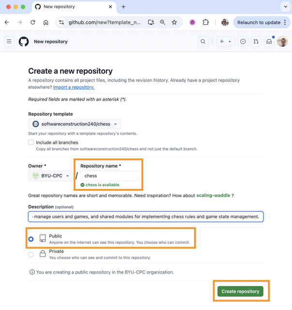

# ♕ Chess GitHub Repository

In the following phases of the chess project you will add to, and enhance, the content you have created in a GitHub repository. The commit history that you establish through the course serves the following valuable purposes:

1. **Backup** - Every semester at least one student's computer dies. Having the ability to clone the repo to a new computer could save your grade in the course.
1. **Portfolio** - The code you develop in this course serves as a valuable portfolio artifact that you can use to demonstrate your mastery to future employers.
1. **Proof of work** - You can demonstrate your authorship of your code by consistently, and frequently, committing your work.
1. **Exploration** - The ability to create branches allows you to continuously experiment with different ideas without losing the main thread of your development. Likewise, you can try and implement something, realize it is not working and then simply reset to your last commit.
1. **Experience** - Git is the de facto versioning system. The experience you gain in this class will help prepare you for professional work.

All of this requires that you commit often. You should get in the habit of consistently making a small stable change and then committing.

1. Verify you have the latest code (`git pull`)
1. Refactor, test, and/or implement a small portion of cohesive code (`test` `code` `test`)
1. Commit and push (`git commit` `git push`)
1. Repeat

You will be most successful in this course if you set aside time each day, or every other day, to work on the project. Those consistent work sessions should be complemented with consistent commits. If you are not creating multiple commits every workday then you are not reflecting the code management practices you need in order to be successful in a production development environment.

For all of the above reasons, it is required that you use GitHub for your chess project. Additionally, you must use it consistently and frequently.

⚠ **IMPORTANT**: **It is a prerequisite for all deliverables that you have at least 10 commits evenly spread across the assignment period for the deliverable.**

If you do not have the required number of commits, or if they are all clustered in a single burst of activity, then you will need to justify the discrepancy before the deliverable will be accepted.

## Creating Your Chess GitHub Repository

1. Open your web browser to [GitHub](https://github.com)
1. Create a GitHub repository for your chess project

   1. Name it `chess`.
   1. Mark the repository as `public` so that it can be reviewed by the TAs and instructors.
   1. Select the option to create a license file.

      

1. Open a command line console window.
1. Clone the repository to your development environment. Make sure you put the clone of the repository in a directory that you use for this class's coursework. These commands will look something like the following.

   ```sh
   cd ~/byu/cs240
   git clone https://github.com/YOURACCOUNTHERE/chess.git
   cd chess
   ```

## Making Changes

After you have cloned your repository locally, you need to make a change so that you can demonstrate that things are working properly.

1. Create a file in your repository directory named `notes.md`.
1. Add some content to it.
1. Add the `notes.md` file to the repo.
1. Create the changes.
1. Push the changes to GitHub.

You can accomplish all of these changes with the following commands.

```sh
echo "# My notes" > notes.md
git add notes.md
git commit -am "initial(notes) creation"
git push
```

As you develop your chess application you should consider keeping notes about the techniques and technologies that you learn in the `notes.md` file that you have added.

## ☑ Deliverable

Create your repository, clone it to your development environment, add the `notes.md` file, and pushed to GitHub.

Submit the URL of your repository to the canvas assignment. The URL should look something like this:

```txt
https://github.com/<youraccount>/chess
```
