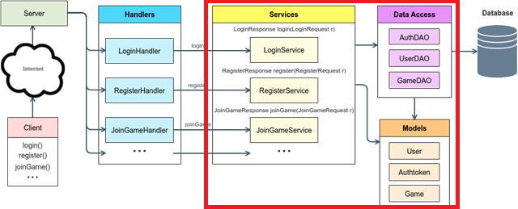

# Server Design

In this part of the Chess Project, you will create the class and package structure for your Chess Server. Create the Java packages you think you will need for your server implementation. Then, populate each package with the classes you think you will need. For this assignment you need not create fully-functional classes. Rather, for each class you only need to declare the public methods, constructors, and fields the class will need. Add minimal bodies to each method and constructor sufficient to make the class compile. If a method has no return value, its body may be empty. If a method has a return value, add a return statement so the method will compile (e.g., return null or zero or false or whatever works). The code needs to compile so that we can use the Javadoc tool to generate nicely-formatted documentation for your design that you can submit for grading.

Javadoc is a tool that looks through your code and extracts comments in order to generate nicely-formatted documentation for your classes. This is the same tool that is used to generate the official Java API documentation. Write a Javadoc comment for each class, constructor, method, and field in your design that explains the item’s purpose and/or function. You should also document all constructor and method parameters with Javadoc @param tags, all return values with Javadoc @return tags, and all exceptions throw with Javadoc @throws or @exception tags (these two tags are synonymous). You do need not write Javadoc comments for getter and setter methods.

You need to create classes for each Service, each Request and Result, each Model object, and each Data Access Object (DAO). At this point in the project, you do not need to create the Client, the Server class, the Handler classes, or the relational Database. You do not need to code any of the algorithms, just create the structure of the packages, classes, methods, and fields.

## Generating Javadoc in IntelliJ

After creating and commenting your classes, follow these instructions to generate the documentation for your design.

1. Select packages you want Javadocs for
1. Select Tools -> Generate JavaDoc...
1. Create an empty directory that will contain the files created by Javadoc, and Select it as the output directory
1. Select "private" on the private/package/protected/public scale
1. Deselect "Include test sources"
1. Click OK. Javadocs will be in the specified output directory.
1. Compress Javadocs into a zip archive

## Submitting Your Design

Submit your Javadocs zip archive to the Chess Design Canvas Assignment.
