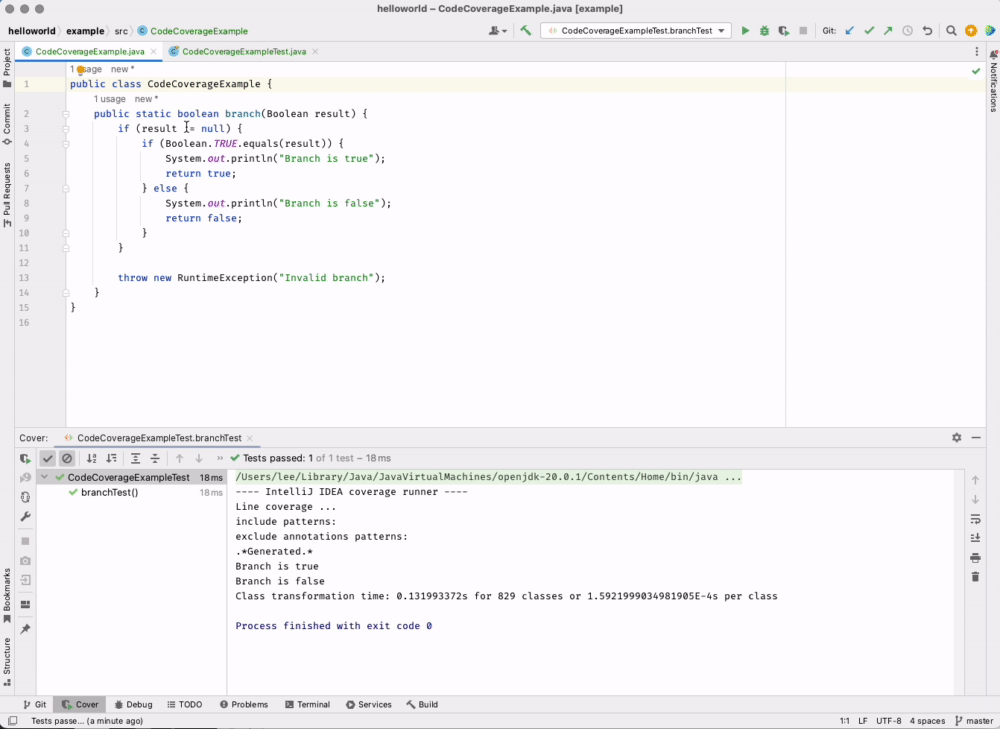

# Code Coverage

🖥️ [Slides](https://docs.google.com/presentation/d/14fDhNHsnU-knkVYmfNDsIwZQ027tu_DB/edit?usp=sharing&ouid=114081115660452804792&rtpof=true&sd=true)

🖥️ [Lecture Videos](#videos)

### 🔑 Key points

- Code coverage provides a metric to help determine if code is sufficiently tested.
- High coverage does not guarantee code correctness or the absence of bugs.
- Coverage tools help identify untested paths, such as conditional branches and error-handling logic.

---

Once you begin using test-driven development (TDD), you rely on tests to alert you when something is broken. However, this can lead to a state of false confidence if your tests do not actually exercise all possible paths through your code. This happens when tests miss certain conditional branches, fail to trigger exceptional cases, or do not account for the full range of possible inputs.

Modern Integrated Development Environments (IDEs) provide tools to measure the amount of code coverage your tests provide. You can use the built-in coverage tool in IntelliJ to evaluate the thoroughness of your test suite. To access it, select the **Run 'Test Name' with Coverage** option from the execution menu. This opens a coverage report showing the percentage of code executed. In the editor, the tool displays a green marker next to lines that were executed and a red marker next to lines that were skipped.

The following animation shows a function called `branch` with three distinct execution paths. To achieve full coverage, the test suite must provide `true`, `false`, and `null` values for the parameter. You can see the coverage increasing to 100% as the necessary test cases are enabled for each branch.



## How much coverage?

The question of what percentage of coverage is necessary is a subject of significant debate. Some developers believe that anything less than 100% is a risk. Others argue that striving for 100% coverage can lead to unmaintainable tests, introduce unnecessary complexity into the source code, and decrease overall productivity. The ideal coverage target often depends on the specific requirements and criticality of the project.

It is important to note that 100% coverage does not mean all logic paths are fully exercised or that the code is correct. Consider the following function:

```java
public static void oneHundredPercentCoverage(Object obj) {
    obj.toString();
}
```

You can write a single test that calls this function with a valid object to achieve 100% code coverage. However, if the test suite does not include a case where `obj` is `null`, a `NullPointerException` remains a latent bug that will eventually affect users.

Code coverage can also provide a false sense of security if the testing relies solely on simple unit tests. Many bugs only emerge when an application runs end-to-end, involving the front-end client, middleware, business logic, and data services. Because unit tests often "mock" or "stub" external dependencies to isolate the code, they may miss real-world edge cases and integration failures that occur in a production environment.

Despite these limitations, code coverage is a vital indicator of testing quality. It highlights problematic areas that require review, particularly in code that is highly complex, has a high branching factor, or contains logic paths that are rarely executed.

## ☑ Exercise


```masteryls
{"id":"4057882b-96e0-4013-8f40-6f182d587ba5","title":"Determining Ideal Code Coverage","type":"multiple-choice"}
When establishing a target for code coverage within a software development team, which of the following best describes the "right" percentage to aim for?

- [ ] 100% coverage should always be the mandatory goal to ensure that every line of code is executed and guaranteed to be bug-free.
  You're right to aim high. Thorough testing is valuable, and some developers do argue for 100%.

  Coverage only shows that lines *ran*, though, not that they're correct. The lesson's example shows a function with 100% coverage that still fails on certain inputs. Chasing 100% can also lead to brittle tests and extra complexity.

  Revisit the *How much coverage?* section and its example.

- [ ] Exactly 80% coverage, as this is the industry-standard threshold required for software to be considered "production-ready."
  Good effort. 80% is a common rule of thumb, and many teams use it.

  It isn't an industry standard or a requirement for "production-ready" software, though. Some systems need much more coverage than others, depending on their requirements and how critical they are.

  Reread the *How much coverage?* section and notice what the lesson says the right target depends on.

- [ ] Coverage should be kept below 50% to ensure that the development team is focusing on writing new features rather than maintaining test suites.
  You're thinking about the cost of maintaining tests, and that cost is real.

  Deliberately keeping coverage low, though, means large parts of the code are never verified. Bugs then reach users, and the time "saved" goes into fixing them later.

  Revisit the debate described in the *How much coverage?* section and notice the factors that should drive the target.

- [x] There is no universal "correct" percentage; the target should be based on the project's risk profile and the point of diminishing returns.
  **Well reasoned!** There's no magic number.

  A payment system or medical device may justify very high coverage. A prototype may not. Beyond a certain point, each extra percentage point costs more than it's worth. Remember too that coverage measures which lines ran, not whether the results are correct, so pair it with meaningful assertions.
```

```masteryls
{"id":"d74950d1-2903-4cda-ab9f-0d38a4dcb11c","title":"Diligence in Testing","type":"essay"}
How does the discipline of measuring and improving code coverage cultivate the thoroughness and honesty that the BYU aim of character building seeks to develop, and how does that diligence serve the people who depend on your software?
```


## Videos

- 🎥 [Code Coverage Overview (8:18)](https://byu.hosted.panopto.com/Panopto/Pages/Viewer.aspx?id=5fc1d70d-9c34-41f1-b195-b1a001161540&start=0) - [[transcript]](https://github.com/user-attachments/files/17707673/CS_240_Code_Coverage_Overview_Transcript.pdf)
- 🎥 [Code Coverage Tools (1:38)](https://byu.hosted.panopto.com/Panopto/Pages/Viewer.aspx?id=c58109b6-ea78-4e98-8554-b1a001187fdb&start=0) - [[transcript]](https://github.com/user-attachments/files/17707688/CS_240_Code_Coverage_Tools_Transcript.pdf)
- 🎥 [Intellij Code Coverage (3:49)](https://byu.hosted.panopto.com/Panopto/Pages/Viewer.aspx?id=cbb47ecd-2023-4911-933b-b1a001195835&start=0) - [[transcript]](https://github.com/user-attachments/files/17707699/CS_240_IntelliJ_Code_Coverage_Transcript.pdf)