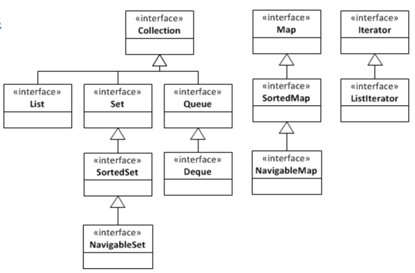

# Java Collections

🖥️ [Slides](https://docs.google.com/presentation/d/1yAxwkW1qClRlFBxAokyBvfDhuTI6LXmA/edit?usp=sharing&ouid=114081115660452804792&rtpof=true&sd=true)

🖥️ [Lecture Videos](#videos)

📖 **Required Reading**: Core Java for the Impatient

- Chapter 7: Collections

The Java Collection library provide several useful utility classes for dealing with data structures. This includes things like lists, sets, and maps. Using the standard collections library makes it so that you don't have to write this code yourself. You can also be confident that the code has been thoroughly tested, is secure, and is multithreaded where appropriate.



Most of the JDK collection objects are contained in the [java.util](https://docs.oracle.com/javase/8/docs/api/java/util/package-summary.html) package. It is worth the time to browser the JavaDocs for this package and become familiar with what it offers. Some of the more commonly used interfaces include [List](https://docs.oracle.com/javase/8/docs/api/java/util/List.html), [Map](https://docs.oracle.com/javase/8/docs/api/java/util/Map.html), [Set](https://docs.oracle.com/javase/8/docs/api/java/util/Set.html), and [Iterator](https://docs.oracle.com/javase/8/docs/api/java/util/Iterator.html). The package also provides various implementations of the interfaces such as [HashMap](https://docs.oracle.com/javase/8/docs/api/java/util/HashMap.html), [ArrayList](https://docs.oracle.com/javase/8/docs/api/java/util/ArrayList.html), and [TreeSet](https://docs.oracle.com/javase/8/docs/api/java/util/TreeSet.html).

## ArrayList Example

Here is an example of using the `ArrayList` class.

```java
import java.util.ArrayList;

public static class MountainList {
    ArrayList mountains = new ArrayList();

    public MountainList() {
        mountains.add("Nebo");
        mountains.add("Timpanogos");
        mountains.add("Lone Peak");
        mountains.add("Cascade");
        mountains.add("Provo");
        mountains.add("Spanish Fork");
        mountains.add("Santaquin");
    }

    public void print() {
        for (var m : mountains) {
            System.out.println(m);
        }
    }

    public static void main(String[] args) {
        var mountains = new MountainList();
        mountains.print();
    }
}
```

## HashMap Example

Here is an example of using the `HashMap` class.

```java
import java.util.HashMap;

public static class MountainMap {
    HashMap<String, Integer> mountains = new HashMap<>();

    public MountainMap() {
        mountains.put("Nebo", 11928);
        mountains.put("Timpanogos", 11750);
        mountains.put("Lone Peak", 11253);
        mountains.put("Cascade", 10908);
        mountains.put("Provo", 11068);
        mountains.put("Spanish Fork", 10192);
        mountains.put("Santaquin", 10687);
    }

    public void print() {
        for (var m : mountains.entrySet()) {
            System.out.printf("%s, height: %d%n", m.getKey(), m.getValue());
        }
    }

    public static void main(String[] args) {
        var mountains = new MountainMap();
        mountains.print();
    }
}
```

## Equals and HashCode

When we previously discussed the [Java Object](../java-object-class/java-object-class.md) class we talked about the importance of overriding the equals and hashCode methods. The JDK collection objects make extensive use of these methods and so it is vital that you implement them on any class that you use with collection objects such as a `Map`.

## Comparable

If you are going to use your objects with collections and operations that sort your objects, you must also implement the `Comparable` interface. This provides the ability to define the ordering of your object based on the values they contain.

Comparable returns a negative integer if the object is less, zero if they are equal, or a positive integer if the object is greater than the object provided as a parameter to `compareTo`.

```java
public class ComparableExample implements Comparable<ComparableExample> {
    final private char value;

    ComparableExample(char value) {
        this.value = value;
    }

    @Override
    public int compareTo(ComparableExample o) {
        return value - o.value;
    }

    @Override
    public String toString() {
        return String.format("%c", value);
    }

    public static void main(String[] args) {
        var items = new ComparableExample[]{
            new ComparableExample('r'),
            new ComparableExample('a'),
            new ComparableExample('b')
        };

        Arrays.sort(items);
        for (var i : items) {
            System.out.println(i);
        }
        // Outputs: a b r
    }
}
```

## Things to Understand

- The interfaces and classes that make up the Java collection API
- What each interface and class is used for
- The importance of overriding the `equals(...)` and `hashCode()` methods of classes that will be placed in collections
- The importance of implementing the Comparable interface in classes that will be placed in collections

## <a name="videos"></a>Videos (42:23)

- 🎥 [Java Collections (22:57)](https://byu.hosted.panopto.com/Panopto/Pages/Viewer.aspx?id=7f2f800e-d46e-4ce4-8839-ad5f011fa7a1&start=0)
- 🎥 [Using Collections Correctly (19:26)](https://byu.hosted.panopto.com/Panopto/Pages/Viewer.aspx?id=bea26db3-5825-4df2-9ba0-ad5f01260f7e&start=0)
