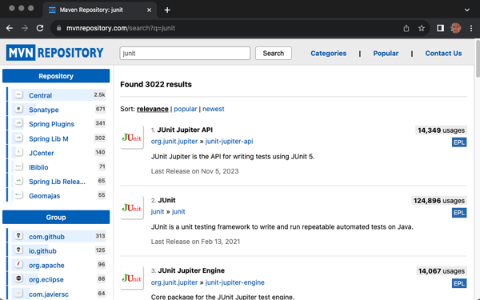
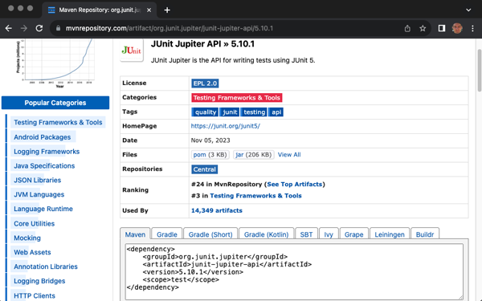
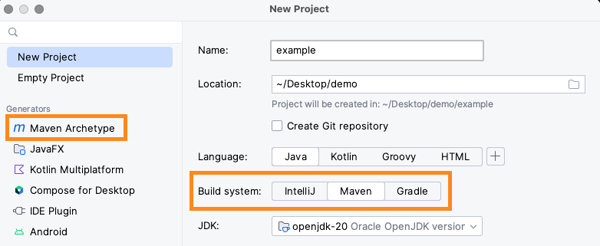
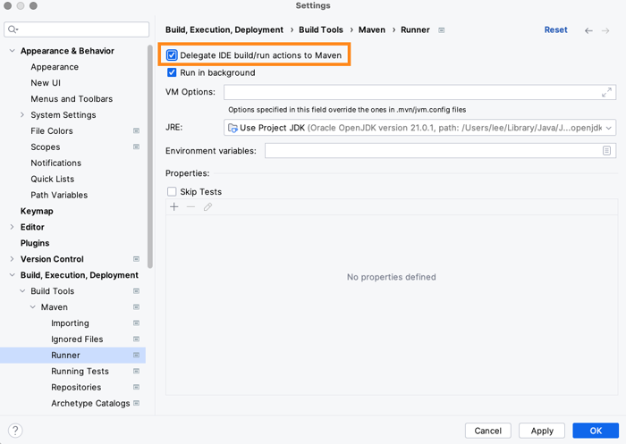
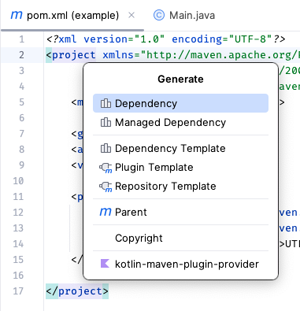
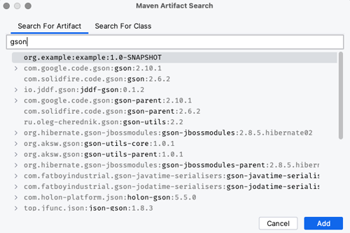

# Command-line Builds

🖥️ [Slides](https://docs.google.com/presentation/d/1Li3p-74-4LoosHmyB_u2b5kpi_vkNgz6/edit#slide=id.p1)

🖥️ [Lecture Videos](#videos)

📖 **Required Reading**:

- [Maven in 5 Minutes](https://maven.apache.org/guides/getting-started/maven-in-five-minutes.html)

📖 **Optional Reading**:

- OPTIONAL: [Maven Getting Started Guide](https://maven.apache.org/guides/getting-started/index.html)

When developing a software project, you must frequently "build" the software. The "build process" includes activities such as compiling the code, compiling and running automated test cases, packaging the code into distributable files, generating code and test quality reports, etc. IDEs such as IntelliJ are great, but using them to build a project can be a partially manual and error-prone process. For many reasons, it can be advantageous to create a "command-line build" for your project, which allows anyone to compile, run, test, package, deploy, and validate the software using simple shell (ie, command-line) commands. Fortunately, there are many tools available to help create a command-line build for a project, such as Apache Maven.

## Installing Maven

To get started with Maven, you need to install it. You can find the installation program at the official download repository.

> [https://maven.apache.org/download.cgi](https://maven.apache.org/download.cgi)

> [!NOTE]
> When you install IntelliJ, it installed a copy of Maven. If you want to use that installation, then you will have to update your command line path to make it accessible outside of IntelliJ. For example, if you are using a Mac you would include something like the following in your profile file. If you are using Windows then you will need to update the `Environment Variables` in your operating system settings.

```sh
export PATH="$PATH:/Applications/IntelliJ IDEA CE.app/Contents/plugins/maven/lib/maven3/bin"
```

Once you have installed Maven you can verify it is working by opening up a console window and running the following command in order to see what version you are using.

```sh
➜  mvn --version

Apache Maven 3.9.2 (c9616018c7a021c1c39be70fb2843d6f5f9b8a1c)
Maven home: /Applications/IntelliJ IDEA CE.app/Contents/plugins/maven/lib/maven3
```

## Creating a Maven Project

Let's go ahead and create an application that we can use to demonstrate how Maven works. We ill start with the following Main.java code.

```java
public class Main {
    public static void main(String[] args) {
        System.out.println("Hello Maven!");
    }
}
```

In order to use Maven as our build tool we need to follow a specific directory structure for the project. Our code must be put in a `src/main/java` directory. Any tests that we have must be placed in a `src/test/java` directory.

We also create a file in the root of our project that is named `pom.xml` that tells Maven how to run. We will discuss what this file contains in a minute.

When you build your code it will create, and output, to a directory named `target`.

```txt
<project>
├── pom.xml
├── src
│   ├── main
│   │   └── java
│   │       └── Main.java
│   └── test
│       └── java
│           └── MainTest.java
└── target
    ├── classes
    │   └── Main.class
    └── demo.jar
```

## Project Object Model

The Project Object Model, or `pom.xml`, file defines everything that Maven needs to know in order to build, test, and deploy an artifact. For our purposes, our artifact is our application. A basic `pom.xml` file looks like the following.

```xml
<?xml version="1.0" encoding="UTF-8"?>
<project>
    <modelVersion>4.0.0</modelVersion>

    <groupId>org.example</groupId>
    <artifactId>example</artifactId>
    <version>1.0-SNAPSHOT</version>

    <properties>
        <maven.compiler.source>21</maven.compiler.source>
        <maven.compiler.target>21</maven.compiler.target>
        <project.build.sourceEncoding>UTF-8</project.build.sourceEncoding>
    </properties>
</project>
```

This defines the name of the artifact and what Java version is required to build the application.

## Executing a Phase

With Maven installed, the correct directory structure, and `pom.xml` file we can compile our code by opening a console window and executing Maven (`mvn`) with the `compile` parameter.

```sh
➜  mvn compile

[INFO] --< org.example:example >--
[INFO] Building example 1.0-SNAPSHOT
[INFO]   from pom.xml
[INFO] ---------------------------
[INFO] BUILD SUCCESS
```

When you run `mvn` you ask it to execute a `phase`. This represents things like compile, clean, test, package, or deploy. When Maven executes a phase, it looks for a `plugin` containing a `goal` that is registered to execute as part of the phase. There are default plugins that deploy with Maven, but you can also download or create your own plugins.

| Term      | Definition                                                                                                           |
| --------- | -------------------------------------------------------------------------------------------------------------------- |
| Lifecycle | A collection of phases for building or distributing an artifact.                                                     |
| Phase     | A specific step in a lifecycle.                                                                                      |
| Goal      | The code that actually contributes to the execution of a lifecycle phase. Each Goal is assigned to a specific phase. |
| Plugin    | A binary container for goal code. You register one or more plugins to run as part of your artifact lifecycle.        |

Here is a list of some of the commonly used phases that are included in Maven by default.

| Phase   | Plugin:goal      | Purpose                                          |
| ------- | ---------------- | ------------------------------------------------ |
| clean   | clean:clean      | Delete the `target` directory.                   |
| compile | compiler:compile | Compile the code found in the `src/main/java`    |
| test    | surefire:test    | Run test found in the `src/test/java` directory. |
| package | jar:jar          | Create a jar file.                               |

### Executing Code

Once we have built our code with the `mvn compile` command we can execute it using the standard `java` runtime.

```sh
➜  java -cp target/classes Main
Hello Maven!
```

We can also install a custom plugin that knows how to execute java code. We do this by adding the following to our `pom.xml` file.

```xml
    <build>
        <plugins>
          <plugin>
            <groupId>org.codehaus.mojo</groupId>
            <artifactId>exec-maven-plugin</artifactId>
            <version>3.1.1</version>
            <configuration>
              <mainClass>Main</mainClass>
            </configuration>
          </plugin>
        </plugins>
    </build>
```

Now we can run the `exec:java` goal.

```sh
➜  mvn exec:java

[INFO] --< org.example:example >---
[INFO] Building from pom.xml
[INFO] ------ exec:3.1.1:java -----
Hello Maven!
```

### Jar

If you want to compile your application into a jar file then you can add the following to your `pom.xml` file. The `packaging` element specifies that we want to output to a jar file. The `finalName` element specifies the name of the jar file.

```xml
    <packaging>jar</packaging>

    <build>
        <finalName>demo</finalName>
        <plugins>
          <plugin>
            <groupId>org.apache.maven.plugins</groupId>
            <artifactId>maven-assembly-plugin</artifactId>
            <version>3.6.0</version>
            <executions>
                <execution>
                    <phase>package</phase>
                    <goals>
                        <goal>single</goal>
                    </goals>
                    <configuration>
                        <archive>
                            <manifest>
                                <mainClass>
                                    Main
                                </mainClass>
                            </manifest>
                        </archive>
                        <descriptorRefs>
                            <descriptorRef>jar-with-dependencies</descriptorRef>
                        </descriptorRefs>
                    </configuration>
                </execution>
            </executions>
          </plugin>
        </plugins>
    </build>
```

Now we can run the `package` goal.

```sh
➜  mvn package

[INFO] --< org.example:example >---
[INFO] Building jar: demo.jar
[INFO] ----------------------------
[INFO] BUILD SUCCESS
```

### Dependencies

Maven also helps manage our application dependencies. To include a dependency in your project you just need to add the information about the dependency to your `pom.xml`. For example, if you wanted to include JUnit and Gson to your project you would add the following.

```xml
    <dependencies>
        <dependency>
            <groupId>org.junit.jupiter</groupId>
            <artifactId>junit-jupiter</artifactId>
            <version>5.10.0</version>
        </dependency>
        <dependency>
            <groupId>com.google.code.gson</groupId>
            <artifactId>gson</artifactId>
            <version>2.10.1</version>
        </dependency>
    </dependencies>
```

By default, Maven will pull these dependencies from the central public repository hosted at [https://repo.maven.apache.org/maven2/](https://repo.maven.apache.org/maven2/). You can search and explore the repository using [mvnRepository.com](https://mvnrepository.com/).



After you have searched and found a package you want to include as a dependency you can select the desired version and it will display the Maven XML that you need to copy into your `pom.xml`.



With the dependency in your project file you can immediately begin using it in your code. We can demonstrate this by modifying our main function to use Gson.

```java
import com.google.gson.Gson;
import java.util.Map;

public class Main {
    public static void main(String[] args) {
        var greeting = Map.of("greeting", "Hello", "object", "Maven");
        var serializer = new Gson();
        String json = serializer.toJson(greeting);

        System.out.println(json);
    }
}
```

We can build and run our code by executing `mvn exec:java`. Notice now that it outputs Json now instead of a simple string.

```sh
➜  mvn exec:java

[INFO] --< org.example:example >---
[INFO] Building from pom.xml
[INFO] ------ exec:3.1.1:java -----
{"object":"Maven","greeting":"Hello"}
```

Since we also install JUnit, we can write a unit test and add it to a file in the `src/test/java` directory.

```java
import org.junit.jupiter.api.Test;
import static org.junit.jupiter.api.Assertions.*;

class MainTest {
    @Test
    void testMain() {
        assertDoesNotThrow(() -> Main.main(new String[]{"cow"}));
    }
}
```

We can run the test by executing `mvn test`.

```sh
➜  mvn test

[INFO] --< org.example:example >---
[INFO] Building from pom.xml
[INFO] ------ exec:3.1.1:java -----
[INFO]
[INFO] -------------------------------------------------------
[INFO]  T E S T S
[INFO] -------------------------------------------------------
[INFO] Running MainTest
{"greeting":"Hello","object":"Maven"}
[INFO] Tests run: 1, Failures: 0, Errors: 0, Skipped: 0, Time elapsed: 0.038 s -- in MainTest
```

## IntelliJ integration

Configuring you build, testing, and deployment process to run from the command line is great for automated processes, but it is also nice to use an IDE, like IntelliJ, for your development work. For this reason, IntelliJ includes the ability to use Maven for building, testing, and packaging jar files.

To create a project that uses Maven you select `Maven` as the build system when you create a new project. You can also select a `Maven Archetype`. This allows you to select a set of application templates that help bootstrap your efforts.



This will create a `pom.xml` file along with the directory structure that Maven requires.

Once you have created your project you need to tell IntelliJ that you want to use Maven for the building and running your code. This is found in the application settings.



You can also find and insert dependencies directly into your `pom.xml` using IntelliJ's dependency generation functionality. To do this, you open the `pom.xml` file, right click, and select the Generate|Dependency option.



This will display a search dialog at queries [mvnRepository.com](https://mvnrepository.com/) to help you find the package you are looking for.



Once you press `Add` your `pom.xml` file will be updated and you are ready to go.

## Things to Understand

- The benefits of using command-line builds
- All popular language environments have tools for creating command-line builds
- How to run a command-line build
- Typical features of command-line build tools, such as dependency management
- Have a general understanding of how Maven can be used to create a command-line build for a Java project
- Have a general understanding of how Maven can be used with IntelliJ

## <a name="videos"></a>Videos (25:44)

- 🎥 [Command-line Builds (5:45)](https://byu.hosted.panopto.com/Panopto/Pages/Viewer.aspx?id=96027f51-b4f0-4d5b-8f32-b19a015a9d4b)
- [CS_240_Command_line_Builds_Transcript.pdf](https://github.com/user-attachments/files/17707795/CS_240_Command_line_Builds_Transcript.pdf)
- 🎥 [Maven (7:10)](https://byu.hosted.panopto.com/Panopto/Pages/Viewer.aspx?id=f64c2663-19d9-411d-9f65-b19a015d6350)
- [CS_240_Maven_Transcript.pdf](https://github.com/user-attachments/files/17707798/CS_240_Maven_Transcript.pdf)
- 🎥 [Maven Project Structure (8:45)](https://byu.hosted.panopto.com/Panopto/Pages/Viewer.aspx?id=e282502e-0b40-4c40-99c1-b19a015ff622)
- [CS_240_Maven_Project_Structure_Transcript.pdf](https://github.com/user-attachments/files/17707802/CS_240_Maven_Project_Structure_Transcript.pdf)
- 🎥 [IDE + Automated Builds (4:04)](https://byu.hosted.panopto.com/Panopto/Pages/Viewer.aspx?id=98bcf610-19d1-46ef-bd61-b19a0162f956)
- [CS_240_IDE_Automated_Builds_Transcript.pdf](https://github.com/user-attachments/files/17707804/CS_240_IDE_Automated_Builds_Transcript.pdf)

## Demonstration code

📁 [Building Chess with Maven](example-code/)
