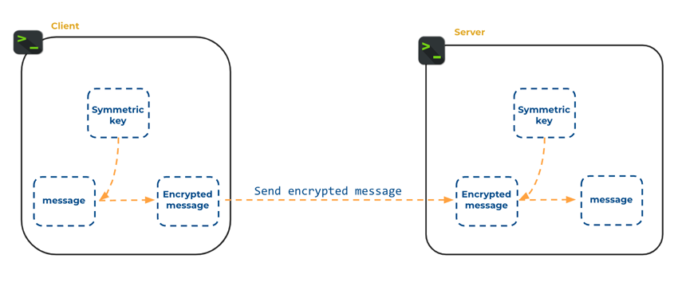
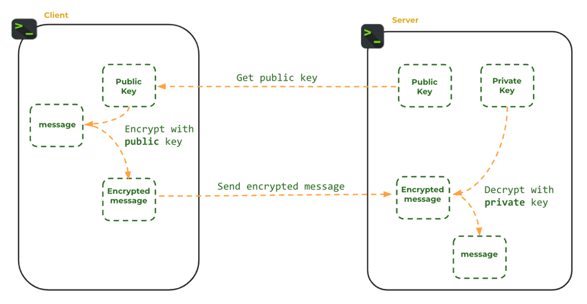
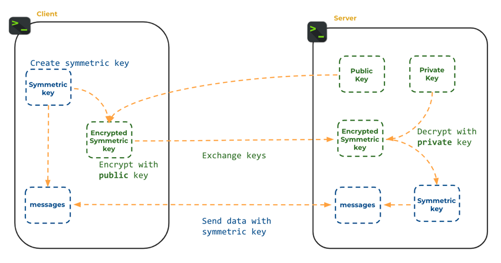
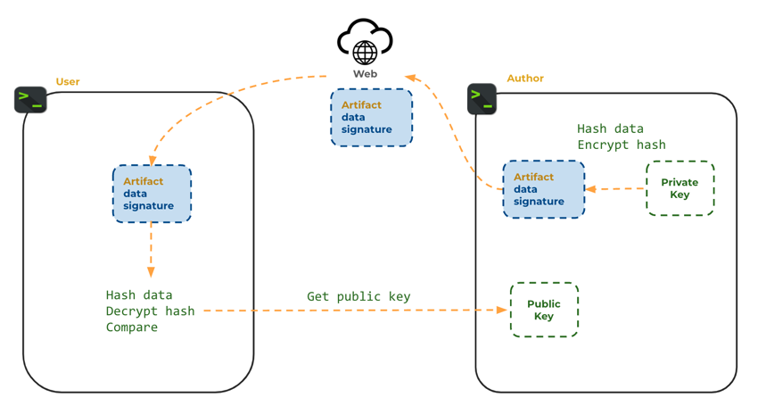
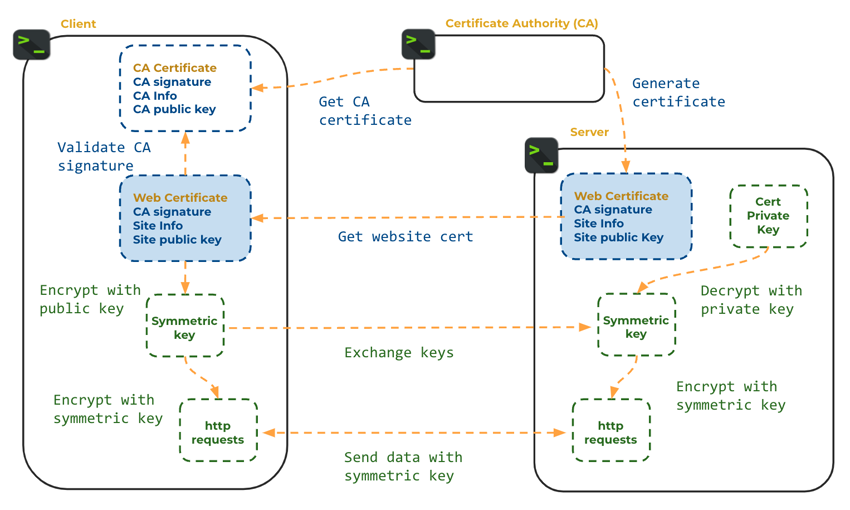

# Computer Security

🖥️ [Slides](https://docs.google.com/presentation/d/1pUU4DDACUndgj_ij7bbKOUY8cxmGinZq/edit#slide=id.p1)

📖 **Required Reading**: None

Software systems conduct trillions of dollars in daily transactions, and manage access to billions of personal records. This makes these systems a valuable target for attack. Bad actors try to compromise systems in a variety of ways. They may try to gain unauthorized access to data and computers for the purposes of stealing, monitoring, damaging, or otherwise misusing these assets. In order to mitigate their efforts you must include security as a primary design criteria, understand historical and current attack vectors, vigilantly monitor for intrusion, and continually enhance your systems as new threats evolve.

This topic focuses on the core concepts and technologies necessary to securely store and transmit data. The core concepts of computer security include the following.

- **Authentication**: Verifying the identity of an actor (e.g. user or system)
- **Authorization**: Enforcing the rights that an actor has to access data or perform restricted operations
- **Data Integrity**: Verifying that data has not been modified from its original form
- **Non-Repudiation**: Verifying, or not rejecting, the origin or authorship of data

Cryptography plays a key technological role in supporting these security concepts. Cryptography is used to authenticate users, represent their rights and identity, encrypt their data, and digitally sign messages. Without cryptography it would be very difficult to securely exchange money or information in digital form.

## Cryptographic Hash Functions

Let's take a look at our first cryptographic tool, hash functions. A hash function is a mathematical function that converts data of arbitrary size into a fixed-size value. The value returned by a hash function are often called a hash value, hash code, digest, or simply a hash.

Desirable features of a hash function include:

- **Fixed-Size**: The digest (or output) is always the same size (e.g., 160 bits), regardless of the input size
- **Deterministic**: Given the same input, it produces the same digest
- **One-Way**: Given the digest, you cannot recover the original text
- **Resistance to collisions**: It should be difficult to find two different input values that produce the same digest
- **Preimage resistance:** It should be difficult to find an input value that produces a given digest

There are many algorithms for computing digests. Here is a list of some of the more common ones along with their limitations and benefits.

| Hash function | Benefits                                                                               | Limitations                                                                           |
| ------------- | -------------------------------------------------------------------------------------- | ------------------------------------------------------------------------------------- |
| **MD5**       | Simple, fast, widely used, widely available                                            | Collision attacks have been found, considered insecure for cryptographic applications |
| **SHA-1**     | More secure than MD5, widely used, widely available                                    | Collision attacks have been found, considered insecure for cryptographic applications |
| **SHA-256**   | Secure against known attacks, widely used, widely available                            | Slower than MD5 and SHA-1, not as widely supported as MD5 and SHA-1                   |
| **Bcrypt**    | Password hashing function, secure against known attacks, widely used, widely available | Slower than SHA-256                                                                   |

If you are using macOS or linux you can use the `shasum` command console utility to generate a hash using the **SHA-256** algorithm.

```sh
➜ echo -n "Fox" | shasum -a 256
f55bd2cdfae7972827638f3691a5bc189199d7cff7188d5ead489afdea0e5403
```

The following demonstrates doing the same thing with Java code.

```java
package demo;

import java.security.MessageDigest;
import java.security.NoSuchAlgorithmException;
import java.nio.charset.StandardCharsets;


public class CryptoHashFunctionDemo {

    public static void main(String[] args) throws NoSuchAlgorithmException {

        String[] allInputs = new String[]{
                "Fox",
                "Fox",
                "The red fox jumps over the blue dog",
                "The red fox jumps oѵer the blue dog",
        };

        for (String input : allInputs) {
            // Convert character string to array of bytes
            byte[] inputBytes = input.getBytes(StandardCharsets.UTF_8);

            // Calculate message digest
            MessageDigest md = MessageDigest.getInstance("SHA-256");
            byte[] digestBytes = md.digest(inputBytes);

            System.out.println(input);
            System.out.println(bytesToHex(digestBytes));
            System.out.println();
        }
    }

    public static String bytesToHex(byte[] bytes) {
      byte[] hexChars = new byte[bytes.length * 2];
      for (int j = 0; j < bytes.length; j++) {
          int v = bytes[j] & 0xFF;
          hexChars[j * 2] = HEX_ARRAY[v >>> 4];
          hexChars[j * 2 + 1] = HEX_ARRAY[v & 0x0F];
      }
      return new String(hexChars, StandardCharsets.UTF_8);
    }
}
```

Using either method should generate the same output for the word `Fox`. You can experiment with either the code or console command to see what happens with different inputs. Notice that changing the case of the text or including whitespace will produce different results.

### Creating Signatures

One primary use for a hash function is to create a unique, short, fixed size signature that can represent data blocks of arbitrary length. With a signature you can use it as a compact representation of the data, and to determine equality to other data blocks.

The key properties of a hash function that is used for generating signatures include speed, fixed size, determinism, and resistance to collisions. Therefore algorithms such as MD5 and SHA-1 work well for this purpose. As an example, Git uses SHA-1 to generate a unique signature for all the data in a given commit.

### Securing Passwords

If a hash function is one-way and preimage resistant, then it is a good candidate for representing passwords. Under this model you would hash the user's password when they register and then store it in the database. When you want to authenticate a user's password you simply hash the password at login, and compare it to the previously stored hashed value.

In order to understand why hashing passwords is valuable, consider the case where you simply store plain text representations of passwords in a database column.

| User  | Password       |
| ----- | -------------- |
| sally | toomanysecrets |
| juan  | p@33w0r6       |
| pat   | qwerty1        |

> Plain text passwords

If your database is ever compromised then the attacker now has all of the credentials for all of your users. That might allow them access to valuable monetary, proprietary, or confidential data. Even if your application has little value to compromise, it is common for passwords to be reused on different websites. For example, if Juan reused his super secret password `p@33w0r6` on his school account, bank application, and his shopping websites.

By hashing the passwords the attacker cannot simply read the password from the database and use it to log in to an account.

| User  | HashedPassword                           |
| ----- | ---------------------------------------- |
| sally | fc80b22ff203a1a88470b19ab19228044d066d66 |
| juan  | adb4c36db0466b9750a7a298ef39f98159eb219d |
| pat   | ad70ab97ae1376e656002641cfb067c9c94906a2 |

> Hashed passwords using SHA-1

However, even with a hashed version of the passwords a determined attacker can still succeed in revealing the credentials for your users by using what is known as a `rainbow table attack`. A `rainbow` table is a large database with an index of precomputed hash codes for common passwords and a specific hashing algorithm such as `SHA-256`. With such a table the hacker simply searches for the hashed password, and if there is a match then they know what the original password was and that `SHA-256` was used to hash it.

In order to combat a rainbow table attack, it is common to combine the password with a random sequence of characters, called a `salt`, for each hashed password. By combining the salt with the password plain text the combination becomes unique and therefore no longer vulnerable to a rainbow table attack because the attacker would have to compute a database for every possible password, salt value, and algorithm.

| User  | SaltedHashedPassword                           |
| ----- | ---------------------------------------------- |
| sally | 37581:a67d83d2f75f240fe223ea899757a6980dee7d50 |
| juan  | 92734:79241300a93bdda742159f1902db461b55be3982 |
| pat   | 84723:fdfa32ac48e82803daa5b2a0849fb3c080b09cec |

> Hashed passwords using SHA-1 and salt

The following diagram demonstrates the flow necessary to use salted passwords.


Note that the salt is not encrypted. It can be simply stored in your database along with the hashed password. The idea is to simply make it difficult for the attacker to precompute the hashed value. With the salt you are making each hash unique. To do a brute force attack against that representation an attacker would have to compute a rainbow table against each salted password.

| Representation    | Benefit                                                                           |
| ----------------- | --------------------------------------------------------------------------------- |
| Plain text        | The password is kept safe in a non-public database                                |
| Hashed            | The password in not immediately usable if the database is compromised             |
| Hashed and salted | Each individual password must be analyzed in order to be successfully compromised |

### Bcrypt

As an additional protection for our user's passwords we want to use a hash algorithm that is expensive to calculate. That way it is difficult to create a table of precomputed passwords. With modern hardware that utilizes graphical processing units (GPUs), it is possible to try millions of possible hashes per second with the `SHA-256` algorithm. For this reason, algorithms such as `Bcrypt` were created to make it computationally expensive to generate a hash, while still maintaining all of the other desirable characteristics of a password hashing algorithm. That means that while `SHA-256` can create millions of hashes per second, `Bcrypt` will only generate a few thousand when running on the same hardware. The cost of generation it very difficult for an attacker to create a large rainbow table, and extremely difficult to do so with salted data.

You can experiment with `Bcrypt` using the following library.

```
org.springframework.security:spring-security-core:6.2.1
```

This implementation of Bcrypt makes it so you can hash and salt a password with one line of code, and then later compare the hash to a candidate password with another line of code. The following example first hashes the password `toomanysecrets` and then compares it to three possible candidates.

```java
import org.springframework.security.crypto.bcrypt.BCryptPasswordEncoder;

public class PasswordExample {

    public static void main(String[] args) {
        BCryptPasswordEncoder encoder = new BCryptPasswordEncoder();
        String secret = "toomanysecrets";
        String hash = encoder.encode(secret);

        String[] passwords = {"cow", "toomanysecrets", "password"};
        for (var pw : passwords) {
            var match = encoder.matches(pw, hash) ? "==" : "!=";

            System.out.printf("%s %s %s%n", pw, match, secret);
        }
    }
}
```

Here are the results of running the program.

```txt
cow != toomanysecrets
toomanysecrets == toomanysecrets
password != toomanysecrets
```

## Encryption and Decryption

In Cryptography, `encryption` is the process of encoding data so that it is unreadable. Decryption is the process of decoding data back to its original form.

Unlike hashing passwords, many applications need to both encrypt and decrypt information. For example, when you have to save confidential information such as a user's medical or financial records, you want to encrypt that data so that it is difficult to compromise, but you also need to be able to decrypt it so that it can be returned to the user on request.

In the world of cryptography, the unencrypted text is called plain text. The encrypted text is called a cipher. Algorithms that both encrypt and decrypt data utilize a sequence of bytes, called a key, that enable conversion. Typically, the longer the key size, the more difficult it will be to defeat the encryption.

| Term        | Purpose                                | Example             |
| ----------- | -------------------------------------- | ------------------- |
| Plain text  | unencrypted data                       | toomanysecrets      |
| Key         | value used to encrypt and decrypt data | 9012434289054653828 |
| Key size    | The length of the key                  | 1024 bits           |
| Cipher text | encrypted data                         | 88338012387532      |

### Simple Example

Consider a simple encryption algorithm that adds a number from one to 16, to each character of text. This would be easy to encrypt and decrypt text and only require a key size of four bits.

| Value       | Value          |
| ----------- | -------------- |
| Plain text  | toomanysecrets |
| Key         | 1              |
| Key size    | 4 bits         |
| Cipher text | uppoboztfdsfut |

You could implement this algorithm for both encryption and decryption with the following code.

```java
public class SimpleExample {
  public static void main(String[] args) {
      var key = 1;
      var plainText = "toomanysecrets".toCharArray();

      // encrypt
      var cipherText = new char[plainText.length];
      for (var i = 0; i < plainText.length; i++) {
          cipherText[i] = (char) (plainText[i] + key);
      }

      // decrypt
      for (var i = 0; i < cipherText.length; i++) {
          plainText[i] = (char) (cipherText[i] - key);
      }

      System.out.println(plainText);
      System.out.println(cipherText);
  }
}
```

However, our simple encryption algorithm would be easy to defeat because you could simply try all `16` possible values of the key to decrypt any cipher text. In order for an algorithm to be viable, it needs to have a large key and an algorithm that exploits complex mathematics. For example, a key size of 1024 bits could require as many as `2^1024` attempts, or:

```
1,797,693,134,862,315,907,729,305,190,789,024,733,617,976,978,942,306,572,734,300,811,577,326,758,055,009,631,327,084,773,224,075,360,211,201,138,798,713,933,576,587,897,688,144,166,224,928,474,306,394,741,243,777,678,934,248,652,763,022,196,012,460,941,194,530,829,520,850,057,688,381,506,823,424,628,814,739,131,105,408,272,371,633,505,106,845,862,982,399,472,459,384,797,163,048,353,563,296,242,241,372,160
```

This number is significantly larger than the number of atoms in the observable universe, which is estimated to be around 10^80.

## Symmetric Key Encryption

The `SimpleExample` encryption code that was demonstrated above is an example of a symmetric key encryption algorithm. Symmetric algorithms use the same key to both encryption and decryption. Symmetric encryption algorithms are attractive because they are very quick to compute and difficult to attack assuming that you have an appropriately sized key.

As we mentioned above, a good encryption algorithm will use complex mathematics to make it difficult to encrypt or decrypt without the proper key. One commonly used symmetric key algorithm is Advanced Encryption Standard (`AES`). This algorithm shifts blocks of characters around, across multiple rounds of manipulation, while applying a key size of 128, 192, or 256 bits. It also applies
an `initialization vector` to create a unique cipher value for each `plain text`/`initialization vector` combination. The use of the initialization vector makes it so that the same plain text does not result in the same cipher representation. Without that, you would be able to determine the encrypted data by brute forcing an attack that guessed what the plain text was.



The following code demonstrates the use of `AES` to encrypt and decrypt data. The code begins by generating an appropriately sized key and then creating an initialization vector. These are then used to first encrypt and then decrypt the message.

```java
import javax.crypto.*;
import javax.crypto.spec.IvParameterSpec;
import java.security.SecureRandom;
import java.io.*;

public class SymmetricKeyExample {
    public static void main(String[] args) throws Exception {
        SecretKey key = createAesKey();
        IvParameterSpec initVector = createAesInitVector();

        var secretMessage = "toomanysecrets";

        var plainTextIn = new ByteArrayInputStream(secretMessage.getBytes());
        var cipherBytes = runAes(Cipher.ENCRYPT_MODE, plainTextIn, key, initVector);

        var cipherTextIn = new ByteArrayInputStream(cipherBytes);
        var plainTextBytes = runAes(Cipher.DECRYPT_MODE, cipherTextIn, key, initVector);

        System.out.printf("%s == %s%n", secretMessage, new String(plainTextBytes));
    }

    static SecretKey createAesKey() throws Exception {
        KeyGenerator keyGen = KeyGenerator.getInstance("AES");
        keyGen.init(256);
        return keyGen.generateKey();
    }

    static IvParameterSpec createAesInitVector() {
        var ivBytes = new byte[16];
        new SecureRandom().nextBytes(ivBytes);
        return new IvParameterSpec(ivBytes);
    }

    static byte[] runAes(int cipherMode, InputStream in, SecretKey key, IvParameterSpec initVector) throws Exception {
        Cipher cipher = Cipher.getInstance("AES/CBC/PKCS5Padding");
        cipher.init(cipherMode, key, initVector);

        ByteArrayOutputStream out = new ByteArrayOutputStream();
        byte[] inputBytes = new byte[64];
        int bytesRead;
        while ((bytesRead = in.read(inputBytes)) != -1) {
            out.write(cipher.update(inputBytes, 0, bytesRead));
        }

        out.write(cipher.doFinal());
        return out.toByteArray();
    }
}
```

### Asymmetric Key Encryption

An alternative to symmetric key encryption is `asymmetric key encryption`. With this algorithm, two keys have a certain mathematical relationship to each other, and are generated at the same time as a `key pair`. The pair consists of a `public` key and a `private` key. Given one key you cannot determine the other key, but you can decrypt data that was encrypted by the other key. With a key pair you can publicly distribute the public key and then any party that has the public key can encrypt data that can only be decrypted by a party that has the private key.

1. Generate a key pair
1. Keep one of the keys secret. This is the `private key`.
1. Give the other key to anyone who wants to send you data. This is the `public key`. There is no need to keep it secret.
1. When sending you data, the sender encrypts the data with the public key
1. When you receive the data, you decrypt the data with the private key



In order for this exchange to work it is very important that you keep the private key secret. If the private key is ever publicly released then the pair becomes worthless.

There are several implementations of asymmetric key encryption. Here are the two most popular ones.

- **Rivest–Shamir–Adleman (RSA)**: This is a mature and well-respected algorithm that is widely used in a variety of applications, including secure communication, digital signatures, and certificate authorities.
- **Elliptic curve cryptography (ECC)**: This is a newer algorithm that is more efficient than RSA and offers comparable security. ECC is becoming increasingly popular in a variety of applications, including mobile devices and lightweight devices.

Asymmetric key encryption is built directly into the JDK `crypto` and `security` packages. The following code demonstrates how to create a key pair and then use it to encrypt and decrypt data.

```java
import javax.crypto.Cipher;
import java.io.*;
import java.security.*;

public class AsymmetricKeyExample {
    public static void main(String[] args) throws Exception {
        KeyPair key = createRsaKeyPair();

        final String secretMessage = "toomanysecrets";

        var plainTextIn = new ByteArrayInputStream(secretMessage.getBytes());
        var cipherTextOut = new ByteArrayOutputStream();
        runRsa(Cipher.ENCRYPT_MODE, plainTextIn, cipherTextOut, key.getPublic());

        var cipherTextIn = new ByteArrayInputStream(cipherTextOut.toByteArray());
        var plainTextOut = new ByteArrayOutputStream();
        runRsa(Cipher.DECRYPT_MODE, cipherTextIn, plainTextOut, key.getPrivate());

        System.out.printf("%s == %s%n", secretMessage, plainTextOut);
    }

    private static KeyPair createRsaKeyPair() throws Exception {
        var keyPairGen = KeyPairGenerator.getInstance("RSA");
        keyPairGen.initialize(2048);
        return keyPairGen.generateKeyPair();
    }

    private static void runRsa(int cipherMode, InputStream inputStream, OutputStream outputStream, Key key) throws Exception {
        Cipher cipher = Cipher.getInstance("RSA");
        cipher.init(cipherMode, key);

        byte[] inputBytes = new byte[64];
        int bytesRead;
        while ((bytesRead = inputStream.read(inputBytes)) != -1) {
            outputStream.write(cipher.update(inputBytes, 0, bytesRead));
        }

        outputStream.write(cipher.doFinal());
    }
}
```

You can also generate an asymmetric key pair using the console command line tool `ssh-keygen`. The following command uses the RSA algorithm to generate a key pair with a length of 4096 bits.

```sh
ssh-keygen -t rsa -b 4096
```

### Disadvantages of Asymmetric Key Encryption

While asymmetric key cryptography is one of the most important inventions in the history of computing, asymmetric key encryption has several disadvantages when compared with symmetric key encryption.

1. **Size restriction** - You can only encrypt a small amount of data. With RSA, you can only encrypt data less than the key size (e.g., 2048 bits, 4096 bits, etc.)
1. **Performance** - Asymmetric encryption is much slower than symmetric encryption.

## Secure Key Exchange

While symmetric encryption is good at quickly providing secure encryption, it has one significant drawback. The key must be known to both the encryption and decryption software. That means if you are trying to transmit encrypted data to remote parties, you must also securely transmit the key. Either the key must be supplied in advance of the remote communication, or delivered with some other secure channel such as in-person communication. Using any means that also uses symmetric encryption simply creates another layer to the problem.

One common way to solve this problem is to use `asymmetric key encryption` to exchange an encrypted `symmetric key`. Once both parties have the symmetric key they can use it to transmit large amounts of data. With this pattern you would do the following:

1. Client generates an asymmetric key pair.
1. Client publicly posts the public key.
1. Server generates a symmetric key and encrypts it using the public key provided by Client.
1. Server sends the encrypted key to Client.
1. Client decrypts the encrypted key using her private key.
1. Client sends a message back to Server that is encrypted using Server's symmetric key.
1. Communication then continues using Server's symmetric key.



## Digital Signatures

Asymmetric encryption also helps us solve the problems of `Non-Repudiation` and `Data Integrity`. Non-Repudiation is the task of guaranteeing that the party sending a message is actually who they say they are. Data Integrity guarantees that the data has not been tampered with since it left the sender. The basic idea is to create a `digital signature` that represents both the author of the data and the data sent in the message. This is done using the following steps:

1. Sally generates an asymmetric key pair.
1. Sally publicly posts the public key.
1. Sally generates a message.
1. Sally hashes the message using SHA-1. This is called the `signer digest`.
1. Sally encrypts the signer digest using her private key. This creates the `signature`.
1. Sally posts the message and the signature publicly.
1. Juan obtains the message and hashes it using the same algorithm Sally used. This is called the `receiver digest`.
1. Juan uses Sally's public key to decrypt the signature. This returns the `signer digest` in a way that provides non-repudiation by guaranteeing it was created by Sally.
1. Juan compares the `signer digest` to the `receiver digest`. If they match then that provides data integrity because the message has not changed since Sally signed it.



Digital signatures are used to sign emails, contracts, crypto currency transactions, and web certificates.

## Web Certificates and Secure Communication (HTTPS)

Let's move to an example that demonstrates everything we have learned about encryption including using digital signatures, symmetric keys, asymmetric keys, and key exchanges.

An important feature of the world wide web is knowing that the website you are talking to is actually the website you believe it to be. This is solved by gaining a web certificate, from an authority, called a certificate authority (`CA`), that is trusted by both the website owner and the website browser. A web certificate contains information about the website identity, a public asymmetric key, and a digital signature signed by the CA. The web certificate is used to demonstrate non-repudiation of the website owner using the following steps.

1. The website is granted a web certificate and key pair from the CA.
1. The web certificate contains a public asymmetric key. The website keeps the private key secure.
1. A web browser makes a connection to the website.
1. The website provides the certificate as part of the connection process.
1. The browser verifies that the certificate was signed by the CA.

Once a web browser has verified that the certificate is valid, it then attempts to create a secure connection to the website. The browser uses the asymmetric public key that was provided in the certificate to begin a secure key exchange.

1. The browser creates a symmetric key.
1. The browser encrypts the key using the public key provided in the certificate.
1. The browser sends the encrypted key to the website.
1. The website decrypts the key using the certificate's private key.
1. The website responds with data encrypted using the browser's symmetric key.

If the website cannot decrypt the symmetric key then that means the website is not actually the owner of the validated certificate and it terminates communication. That is why the website must be very careful to never publicly release their web certificate private key.



This demonstrates how modern cryptography forms the foundation of web security by providing user authentication, authorization, non-repudiation, data integrity, and secure communication.

## Things to Understand

- High-level goals of computer security
  - Data confidentiality
  - Authentication
  - Data integrity
  - Non-Repudiation
- Fundamental security concepts and technologies
  - Cryptographic hash functions
  - Symmetric encryption
  - Asymmetric encryption with public and private keys
  - Secure key exchange
  - Digital signatures
  - Public key certificates
- Secure password storage and verification
- Secure network communication using HTTPS

## Demonstration code

📁 [Cryptographic Hash Function Example](example-code/src/demo/CryptoHashFunctionDemo.java)

📁 [Password Hashing and Verification Example](example-code/src/demo/PBKDF2WithHmacSHA1Hashing.java)

📁 [Symmetric Key Encryption Example](example-code/src/demo/SymmetricKeyEncryptionDemo.java)

📁 [Public Key Encryption Example](example-code/src/demo/PublicKeyEncryptionDemo.java)

📁 [Security Utilities](example-code/src/demo/Utils.java)
