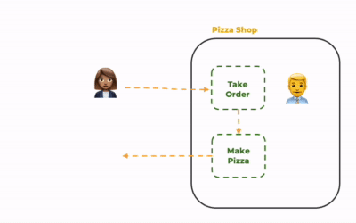
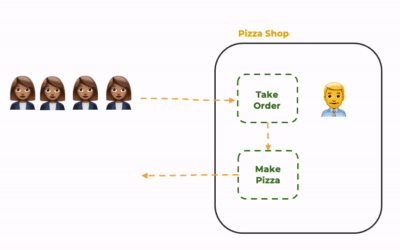
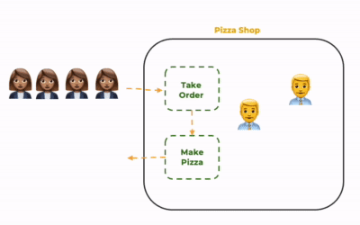

# Concurrency and Multi-threaded Programming

🖥️ [Slides](https://docs.google.com/presentation/d/1ibtqBjYEzx45Nh9eLP5xq6jWKfVjVMpv/edit#slide=id.p1)

📖 **Optional Reading**: OPTIONAL: Core Java for the Impatient, Chapter 10: Concurrent Programming

In order to understand the value of concurrent programming it is helpful to examine a process that executes discrete tasks. Imagine a pizza shop that takes orders and makes pizzas. A shop that only has one worker can only take one order at a time and make one pizza at a time.



> _1_ - One worker, one customer

This is fine if you only have one customer at a time, but you run into trouble if multiple customers want pizzas all at the same time. Like during a lunch hour rush. With only one employee, the customers will need to wait for each previous customer to be served. This leads to unhappy customers and eventually to a decrease in profit.



> _2_ - One worker, multiple customers

We can solve this problem by hiring more workers so we can serve multiple customers at the same time, or **concurrently**. With two workers we can make pizzas twice as fast. If we add a third worker then we can make pizzas three times as fast.



> _3_ - Multiple workers, multiple customers

The pattern of concurrently executing tasks is a foundational principle in computer science that enables increased throughput and performance.

## Concurrency at the System Level

When your computer runs, it has hundreds of tasks that it needs to execute. This includes each program you start, sending and receiving network communication, receiving input from your keyboard, rendering to your display, and storing information. A computer usually has multiple processing units (CPUs) that each can process one task at a time. When a CPU periodically switches tasks it gives the appearance that everything is running at the same time. If you have multiple CPUs, then the tasks are actually running concurrently. However no computer has enough CPUs for every task to run concurrently, and so the operating system spends much of its time scheduling and swapping tasks.

## Concurrency Complexities

Implementing concurrency doesn't come for free. If an operating system only executed a single task at a time, it would be more simple than an operating system that can execute on multiple processors. In our pizza shop example, it is more complex to hire and manage multiple workers than to have a single worker. Additionally, if the workers cannot execute as a team, then you may lose all of the benefits that concurrency provides and end up with a shop that is less efficient than a shop with a single worker. These complexities introduce operational overhead, resource synchronization, starvation, and deadlock. Let's look at each one of these complexities individually.

### Overhead

With our pizza example, we can keep hiring workers in an attempt to increase **throughput**, but at some point the shop will be too small to allow the workers to efficiently move around. When that happens, adding more workers just increases the time each worker spends walking around each other. The cost of hiring workers and moving them around is all **overhead**. This will decrease the productivity of each worker and cause pizzas to be created at a slower rate. If we continue adding workers, then eventually none of them will be able to move and no pizzas will be created.

In computer systems, overhead is determined by how expensive it is to create and manage tasks. If the CPU spends all of its time creating, deleting, and switching between tasks it will get little or no actual work done.

### Resource synchronization

You can also run into trouble when the workers need to **synchronize** their work on resources that cannot be shared concurrently. In our pizza shop there is only one cash register. Imagine what would happen if two workers tried to take an order at the same time using the single cash register. This might result in one customer paying for another customer's pizza, or both customers getting their pizzas for free.

In a computer system, memory is a resource that is shared by all tasks. If multiple tasks try to write to memory at the same time they will overwrite each other or create duplicate entries.

### Starvation

Next we consider when one worker is monopolizing a resource. For example, If a worker starts taking an order on the cash register, but then decides to go on break before completing the order. Now, no other worker can take any orders. The result is no more pizzas and everyone is unhappy. When workers cannot operate because a necessary resource is not available it is called resource **starvation**.

Most computers only have one network card. If one task monopolizes the use of the network then no other task can send or receive data.

### Deadlock

In the pizza shop you need to have the paddle to pull a pizza out of the oven and use the box maker to create a pizza box to put it in. If one worker is holding the box maker while a different worker is holding the oven paddle, neither one can actually complete the pizza making process. When two workers each hold a resource that the other worker needs to get a job done, you end up with **deadlock** in your system. One of the workers must temporarily release the resource so that the work can move forward.

If we look back to our computer example, we have two resources, memory and the network. When two processes want to read from memory and write to the network, the operating system must make sure that they are sharing nicely. If one process grabs the network, and the other process grabs the access to the memory, neither one will be able to complete their tasks. The operating system must step in and require one of them to release a resource.

### Parallelism vs Concurrency

When you have multiple tasks and a single CPU, the operating system will swap which task is executing so that each task gets a chance to run. This allows the tasks to run in parallel. If you have multiple CPUs then the operating system can actually run the tasks at the same time, or concurrently. If tasks are not actually running concurrently then you don't need to worry about starvation or deadlock because nothing actually runs at the same time. However, you must still consider the overhead involved with swapping tasks.

## Concurrent Programming in Java

Now that we have an idea of what concurrency is and what some of the complexities are, let's turn our attention to how we can take advantage of concurrency in our Java programs. First let's look at how you can create and execute multiple tasks.

The primary mechanisms that enable concurrent programming in Java are `Processes` and `Threads`. A process is created when you run the Java Virtual Machine and point it at a class that has a `main` function. Once the main process has started it can span other processes using the [ProcessBuilder](https://docs.oracle.com/javase/8/docs/api/java/lang/ProcessBuilder.html) object. Each process runs as a separate application that can coordinate with other processes using the main function's arguments, standard input, standard output, or inter-process communication.

Each process has a main thread of execution, and can create additional threads to process concurrent tasks. A Thread is a form of light weight process that runs under the context of a parent process. Threads in the same process can share memory, as variables or parameters, in order to communicate with each other.

You create a Java thread by extending the [Thread](https://docs.oracle.com/javase/8/docs/api/java/lang/Thread.html) abstract class and providing a `run` method. You then allocate a new object from your class and call the `start` method. This will create a branch in the execution of your code. One branch will start executing your `run` method and the other branch with start executing the code listed after the `start` call.

Each process and thread is assigned a unique identifier by the operating system. The ID is used to control which thread is currently executing and what resources it owns.

### Thread Example

The following program demonstrates creating two threads that print out the thread's ID 10 times. The `CountingThread` class extends the `Thread` abstract class by implementing a for loop in the `run` method.

Form the main method we allocate two new instances of `CountingThread` and call the `start` method to begin their execution.

```java
public class ThreadExample {
    public static void main(String[] args) {

        new CountingThread().start();
        new CountingThread().start();

        System.out.println("\nExit Main Thread");
    }

    static class CountingThread extends Thread {
        public void run() {
            var id = this.threadId();
            for (int i = 0; i != 10; i++) {
                System.out.printf("%s:%d ", id, i);
            }
            System.out.printf("%nExit thread %s%n", id);
        }
    }
}
```

Note that as this program runs, we actually have three threads. Our main process thread, and two counting threads. If your computer has three processors, then each of the threads run concurrently.

What this program outputs will be different every time you run it because it relies on the operating system's scheduler to determine when threads run. However, one possible output is demonstrated below. Notice that the output for the two threads are intermingled with each other, and that the main process thread exits before the other two threads. This demonstrates the concurrent nature of the execution.

```txt
Exit Main Thread
22:0 22:1 22:2 22:3 22:4 23:0 23:1 23:2 23:3 22:5 22:6 22:7 22:8 22:9
Exit thread 22
23:4 23:5 23:6 23:7 23:8 23:9
Exit thread 23
```

### Runnable

As an alternative to extending `Thread`, you can implement the `Runnable` functional interface in order to execute a thread. This allows you to compactly represent your thread implementation with a lambda function.

```java
public class RunnableExample {
    public static void main(String[] args) {

        new Thread(() -> {
            var id = Thread.currentThread().threadId();
            for (int i = 0; i != 10; i++) {
                System.out.printf("%s:%d ", id, i);
            }
        }).start();

        System.out.println("\nLeaving Main Thread");
    }
}
```

The above is functionally equivalent to running one of the counting threads from the previous example.

### Join

Sometimes you want to wait for one or more threads to complete before you continue executing your main process thread. You can do this by calling the `join` method on the Thread object.

```java
public class JoinExample {
    public static void main(String[] args) throws Exception {
        var t = new Thread(() -> System.out.println("Thread done"));

        t.start();
        t.join();

        System.out.println("Exiting Main Thread");
    }
}
```

In the above example, "Thread done" will always output before "Exiting Main Thread" because the `join` method will block the main thread until the thread exits.

### Callable and Executors

When you want to return a result from a thread you can do this by creating an [ExecutorService](https://docs.oracle.com/javase/8/docs/api/java/util/concurrent/ExecutorService.html). You can then start a thread by calling the ExecutorService's `submit` method with an implementation of the `Callable` functional interface. Callable is similar to Runnable, except that it returns a result. When you call `submit`, it returns a `Future` object that will eventually contain the result of the Callable once the thread exits.

You can wait for the Callable to complete, and thus get the return value, by calling the `get` method on the future object. This is similar to the `join` function described above, but `get` will return the thread's result.

The use of an ExecutorService, Futures, and blocking on the `get` method is demonstrated by the code below. Calling the `submit` method causes the thread to branch but the main thread will block on the call to the Future's `get` method until the thread completes.

```java
public class CallableExample {
    public static void main(String[] args) throws Exception {
        try (ExecutorService executorService = Executors.newSingleThreadExecutor()) {
            Future<String> future = executorService.submit(() -> {
                return "Callable result";
            });
            System.out.println(future.get());
        }
    }
}
```

### Thread Pools

In addition to returning `Future` objects from the execution of a `Callable`, the ExecutorService can efficiently manage multiple threads as a group, or pool. If you are not careful with how you create and execute threads, the overhead of the thread management can quickly decrease the value of concurrent execution.

In our example above we created a pool using the ExecutorService's factory `newSingleThreadExecutor` method. This creates a single thread and gives each Callable an equal chance to execute. You can also create a thread pool that allocates a fixed number of threads using the `newFixedThreadPool` method. This executor will block newly submitted tasks if there are no available threads in the pool. The `newCachedThreadPool` will grow the pool of threads when a new task is submitted if all of the current threads are in use.

With all of the executors defined above, the threads in the pool are reused for each of the submitted tasks. This helps to decrease the overhead involved with creating and deleting threads.

| Pool Type               | Description                                                                                                       |
| ----------------------- | ----------------------------------------------------------------------------------------------------------------- |
| newSingleThreadExecutor | Uses a single thread and switches the callable task. Good for removing thread context switching overhead.         |
| newFixedThreadPool      | Reuses threads. Good for saving on thread creation overhead.                                                      |
| new CachedThreadPool    | Reuses threads. Good for saving on thread creation overhead where the maximum number of needed thread is unknown. |
| newScheduledThreadPool  | Runs threads periodically. Good for scheduled tasks without creating a new thread every time.                     |

## Synchronizing Threads

Supporting concurrency in your application will significantly increase the complexity of your code. Because of that complexity, multithreaded programs are a major source of bugs that can corrupt the integrity of your data or cause your application to fail entirely.

### Race Conditions

One common threading bug results from multiple threads racing to use a shared resource at the same time. Consider the following code where you have one thread taking pizza orders and multiple threads racing to make the pizzas. They coordinate their work by sharing a list of pizza orders. One thread puts the order on the list, and the other threads check to see if there is a pizza on the list and then attempt to remove it and make the pizza.

```java
public class PizzaRaceExample {
    final static ArrayList<String> orders = new ArrayList<>();

    public static void main(String[] args) throws Exception {
        new Thread(() -> takeOrders()).start();

        for (var i = 0; i < 10; i++) {
            new Thread(() -> makePizzas()).start();
        }
    }

    static void takeOrders() {
        for (var i = 1; i < 1000; i++) {
            var order = "Pizza-" + i;
            System.out.printf("Ordering %s%n", order);
            orders.add(order);
        }
    }

    static void makePizzas() {
        while (true) {
            if (!orders.isEmpty()) {
                var order = orders.remove(0);
                System.out.printf("%s served%n", order);
            }
        }
    }
}

```

On the surface this code looks simple enough, but if you run this code, you will likely get the following result:

```
Ordering Pizza-1
Ordering Pizza-2
Ordering Pizza-3
Pizza-3 served
Pizza-2 served
Pizza-1 served

Exception in thread "Thread-7" Exception in thread "Thread-6" java.lang.IndexOutOfBoundsException: Index 0 out of bounds for length 0
```

This happens because a thread running the `makePizzas` function checks to see if there is a pizza in the list, but before it can pull it out of the list, another `makePizzas` thread pulls it out of the list and the first thread gets an array out of bounds exception when it tries to grab the order that is no longer in the list. Any piece of code that access a resource that can be manipulated by multiple threads is called a `critical section`. Usually this involves code that **reads** and **modifies** a resource over multiple non-atomic statements.

In the pizza shop case, the critical sections are when we add to the order list,

```java
// modify
orders.add(order);
```

and when we read and remove from the order list.

```java
// read
if (!orders.isEmpty()) {
    // modify
    var order = orders.remove(0);
}
```

### Synchronization

To solve our race condition bug, we need to protect our critical sections by synchronizing their access so that only one thread can use the shared resource at a time. This can be done by creating a `synchronized` code block around any critical section.

A `synchronized` code block begins with the `synchronized` statement and takes a synchronization object as a parameter. The synchronization object can be any object, but you need to use the same synchronization object for each critical section you are trying to protect. When your code executes and hits the synchronization block it will call the `wait` and `notify` methods that your synchronization object inherits from the base `Object` class in order to block multiple threads from entering the critical section at the same time. The synchronization code block is defined by the curly braces that surround the entire critical section.

The syntax looks like the following.

```java
synchronized (object) {
    // code that reads or modifies a shared resource
}
```

For our pizza shop, we need to identify any critical sections. We only have one shared resource, the order list, and so we look for any place where it is read or modified. This includes where we add to the list, where we check its length, and also when we remove from the list.

We use the `orders` object as the object for the synchronized statement. You can use any object, but it must be the same exact object used in all critical sections that you want to synchronize. It is common to use the resource object, an object specifically created for synchronization (e.g. `Object lock = new Object()`, the `this` pointer of the class, a static object (e.g. `static Object lock = new Object()`, or the class object (e.g. `this.class`) depending on the scope of the resource you are trying to synchronize.

We can make our pizza shop thread safe by adding a critical section to both the `takeOrders` function and the `makePizzas` function.

```java
public class PizzaSyncExample {
    final static ArrayList<String> orders = new ArrayList<>();

    public static void main(String[] args) throws Exception {
        new Thread(() -> takeOrders()).start();

        for (var i = 0; i < 10; i++) {
            new Thread(() -> makePizzas()).start();
        }
    }

    static void takeOrders() {
        for (var i = 1; i < 1000; i++) {
            var order = "Pizza-" + i;
            System.out.printf("Ordering %s%n", order);
            synchronized (orders) {
                orders.add(order);
            }
        }
    }

    static void makePizzas() {
        while (true) {
            synchronized (orders) {
                if (!orders.isEmpty()) {
                    var order = orders.remove(0);
                    System.out.printf("%s served%n", order);
                }
            }
        }
    }
}
```

Alternatively, if a function represents the entire critical section, you can use the `synchronized` keyword on the function signature. This syntax:

```java
synchronized void func() {
    // critical section
}
```

is equivalent to this syntax:

```java
void func() {
    synchronized(this) {
        // critical section
    }
}
```

## Multithreaded HTTP Requests

It is important to recognize that if you create an HTTP server, you have created a multithreaded application. That is because multiple web browsers may connect to your server and make requests concurrently and the server code will automatically create a thread for each request. Consider the following code.

```java
public class MultithreadedServerExample {
    static int sum = 0;

    public static void main(String[] args) {
        Spark.port(8080);
        Spark.get("/add/:value", (req, res) -> {
            sum += Integer.parseInt(req.params(":value"));
            return " " + sum;
        });
    }
}
```

In this example, the `value` variable is read and modified in the endpoint handler. If you execute the following commands from your command console it will repeatedly try to toggle the value. After each call to toggle the value should return to true.

```sh
while true; do curl localhost:8080/add/1; print "\n"; done &
while true; do curl localhost:8080/add/-1; print "\n"; done &
wait
```

However, because we read and write `value` as two different statements, we have a race condition where we occasionally lose what one thread assigned. That means the `value` will often appear as false.

We can solve this by synchronizing the access to the critical section of code.

```java
public class SynchronizedMultithreadedServerExample {
    static int sum = 0;
    static Object lock = new Object();

    public static void main(String[] args) {
        Spark.port(8080);
        Spark.get("/add/:value", (req, res) -> {
            synchronized (lock) {
                var value = Integer.parseInt(req.params(":value"));
                sum += value;
                return " " + sum;
            }
        });
    }
}
```

## Atomic Concurrency

The Java concurrency package also includes several classes that make it so that you don't create critical sections that have to be protected with a synchronization object. One of these classes is `AtomicInteger`. Remember that you only need to protect resources that take several steps to modify (e.g. read/modify/write). By modifying a resource over multiple statements, you allow another thread to slip in between and change the resource you are working with. If you can read/modify/write a resource in on statement, or atomically, then there is no need to synchronize the object across threads. We can rewrite our server example to use an `AtomicInteger` instead of the simple `int` type. Then instead of reading the value and modifying it, we simply call the `AtomicInteger.addAndGet` method to do do both in one atomic step. This makes things completely thread safe.

```java
public class AtomicServerExample {
    static AtomicInteger sum = new AtomicInteger(0);

    public static void main(String[] args) {
        Spark.port(8080);
        Spark.get("/add/:value", (req, res) -> {
            var value = Integer.parseInt(req.params(":value"));
            value = sum.addAndGet(value);
            return " " + value;
        });
    }
}
```

There are other atomic classes in the JDK that you might find useful in order to support concurrency. This includes the following.

| Class                | Description                                                                                                                                                                          |
| -------------------- | ------------------------------------------------------------------------------------------------------------------------------------------------------------------------------------ |
| AtomicInteger        | Atomically add to the value of an integer.                                                                                                                                           |
| AtomicBoolean        | Atomically change a boolean value if it is the given value.                                                                                                                          |
| BlockingQueue        | A thread-safe queue that allows threads to add and remove elements without worrying about synchronization. It is useful for implementing producer-consumer patterns.                 |
| LinkedBlockingQueue  | An implementation of the BlockingQueue interface that uses a linked list to store its elements. It is a good choice for applications that require high throughput and low latency.   |
| ArrayBlockingQueue   | An implementation of the BlockingQueue interface that uses an array to store its elements. It is a good choice for applications that require bounded capacity and fast access times. |
| ConcurrentHashMap    | A thread-safe implementation of the HashMap class. It is a good choice for applications that require a high-performance map that can be safely accessed by multiple threads.         |
| CopyOnWriteArrayList | A thread-safe implementation of the ArrayList class. It is a good choice for applications that require a read-heavy list that can be occasionally modified.                          |

## Database Transactions

Memory is not the only resource that might be corrupted by non-synchronized thread access. It is common to have multiple threads accessing a database at the same time. If your application needs to read something from the database, modify it, and then write back to the database then you have an opportunity for corruption.

Consider an example where you have a table that stores a unique username along with their email address. When you try to add a new user, you first check to see if the username is already in the table. If it is then it returns an error, otherwise it writes the user to the table. Notice that this is the classic read/modify pattern that causes a problem for multithreaded applications. As long as only one thread can write to the database at a time then everything will be fine, but if you allow multiple users to make HTTP endpoint requests then you have the possibility of corruption.

```java
public static void main(String[] args) throws Exception {
    var username = args[0];
    var email = args[1];
    configureDatabase();

    try (var conn = getConnection()) {
        if (!userExists(conn, username)) {
            insertUser(conn, username, email);
        }
    }
}

static void insertUser(Connection conn, String username, String email) throws SQLException {
    try (var preparedStatement = conn.prepareStatement("INSERT INTO pet_store.user (username, email) VALUES(?, ?)")) {
        preparedStatement.setString(1, username);
        preparedStatement.setString(2, email);
        preparedStatement.executeUpdate();
    }
}

static boolean userExists(Connection conn, String username) throws SQLException {
    try (var preparedStatement = conn.prepareStatement("SELECT username FROM pet_store.user WHERE username=?")) {
        preparedStatement.setString(1, username);
        try (var rs = preparedStatement.executeQuery()) {
            return rs.next();
        }
    }
}
```

To solve this problem you can tell the database to consider all requests made on a connection as a single transaction. Using a transaction makes it so that if any database requests fails, then all the requests fail and are reversed. It also makes it so all requests are executed atomically. That means that no other connection can modify the database resources used by the transaction while the transaction is executing. To create a transaction we would modify the above code to first create a transaction by turning off the automatic commitment of each statement as it executes by calling `setAutoCommit(false)`. We then execute multiple queries, insert, update, or delete statements. We then commit all the statements atomically by calling `commit`, or if we want to discard all the work that the statements did we call `rollback`.

```java
public static void main(String[] args) throws Exception {
    var username = args[0];
    var email = args[1];
    configureDatabase();

    try (var conn = getConnection()) {
        conn.setAutoCommit(false);

        try {
            if (!userExists(conn, username)) {
                insertUser(conn, username, email);
                conn.commit();
            }
        } catch (SQLException e) {
            conn.rollback();
        }
    }
}
```

### Database Transaction Alternatives

One of the major problems with using concurrency to increase the throughput of your application, is that the coding complexity and processing overhead can create new problems. When synchronizing threads you can deadlock the application, or create too many threads and cause thread starvation. Likewise, database transactions significantly impact the performance of your database if used incorrectly or excessively.

Instead of using transactions you can use other methods to make things execute concurrently. One solution to the problem that we defined above, is to make the username a unique key for the table. That way if you try to insert two rows with the same username, the database will enforce the uniqueness and reject the second request.

Database Management Systems (DBMS) often contain clauses that make statements atomic. You can use the `INSERT IGNORE` syntax to not execute the statement if the row already has the value you are attempting to set. If you are trying to do an insert if something doesn't exist, or an update if it does exist, you can use the `INSERT … ON DUPLICATE KEY UPDATE` syntax.

Any of these options will increase the performance of your database if you are attempting to modify a single table. That leaves the use of transactions for when you need to execute multiple statements, such as when you are modifying multiple tables that are related with foreign keys.

## Concurrency in the Chess Application

Now that we understand the power and complexity of concurrent programming we can look at the chess application and decide if we already have concurrency bugs, or if we could increase the performance of the application by introducing concurrency.

The client program itself only allows one player at a time. However, it can receive asynchronous WebSocket messages on a thread that is different from the main UI thread. This means there is the possibility of our shared client state becoming corrupted.

1. If a user leaves a game and the server concurrently receives a MAKE_MOVE message that could put the user back into the game.

Additionally, our HTTP server allows multiple clients to communicate with the server, and so we need to consider every shared memory access or database interaction. At this point in our development there shouldn't be any shared memory resources, and so that only leaves the database requests.

An obvious problem results from storing game state in a serialized representation. The database has no visibility into what the game object represents. That means that you cannot use the database to provide synchronization and therefore must synchronize the access in your server code.

There are several possible corruptions that we need to consider.

1. Two users can both claim the same color if both request the color concurrently. The server will return affirmatively to both, but only record one player as claiming the color.
1. A request to claim a color can be lost if another user concurrently claims the other color.
1. A single user can make multiple moves if executed from multiple threads. For example, a quick execution of concurrent requests could move all of the pawns.

All of these problems can be mitigated by using atomic operations or thread synchronization to protect critical sections. The important first step is to recognize that you have a multithreaded application and to consider all of the ways your shared data needs to be protected.

## Things to Understand

- What is a thread?
- Creating and executing a simple thread in Java
- Using a thread pool (ExecutorService in Java) to run multiple threads
- What is a race condition (or race hazard)?
- How to use database transactions to avoid race conditions
- How to use "synchronized" methods and code blocks in Java to avoid race conditions
- How to avoid race conditions in the Chess server and client programs

## Demonstration code

📁 [Java Thread Example](example-code/src/demo/JavaThreadExample.java)

📁 [Java Thread Pool Example](example-code/src/demo/JavaThreadPoolExample.java)

📁 [File Race Condition Example](example-code/src/demo/FileRaceConditionExample.java)

📁 [Synchronized Stack Example](example-code/src/demo/Stack.java)
