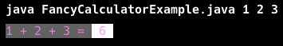
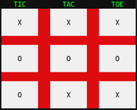

# Console User Interface (UI)

🖥️ [Slides](https://docs.google.com/presentation/d/1zHBDEdB6xhvnA12m3VliBaOQj7yZOxjT/edit#slide=id.p1)

Typically, when a program prints output to the console (or terminal), the text is plain and without much formatting. However, it is possible to create fairly nice console user interfaces that include formatted, colored text, and use character-based graphics. This lecture explains how to create a text-based console user interface, with an emphasis on how to implement the Chess client user interface.

_en.png>)

## Processing Application Arguments

When the Java runtime executes your application, it passes any arguments that were specified on the command line in the `args` parameter of your `main` function.

```java
public class ArgsExample {
  public static void main(String[] args) {
      for (var i = 0; i < args.length; i++) {
          System.out.printf("%d. %s%n", i+1, args[i]);
      }
  }
}
```

If you run this code with the following command you will see how the arguments are output.

```sh
➜  java ArgsExample.java a b c
1. a
2. b
3. c
```

Using application arguments is a convenient way to customize how your application operates. For example, with your chess client application you could allow the user to provide the URL of your chess server. The code below specifies a default URL, but allow the user to override it with a provided value.

```java
public class ClientMain {
    public static void main(String[] args) {
        var serverUrl = "http://localhost:8080";
        if (args.length == 1) {
            serverUrl = args[0];
        }

        new Repl(serverUrl).run();
    }
}
```

## Writing to Standard Out

The `System.out` object is an output stream that is associated with whatever your operating system has decided is the output device. Usually this is the command line console that launched your application. You can use the `System.out` object to print out text to the command line and communicate with the user of your application. We can combine the use of application arguments and `System.out` to create a rudimentary calculator that does simple addition.

```java
public class CalculatorExample {
    public static void main(String[] args) {
        int result = 0;
        for (var arg : args) {
            result += Integer.parseInt(arg);
        }
        var equation = String.join(" + ", args);
        System.out.printf("%s = %d", equation, result);
    }
}
```

```sh
➜  java CalculatorExample.java 1 2 3

1 + 2 + 3 = 6
```

### Enhancing the Output

Most command line consoles support a common set of escape codes that allow you to change the background and foreground colors of the characters that are output. You control the color changes by outputting a sequence of special escape characters. For example, if you run the following command in your console window you will see that the text `cow` is output in green.

```sh
echo -e "\u001b[32m cow \u001b[0m"
```

You begin the escape sequence with the characters `\u001b`, this tells the console that you are using unicode characters. `[32m` sets the text foreground color to green, and `[0m` resets the color back to the default.

We can enhance our calculator to use different colors by printing out the correct control colors before we print the text. We do this by creating constants that represent the different foreground and background colors we want to use, and then print the constants out to `System.out` before we print any text.

```java
public class FancyCalculatorExample {

    private static final String SET_TEXT_COLOR = "\u001b[38;5;";
    private static final String SET_BG_COLOR = "\u001b[48;5;";

    public static final String MAGENTA_TEXT = SET_TEXT_COLOR + "5m";

    public static final String GREY_BG = SET_BG_COLOR + "242m";
    public static final String WHITE_BG = SET_BG_COLOR + "15m";

    public static void main(String[] args) {
        int result = 0;
        for (var arg : args) {
            result += Integer.parseInt(arg);
        }

        System.out.print(MAGENTA_TEXT);
        System.out.print(GREY_BG);
        System.out.printf("%s = ", String.join(" + ", args));
        System.out.print(WHITE_BG);
        System.out.printf(" %d ", result);
    }
}
```

Now when we run our calculator, we see the color changes.



## Reading from Standard In

In order to create a complete console based application you need to also receive input from your user. When you java program executes, the operating system usually streams the buttons pressed on a keyboard to the `System.in` object.

To demonstrate reading from the keyboard, we can modify our calculator to read our numbers from what the user is typing instead of reading it from the application arguments. To do this we wrap `System.in` with the `Scanner` class so that we can read the user's input a line at a time. Once the user presses `Enter` we can parse out the numbers and output the result.

```java
import java.util.Scanner;

public class InteractiveCalculatorExample {
    public static void main(String[] args) throws Exception {
        System.out.printf("Type your numbers%n>>> ");
        Scanner scanner = new Scanner(System.in);
        String line = scanner.nextLine();
        var numbers = line.split(" ");

        int result = 0;
        for (var number : numbers) {
            result += Integer.parseInt(number);
        }
        var equation = String.join(" + ", numbers);
        System.out.printf("%s = %d%n", equation, result);
    }
}
```

```sh
➜  java InteractiveCalculatorExample.java 1 2 3

Input your numbers
>>> 1 2 3
1 + 2 + 3 = 6
```

## Things to Understand

- How to use command line arguments
- How to write to the standard out
- How to read from standard in
- How to use terminal control codes to clear the terminal, set background and text colors, and text attributes such as bold, faint, italic, underline, and blinking
- How to use Unicode characters to draw the chess board and pieces for the Chess project

## Demonstration code

The following demonstration code uses escape sequences to draw a tic tac toe board. This is similar to the concepts you will need in order to implement the rendering of the chess board.



📁 [Tic-Tac-Toe](example-code/src/ui/TicTacToe.java)

📁 [Escape Sequences](example-code/src/ui/EscapeSequences.java)

```

```
