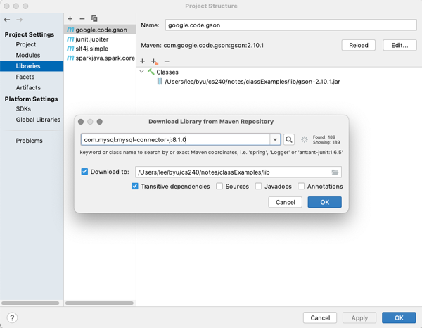

# Relational Databases - JDBC

🖥️ [Slides - JDBC](https://docs.google.com/presentation/d/19nC7v6SDqoEeK75Mb-f6L3QhnbuP6Xfo)

Now that we have covered what relational databases are and how to use SQL to interact with them, it is time to discuss how to use SQL from a Java program. Java uses a standard interface library called Java Database Connector (JDBC). This library provides you with classes to connect to a database, execute SQL queries, and process the results.

We also discuss using the popular open source relational database software MySQL. You will install a MySQL server in your development environment and use it as the persistent data store for your chess program.

To actually create a connection to your database you must first download the MySQL JDBC driver jar. You can then use the standard JDK JDBC classes as shown in the following example:

```java
import java.sql.DriverManager;

public class DatabaseExample {
    public static void main(String[] args) throws Exception {
        try (var conn = DriverManager.getConnection("jdbc:mysql://localhost:3306", "root", "monkeypie")) {
            conn.setCatalog("pet_store");

            try (var preparedStatement = conn.prepareStatement("SELECT id, name, type from pet")) {
                try (var rs = preparedStatement.executeQuery()) {
                    while (rs.next()) {
                        var id = rs.getInt("id");
                        var name = rs.getString("name");
                        var type = rs.getString("type");

                        System.out.printf("id: %d, name: %s, type: %s%n", id, name, type);
                    }
                }
            }
        }
    }
}
```

## Database Connectors

The JDK `java.sql` package contains interfaces and abstract classes for connecting to a RDBMS. However, you need to download a specific database connector that implements the interfaces for the RDBMS that you are using. For this course, we use the `mysql.connector`. Here is an example of using IntelliJ to import the MySQL connection into a project.



Most modern connector packages don't require you to initialize the connector. The act of including it in your classpath will do that automatically. Once you have installed the package for you project you are good to create connections with it.

## Obtaining a Connection

With the database specific connector installed, you are ready to use the JDK `DriverManager` class to get a connection to the database specified by a given URL. The DriverManager inspects the URL and passes the connection request over appropriate database connector. In the example below, the DriverManager will pass the request to the MySQL connector that registered itself when the connector package was loaded.

If the connector exists, and the RDBMS specified by the URL is available then you will get back a connection object.

Note that we use the Java `try-with-resource` syntax so that the connection will be released as soon as the try block exits. This is important, because the number of available connections is limited by the database server. If you don't release connections then any request for new connections will fail and you will no longer be able to use the database.

```java

Connection getConnection() throws SQLException {
    return DriverManager.getConnection("jdbc:mysql://localhost:3306", "root", "monkeypie");
}

void makeSQLCalls() throws SQLException {
    try (var conn = getConnection() {
        // Execute SQL statements on the connection here
    }
}
```

## Creating Databases and Tables

Once you have a connection you can use it to create databases and tables. It is a good idea to create Java code that create your databases and tables either when your application starts up, or with an explicit initialization operation. This allows you to define all of the infrastructure that your code depends upon in the code that actually uses the infrastructure. That way you can always assume that the required databases and tables exist instead of managing and initializing that infrastructure as some sort of external manual executed process.

We can fully configure a theoretical pet store application by doing the following.

1. Get a connection to the RDBMS.
1. Create the the pet store database if it doesn't exist.
1. Create the pet table if it doesn't exist.

```java
void configureDatabase() throws SQLException {
    try (var conn = getConnection()) {
        var createDbStatement = conn.prepareStatement("CREATE DATABASE IF NOT EXISTS pet_store");
        createDbStatement.executeUpdate();

        conn.setCatalog("pet_store");

        var createPetTable = """
            CREATE TABLE  IF NOT EXISTS pet (
                id INT NOT NULL AUTO_INCREMENT,
                name VARCHAR(255) NOT NULL,
                type VARCHAR(255) NOT NULL,
                PRIMARY KEY (id)
            )""";


        try (var createTableStatement = conn.prepareStatement(createPetTable)) {
            createTableStatement.executeUpdate();
        }
    }
}
```

We execute SQL statements by first creating a `PreparedStatement`. You can think of a prepared statement as a SQL statement template. In the above code we create two prepared statements. One to create the database and one to create the table. Both of the statements are created with hard coded strings that represent the desired SQL to execute.

In the same way that you had to use a try-with-resource block to close our connection, you also need to make sure you close the prepared statement when we are done with it.

Make sure you note the use of the `setCatalog` call. We call this after we have made sure that the pet store database is created. Setting the catalog tells the connection that all subsequent calls should be done in the context of the given database. In the example, we are creating the `pet` table in the context of the `pet_store` database.

## Inserting Data

Once you have created your database and tables, you can now start inserting data. The following is an example of how to insert a new row in the `pet` table.

```java
int insertPet(Connection conn, String name, String type) throws SQLException {
    try (var preparedStatement = conn.prepareStatement("INSERT INTO pet (name, type) VALUES(?, ?)", RETURN_GENERATED_KEYS)) {
        preparedStatement.setString(1, name);
        preparedStatement.setString(2, type);

        preparedStatement.executeUpdate();

        var resultSet = preparedStatement.getGeneratedKeys();
        var ID = 0;
        if (resultSet.next()) {
            ID = resultSet.getInt(1);
        }

        return ID;
    }
}
```

This code starts by creating a new prepared statement that contains the `INSERT` command. Note however that instead of concatenating the pet name and type directly into the command, we parameterize the prepared statement by putting question marks (`?`) into the statement syntax. We then supply the values of the parameter with the `setString` method on the prepared statement.

The first parameter to setString tells the position of the parameter to set and the second parameter is the value to set. This corresponds to the position of the question marks in the prepared statement.

```java
preparedStatement.setString(1, name);
```

There are `set` methods for all the SQL types (e.g. `setInt`, `setDate`, `setBoolean`, ...). Make sure you use the one that conforms with the schema of the table field you are populating.

Once you have created the statement and populated the parameters you then execute the statement by calling `executeUpdate`. If this doesn't throw an exception then the data was successfully inserted.

### Generating Primary Keys

Our insertPet function does one more thing. If you look at the table schema that we defined when we created the pet table, you will see that we set the `id` column to `AUTO_INCREMENT` the value.

```sql
CREATE TABLE  IF NOT EXISTS pet (
    id INT NOT NULL AUTO_INCREMENT,
    name VARCHAR(255) NOT NULL,
    type VARCHAR(255) NOT NULL,
    PRIMARY KEY (id)
)
```

We use this to let the database handle the assignment of the primary key for the pet record. That means that we don't have to provide that as a field when when insert a new pet, but we do potentially want to know what ID was generated by the database. To get the generated value we specify the parameter `RETURN_GENERATED_KEYS` when we create the prepared statement. We then call `getGeneratedKeys` after we called `executeUpdate`. This returns an iterator, but we are only interested in the first value and so we advance the iterator with `next` and the call `getInt` to get the new ID

```java
var resultSet = preparedStatement.getGeneratedKeys();
var ID = 0;
if (resultSet.next()) {
    ID = resultSet.getInt(1);
}
```

### Protecting Against SQL Injections


> Source: _Randall Munroe. Exploits of a Mom. xkcd. (CC BY-NC 2.5)_

Using the `set` functions on a prepared statement helps prevent against what is know as a SQL injection. A SQL injection allows an attacker to inject unexpected SQL syntax into a statement. Consider the case where we simplify the `insertPet` function to the following.

```java
void insertPet(String name) throws SQLException {
        var conn = DriverManager.getConnection("jdbc:mysql://localhost:3306/pet_store?allowMultiQueries=true", "root", "monkeypie");

        var statement = "INSERT INTO pet (name) VALUES('" + name + "')";
        System.out.println(statement);
        try (var preparedStatement = conn.prepareStatement(statement)) {
            preparedStatement.executeUpdate();
        }
}
```

This makes the code smaller and would actually work fine in the normal case. The problem occurs when someone supplies the following name:

```java
name = "joe','cat'); DROP TABLE pet; -- ";
```

This will result in execution the following SQL. This first inserts a bogus pet record, and then deletes the entire pet table.

```sql
INSERT INTO pet (name, type) VALUES('joe','cat'); DROP TABLE pet; -- 'rat')
```

In addition to using the database connection prepared statements properly you also want to sanitize any input that comes from a user to make sure it only contains patterns that you expect. A more secure insert pet method would look like the following.

```java
void insertPet(String name) throws SQLException {
    var conn = DriverManager.getConnection("jdbc:mysql://localhost:3306/pet_store", "root", "monkeypie");

    if (name.matches("[a-zA-Z]+")) {
        var statement = "INSERT INTO pet (name) VALUES(?)";
        try (var preparedStatement = conn.prepareStatement(statement)) {
            preparedStatement.setString(1, name);
            preparedStatement.executeUpdate();
        }
    }
}
```

This does the following to help prevent a SQL injection.

1. Validates the input is of the expected format.
1. Uses the prepared statement `set` functions which also validates the format.
1. Does not allow multiple statements to execute in a single `executeUpdate` request by removing the `allowMultiQueries` from the connection string.

## Updates

You can update data using JDBC code similar to what you used for inserting data. You just need to change the SQL statement that you execute.

```java
void updatePet(Connection conn, int petID, String name) throws SQLException {
    try (var preparedStatement = conn.prepareStatement("UPDATE pet SET name=? WHERE id=?")) {
        preparedStatement.setString(1, name);
        preparedStatement.setInt(2, petID);

        preparedStatement.executeUpdate();
    }
}
```

Make sure that you include a `WHERE` clause in your statement. Otherwise you will update every row in the table.

## Deleting Data

You delete data by specifying a `DELETE` SQL statement along with a `WHERE` clause that describes the rows to delete.

```java
void deletePet(Connection conn, int petID) throws SQLException {
    try (var preparedStatement = conn.prepareStatement("DELETE FROM pet WHERE id=?")) {
        preparedStatement.setInt(1, petID);
        preparedStatement.executeUpdate();
    }
}
```

If no clause is specified then all of the table data will be deleted. However, it is usually more efficient to use a `TRUNCATE tableNameHere` statement instead.

## Queries

In order to get things out of a database you need to call the `executeQuery` method on the prepared statement. The `executeQuery` method returns a `java.sql.ResultSet` object that represents the resulting rows that match the query.

You can parameterize the `SELECT` statement with a `WHERE` clause, or you can leave out the clause if you want to return all rows in the table.

```java
void queryPets(Connection conn, String findType) throws SQLException {
    try (var preparedStatement = conn.prepareStatement("SELECT id, name, type FROM pet WHERE type=?")) {
        preparedStatement.setString(1, findType);
        try (var rs = preparedStatement.executeQuery()) {
            while (rs.next()) {
                var id = rs.getInt("id");
                var name = rs.getString("name");
                var type = rs.getString("type");

                System.out.printf("id: %d, name: %s, type: %s%n", id, name, type);
            }
        }
    }
}
```

When you call the result set `next` method it will advance the result to the next row. If it ever returns `false` then it means you have read all the matching rows. You can read the fields of the row with the result set `get` methods. There are methods for all of the basic SQL types. Make sure that the fields you get are represented in the fields that your `SELECT` statement requested.

Make sure that your wrap the result set returned from the query with a `try-with-resource` block so that you release the resources associated with the result once you are done with them.

## Text and Blob Types

Sometimes you want to store large text or binary data in the database. In MySQL the `text` type can represent large textual sequences, and the `blob` type represents large binary sequences. These can be as large as 4 gigabytes. Blob and text data is not searchable, but it is convenient to associate it with some other indexed fields. For example, a commonly used pattern called a `key-value` store, associates a single key field with a blob field. This basically uses the database as a big persisted map.

Another example of storing large text data comes from the chess application. With chess, you need to store your game board and make it searchable using the game ID. One way to do this is to serialize your board to JSON and then place the JSON data in a `text` field.

We can demonstrate how to do this using a simple pet record that has a name, a type, and a list of friends.

```java
record Pet(String name, String type, String[] friends) {}
```

We can create a SQL table schema that matches this structure by including field for the friend array that has type `longtext`. The `longtext` type can represent text strings that are up to 4 gigabytes and so that will be plenty of room for all the pet's friends.

```java
CREATE TABLE  IF NOT EXISTS pet (
    name VARCHAR(255) DEFAULT NULL,
    type VARCHAR(255) DEFAULT NULL,
    friends longtext NOT NULL
);
```

We then create a method that inserts a pet into the database. This serializes the friend field using the Gson `toJson` method, and uses a SQL INSERT statement to put it in the database.

```java
void insertPet(Connection conn, Pet pet) throws SQLException {
    try (var preparedStatement = conn.prepareStatement("INSERT INTO pet (name, type, friends) VALUES(?, ?, ?)")) {
        preparedStatement.setString(1, pet.name);
        preparedStatement.setString(2, pet.type);

        // Serialize and store the friend JSON.
        var json = new Gson().toJson(pet.friends);
        preparedStatement.setString(3, json);

        preparedStatement.executeUpdate();
    }
}
```

And we can read it back out again by reversing the process.

```java
Collection<Pet> listPets(Connection conn) throws SQLException {
    var pets = new ArrayList<Pet>();
    try (var preparedStatement = conn.prepareStatement("SELECT name, type, friends FROM pet")) {
        try (var rs = preparedStatement.executeQuery()) {
            while (rs.next()) {
                var name = rs.getString("name");
                var type = rs.getString("type");

                // Read and deserialize the friend JSON.
                var json = rs.getString("friends");
                var friends = new Gson().fromJson(json, String[].class);

                pets.add(new Pet(name, type, friends));
            }
        }
    }
    return pets;
}
```

### Type Adapters

Sometimes you need to deserialize JSON data into a field that is defined as, or contains, an Interface. When that happens, you must register an adapter to tell Gson what concrete class it should use when deserializing the JSON.

We can demonstrate that my changing our Pet record to contain a `FriendList` instead of a `String[]`.

```java
interface FriendList {
    FriendList add(String friend);
}

record Pet(String name, String type, List friends) {}
```

Now that we have an interface in our record, Gson no longer knows what class to create in order to represent the `FriendList` interface. That means we must register an adapter that explicitly handles the conversion. Gson supports this with the `JsonDeserializer` interface. This interface defines a method named `deserialize` that takes a JSON element and converts it into the expected object. In the example below we take the element and use the `fromJson` method to do the explicit conversion for us.

```java
class ListAdapter implements JsonDeserializer<FriendList> {
    public FriendList deserialize(JsonElement el, Type type, JsonDeserializationContext ctx) throws JsonParseException {
        return new Gson().fromJson(el, ArrayFriendList.class);
    }
}
```

We then use the adapter when we deserialize the friends field from the database. We replace the simple deserialization code,

```java
var json = rs.getString("friends");
var friends = new Gson().fromJson(json, String[].class);
```

with code that creates a builder and registers the adapter to be used whenever the `FriendList` interface is observed.

```java
var json = rs.getString("friends");
var builder = new GsonBuilder();
    builder.registerTypeAdapter(FriendList.class, new ListAdapter());

var friends = builder.create().fromJson(json, FriendList.class);
```

Now Gson knows that whenever it sees a `FriendList` it creates a `ArrayFriendList` to back it.

With the Chess application you may have a similar situation with the game interfaces. If so, then you will have to tell Gson to map the `ChessGame`, `ChessBoard`, and `ChessPiece` interfaces to your concrete implementations.

## Things to Understand

- How to execute each of the SQL statements from Java using JDBC
- How to use JDBC connections
- How to generate Java objects from the result of a database query
- How to retrieve auto-increment primary keys that were generate by the database on an insert
- How to get a JDBC driver for MySQL and make it available to your Java project/code

## Videos

- 🎥 [Java Database Access with JDBC](https://byu.hosted.panopto.com/Panopto/Pages/Viewer.aspx?id=cabe9971-3ff7-4579-be2e-ad660156090a&start=0)
- 🎥 [JDBC - Putting it All Together](https://byu.hosted.panopto.com/Panopto/Pages/Viewer.aspx?id=e5d62c40-3494-4ff9-9558-ad6b013cdfb6&start=0)
