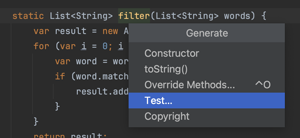
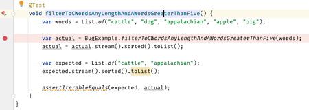
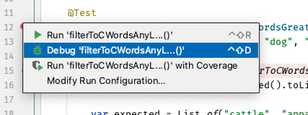
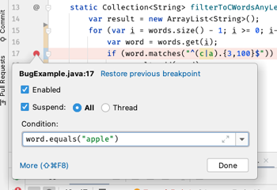
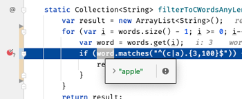
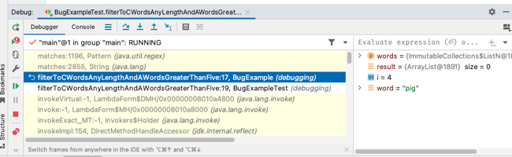

# Debugging

🖥️ [Slides](https://docs.google.com/presentation/d/14CiV7TwmAG-vEWWsQQtaP_-Hx-pqJlGR/edit?usp=sharing&ouid=114081115660452804792&rtpof=true&sd=true)

Debugging is one of the most important development skills that you can master. If you can learn how to rapidly reproduce a problem, narrow down its cause, and quickly implement a solution, you will dramatically increase your value as a software engineer.

Knowing what debugging tools are available and how to effectively employ them is key to your success. Common categories of debugging tools include:

1. Visual debuggers
1. Stack traces
1. Logs
1. Metrics
1. Customer reports
1. Development and staging environments
1. Unit, system, and end to end tests
1. Code reviews
1. Performance profilers

The more you think about debugging as applying the scientific method, the more you will become adept at the debugging process.

1. Concisely state the problem
1. Reproduce the problem with a unit test
1. Isolate the problem to its simplest representation
1. Step through the tested code
1. Implement a solution
1. Verify that the unit test passes
1. Verify that all tests pass

In this instruction we focus on `visual debuggers`. You are encouraged to become experts with the debugger that is available for your development environment. In our case this is IntelliJ. Learn how to quickly execute the debugger, use it with only keystrokes, maximize the use of breakpoints, inspect variables and execution stacks, and isolate a reproduction of the problem, possibly with new unit tests.

## Example Debugging

To demonstrate some debugging techniques let's consider a simple example of a function that has the following specification.

> Given a list of words, return a collection that only contains words of any length that start with a lowercase `c`, and words that are longer than five characters that start with a lowercase `a`.

With that description, we go ahead and write our code and deploy it to production.

```java
Collection<String> filterToCWordsAnyLengthAndAWordsGreaterThanFive(List<String> words) {
    var result = new ArrayList<String>();
    try {
        for (var i = words.size(); i >= 0; i--) {
            var word = words.get(i);
            if (word.matches("^(c|a).{3,100}$")) {
                result.add(word);
            }
        }
    } catch (Exception ignore) {
    }
    return result;
}
```

Sometime later we get a report from a user that says the function doesn't return the expected result. When they pass in:

`"cattle", "dog", "appalachian", "apple", "pig", "cat"`

They are expecting to get back:

`"cattle", "appalachian", "cat"`

but instead they get back nothing.

## Reproducing the Bug with a Test

When you, or a customer, finds a bug, the first step is to verify the bug by creating a test that reproduces the problem. IntelliJ helps with this by providing the `Generate Test` functionality. So we right click on the function name and choose the `Generate` option followed by `Test...`.



This will write a stub test function.

```java
@Test
void filterToCWordsAnyLengthAndAWordsGreaterThanFive() {
}
```

We then fill in the test with the user's reported reproduction steps.

```java
@Test
void filterToCWordsAnyLengthAndAWordsGreaterThanFive() {
  var words = List.of("cattle", "dog", "appalachian", "apple", "pig", "cat");

  var actual = BugExample.filterToCWordsAnyLengthAndAWordsGreaterThanFive(words);
  actual = actual.stream().sorted().toList();

  var expected = List.of("cattle", "appalachian", "cat");
  expected = expected.stream().sorted().toList();

  assertIterableEquals(expected, actual);
}
```

Now we can run the test and verify that we get the same result as what the customer reported.

```
org.opentest4j.AssertionFailedError: iterable lengths differ,
Expected :2
Actual   :0
```

## Stepping Through Code

Sometimes it is obvious what the problem is by simply looking at the test. Other times we need to step through the code using the debugger to see what is going on. To do this we put a breakpoint in our test on the line that makes the calling to our filtering function. You can set a breakpoint by clicking on the left margin.



With a breakpoint set, you can then click on the `debug` icon in the left margin associated with the function and select `Debug`. This will start up the test and execute until the breakpoint is reached.



At this point you can view the variables and confirm any assumptions that you have. This is an important step. Oftentimes a bug is created when we make assumptions about the possible variable values. If everything looks good, then we can start stepping through the code.

### Pro Tip: Hotkeys

An important skill to learn is the hotkeys for stepping through the code. Learning these keys will greatly increase your debugging speed. If you find yourself reaching for the mouse, take the time instead to learn the keystroke for the desired action. Each development environment is different, but here are the big ones for IntelliJ.

| Windows  | Mac   | Purpose           |
| -------- | ----- | ----------------- |
| Shift F9 | ⌃ D   | Debug             |
| F7       | F7    | Step into         |
| F8       | F8    | Step over         |
| F9       | ⌘ ⌥ R | Resume program    |
| Alt F9   | ⌥ F9  | Run to cursor     |
| Ctrl F8  | ⌘ F8  | Toggle breakpoint |

### Example Debugging: Stepping Through Code

As we step through the execution of our test function we will see that we are referencing a position beyond the length of our list. This is going to throw an out of bounds exception. However, we incorrectly catch and ignore the exception and so the error is hidden and it appears to the caller that we filtered out all the words and returned an empty list.


Our first correction will be to remove the bad exception handling that is hiding our error. With this change our code now looks like this:

```java
Collection<String> filterToCWordsAnyLengthAndAWordsGreaterThanFive(List<String> words) {
    var result = new ArrayList<String>();
    for (var i = words.size(); i >= 0; i--) {
        var word = words.get(i);
        if (word.matches("^(c|a).{3,100}$")) {
            result.add(word);
        }
    }
    return result;
}
```

## Error Messages

The error messages generated while debugging often contain valuable information. Take that time to read them and digest what they are telling you. Also note that you can follow the links displayed in the stack traces to see exactly where the errors are occurring. You can then set a breakpoint on that line and rerun the test to debug what is going on.

### Example Debugging: Error Messages

When we run our test again, after removing the empty catch block, we see the following exception error written to the console window.

```text
java.lang.ArrayIndexOutOfBoundsException: Index 5 out of bounds for length 5

	at java.base/java.util.ImmutableCollections$ListN.get(ImmutableCollections.java:680)
	at debugging.BugExample.filterToCWordsAnyLengthAndAWordsGreaterThanFive(BugExample.java:16)
	at debugging.BugExampleTest.filterToCWordsAnyLengthAndAWordsGreaterThanFive(BugExampleTest.java:15)
	at java.base/java.lang.reflect.Method.invoke(Method.java:578)
	at java.base/java.util.ArrayList.forEach(ArrayList.java:1511)
	at java.base/java.util.ArrayList.forEach(ArrayList.java:1511)
```

This clearly describes what our problem is and points us to the line in our code that threw the exception. When we examine the line of code we see that the `for` loop incorrectly initializes with the size of the list instead of the last position in the list.

```java
for (var i = words.size(); i >= 0; i--) {
```

We fix this by subtracting one from the size.

```java
for (var i = words.size() - 1; i >= 0; i--) {
```

And run our test again. Now the test returns that it got an `apple` when it expected a `cat`. Since `apple` starts with `a` and is not greater than a length of five we have now reproduced another problem.

```
AssertionFailedError: iterable contents differ at index [1],
Expected :cat
Actual   :apple
```

### Conditional Breakpoints

When you create a breakpoint in IntelliJ you can specify conditions such as the required value of a variable before the breakpoint will trigger. To set a conditional breakpoint, first set a breakpoint and then right click on it to bring up the conditions dialog.

### Example Debugging: Conditional Breakpoints

We can use a conditional breakpoint to see what the code is doing when attempting to filter out the `apple`. The breakpoint is set by clicking on the margin next to the `word.matches` expression, and then right clicking on the breakpoint and specifying the condition:

```java
word.equals("apple")
```



With the conditional breakpoint in place we can debug the test and it will only stop when `word` equals `apple`.



If we step over the match call we see that `apple` does match, and it gets added to the list. That means we have a problem with our regular expression. We can take that regular expression and use a tool like [Regex101.com](https://regex101.com/) to figure out why it is matching. This leads us to realize that we need to change our regular expression to allow anything on `c` and change the starting limit from `3` to `5` for words beginning with `a`.

```java
^(c.*|a.{5,100})$
```

Now the test passes and we have improved our confidence that the code is doing what it is working correctly.

## Examining up the Stack

As you are debugging you might find that you need to know what happened in the functions that called the current function that you are debugging. The chain of parent function calls is referred to as the `call stack`. You can tell the debugger to move the current context up the call stack so that you can see what the variable values were. To do this open, or move to, the debugger stake pane and click on the function you wish to inspect. When you are done looking up the stack, you can click on the current function and continue debugging.

## Debugging Example: Examining up the Stack

When we discovered that the regular expression matching wasn't working right, we could have stepped into the JDK code for the `match` function to see how it was computing the match. If, while examining the JDK code, we wanted to look back up the stack we can open the debugger stake pane and click on any of the previous functions. In the case shown below, we can look back at the filter function and see exactly what the variables looked like before we called `match`.



## Executing Multiple Processes

Sometimes you need to debug/run multiple processes at the same time. For example, you might want to debug both your server and your client so that you can see how requests from the client execute on your server. With IntelliJ, you can debug multiple programs by just starting each one up individually. In the following image you can see that the server is started and a breakpoint set on the `listNames` HTTP endpoint. Then we set a breakpoint in the client and start it up. As the request flow goes from client to server, the server breakpoint is hit. Once we resume execution, the client picks up the when call to the server returns. This allows us to see exactly what is happening in each application.


## Enhancing Tests

As you fix bugs you will often discover other problems that haven't been reported yet. You can also discover that the tests have a bug in them and the code is actually running fine. It is also possible that the test is succeeding, but not actually testing anything of value.

When you discover any of these situations it is important that you enhance your tests to increase your confidence that the code is correct.

Once we are confident that everything is working we need to run all of the tests to make sure we didn't break some other functionality. If that passes then we commit our changes and push them to GitHub.

### Example Debugging: Enhancing Tests

As we wrote our tests and debugged our code you may have noticed that the regular expression limits the `c` words to a maximum of 100 characters. While this may seem reasonable, it is contrary to requirements and so we should alter our test to ensure everything is up to specification.

```java
@Test
void filterToCWordsAnyLengthAndAWordsGreaterThanFive() {
    var big = "a";
    for (var i = 0; i < 1005; i++) {
        big += 'a';
    }

    var words = List.of("cattle", "dog", "appalachian", "apple", "pig", big);
    var actual = BugExample.filterToCWordsAnyLengthAndAWordsGreaterThanFive(words);
    actual = actual.stream().sorted().toList();

    var expected = List.of("cattle", "appalachian", big);
    expected = expected.stream().sorted().toList();

    assertIterableEquals(expected, actual);
}
```

When we run this the test fails on a new big word.

```
AssertionFailedError: iterable contents differ at index [0],
Expected :aaaaaaaaaaaaaaaaaaaa...
Actual   :appalachian
```

A quick change to our regular expression corrects the problem.

```java
"^(c.*|a.{5,})$"
```

## Things to Understand

- How to set a breakpoint
- How to step through code and into method calls
- How to set conditional breakpoints
- How to view the values and local and instance values while stepping through code
- How to view the current call stack
- How to set watches

## Videos

- 🎥 [Introduction](https://byu.hosted.panopto.com/Panopto/Pages/Viewer.aspx?id=f2279dc0-fd71-46af-ab7a-ad6d01516f20&start=68.656585)
- 🎥 [Debugging in IntelliJ](https://byu.hosted.panopto.com/Panopto/Pages/Viewer.aspx?id=6ff3df28-71f9-435e-915e-ad6d01535f13&start=253.821601)
