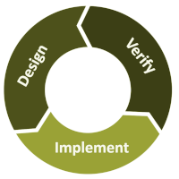

# Design Principles

🖥️ [Slides](https://docs.google.com/presentation/d/1f1X706vwJKqBRPhlB-yBF7-059--6DoF/edit#slide=id.p1)

📖 **Required Reading**: None

Software design is the process of defining, architecting, and creating an application. The primary goal of any application is to satisfy a customer's requirements. With a firm focus on the customer, you then apply the principles of good software design to identify the important actors, objects, and interactions necessary to represent the application's domain. This naturally leads to a code architecture that is easy to understand, debug, enhance, and maintain as requirements change.

As you seek to design software you should focus on the following high level goals:

1. It does what the customer wants it to do
1. It is easy to understand, debug, and maintain
1. It is extensible to requirement changes

Using these goals we can discuss the methods that commonly lead to successful software designs.

## Domain Driven Design

In order to build an application that a customer wants you need to understand the domain that the customer lives in. This helps you to properly define the application in terms that the customer understands. This approach is often referred to as [Domain Driven Design](https://en.wikipedia.org/wiki/Domain-driven_design).

As software engineers, it is tempting to focus on computer science algorithms and data structures instead of the objects and actors that a user is familiar with. With Domain Driven Design you reverse the thought process and instead think of the following:

1. Who are the **actors** in the system?
1. What **tasks** do the actors want to accomplish?
1. What are the **objects** that the actors use?
1. What are the **interactions** between actors and objects that are necessary to complete the tasks?

Once you have the actors, tasks, objects, and interactions defined you can then think about the data structures, devices, and protocols that will best support the domain. Basically you think about retail stores, employees, SKUs, and credit cards before you worry about hashmaps, protocols, tables, and networks.

Be careful to consider all of your users, not just your target customers. Oftentimes internal corporate, or governmental, customers are just as important. That means you need to consider security, regulatory restrictions, data privacy, administration, reporting, and metrics as primary pieces of the domain design.

## Persona Role Play

Sometimes it is helpful to assign personas to your primary actors and have a role play conversation with them. Creating a persona that gives a name and backstory to an actor allows you to walk through a story with them to validate the assumptions of your design. It changes the conversation from a shallow statement like:

> "A user buys a car"

to something closer to the reality of the user's domain:

> "Perry is a student from rural Utah who is short on cash. He needs to buy a car so that he can get to his part time job. He is willing to spend a lot of time finding and negotiating the best deal possible. However, he finds interacting with sales people intimidating and would prefer an automated process. He is going to need to finance his car with a cosigner on the loan."

Being thoughtful about the background of your customer will make it easier to avoid incorrect assumptions in your design. The more real the persona becomes, the better the result will be. In the end, intentional introspection of this type will save you time because your earlier design iterations will be closer to what the customer wants.

## Core Technologies

Even though you want to design for your domain first, that does not mean that you give no thought to your technology infrastructure. Carefully consider core technologies that are expensive to change once an application is deployed. This includes things such as programming languages, data schemas, protocols, databases, deployment processes, and hosting locations. Some criteria that you should consider when choosing core technology includes:

1. Security
1. Cost
1. Availability
1. Redundancy
1. Stability
1. Market acceptance
1. Support
1. Performance
1. Elasticity

### Data Structures

Likewise you should be thoughtful about choosing a data structure that fits the situation. It is sometimes easy to fall back on the same old data structure for every situation. After all you can represent anything with a sufficiently convoluted `String` class. You just start encoding your data structure into the string characters separated by delimiting control characters. Instead you should spend time becoming familiar with the strengths and weaknesses of different data structures and pick the one with the proper characteristics.

Consider factors such as:

1. **Similarity to the data it models** - Don't use a list to represent a tree.
1. **Space complexity** - If memory is abundant then favor this characteristic.
1. **Time complexity** - If speed is important then favor this characteristic
1. **Algorithmic complexity** - Are you willing to sacrifice readability and maintainability?
1. **Compatibility with interface and persistence layers** - Some data structures are easier to serialize.

## Iterative Design

It is important to realize that the complexity of software increases exponentially with the size of the application and the team working on it. One method for dealing with increasing complexity is to execute a series of simplified iterations. Each iteration becomes a deliverable by itself in a journey towards a larger goal. With the understanding that you are going to take an iterative approach to your design you then break each iteration into three distinct steps. First consider the design for some foundational piece of the application. For example, start with a nonfunctional client that displays hardcoded placeholders. Next, you build a minimal implementation that satisfies the design. Finally, you verify that your iteration satisfies the design by examining the test coverage, and soliciting user feedback that the implementation of the design is correct. You then repeat the process.



Using an iterative design is important because it will break the application down into manageable pieces, incrementally introduce complexity, and allow you to correct bad design decisions early in the process.

The size of your iteration will depend on the size of your team and the complexity of the project, but work that can be completed in one to two weeks is a common measure. Iterating for more than four weeks will often lead to wasted or inefficient efforts.

## Abstraction

In order to understand the world we use abstraction. When we see a person, we don't see organs and DNA. When we think of a university, we don't think about databases of scholastic records, cleaning crews, pipes, and department budgets. Likewise, when we think of a software applications, we don't consider all of the layers of complexity that make the application work. We abstract away many layers of detail and instead focus on the pieces necessary to complete our current task. Without abstracting away things like the hardware, operating system, application interface, threads, user interface, rendering engine, network communication, persistent storage, and memory we would never be able to keep even the simplest of programs in our heads.

When we create abstractions in our applications we begin by defining abstractions that represent real world objects. We call these the objects of our application domain. For example, a bank, customer, account, and loan. We then add an additional level of abstraction to represent the data structures and algorithms necessary to support the domain objects. For example, database schemas, network protocols, hash tables, and events.

In object oriented programming `Interfaces` and `Objects` are used to provide the bulk of abstraction.

Whenever you program you should try and abstract things into the following parts.

1. What are the input interfaces
1. What are the output interfaces
1. What interface does the my abstraction need to provide
1. What class will implement the interface


Note that sometimes it is not necessary to create an interface when a single class representation can simply expose public methods and abstract away the details. Interfaces are useful when there are multiple different algorithms that can be used to satisfy the interface, or when there are classes that implement multiple interfaces.

The important thing to remember about abstraction is that you:

1. Represent the domain and system objects with abstractions (e.g. interfaces and classes)

## Encapsulation

When we create our abstractions we want to hide anything that is not absolutely necessary to complete the task of the abstraction. In software design, hiding details is referred to as encapsulation. Some of the benefits of encapsulation include:

1. **Comprehension** - Less details makes it easier to understand how the objects interact and form a complete mental model.
1. **Extensibility** - When we are not aggressive with exposing details, we can expose those details later, or we can expose new operations that might have conflicted with previously exposed operations that were unnecessary at the time.
1. **Evolution** - Hiding how the object gets things done means that you can change the implementation without changing anything that depends on the object.
1. **Security** - Anything that is hidden by an object is less likely to be subject to attack through the object's interface.

One common mistake with encapsulation is to think that it only applies to the public methods that you include in a class. You can also provide data hiding by implementing interfaces that restrict the view of what an object can do to a small set of methods. For example, you might have a class that represents a person. In order to provide encapsulation of the class, the person might represent an `Object`, `LivingEntity` and `Animal` interface. By exposing different aspects of the person the consumer of the object only needs to know about the aspect that is of interest to them. This provides all of the benefits of comprehension, extensibility, evolution, and security.

The important thing to remember about encapsulation is that you:

1. Only expose what is necessary

## Decomposition

The basic idea of decomposition is to create another level of abstraction with layers of generalization and specialization. Each layer has a specific task to do and it accomplishes it by using the layers beneath. The idea is that you start at the top with a very general representation. For example, a chess game. You then decompose, or factor out, each layer of the higher level object into increasingly specialized pieces. For example, a game is made up of participants, pieces, and a board. This process continues until the smallest necessary level of decomposition is completed. For example, decomposing participants into players and observers, decomposing pieces by piece types, and decomposing a board with squares.

This way you only need to think about a piece of code when you are writing and testing that piece. For example, you only need to worry about game participants when trying to represent a player.


Programming languages themselves utilize decomposition to represent different parts of a program. When using Java we use the following decompositions:

| Decomposition | Purpose                                                          |
| ------------- | ---------------------------------------------------------------- |
| Application   | The top level that we hand to the operating system for execution |
| Jar           | A zip file containing packages of classes                        |
| Package       | A directory of classes                                           |
| Class         | A domain or system object                                        |
| Method        | An action of an object                                           |
| Expression    | Logic of a method                                                |

## Names

You should give appropriate consideration to the names that you use for your classes, methods, and variables. A good name will convey meaning that makes your code more maintainable and less of a cognitive load to read. Consider the following example where you have to read the docs in order to know what is happening.

```java
/**
 * Compute the mean of the numbers and
 * ignore any values that are outliers.
 */
public int calc(int[] x, boolean ignore);
```

Because the names are terse and nondescript it encourages the reader to trust the docs, which might not actually reflect what the code actually does. It also means that as the code is altered, the programmer may feel no responsibility to be true to the original intent of the name. Before long this function may be doing much more than `calc` and the meaning of `ignore` may stray far from excluding outliers.

Instead, if reasonable function and parameter names were chosen the code becomes self documenting and a future programmer will think twice before changing the obvious intent.

```java
public int calculateMean(int[] numbers, boolean ignoreOutliers);
```

There are also standard conventions that should be followed when choosing names. These conventions include the following.

1. Object names are nouns
1. Method names are verbs
1. Objects begin with uppercase
1. Methods begin with lowercase
1. Variables begin with lowercase
1. Package names begin with lowercase and should be separated by dots.
1. Constants are all uppercase
1. CamelCase should be used for all names, except constants.

## Aggregation Vs Inheritance

When you are creating your classes you need to carefully consider the different meanings and implications of using inheritance instead of aggregation. We often simplify the concepts of inheritance and aggregation to represent `is-a` and `has-a` relationships respectively. However, by favoring aggregation you can create composable objects that have the benefits of multiple inheritance without all of the complexity the multiple inheritance incurs. Aggregated objects can demonstrate polymorphic behavior by exposing interfaces that are implemented by the contained objects. As long as interfaces are used to access the aggregations, the containing class can replace the aggregated objects without impacting any users of the objects. In short, when combined with interfaces, aggregation can provide:

1. `has-a` and `is-a` relationships
1. The benefits of multiple inheritance
1. Encapsulation

## Single Responsibility Principle

Simplicity is a primary goal of good software design. One form of simplicity is represented by the [Single Responsibility Principle](https://en.wikipedia.org/wiki/Single-responsibility_principle). The idea here is that an object does one thing and does it well. You don't have a `Person` class that has a method to `driveCarByRoute` that performs the actions of a car in motion. You would have a `Person` class, a `Car` class, and a `Route` class. You would then pass the `Person` and `Route` to the car's `drive` method, and send it on its way.


Following the single responsibility principle makes it so there is only one reason to manipulate the class. You manipulate the `Person` class to represent the person and the `Route` class to represent the route. If you find yourself making a `FrankenObject` that represents multiple real world objects then you need to refactor your code into multiple classes.

The Java `String` class is a frequently cited example of violating the single responsibility principle as it not only represents an immutable string but provides operations for manipulating and converting the string. This makes the `String` class both a data container and a data mutator.

Classes are not the only places where you need to consider the single responsibility principle. Methods and variables can also fall prey to confusing and conflicting responsibilities. For example, the following method has been overloaded with multiple responsibilities and interpret the parameters and return value in contradictory ways.

```java
/**
 * i < 0 delete the key and the empty string if successful
 * i == 0 return the old value if different
 * i > 0 replace the value and return the old value
 */
String dbAction(String key, String value, int i);
```

## Avoiding Code Duplication

If your code contains multiple copies of the same code then it is violating the `Do not repeat yourself`, or DRY, principle. Code duplication create maintenance problems when you want to alter the code, increase the impact of errors, and makes it more difficult to correct the problems. It also makes the code unnecessarily complex because the reader has to read the same blocks over and over again to make sure they don't contain subtle variations.

You can reduce duplicated code by:

1. Using inheritance and encapsulation to represent a single version of the functionality.
1. Using utility methods for common operations.
1. Using generics to represent objects that only differ by type.

## Things to Understand

- The goals of software design
- Design is an iterative process
- Abstraction
- Good naming
- Single Responsibility Principle
- Decomposition
- Good algorithm and data structure selection
- Encapsulation - Information hiding
- DRY - Avoiding code duplication
