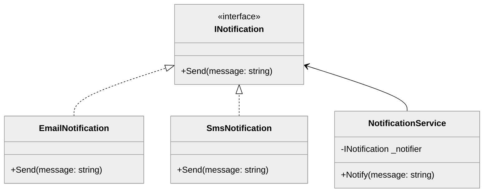
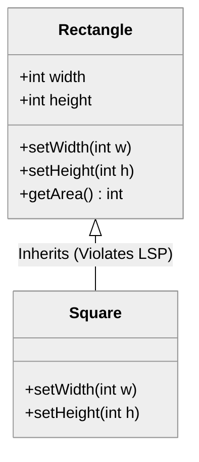
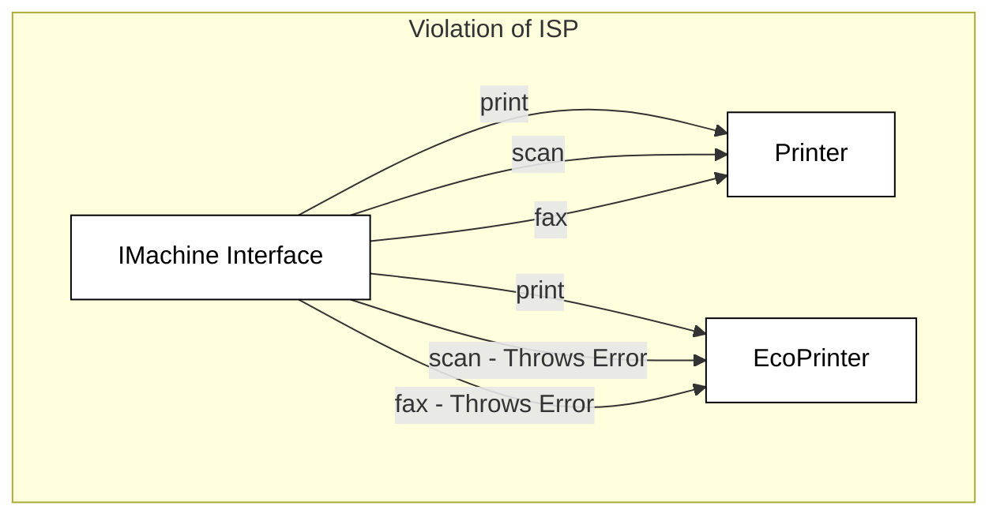

# Software Engineering Principles

Software engineering principles are fundamental guidelines and best practices that underpin the development of high-quality, maintainable, and scalable software systems. These principles serve as a compass, guiding engineers through the complexities of software development, from initial design to deployment and beyond. By adhering to these principles, software engineers can create robust, efficient, and user-friendly applications that meet the needs of their stakeholders.

## Decomposition

**Purpose:** Decomposition involves breaking down a complex problem or system into smaller, more manageable parts.  This makes the problem easier to understand, design, implement, test, and maintain. Effective decomposition allows engineers to focus on individual components without being overwhelmed by the entire system.

**Example:**

Imagine building an e-commerce website. Instead of trying to build the entire system at once, you decompose it into modules:

*   User Management: Handles user accounts, profiles, authentication, and authorization.
*   Product Catalog: Manages product information, categories, and search functionality.
*   Shopping Cart:  Allows users to add, remove, and modify items in their cart.
*   Order Processing:  Handles order placement, payment processing, and shipping.

Each of these modules can then be further decomposed.  For instance, the "Order Processing" module might be decomposed into:

*   Payment Gateway Integration
*   Order Validation
*   Inventory Management
*   Shipping Calculation

### Common Misunderstandings and Antipatterns

*   Decomposing too early: Premature decomposition can lead to unnecessary complexity and rigid designs. Understand the overall requirements before breaking things down.
*   Creating overly complex decompositions: A decomposition that is too fine-grained can be just as problematic as no decomposition at all. Aim for a balance between simplicity and manageability.
*   Ignoring dependencies: Ensure that the decomposed components have well-defined interfaces and dependencies.  Poorly managed dependencies can lead to tight coupling and increased complexity.
*   Lack of clear responsibility per component: Each component should have a clearly defined function.


## Abstraction

**Purpose:** Abstraction is the process of hiding complex implementation details and exposing only the essential information or functionality to the user. It simplifies interactions with the system and allows developers to work at a higher level of understanding, without needing to be concerned with the inner workings.

**Example:**

Consider a car.  A driver interacts with the car through the steering wheel, pedals, and gear shift. They don't need to know the intricate details of the engine, transmission, or braking system to operate the vehicle. The car's controls provide an abstraction layer, hiding the complex underlying mechanisms.

In code:

```java
interface Shape {
    double getArea();
    double getPerimeter();
}

class Circle implements Shape {
    private double radius;

    public Circle(double radius) {
        this.radius = radius;
    }

    @Override
    public double getArea() {
        return Math.PI * radius * radius;
    }

    @Override
    public double getPerimeter() {
        return 2 * Math.PI * radius;
    }
}

class Rectangle implements Shape {
    private double width;
    private double height;

    public Rectangle(double width, double height) {
        this.width = width;
        this.height = height;
    }

    @Override
    public double getArea() {
        return width * height;
    }

    @Override
    public double getPerimeter() {
        return 2 * (width + height);
    }
}
```

The `Shape` interface provides an abstraction. Users of the `Shape` interface only need to know that they can get the area and perimeter of a shape, without needing to know the specific details of how those calculations are performed for each shape type.

### Common Misunderstandings and Antipatterns

*   Over-abstraction: Creating unnecessary abstraction layers can add complexity and make the code harder to understand. Only abstract when there's a clear benefit in terms of simplification or flexibility.  The "You Ain't Gonna Need It" (YAGNI) principle applies.
*   Leaky abstractions: When the underlying implementation details "leak" through the abstraction layer, it defeats the purpose of abstraction.  For example, if a supposedly database-agnostic abstraction requires specific database-dependent configuration, it's leaky.
*   Abstracting too early: Similar to premature decomposition, abstracting before understanding the requirements can lead to incorrect or incomplete abstractions.

## Inheritance vs. Composition

**Purpose:** Inheritance and composition are two fundamental ways to establish relationships between classes in object-oriented programming.  Choosing between them is a crucial design decision.

*   **Inheritance:** Creates an "is-a" relationship. A subclass inherits properties and behaviors from its superclass.
*   **Composition:** Creates a "has-a" relationship. A class contains instances of other classes as members.

**Example:**

Consider representing different types of animals:

**Inheritance:**

```java
class Animal {
    public void eat() {
        System.out.println("Animal is eating");
    }
}

class Dog extends Animal {
    public void bark() {
        System.out.println("Woof!");
    }
}

class Cat extends Animal {
    public void meow() {
        System.out.println("Meow!");
    }
}
```

Here, `Dog` and `Cat` *are* Animals.  They inherit the `eat()` method and add their own specific behaviors.

**Composition:**

```java
interface Eatable {
    void eat();
}

class Herbivore implements Eatable {
    @Override
    public void eat() {
        System.out.println("Eating plants");
    }
}

class Carnivore implements Eatable {
    @Override
    public void eat() {
        System.out.println("Eating meat");
    }
}

class Animal {
    private Eatable eatingBehavior;

    public Animal(Eatable eatingBehavior) {
        this.eatingBehavior = eatingBehavior;
    }

    public void eat() {
        eatingBehavior.eat();
    }
}

// Usage
Animal rabbit = new Animal(new Herbivore());
rabbit.eat(); // Output: Eating plants

Animal lion = new Animal(new Carnivore());
lion.eat(); // Output: Eating meat
```

In this example, `Animal` *has-a* `Eatable` behavior. The `Animal` class is not tightly coupled to a specific eating implementation.  This allows for greater flexibility and avoids the problems associated with deep inheritance hierarchies.

**When to Use Which:**

*   **Inheritance:** Use when there's a clear "is-a" relationship and you want to reuse code from a base class.  However, be cautious about creating deep inheritance hierarchies, as they can become rigid and difficult to maintain.
*   **Composition:** Use when you want to combine different behaviors or functionalities in a flexible way. Favor composition over inheritance to avoid the problems of tight coupling and the fragile base class problem.  This is a key tenet of object-oriented design.

### Common Misunderstandings and Antipatterns

*   Overuse of inheritance: Leading to deep, complex inheritance hierarchies that are difficult to understand and maintain.
*   The "fragile base class" problem: Changes to a base class can have unintended consequences for its subclasses.
*   Ignoring the "is-a" vs. "has-a" distinction:  Using inheritance when composition is more appropriate, or vice versa.
*   Lack of interfaces:  Combining composition with interfaces leads to more flexible design.

## Cohesion

**Purpose:** Cohesion refers to the degree to which the elements within a module (e.g., a class, function, or package) are related to each other. High cohesion means that the elements within a module are strongly related and work together to achieve a single, well-defined purpose. Low cohesion indicates that the elements are unrelated or perform multiple, disparate tasks. High cohesion is generally desirable because it leads to more maintainable, understandable, and reusable code.

**Example:**

**High Cohesion:**

```java
class StringConverter {
    public String toUpperCase(String input) {
        return input.toUpperCase();
    }

    public String toLowerCase(String input) {
        return input.toLowerCase();
    }

    public String trim(String input) {
        return input.trim();
    }
}
```

This class has high cohesion because all its methods are related to string manipulation.

**Low Cohesion:**

```java
class Utility {
    public String toUpperCase(String input) {
        return input.toUpperCase();
    }

    public int calculateSum(int a, int b) {
        return a + b;
    }

    public void printReport(String data) {
        System.out.println("Report: " + data);
    }
}
```

This class has low cohesion because its methods perform unrelated tasks: string manipulation, arithmetic calculation, and printing a report.

### Common Misunderstandings and Antipatterns

*   God classes: Classes that do everything and have no clear focus.
*   Shotgun surgery: When a single change requires modifications to many different, unrelated modules.
*   Ignoring the relationship between elements: Failing to recognize that elements within a module should be related to a single purpose.
*   Combining unrelated functionalities: Grouping unrelated functionalities into a single module.

## Coupling

**Purpose:** Coupling refers to the degree of interdependence between software modules. Tight coupling means that modules are highly dependent on each other, while loose coupling means that modules are relatively independent.  Loose coupling is generally desirable because it makes the system more flexible, maintainable, and testable.

**Example:**

**Tight Coupling:**

```java
class Order {
    private Product product;

    public Order(Product product) {
        this.product = product;
    }

    public double calculateTotal() {
        return product.getPrice() * product.getQuantity(); // Directly accessing Product's properties
    }
}

class Product {
    private double price;
    private int quantity;

    public Product(double price, int quantity) {
        this.price = price;
        this.quantity = quantity;
    }

    public double getPrice() {
        return price;
    }

    public int getQuantity() {
        return quantity;
    }
}
```

In this example, the `Order` class is tightly coupled to the `Product` class. If the `Product` class changes its internal representation (e.g., changes the name of `getPrice()`), the `Order` class will also need to be modified.

**Loose Coupling:**

```java
interface PricedItem {
    double getPrice();
}

class Order {
    private PricedItem item;

    public Order(PricedItem item) {
        this.item = item;
    }

    public double calculateTotal() {
        return item.getPrice(); // Accessing through interface
    }
}

class Product implements PricedItem {
    private double price;

    public Product(double price) {
        this.price = price;
    }

    @Override
    public double getPrice() {
        return price;
    }
}

class Service implements PricedItem {
  private double hourlyRate;
  private double hours;

  public Service(double hourlyRate, double hours) {
    this.hourlyRate = hourlyRate;
    this.hours = hours;
  }

  @Override
  public double getPrice() {
    return hourlyRate * hours;
  }
}
```

Here, the `Order` class depends on the `PricedItem` interface, not the concrete `Product` class. This reduces coupling because the `Order` class doesn't need to know the specific details of how the price is calculated.  It could be a `Product` or a `Service` or anything else that implements `PricedItem`.

### Common Misunderstandings and Antipatterns

*   Global variables: Create tight coupling by allowing modules to access and modify shared state.
*   Direct object creation: Creating instances of concrete classes within other classes creates tight dependencies. Use factories or dependency injection instead.
*   Ignoring the impact of changes: Failing to consider how changes in one module might affect other modules.
*   Using concrete classes instead of interfaces: Using concrete classes as dependencies instead of interfaces creates tight coupling.


## Don't Repeat Yourself (DRY)

**Purpose:** The Don't Repeat Yourself (DRY) principle states that every piece of knowledge must have a single, unambiguous, authoritative representation within a system.  In other words, avoid duplicating code. Duplication leads to increased maintenance effort, higher risk of errors, and inconsistencies.

**Example:**

**Violation of DRY (Duplication):**

```java
class Order {
    public double calculateShippingCost(String shippingMethod, double orderTotal) {
        if (shippingMethod.equals("Standard")) {
            return orderTotal * 0.1; // 10% of order total
        } else if (shippingMethod.equals("Express")) {
            return orderTotal * 0.2; // 20% of order total
        } else {
            return 0.0;
        }
    }
}

class Invoice {
    public double calculateTax(String taxRate, double orderTotal) {
        if (taxRate.equals("Standard")) {
            return orderTotal * 0.1; // 10% of order total
        } else if (taxRate.equals("Express")) {
            return orderTotal * 0.2; // 20% of order total
        } else {
            return 0.0;
        }
    }
}
```

In this example, the calculation logic (`orderTotal * 0.1` and `orderTotal * 0.2`) is duplicated in both the `Order` and `Invoice` classes.

**Adhering to DRY (No Duplication):**

```java
class Calculator {
    public static double calculatePercentage(double percentage, double amount) {
        return amount * percentage;
    }
}

class Order {
    public double calculateShippingCost(String shippingMethod, double orderTotal) {
        if (shippingMethod.equals("Standard")) {
            return Calculator.calculatePercentage(0.1, orderTotal);
        } else if (shippingMethod.equals("Express")) {
            return Calculator.calculatePercentage(0.2, orderTotal);
        } else {
            return 0.0;
        }
    }
}

class Invoice {
    public double calculateTax(String taxRate, double orderTotal) {
        if (taxRate.equals("Standard")) {
            return Calculator.calculatePercentage(0.1, orderTotal);
        } else if (taxRate.equals("Express")) {
            return Calculator.calculatePercentage(0.2, orderTotal);
        } else {
            return 0.0;
        }
    }
}
```

Now, the calculation logic is centralized in the `Calculator` class, eliminating duplication.

### Common Misunderstandings and Antipatterns

*   Copy-pasting code: The most obvious violation of DRY.
*   Ignoring subtle duplication: Failing to recognize that similar code snippets might be performing the same underlying logic.
*   Over-abstracting:  Creating overly complex abstractions to avoid duplication, which can lead to code that is harder to understand.
*   Duplication by accident:  When different developers independently implement the same functionality.  Good communication and code review processes can help prevent this.

## Keep It Simple, Stupid (KISS)

**Purpose:** The Keep It Simple, Stupid (KISS) principle advocates for simplicity in design and implementation.  Avoid unnecessary complexity. Simple solutions are generally easier to understand, maintain, and debug.

**Example:**

Imagine you need to sort a list of numbers.

**Complex (Unnecessary Complexity):**

```java
public static void complexSort(int[] arr) {
    // An unnecessarily complex sorting algorithm
    // that is difficult to understand and maintain
    // (e.g., a hand-rolled, poorly optimized version of quicksort)
}
```

**Simple (KISS):**

```java
import java.util.Arrays;

public static void simpleSort(int[] arr) {
    Arrays.sort(arr); // Using the built-in, well-tested sort method
}
```

The `simpleSort` method uses the built-in `Arrays.sort()` method, which is well-tested, efficient, and easy to understand. The `complexSort` method, on the other hand, introduces unnecessary complexity.

### Common Misunderstandings and Antipatterns

*   Over-engineering: Designing solutions that are more complex than necessary.
*   Premature optimization: Optimizing code before it's necessary, which can lead to unnecessary complexity.
*   Ignoring existing solutions: Re-inventing the wheel instead of using existing libraries or frameworks.
*   Confusing simplicity with laziness:  Simplicity doesn't mean avoiding effort. It means choosing the most straightforward and understandable solution.

## You Ain't Gonna Need It (YAGNI)

**Purpose:** The You Ain't Gonna Need It (YAGNI) principle states that you should not add functionality until it is actually needed. Avoid speculating about future requirements and adding features that might be used later. Focus on implementing only what is required for the current iteration.

**Example:**

Imagine you're building a user management system.

**Violation of YAGNI:**

```java
class User {
    // ... existing fields and methods

    // Adding fields and methods for features that might be needed in the future
    private String preferredLanguage;
    private String profilePictureUrl;

    public void sendWelcomeEmail(String language) {
        // Logic to send welcome email in the specified language
        // (Even though the system currently only supports English)
    }
}
```

Adding the `preferredLanguage`, `profilePictureUrl`, and `sendWelcomeEmail()` method before they are actually needed violates YAGNI.  It adds complexity and potential maintenance overhead without providing any immediate benefit.

**Adhering to YAGNI:**

```java
class User {
    // ... only the fields and methods that are currently needed
}
```

Only implement the features that are required for the current iteration. If the need for `preferredLanguage`, `profilePictureUrl`, or localized welcome emails arises in the future, then implement them at that time.

### Common Misunderstandings and Antipatterns

*   Speculating about future requirements: Trying to anticipate future needs and adding features that might be used later.
*   Over-generalizing: Creating overly general solutions that are designed to handle a wide range of potential requirements.
*   Ignoring the cost of complexity: Failing to recognize that adding unnecessary features increases the complexity of the system and makes it harder to maintain.
*   Confusing YAGNI with short-sightedness: YAGNI doesn't mean ignoring future needs altogether. It means focusing on the present and addressing future needs when they actually arise.


## Single Responsibility Principle (SRP)

**Purpose:** The Single Responsibility Principle states that a class should have only one reason to change. This principle promotes modularity and reduces the likelihood that a change in one part of the system will inadvertently affect other unrelated parts. In essence, a class should be responsible for only one aspect of the software's functionality.

**Example:**

Consider a class `User` that handles both user data and user authentication:

```java
class User {
    String username;
    String password;

    public User(String username, String password) {
        this.username = username;
        this.password = password;
    }

    public String getUsername() {
        return username;
    }

    public void setUsername(String username) {
        this.username = username;
    }

    public boolean authenticate(String password) {
        // Authentication logic here
        return this.password.equals(password);
    }

    public void saveUserToDatabase() {
        // Database saving logic here
    }
}
```

This class violates SRP because it has two responsibilities: managing user data and handling authentication.  A better design separates these concerns:

```java
class User {
    String username;

    public User(String username) {
        this.username = username;
    }

    public String getUsername() {
        return username;
    }

    public void setUsername(String username) {
        this.username = username;
    }
}

class Authenticator {
    public boolean authenticate(User user, String password) {
        // Authentication logic here
        return true; // Replace with actual logic
    }
}

class UserRepository {
    public void saveUser(User user) {
        // Database saving logic here
    }
}
```

### Common Misunderstandings and Antipatterns

*   Thinking SRP applies only to classes: SRP applies to modules, functions, and even microservices. Any unit of code should have a single, well-defined purpose.
*   Over-splitting classes: While important, the goal isn't to create a multitude of tiny classes.  Balance is key.  Classes should be split when their responsibilities are truly distinct and evolve for different reasons.
*   Ignoring the "reason to change":  The critical aspect is identifying *why* a class might need to be modified. If multiple reasons exist, SRP is likely being violated.


### Comprehension check

```masteryls
{"id":"67aa812b-3ffe-4983-bcd8-384be776b015", "type":"multiple-choice" }
SRP means that a class, function, or module should:

- [ ] Do one thing and do it well
- [x] Have only one reason to change
- [ ] Be immutable
- [ ] Have no side effects
```


## The Open/Closed Principle (OCP)

The Open/Closed Principle (OCP) is the second pillar of the SOLID design principles. It states that **software entities (classes, modules, functions, etc.) should be open for extension, but closed for modification.** This means that the behavior of a module can be extended without altering its existing source code. By adhering to this principle, engineers can create systems that are robust, maintainable, and less prone to regression bugs when new requirements emerge.

When a system is "closed for modification," it means the source code is stable, tested, and deployed. Changing this code introduces the risk of breaking existing functionality. When a system is "open for extension," it provides a mechanism—usually through abstraction—to add new features. In object-oriented programming, this is typically achieved using interfaces or abstract classes.

### The Problem: Violation of OCP

Consider a scenario where we have a `NotificationService` that sends emails. If we want to add SMS support, a common mistake is to modify the existing class by adding an `if-else` or `switch` statement.

```csharp
// BAD: Violates OCP
public class NotificationService {
    public void SendNotification(string message, string type) {
        if (type == "Email") {
            // Logic to send email
        } else if (type == "SMS") {
            // Logic to send SMS
        }
        // Every time we add a new type (Push, Slack), we must modify this class.
    }
}
```

### The Solution: Abstraction

To follow OCP, we define an interface for the notification behavior. The `NotificationService` then depends on the interface rather than concrete implementations. We can add as many new notification types as we want by creating new classes that implement the interface, without ever touching the original service logic.



### Key Benefits of OCP

*   **Reduced Regression Risk:** Since existing code is not modified, the likelihood of introducing bugs into features that already work is significantly lowered.
*   **Decoupling:** High-level policy classes do not need to know the details of low-level implementation classes.
*   **Scalability:** New developers can add functionality by creating new files/classes rather than navigating and editing massive, complex legacy files.
*   **Testability:** New extensions can be unit tested in isolation without needing to re-test the entire original module.

```masteryls
{"id":"ocp-001", "title":"Identifying OCP Compliance", "type":"multiple-choice"}
Which of the following scenarios best demonstrates a violation of the Open/Closed Principle?

- [ ] Adding a new class that implements an existing interface to support a new database type.
- [x] Modifying an existing 'CalculateTotal' method to include a new 'if' statement every time a new discount type is introduced.
- [ ] Using dependency injection to swap out a production service with a mock service during testing.
- [ ] Creating a subclass that overrides a method to provide specialized behavior without changing the base class source code.
```


## The Liskov Substitution Principle (LSP)

The Liskov Substitution Principle (LSP) is the third of the five SOLID principles of object-oriented design. Introduced by Barbara Liskov in 1987, the principle states that **objects of a superclass should be replaceable with objects of its subclasses without affecting the correctness of the program.** In simpler terms, a subclass should extend the behavior of a parent class without changing its fundamental expectations or "contract."

When a subclass violates LSP, it often forces developers to use type-checking (`instanceof` or `is`) or results in unexpected runtime errors when a derived type is passed into a function expecting the base type. Adhering to LSP ensures that polymorphism remains reliable and that the inheritance hierarchy is logically sound.

### The Classic Violation: The Square-Rectangle Problem

The most famous example of an LSP violation is the Square-Rectangle problem. Mathematically, a square is a rectangle. However, in software engineering, if a `Square` class inherits from a `Rectangle` class, it often breaks the behavior expected of a rectangle.

If a `Rectangle` has independent `setWidth()` and `setHeight()` methods, a user expects that changing the width will not affect the height. But in a `Square`, changing the width *must* change the height to maintain its invariants. This contradiction means a `Square` cannot truly substitute a `Rectangle` in all scenarios.



### Key Rules for LSP Compliance

To ensure your code follows the Liskov Substitution Principle, you must respect the "Contract" of the base class. This involves several technical constraints:

1.  **Preconditions cannot be strengthened:** A subclass shouldn't require more from the caller than the base class does (e.g., a method that accepted any integer shouldn't be overridden to only accept positive integers).
2.  **Postconditions cannot be weakened:** A subclass must guarantee at least as much as the base class (e.g., if the base class guarantees a non-null return, the subclass cannot return null).
3.  **Invariants must be preserved:** Any condition that remains true for the base class (like "Area = Width * Height") must remain true for the subclass.
4.  **No "Dummy" Implementations:** If a subclass overrides a method from a parent class only to throw a `NotImplementedException`, it is a clear violation of LSP.

### Example: Refactoring for LSP

Instead of using inheritance where the relationship is forced, we can use interfaces or composition to ensure that objects remain substitutable within their specific contexts.

```python
# VIOLATION: Square modifies height when width is set
class Rectangle:
    def set_width(self, w): self.width = w
    def set_height(self, h): self.height = h

class Square(Rectangle):
    def set_width(self, w):
        self.width = w
        self.height = w  # Unexpected side effect for a Rectangle user!

# REFACTORED: Use a common interface for shapes
from abc import ABC, abstractmethod

class Shape(ABC):
    @abstractmethod
    def get_area(self):
        pass

class Rectangle(Shape):
    def __init__(self, w, h):
        self.w = w
        self.h = h
    def get_area(self):
        return self.w * self.h

class Square(Shape):
    def __init__(self, side):
        self.side = side
    def get_area(self):
        return self.side * self.side
```

By refactoring to a `Shape` interface, we no longer assume that all shapes have independent width and height controls, thus preserving the correctness of any function that calculates areas for a list of shapes.

```masteryls
{"id":"lsp-001", "title":"Identifying LSP Violations", "type":"multiple-choice"}
A developer has a base class `Bird` with a method `fly()`. They create a subclass `Ostrich`. Since ostriches cannot fly, the developer overrides the `fly()` method in the `Ostrich` class to throw an `UnsupportedOperationException`. Why is this a violation of the Liskov Substitution Principle?

- [ ] Because inheritance should only be used for objects that share 100% of their DNA.
- [x] Because a program expecting a `Bird` will crash if it receives an `Ostrich`, meaning the subclass cannot safely replace the superclass.
- [ ] Because exceptions should never be used in overridden methods.
- [ ] Because the `Bird` class should have been an interface instead of a base class.
```


## The Interface Segregation Principle (ISP)

The Interface Segregation Principle (ISP) is the fourth of the five SOLID principles of object-oriented design. It states that **no client should be forced to depend on methods it does not use.** In practice, this means we should favor many small, specific interfaces over a single, large, "fat" interface. When an interface becomes too bloated, it forces implementing classes to provide empty or "Not Implemented" logic for methods they don't actually need, leading to brittle code and unnecessary recompilation.

### The Problem: Fat Interfaces
A "fat" interface is one that attempts to cover too many responsibilities. Consider a multi-function printer system. If we create a single interface for all machines, a simple "Economic Printer" that cannot scan or fax would still be forced to implement those methods.



### Applying ISP: Segregation
To fix this, we break the large interface into smaller, more granular ones. This allows clients to implement only the functionality that is relevant to them. This approach promotes the "decoupling" of systems, making the codebase easier to refactor and test.

**Benefits of ISP include:**
*   **Reduced Side Effects:** Changes to a specific interface only affect the classes that actually use those methods.
*   **Improved Readability:** Small interfaces are easier to understand and document.
*   **Flexibility:** Classes can implement multiple small interfaces (composition) to achieve complex behavior without being forced into unrelated contracts.

### Code Example: From Monolith to Segregated
In the following example, we refactor a bloated `IMessage` interface into smaller, specialized interfaces.

**Before (ISP Violation):**
```csharp
public interface IMessage {
    void SendEmail();
    void SendSMS();
    void SendPushNotification();
}

// A class that only sends Emails is forced to handle SMS and Push logic
public partial class EmailService : IMessage {
    public void SendEmail() { /* Logic */ }
    public void SendSMS() { throw new NotImplementedException(); }
    public void SendPushNotification() { throw new NotImplementedException(); }
}
```

**After (Following ISP):**
```csharp
public interface IEmailMessage {
    void SendEmail();
}

public interface ISmsMessage {
    void SendSMS();
}

// Now the EmailService only depends on what it actually needs
public class EmailService : IEmailMessage {
    public void SendEmail() {
        Console.WriteLine("Sending email...");
    }
}

// A multi-channel service can still implement multiple interfaces
public class MultiChannelService : IEmailMessage, ISmsMessage {
    public void SendEmail() { /* ... */ }
    public void SendSMS() { /* ... */ }
}
```

```masteryls
{"id":"isp-concept-check", "title":"Identifying ISP Violations", "type":"multiple-choice"}
Which of the following scenarios best describes a violation of the Interface Segregation Principle?

- [ ] A class implements two different interfaces to gain multiple functionalities.
- [x] A developer is forced to throw a 'NotImplementedException' because the interface they are implementing contains methods their class doesn't need.
- [ ] An interface inherits from another interface to extend its capabilities.
- [ ] A class has too many private helper methods, making the file difficult to read.
```


## Dependency Inversion Principle (DIP)

**Purpose:** The Dependency Inversion Principle states that high-level modules should not depend on low-level modules. Both should depend on abstractions (interfaces or abstract classes).  Furthermore, abstractions should not depend on details. Details (concrete implementations) should depend on abstractions. This principle promotes loose coupling and makes the system more flexible and maintainable.

**Example:**

**Violation of DIP (Tight Coupling):**

```java
class LightBulb {
    public void turnOn() {
        System.out.println("LightBulb: Bulb turned on...");
    }

    public void turnOff() {
        System.out.println("LightBulb: Bulb turned off...");
    }
}

class Switch {
    private LightBulb bulb;

    public Switch(LightBulb bulb) {
        this.bulb = bulb;
    }

    public void operate() {
        bulb.turnOn();
    }
}
```

Here, the `Switch` class depends directly on the `LightBulb` class (a low-level module). If we wanted to control a different type of device (e.g., a fan), we would need to modify the `Switch` class.

**Adhering to DIP (Loose Coupling):**

```java
interface Switchable {
    void turnOn();
    void turnOff();
}

class LightBulb implements Switchable {
    @Override
    public void turnOn() {
        System.out.println("LightBulb: Bulb turned on...");
    }

    @Override
    public void turnOff() {
        System.out.println("LightBulb: Bulb turned off...");
    }
}

class Fan implements Switchable {
    @Override
    public void turnOn() {
        System.out.println("Fan: Fan turned on...");
    }

    @Override
    public void turnOff() {
        System.out.println("Fan: Fan turned off...");
    }
}

class Switch {
    private Switchable device;

    public Switch(Switchable device) {
        this.device = device;
    }

    public void operate() {
        device.turnOn();
    }
}
```

Now, both the `Switch` and the `LightBulb` (and `Fan`) depend on the `Switchable` interface. The `Switch` class is no longer dependent on a specific type of device.  We can easily switch between different devices without modifying the `Switch` class.

### Common Misunderstandings and Antipatterns

*   Ignoring the principle: Failing to recognize the importance of decoupling high-level and low-level modules.
*   Creating concrete dependencies: Using concrete classes as dependencies instead of abstractions.
*   Not understanding the flow of control: Failing to understand how the principle affects the flow of control in the system.
*   Using service locators instead of dependency injection: While service locators can provide some decoupling, they can also hide dependencies and make the code harder to test. Dependency Injection is generally the preferred approach.


```masteryls
{"id":"98dc3090-8c9a-4f25-8102-05e4b8dd919f","title":"Dependency Inversion Principle","type":"multiple-choice"}
According to the Dependency Inversion Principle (DIP), which of the following statements best describes the relationship between high-level modules and low-level modules?

- [ ] High-level modules should depend on low-level modules, provided that the low-level modules are injected via a constructor.
- [x] Both high-level and low-level modules should depend on abstractions, ensuring that the high-level policy is independent of the low-level details.
- [ ] Low-level modules should depend on high-level modules to ensure that implementation details are driven by business logic requirements.
- [ ] High-level modules should define specific concrete classes that low-level modules must inherit from to maintain a strict hierarchy.
```


## Summary

Software engineering principles are essential for building robust, maintainable, and scalable software systems. These principles, including SRP, decomposition, abstraction, inheritance vs. composition, cohesion, coupling, DIP, DRY, KISS, and YAGNI, provide guidance for making informed design decisions and avoiding common pitfalls. By understanding and applying these principles, software engineers can create high-quality applications that meet the needs of their stakeholders and stand the test of time. Continuously reflecting on these principles during the development process is crucial for becoming a proficient software engineer.
