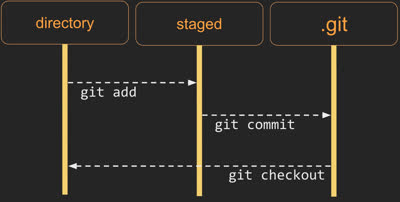
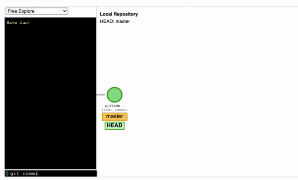
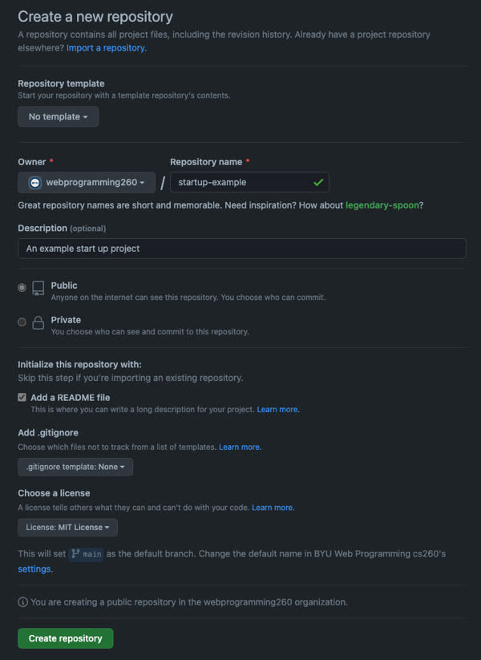
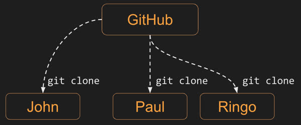
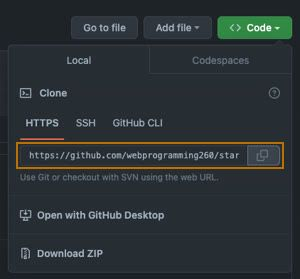
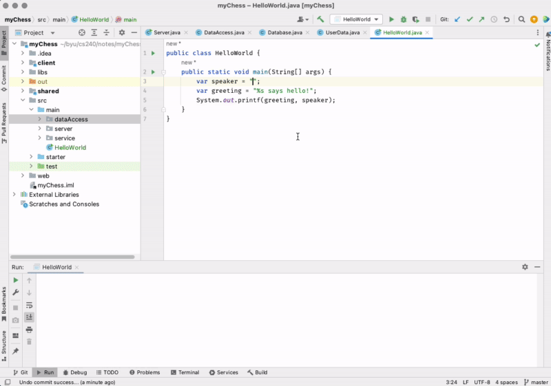

# Git


🖥️ [Slides](https://docs.google.com/presentation/d/1y4u5y9uNiekYcubilyhYLjUGVoYBqs4q/edit?usp=sharing&ouid=114081115660452804792&rtpof=true&sd=true)

📖 **Required reading**:

- [GitHub create a repo](https://docs.github.com/en/get-started/quickstart/create-a-repo)
- [GitHub cloning a repo](https://docs.github.com/en/repositories/creating-and-managing-repositories/cloning-a-repository)
- [GitHub personal access tokens](https://docs.github.com/en/authentication/keeping-your-account-and-data-secure/creating-a-personal-access-token)

[Linus Torvalds](https://en.wikipedia.org/wiki/Linus_Torvalds), the creator of Linux, was fed up with the proprietary version control software that he was using to track the code for the Linux kernel and so over a weekend he built Git, the world's most popular version control system.


> _Source: Wikipedia_

> “Talk is cheap. Show me the code.”
>
> — Linus Torvalds

## Installing Git

Before we can talk about Git you need to make sure it is installed in your development environment. Open a console and type `git --version`.

```sh
➜  git --version
git version 2.32.0 (Apple Git-132)
```

If you do not see something like that, then you need to follow these [instructions](https://git-scm.com/book/en/v2/Getting-Started-Installing-Git) to install Git.

## What is Git?

Git provides two valuable functions. First, it allows you to track versions of files in a directory. Second, it allows you to clone all of those versions to a different location, usually to a different computer. We are going to focus on tracking versions in this instruction and cover cloning repositories when we talk later about GitHub.

You can track file versions of any files in a directory by initializing Git for that directory. You can do this right now by creating a new directory in a console window and initializing it as a Git repository.

```sh
➜  mkdir playingWithGit
➜  cd playingWithGit
➜  git init
```

If you list all files in the directory you will see that you now have a hidden directory named `.git`.

```sh
➜  ls -la
total 0
drwxr-xr-x   3 lee  staff    96 Dec  1 22:59 .
drwxr-xr-x+ 54 lee  staff  1728 Dec  1 23:00 ..
drwxr-xr-x   9 lee  staff   288 Dec  1 22:59 .git
```

The `.git` directory is where all of the versions get stored. Now use the `echo` command to create a file so that we can see how versioning works. After creating the new file, use `git status` to tell you what git is doing.

```sh
➜ echo hello world > hello.txt
➜ git status

On branch master
No commits yet
Untracked files:
  (use "git add <file>..." to include in what will be committed)
	hello.txt

nothing added to commit but untracked files present (use "git add" to track)
```

Git status tells you that it detects a new file named `hello.txt`, but it isn't currently tracking versions for that file. To begin tracking versions you need to add it. Usually you track all files in a repository directory and so you can tell Git to track everything that it doesn't know about with `git add .`. Follow this with another call to `git status`.

```sh
➜  git add .
➜  git status

On branch master
No commits yet
Changes to be committed:
  (use "git rm --cached <file>..." to unstage)
	new file:   hello.txt
```

Now Git tells us that it has `staged` the file `hello.txt` and it is ready to be committed as a version in the repository. We commit a version with the `commit` command. We always want to have a meaningful comment about the version we are committing and so we use the `-m` parameter to provide a message that will live with the version. Follow this with another call to `git status`.

```sh
➜  git commit -m "initial draft"
[master (root-commit) d43b07b] initial draft
 1 file changed, 1 insertion(+)
 create mode 100644 hello.txt

➜  git status
On branch master
nothing to commit, working tree clean
```

Congratulations! You have just committed your first file to a Git repository. It is important to note that we were only working with a single file in this example. However, a commit can represent multiple files. You just need to add them all before you execute the commit. Also, note that the point of the stage (add) step, is so that you can commit some files while still leaving other modified file out of the commit.

Let's make an edit to our file and commit it again. This time we will tell Git that we want to add all the tracked modified files to our commit by including the `-a` parameter along with our message parameter.

```sh
➜  echo goodbye world > hello.txt

➜  git commit -am "changed greeting to reflect the present mood"

[master e65f983] changed greeting to reflect the present mood
 1 file changed, 1 insertion(+), 1 deletion(-)
```

Now that we have a couple versions in our repository we can view the versions with the `git log` command.

```sh
➜  git log

commit e65f9833ca8ee366d0d9c1676a91b1a977dab441 (HEAD -> master)
Author: Lee
Date:   Thu Dec 1 23:32:22 2022 -0700

    changed greeting to reflect the present mood

commit d43b07b8890f52defb31507211ba78785bf6dccf
Author: Lee
Date:   Thu Dec 1 23:29:11 2022 -0700

    initial draft
```

This shows both commits with the associated comments.

## Commit SHA

Every commit has a unique identifier that is generated by hashing the file along with the timestamp using the SHA hashing algorithm. You can always refer to a specific commit in your version history by using its SHA. For example, if we want to temporarily switch back to a previous version to see what it contains we can use the `checkout` command. You only need to provide the first few characters of the SHA.

```sh
➜  git checkout d43b07b8890f

Note: switching to 'd43b07b8890f'.
HEAD is now at d43b07b initial draft

➜  cat hello.txt
hello world
```

The above output omits a big message saying that you are no longer looking at the latest version, but the important thing is that you can see that we are now looking at our old version. To get back to the top of the version chain, use the `checkout` command and reference the branch name, which is by default `master`.

```sh
➜  git checkout master
Previous HEAD position was d43b07b initial draft
Switched to branch 'master'

➜  cat hello.txt
goodbye world
```

Now we are back to our latest version.

The following diagram shows how your commits move from your working directory, to staging them for a commit, and then committing them to a repository.



A commit is a full snapshot of what was staged from your directory at the time of the commit. That means all of the files contained in the commit were reverted when you executed the checkout command. Since we only had one file in our commit, it looks like we are only flipping that file around, but basically you can think of it as a time machine for the entire directory.

## Diff

Most of the time you don't want to reverse back to an earlier commit. Instead you just want to compare the differences between commits. We can do that with the `diff` command. You can specify two SHAs that you would like to compare, or you can use the HEAD variable which points to the top of the commit change. To refer to earlier commits you just add `~` and the numerical distance from head that you want to reference. In this case we will compare HEAD and HEAD~1.

```sh
➜  git diff HEAD HEAD~1
```

```diff
diff --git a/hello.txt b/hello.txt
index 3b18e51..eeee2af 100644
--- a/hello.txt
+++ b/hello.txt
@@ -1 +1 @@
-hello world
+goodbye world
```

You can see that we made a change to `hello.txt` by removing `hello world` and adding `goodbye world`.

## Branches

Git supports the ability to branch your code. This allows you to work on variations of the code while still allowing progress on the main branch. For example, if you wanted to work on a new feature named `A` without interrupting work on the master branch, you would use the `git branch A` command and start working on the `A` branch with the `git checkout A` command. Now commits can be down to both the master and the `A` branch. When you want to combine the work done on both branches you us checkout the master branch and execute `git merge A`. If you decide you want to abandon the new feature then you just don't ever merge it back into the master branch.

Here is a demonstration of this working on the visualization tool provided by [git-school.github.io](https://git-school.github.io/visualizing-git/).



## Commit often

You will be required to have at least 4 commits for each project that you submit in order to get full credit. Commonly, this will be an initial commit that contains empty project files, followed by commits at each functional milestone, and then a final commit for the working project. Committing your code often is an important practice for you to develop. It protects you from losing your work, allows access from anywhere, makes it so you can quickly share changes, reduces conflicts with your peers, and enables you to efficiently explore different possibilities. This also enables others to review the progression of your development efforts in order to prove the originality of your work.

Remember to make meaningful commit messages that describe the **what** and **why** of the changes made. Here is a [good post](https://www.freecodecamp.org/news/how-to-write-better-git-commit-messages/) on how make meaningful commit messages.

## Binary files

You can store any type of file in Git, but be aware that if you store large binary files, such as images or videos, you are storing a copy of that file each time you make a change to it. For example, suppose you use Git to track the changes you make to a video production project. Every time you save a change to your 10 GB video file you store a complete copy of the file. That means 10 commits of the video file will store 100 GB of data in your repository.

## GitHub

When we introduced `Git`, we said that Git provides two things, 1) Version tracking in a repository, and 2) the ability to clone a copy of the repository to a different location. You can clone repositories between computers used by your development team, but the management of cloning repositories is much easier when you use a cloud based service such as `GitHub`.

GitHub was launched in 2008 by a small group of developers that wanted to make code collaboration easy. GitHub was acquired by Microsoft in 2018 for $7.5 billion. Since its beginning as a simple web application for cloning and storing Git repositories, GitHub has added functionality for hosting websites, supporting community pull requests, tracking issues, hosting codespaces, running continuous deployment processes, managing projects, and even AI driven code generation.

### Creating and cloning a repository

While you can create a repository in your development environment using `git init` and then connect it to an upstream repository on GitHub, it is **always** easier to create your repository first on GitHub and then clone it to your development environment. That way your repositories are automatically linked to each other.

To create a repository in GitHub, log into your account, select the `Repositories` tab, and press `New repository`. You then specify a unique repository name, give a description, indicate that you want it to be public, add a default README.md file, and choose a license.



Every repository in GitHub has a unique URL assigned to it. Assuming the repository is public, anyone with the URL can clone it to their development environment. A repository clone is an exact copy of the repository including all of the commits, comments, and SHAs. It also configures the clone to know what the remote source is so that you can use Git commands to keep them in sync as changes are made.



You clone a repository by providing the GitHub repository's URL as a parameter to the `git clone` command from in a console window. You can get a copy of the URL from the repository's GitHub page and clicking on the green `Code` button, and then clicking on the copy button next to the HTTPS url.



When you clone a repository it is placed in a subdirectory named with the name of the repository. So make sure you are in the directory where you keep all of your source repositories before you run the command.

```sh
➜  git clone https://github.com/softwareconstruction240/chess.git

Cloning into 'chess'...
remote: Total 4 (delta 0), reused 0 (delta 0), pack-reused 0
Receiving objects: 100% (4/4), done.

➜  cd chess
```

## IntelliJ and Git

Knowing how to use Git from the console is a very valuable skill. Git offers a wide variety of functionality such as creating branches of the repository, temporarily stashing changes, and cloning repositories to other machines.

However, by using a tool like IntelliJ you can hide all of the complexity of the command line and use a visual interface instead.

Here we see IntelliJ looking at a `HelloWorld` class we have been working in. Once we have made our changes, we can use the `Commit` tab On the left to interact with Git and GitHub. On the `Commit` tab we can see all the changes we have made to the code. By clicking on the files we see the difference between the old and new version. If everything looks good we can press the `Commit and Push` button. Because this is our first commit to GitHub we need to provide our Personal Access Token. Once you have done this once, you don't need to do it again.

You can also use the `Git` tab, at the bottom of the screen, to see the commit history for your project. This allows you to walk back in history and see where changes were introduced or even revert back to previous versions.



Underneath the covers, IntelliJ is running Git commands just like we did on the command line, but using a visual tool makes working with versions much easier.

Take some time and play with adding files, modifying them, committing, and diffing. You want to get to the point where this is second nature so that you can easily experiment and make mistakes, knowing that with Git, you can always easily recover.

| Prev                                                            | Up                       | Next                                                    |
| --------------------------------------------------------------- | ------------------------ | ------------------------------------------------------- |
| ♕ [Phase 1: Chess Game](../../chess/1-chess-game/chess-game.md) | [Modules](../modules.md) | [Java Inner Classes](../inner-classes/inner-classes.md) |
