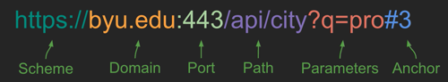

# Hypertext Transfer Protocol

🖥️ [Slides](https://docs.google.com/presentation/d/1VECGwiLgXd541yq9BWVSYiphHAXHG0ca/edit?usp=sharing&ouid=114081115660452804792&rtpof=true&sd=true)

🖥️ [Lecture Videos](#videos)

📖 **Optional Reading**: [MDN An overview of HTTP](https://developer.mozilla.org/en-US/docs/Web/HTTP/Overview)


> “You affect the world by what you browse”
>
> — Tim Berners-Lee, (**Source**: _Answers for Young People_)

## URL

The Uniform Resource Locator (URL) represents the location of a web resource. A web resource can be anything, such as a web page, font, image, video stream, database record, or JSON object. It can also be completely ephemeral, such as a visitation counter, or gaming session.

Looking at the different parts of a URL is a good way to understand what it represents. Here is an example URL that represents a query to BYU for cities that contain `pro` using secure HTTP.



The URL syntax uses the following convention. Notice the delimiting punctuation between the parts of the URL. Most parts of the URL are optional. The only ones that are required are the scheme, and the domain name.

```yaml
<scheme>://<domain name>:<port>/<path>?<parameters>#<anchor>
```

| Part        | Example                              | Meaning                                                                                                                                                                                                                                                                             |
| ----------- | ------------------------------------ | ----------------------------------------------------------------------------------------------------------------------------------------------------------------------------------------------------------------------------------------------------------------------------------- |
| Scheme      | https                                | The protocol required to ask for the resource. For web applications, this is usually HTTPS. But it could be any internet protocol such as FTP or MAILTO.                                                                                                                            |
| Domain name | byu.edu                              | The domain name that owns the resource represented by the URL.                                                                                                                                                                                                                      |
| Port        | 3000                                 | The port specifies the numbered network port used to connect to the domain server. Lower number ports are reserved for common internet protocols, higher number ports can be used for any purpose. The default port is 80 if the scheme is HTTP, or 443 if the scheme is HTTPS.     |
| Path        | /school/byu/user/8014                | The path to the resource on the domain. The resource does not have to physically be located on the file system with this path. It can be a logical path representing endpoint parameters, a database table, or an object schema.                                                    |
| Parameters  | filter=names&highlight=intro,summary | The parameters represent a list of key value pairs. Usually it provides additional qualifiers on the resource represented by the path. This might be a filter on the returned resource or how to highlight the resource. The parameters are also sometimes called the query string. |
| Anchor      | summary                              | The anchor usually represents a sub-location in the resource. For HTML pages this represents a request for the browser to automatically scroll to the element with an ID that matches the anchor. The anchor is also sometimes called the hash, or fragment ID.                     |

Technically you can also provide a user name and password before the domain name. This was used historically to authenticate access, but for security reasons this is deprecated. However, you will still see this convention for URLs that represent database connection strings.

## HTTP

Hypertext Transfer Protocol (`HTTP`) is how the web talks. When a web browser makes a request to a web server it does it using the HTTP protocol. The purpose of this instruction is help you master the high level internals of HTTP. Just like becoming fluent in a foreign language makes a visit to another country more enjoyable, understanding how to speak HTTP helps you communicate effectively when talking on the web.

When a web client (e.g. a web browser) and a web server talk they exchange HTTP requests and responses. The browser will make an HTTP request and the server will generate an HTTP response. You can see the HTTP exchange by using the browser's debugger or by using a console tool like `curl`. For example, in your console you can use `curl` to make the following request.

```sh
curl -v -s http://info.cern.ch/hypertext/WWW/Helping.html
```

### Request

The HTTP request for the above command would look like the following.

```http
GET /hypertext/WWW/Helping.html HTTP/1.1
Host: info.cern.ch
Accept: text/html
```

An HTTP request has this general syntax.

```yaml
<verb> <url path, parameters, anchor> <version>
[<header key: value>]*
[

  <body>
]
```

The first line of the HTTP request contains the `verb` of the request, followed by the path, parameters, and anchor of the URL, and finally the version of HTTP being used. The following lines are optional headers that are defined by key value pairs. After the headers you have an optional body. The body start is delimited from the headers with two new lines.

In the above example, we are asking to `GET` a resource found at the path `/hypertext/WWW/Helping.html`. The version used by the request is `HTTP/1.1`. This is followed by two headers. The first specifies the requested host (i.e. domain name). The second specifies what type of resources the client will accept. The resource type is always a [MIME type](https://developer.mozilla.org/en-US/docs/Web/HTTP/Basics_of_HTTP/MIME_types) as defined by internet governing body IANA. In this case we are asking for HTML.

### Response

The response to the above request looks like this.

```yaml
HTTP/1.1 200 OK
Date: Tue, 06 Dec 2022 21:54:42 GMT
Server: Apache
Last-Modified: Thu, 29 Oct 1992 11:15:20 GMT
ETag: "5f0-28f29422b8200"
Accept-Ranges: bytes
Content-Length: 1520
Connection: close
Content-Type: text/html

<TITLE>Helping -- /WWW</TITLE>
<NEXTID 7>
<H1>How can I help?</H1>There are lots of ways you can help if you are interested in seeing
the <A NAME=4 HREF=TheProject.html>web</A> grow and be even more useful...
```

An HTTP response has the following syntax.

```yaml
<version> <status code> <status string>
[<header key: value>]*
[

  <body>
]
```

You can see that the response syntax is similar to the request syntax. The major difference is that the first line represents the version and the status of the response.

Understanding the meaning of the common HTTP verbs, status codes, and headers is important for you to understand, as you will use them in developing a web application. Take some time to internalize the following common values.

## Verbs

There are several verbs that describe what the HTTP request is asking for. The list below only describes the most common ones.

| Verb    | Meaning                                                                                                                                                                                                                                                  |
| ------- | -------------------------------------------------------------------------------------------------------------------------------------------------------------------------------------------------------------------------------------------------------- |
| GET     | Get the requested resource. This can represent a request to get a single resource or a resource representing a list of resources.                                                                                                                        |
| POST    | Create a new resource. The body of the request contains the resource. The response should include a unique ID of the newly created resource.                                                                                                             |
| PUT     | Update a resource. Either the URL path, HTTP header, or body must contain the unique ID of the resource being updated. The body of the request should contain the updated resource. The body of the response may contain the resulting updated resource. |
| DELETE  | Delete a resource. Either the URL path or HTTP header must contain the unique ID of the resource to delete.                                                                                                                                              |
| OPTIONS | Get metadata about a resource. Usually only HTTP headers are returned. The resource itself is not returned.                                                                                                                                              |

## Status codes

It is important that you use the standard HTTP status codes in your HTTP responses so that the client of a request can know how to interpret the response. The codes are partitioned into five blocks.

- 1xx - Informational.
- 2xx - Success.
- 3xx - Redirect to some other location, or that the previously cached resource is still valid.
- 4xx - Client errors. The request is invalid.
- 5xx - Server errors. The request cannot be satisfied due to an error on the server.

Within those ranges here are some of the more common codes. See the [MDN documentation](https://developer.mozilla.org/en-US/docs/Web/HTTP/Status) for a full description of status codes.

| Code | Text                                                                                 | Meaning                                                                                                                           |
| ---- | ------------------------------------------------------------------------------------ | --------------------------------------------------------------------------------------------------------------------------------- |
| 100  | Continue                                                                             | The service is working on the request                                                                                             |
| 200  | Success                                                                              | The requested resource was found and returned as appropriate.                                                                     |
| 201  | Created                                                                              | The request was successful and a new resource was created.                                                                        |
| 204  | No Content                                                                           | The request was successful but no resource is returned.                                                                           |
| 304  | Not Modified                                                                         | The cached version of the resource is still valid.                                                                                |
| 307  | Permanent redirect                                                                   | The resource is no longer at the requested location. The new location is specified in the response location header.               |
| 308  | Temporary redirect                                                                   | The resource is temporarily located at a different location. The temporary location is specified in the response location header. |
| 400  | Bad request                                                                          | The request was malformed or invalid.                                                                                             |
| 401  | Unauthorized                                                                         | The request did not provide a valid authentication token.                                                                         |
| 403  | Forbidden                                                                            | The provided authentication token is not authorized for the resource.                                                             |
| 404  | Not found                                                                            | An unknown resource was requested.                                                                                                |
| 408  | Request timeout                                                                      | The request takes too long.                                                                                                       |
| 409  | Conflict                                                                             | The provided resource represents an out of date version of the resource.                                                          |
| 418  | [I'm a teapot](https://en.wikipedia.org/wiki/Hyper_Text_Coffee_Pot_Control_Protocol) | The service refuses to brew coffee in a teapot.                                                                                   |
| 429  | Too many requests                                                                    | The client is making too many requests in too short of a time period.                                                             |
| 500  | Internal server error                                                                | The server failed to properly process the request.                                                                                |
| 503  | Service unavailable                                                                  | The server is temporarily down. The client should try again with an exponential back off.                                         |

## Headers

📖 **Optional Reading**: [MDN HTTP headers](https://developer.mozilla.org/en-US/docs/Web/HTTP/Headers)

HTTP headers specify metadata about a request or response. This includes things like how to handle security, caching, data formats, and cookies. Some common headers that you will use include the following.

| Header                      | Example                              | Meaning                                                                                                                                                                        |
| --------------------------- | ------------------------------------ | ------------------------------------------------------------------------------------------------------------------------------------------------------------------------------ |
| Authorization               | Bearer bGciOiJIUzI1NiIsI             | A token that authorized the user making the request.                                                                                                                           |
| Accept                      | image/\*                             | What content format the client accepts. This may include wildcards.                                                                                                            |
| Content-Type                | text/html; charset=utf-8             | The format of the response content. These are described using standard [MIME](https://developer.mozilla.org/en-US/docs/Web/HTTP/Basics_of_HTTP/MIME_types/Common_types) types. |
| Cookie                      | SessionID=39s8cgj34; csrftoken=9dck2 | Key value pairs that are generated by the server and stored on the client.                                                                                                     |
| Host                        | info.cern.ch                         | The domain name of the server. This is required in all requests.                                                                                                               |
| Origin                      | cs260.click                          | Identifies the origin that caused the request. A host may only allow requests from specific origins.                                                                           |
| Access-Control-Allow-Origin | https://cs260.click                  | Server response of what origins can make a request. This may include a wildcard.                                                                                               |
| Content-Length              | 368                                  | The number of bytes contained in the response.                                                                                                                                 |
| Cache-Control               | public, max-age=604800               | Tells the client how it can cache the response.                                                                                                                                |
| User-Agent                  | Mozilla/5.0 (Macintosh)              | The client application making the request.                                                                                                                                     |

## Body

The format of the body of an HTTP request or response is defined by the `Content-Type` header. For example, it may be HTML text (text/html), a binary image format (image/png), JSON (application/json), or JavaScript (text/javascript). A client may specify what formats it accepts using the `accept` header.

## Things to Understand

- Internet basics: IP addresses, domain names, port numbers
- Web basics: URLs, the HTTP protocol (Headers, methods, and body)
- URL schema

## Videos

- 🎥 [Chess Server Review (3:39)](https://byu.hosted.panopto.com/Panopto/Pages/Viewer.aspx?id=a3d5b141-7756-4b0f-8912-b185014dbd5e) - [[transcript]](https://github.com/user-attachments/files/17738495/CS_240_Chess_Server_Review_Transcript.pdf)
- 🎥 [HTTP Overview (10:42)](https://byu.hosted.panopto.com/Panopto/Pages/Viewer.aspx?id=ef2d29d2-72af-4d8f-9cdc-b185014f4fe5) - [[transcript]](https://github.com/user-attachments/files/17738497/CS_240_HTTP_Overview_Transcript.pdf)
- 🎥 [HTTP GET Requests (23:29)](https://byu.hosted.panopto.com/Panopto/Pages/Viewer.aspx?id=ea7a075b-a516-40f2-b17b-b185015286d8) - [[transcript]](https://github.com/user-attachments/files/17738504/CS_240_HTTP_GET_Requests_Transcript.pdf)
- 🎥 [HTTP POST Requests (8:43)](https://byu.hosted.panopto.com/Panopto/Pages/Viewer.aspx?id=90dad290-87d6-44c5-9aa5-b185015930a1) - [[transcript]](https://github.com/user-attachments/files/17738509/CS_240_HTTP_POST_Requests_Transcript.pdf)
- 🎥 [HTTP Methods (2:49)](https://byu.hosted.panopto.com/Panopto/Pages/Viewer.aspx?id=50ec71e4-a0d9-4f55-853e-b185015bd652) - [[transcript]](https://github.com/user-attachments/files/17738511/CS_240_HTTP_Methods_Transcript.pdf)
