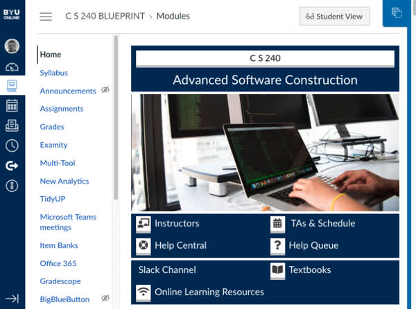
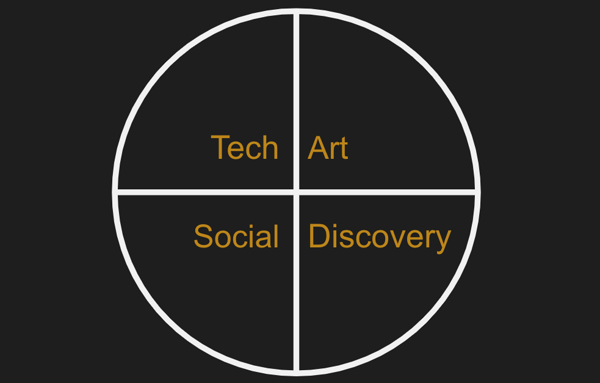

# Introduction

🖥️ [Slides - Jensen](https://docs.google.com/presentation/d/1hn9IpJT1DMQ1fECSt1CY7EdoDi4OQgRn/edit?usp=sharing&ouid=114081115660452804792&rtpof=true&sd=true)

🖥️ [Slides - Rodham](https://docs.google.com/presentation/d/1fbz2fJwlQGvG4V4FTyJsKeDWIl6J7DSx/edit)

🖥️ [Slides - Wilkerson](https://docs.google.com/presentation/d/16w_6hFRhAnNUg20Cnq8HEEnBeLawh3Iw/edit?usp=sharing&ouid=110961336761942794636&rtpof=true&sd=true)

🖥️ [Lecture Videos](#videos)

Welcome to Computer Science 240: `Advanced Software Construction`. This course focuses on learning how professional software developers build applications. As part of this instruction you will gain experience with the skills and technologies used in the real world of software construction. This includes: Software design, data modeling, object oriented programming, distributed communication, relational databases, and testing.

In previous courses you have probably focused on building small programs that targeted learning a particular concept. While these programs teach you a specific concept, they fail to provide you with the skills necessary to create applications that require careful design, engineering, and tooling.

## Software Engineering

The term software engineering was first used in conjunction with the software created for the Apollo moon landings. Margaret Hamilton, the director of the software division, described their work as being similar to hardware engineering in complexity and design, and therefore should be called `software engineering`. Her careful design of the landing system's redundancy capabilities is credited with saving the Apollo 11 mission from aborting during the final minutes of the historic first moon landing.

> _Source: Wikipedia_

> “Looking back, we were the luckiest people in the world. There was no choice but to be pioneers; no time to be beginners.”
>
> — Margaret Hamilton

## Chess Project

We use the game of [chess](../../chess/chess.md) to help you develop and demonstrate mastery during this course. Your development work is divided into different phases. Each phase demonstrates a different architectural concept or technology. The first phases implements the rules of chess.

After implementing the first phase of the chess project, you will rewrite the code, from the base project template, without external help or resources, during a timed exam. This demonstrates your ability to work independently under pressure. Being able to efficiently write code under a deadline is an essential skill that will prepare you for the realities of programming professionally.

The remainder of the chess phases implement a chess server that allows multiple client player programs to connect, register users, and play games.

## Java

You will use the Java programming language for all of your work in this course. Java has been a popular language for multiple decades. According to the [2023 Stack Overflow survey](https://survey.stackoverflow.co/2023/#most-popular-technologies-language-prof), Java is used by 30% of professional developers. Java has some nice properties. It is object oriented, compiled, has garbage collection, and is strongly typed. In short, Java is a good language to help you round out your skill set and resume.

In order to properly learn Java, you will need to reference selected chapters of the book `Core Java for the Impatient`. This book is available for free on the Safari Books collection available through the Harold B. Lee Library. You can also reference the many resources available on the web for mastering the different concepts found in the Java programming language.

> [!NOTE]
> Note that it is critical that you reserve a significant amount of your time to learn Java outside of class. In class we focus on concepts that are needed for the projects, hard concepts, and things that tend to confuse students. It is assumed that you already learned the basics of Java on your own.

## Enrichment Lectures

Towards the end of the course, while you are hammering away on your chess program, the course topics will focus on additional enrichment material that you should be familiar with as a professional developer. These topics will not be reflected in your project work, but you will need to be familiar with their content since they will represent the bulk of the material covered by the final exam. These include topics such as security, concurrency, and Java command line tools.

## Canvas

All of the course instruction is represented on GitHub, however we use Canvas to send out notifications, submit your projects, take exams, and view your grades.

> [!IMPORTANT]
> Make sure you have enabled Canvas to send notifications to an email account that you monitor regularly. Failure to do this will mean that you miss important notifications that could impact your efforts and grade.

## Well Rounded Software Engineers

The key to learning how to be an exceptional software engineer rests in your ability to continually improve in four areas.

1. **`Capable`** - You need to know the technology. The better you know it the better you will be able to leverage its abilities and apply it correctly. Knowing who the experts are, and discerning between meaningful technology and fads, driven by marketeers, allows you to quickly find the valuable and avoid the distractions. Knowing technology will enable you to find the right tool for the job, maximize its performance, and automate its execution.
1. **`Creative`** - We often think of artistic skills when considering creativity. However, there is just as much art in making software usable, efficient, and maintainable. Knowing how to organize and sculpt your code is incredibly creative. Well designed systems are often referred to as beautiful or elegant, and a reflection of the creativity of their authors.
1. **`Collaborative`** - Web applications are rarely created and used by one person. Usually you build an application for a large group of customers, and they almost always are created by a team of contributors with different backgrounds and roles. The ability for that team to work together and interact with customers is essential. These are social skills. The more skilled you are at talking, writing, reading, presenting, expressing body language, projecting a good appearance, and most importantly, listening, the more successful you will be.
1. **`Curious`** - Having a mind that is always questioning will make all the difference. Simply doing the job is not enough. Wanting to know why the job is useful, searching for alternative directions, digging into the inner workings of a black box, and questioning accepted facts are all where progress is made. Cultivating a love for life long learning will take you from adequate to exceptional.

> “When hiring we look for the ability to collaborate, creativity, curiosity, and expertise”
>
> — Tim Cook, ([source](https://appleinsider.com/articles/22/10/03/if-you-want-to-work-for-apple-you-need-these-four-traits))

## Thinking Celestial

By developing and utilizing software engineering skills you can have a significant impact for good. However, you can take this to a whole new level by learning additional principles.

1. **Divine Inspiration** - Seeking for divine help and direction in your efforts, enables you to avoid paths that would otherwise diminish your impact, and instead create results that otherwise would have been beyond your abilities.
1. **Eternal Perspective** - If you look beyond a project due date, problem to solve, diploma, employer, career, or even this mortal existence, you will find your focus gravitating towards a purpose that is guided by the eternal rather than the moment.

As you learn to tap into these two principles, you will find greater motivation and enjoyment in your efforts to acquire and apply your skills as a software engineer. Make sure you emphasis being `Christlike` when making your journey through life.

> “The temple is a place of revelation. There you are shown how to progress toward a celestial life. There you are drawn closer to the Savior and given greater access to His power. There you are guided in solving the problems in your life, even your most perplexing problems.”
>
> — President Russell M. Nelson, ([source](https://www.churchofjesuschrist.org/study/general-conference/2023/10/51nelson))

## Making mistakes

Making mistakes is a key component for learning. Recognizing and embracing the power of making mistakes will help you learn faster, and at a deeper level. Just decide that you are going to make mistakes and that is fine, even preferable. Many of the most important discoveries of all time were a result of making and understanding mistakes. No one learns to walk without falling down. With that said, you should acquire a framework where you can make mistakes while minimizing their ability to slow your progress. Things such as version repositories, notebooks, simulations, working with peers, automation, and reproducibility are all useful for safely making mistakes.

Whenever you approach something new, approach it with the attitude that you will learn by making mistakes. This will keep them from being a barrier to your progress.

> “To make no mistakes is not in the power of man; but from their errors and mistakes the wise and good learn wisdom for the future.”
>
> — Plutarch

## Mastery Demonstration

Your mastery of advanced software construction is demonstrated by the following three areas and percentages.

| Area         | Percentage |
| ------------ | ---------- |
| Chess        | 90%        |
| Phase 0 exam | 5%         |
| Final exam   | 5%         |

More important than the actual grade you receive from this course is the degree to which you stretch yourself. Software construction is an area that takes decades of effort to master. If you approach this subject matter intentionally, with effort and curiosity, you will find your value as a software engineer greatly increased.

Take the time during the course to dive deeper into topics that you find interesting. Learn from external sources and gain a wide perspective of understanding. Question what is being taught and seek to find a better way to construct software. With this attitude, **you** might be the next leader of a new revolution in software construction.

## Videos (45:15)

- 🎥 [Course Overview (10:34)](https://byu.hosted.panopto.com/Panopto/Pages/Viewer.aspx?id=080df794-9d59-426b-b7c8-b19c0109e6f1)
- [CS_240_Course_Overview_Transcript.pdf](https://github.com/user-attachments/files/17738690/CS_240_Course_Overview_Transcript.pdf)
- 🎥 [Course Policies (14:19)](https://byu.hosted.panopto.com/Panopto/Pages/Viewer.aspx?id=ac43c852-5712-4dca-9003-b19c010d56e7)
- [CS_240_Course_Policies_Transcript.pdf](https://github.com/user-attachments/files/17738697/CS_240_Course_Policies_Transcript.pdf)
- 🎥 [Keys to Success (5:53)](https://byu.hosted.panopto.com/Panopto/Pages/Viewer.aspx?id=4eba6882-83ff-4e95-b498-b19c0111a009)
- [CS_240_Keys_to_Success_in_CS_240_Transcript.pdf](https://github.com/user-attachments/files/17738704/CS_240_Keys_to_Success_in_CS_240_Transcript.pdf)
- 🎥 [Github Site Review (14:29)](https://byu.hosted.panopto.com/Panopto/Pages/Viewer.aspx?id=07624a65-7b70-4198-904b-b19c0113f64a)
- [CS_240_Github_Site_Review_Transcript.pdf](https://github.com/user-attachments/files/17738706/CS_240_Github_Site_Review_Transcript.pdf)
