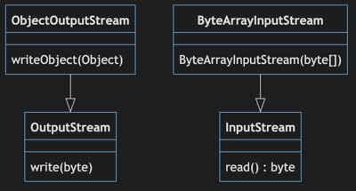

# Java Input and Output (IO)

🖥️ [Slides](https://docs.google.com/presentation/d/1V_tMHZGJMwlB2it1C-KY-AtSMeXGSOUD/edit?usp=sharing&ouid=114081115660452804792&rtpof=true&sd=true)

📖 **Required Reading**: Core Java for the Impatient

- Chapter 9: Processing Input and Output. _Only read:_
  - section 1: Input, Output Streams, Readers, and Writers
  - section 2: Paths, Files and Directories

Input refers to when you read data in from some source of data. Output is the opposite, where you write data out to some destination. Sources and destinations commonly represent devices such as persistent storage, the network, a keyboard, or a printer. It can also represent bytes being pulled from, or written to, an array or some other memory based structure.

The [java.io](https://docs.oracle.com/javase/20/docs/api/java/io/package-summary.html) package contains many classes and interfaces for working with I/O. The following table gives examples of some of the more commonly used `java.io` classes.

| Class                                                                                                | Purpose                                                                                              |
| ---------------------------------------------------------------------------------------------------- | ---------------------------------------------------------------------------------------------------- |
| [InputStream](https://docs.oracle.com/javase/20/docs/api/java/io/InputStream.html)                   | Represents data as an unbounded incoming sequence.                                                   |
| [OutputStream](https://docs.oracle.com/javase/20/docs/api/java/io/OutputStream.html)                 | Represents data as an unbounded outgoing sequence.                                                   |
| [Reader](https://docs.oracle.com/javase/20/docs/api/java/io/Reader.html)                             | Provides functionality for reading an InputStream.                                                   |
| [Writer](https://docs.oracle.com/javase/20/docs/api/java/io/Writer.html)                             | Provides functionality for writing to an output stream.                                              |
| [FileInputStream](https://docs.oracle.com/javase/20/docs/api/java/io/FileInputStream.html)           | Stream that uses a file as its source of data.                                                       |
| [ByteArrayInputStream](https://docs.oracle.com/javase/20/docs/api/java/io/ByteArrayInputStream.html) | Stream that uses a byte array as its source of data.                                                 |
| [BufferedReader](https://docs.oracle.com/javase/20/docs/api/java/io/BufferedReader.html)             | Reader that wraps another reader and caches the reader's data in an attempt to optimize performance. |
| [StringReader](https://docs.oracle.com/javase/20/docs/api/java/io/StringReader.html)                 | Represents a String as an input reader.                                                              |
| [PrintStream](https://docs.oracle.com/en/java/javase/20/docs/api/java.base/java/io/PrintStream.html) | Output stream that provides print functions such as `println` or `printf`                            |
| [File](https://docs.oracle.com/javase/20/docs/api/java/io/File.html)                                 | Provides basic directory and file operations such as create, exists, iterate, or delete.             |
| [Scanner]()                                                                                          | Parses a file into Strings. Note that this class is in `java.util`.                                  |

## InputStream and OutputStream

At the lowest level, Java represents I/O with a data abstraction known as a stream. A stream derives its meaning from a stream of liquid where you are either consuming the fluid from the outlet of the stream, or you are channeling liquid into the stream for later consumption. A stream can flow forever, like a stream of weather data, or it can dry up, like a stream that represents a series of characters in a book.

The two base classes for dealing with Streams in Java are [InputStream](https://docs.oracle.com/javase/20/docs/api/java/io/InputStream.html) and [OutputStream](https://docs.oracle.com/javase/20/docs/api/java/io/OutputStream.html). You read data from an `InputStream` and your write data to an `OutputStream`. Both of these classes are abstract classes and require some subclass in order to use their functionality. For example, you can use a `FileInputStream` to read bytes of data from a file. Likewise you can use a `FileOutputStream` to write data to a file. Other subclasses include `ByteArrayOutputStream`, `ObjectOutputStream`, `SequenceInputStream`, or `StringBufferInputStream`.



## System Out and In

An example of working with I/O is represented by the `java.lang.System` class. This class has public fields named `in` and `out`. The `in` field is a `InputStream` that reads its bytes from the command console. That means if you call `in.read()` it will attempt to read a byte from the standard input stream provided by the console. If no bytes are available then it will block until one is provided by a user typing on the keyboard. You can think of the stream as an infinite buffer, provided by a user typing away, that your program can read as desired. Once a byte is read from the stream it is removed.

Similarly, the `out` field is a `PrintStream` that by default writes to the standard output stream represented in the command line console. When you write to `out.println` it displays the provided text in the console window.

Here is a program that reads characters from the console window and then echos them back out.

```java
public class ConsoleEcho {
    public static void main(String[] args) throws IOException {
        var data = System.in.read();
        while (data > 0) {
            System.out.println((char) data);
            data = System.in.read();
        }
    }
}
```

## Reader and Writer

Working with streams is fine if what you need is bytes, but often you need to work with higher level objects. That is where the [java.io.Reader]() and [java.io.Writer]() classes come into play. These classes will use a stream to read or write bytes, but then they will convert them to a more meaningful representation such as a character array, string, object, or file.

Like the stream base classes `Reader` and `Writer` are both abstract. That means you need to create a subclass specific to the type of reader/writer that you want to use. Some common subclasses include `LineNumberReader`, `FileReader`, `PrintWriter`, or `StringWriter`.

In the following example, we create a `StringReader` with some lines of text in it. We then read through each line with a `LineNumberReader` and insert each line into a `StringWriter` with a prefix of the line number. Once we have read all the lines we dump out the contents of the writer to the system output string and it prints to the console.

```java
public class ReaderWriter {
    public static void main(String[] args) throws IOException {
        var writer = new StringWriter();
        var stringReader = new StringReader("this\nor\nthat");
        var reader = new LineNumberReader(stringReader);
        while (true) {
            var line = reader.readLine();
            if (line == null) break;
            writer.write(String.format("%d. %s%n", reader.getLineNumber(), line));
        }

        System.out.println(writer);
    }
}
```

**Output**

```txt
1. this
2. or
3. that
```

As the above example demonstrates, it is common to combine streams, readers, and writers together in order to complete a task.

## Scanner

In addition to using streams, readers, and writers to work with I/O, there are a lot of utility classes that make working with IO even easier.

For example, the `Scanner` class reads a file and parses it into different words as defined by a regular expression. By default it parses based upon any whitespace. The following demonstrates uses the `Scanner` class to parse a file and write out each word to the console.

```java
import java.io.File;
import java.io.FileNotFoundException;
import java.util.Scanner;

public class ReadFile {
    public static void main(String[] args) throws FileNotFoundException {
        File file = new File(args[0]);
        try (Scanner scanner = new Scanner(file)) {
            while (scanner.hasNext()) {
                System.out.println(scanner.next());
            }
        }
    }
}
```

## Things to Understand

- How input and output streams work
- The difference between streams and readers and writers
- How to chain streams, readers, or writers together to get complex behavior
- How to convert from an input stream to a reader using the InputStreamReader class
- How to convert from a writer to an output stream using the OutputStreamWriter class
- How to use the scanner class
- Uses of the file class

## Videos

- 🎥 [Overview](https://byu.hosted.panopto.com/Panopto/Pages/Viewer.aspx?id=9c064639-8e05-4d4c-b458-ad64014cbb24&start=0)
- 🎥 [Streams](https://byu.hosted.panopto.com/Panopto/Pages/Viewer.aspx?id=8db201b9-9a04-4cbf-8a99-ad64014ddd56&start=0)
- 🎥 [Readers and Writers](https://byu.hosted.panopto.com/Panopto/Pages/Viewer.aspx?id=66d67329-cc52-4533-a2b4-ad64015237cf&start=0)
- 🎥 [The Scanner Class](https://byu.hosted.panopto.com/Panopto/Pages/Viewer.aspx?id=7dcd4a30-0b07-4e6a-9341-ad640153f4b8&start=0)
- 🎥 [Other Ways to Read and Write Files](https://byu.hosted.panopto.com/Panopto/Pages/Viewer.aspx?id=ef902529-f41c-402d-be3d-ad640156133a&start=0)

## Demonstration code

📁 [Compress](example-code/Compress.java)

📁 [CopyFileExample](example-code/CopyFileExample.java)

📁 [Decompress](example-code/Decompress.java)

📁 [LegacyCompress](example-code/LegacyCompress.java)

📁 [LegacyDecompress](example-code/LegacyDecompress.java)

📁 [ScannerExample1](example-code/ScannerExample1.java)

📁 [ScannerExample2](example-code/ScannerExample2.java)

📁 [ScannerExample3](example-code/ScannerExample3.java)
