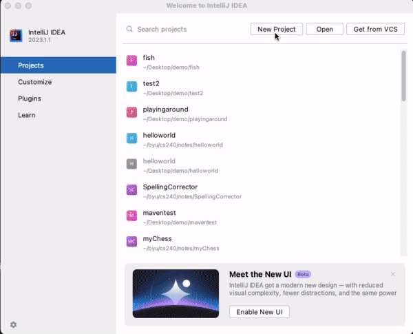

# Java Fundamentals

🖥️ [Slides](https://docs.google.com/presentation/d/1qC9DMSf7PYm-vBhK_qRS0Zu8lNVwQ4H7/edit?usp=sharing&ouid=114081115660452804792&rtpof=true&sd=true)

📖 **Required Reading**: Core Java for the Impatient

- Chapter 1: Fundamental Programming Structures
- Chapter 9:
  - Section 9.1 Input/Output Streams, Readers, and Writers
  - Section 9.2 Paths, Files, and Directories

🖥️ [Lecture Videos](#videos)

## Why Java

1. **Portable** - You can execute your Java program on a large variety of computing platforms without having to recompile or write platform specific code.
1. **Object Oriented** - The Java language encourages the representation of real world and conceptual objects. This makes it easier to translate user requirements and developer expectations into the code's design.
1. **Garbage Collection** - Java handles the allocation and deletion of memory.
1. **Mature** - Java has been around for several decades, and has been used extensively for a wide variety of production applications. This includes desktop applications, websites, mobile applications, and embedded devices.
1. **Rich Libraries** - There is a massive, publicly available, collection of Java Libraries that implements many common and obscure tasks.
1. **Large Community** - Java is one of the world's most popular programming languages. You can easily find books, documentation, videos, articles, and user groups that will answer almost any question you might have.

## History

While working at Sun Microsystems James Gosling formalized his idea of building a programming language that would compile to an intermediate format that could run on multiple operating systems. This became the foundation of the Java Programming language.


> _Source: Wikipedia_

> “So in a strong sense with Java it was a learning process for us - there was some tech learning - but the most important learnings were social or behavioral things.”
>
> — James Gosling

Java quickly gained adoption because of its simplified, yet powerful, object oriented model, standard library, and promise of portability. As of 2023, Java is used by [30% of programming professionals](https://survey.stackoverflow.co/2023/#section-most-popular-technologies-programming-scripting-and-markup-languages) and is the core language for many of the largest software systems in the world.

### Timeline

- **1991** - Work begins on Java.
- **1996** - Version 1 released.
- **2006** - Sun starts [OpenJDK](http://openjdk.java.net/projects/jdk/) under a GPL license. OpenJDK became the reference implementation.
- **2010** - Oracle acquires Sun and Java
- **2019** - (JDK8) OracleJDK requires license for production deployment. OpenJDK adoption increases.
- **2021** - Oracle relents and makes it open again with an option for paid support, and requirements for enterprise use.
- **2023** - (JDK20) Adoptium becomes the primary source for OpenJDK. Oracle shifts its requirements for paid support.

## Hello World

In Java, all code is defined in a class that contains properties and methods. Each class is stored in a file with a filename that is the same as the class, and has a `.java` extension. If your class has a method name `main`, then it can act as the starting point for your program. A simple Java program looks like the following.

**HelloWorld.java**

```java
public class HelloWorld {
    public static void main(String[] args) {
      System.out.println("Hello World!");
    }
}
```

You can convert the above Java code into the intermediary binary format called `Java Bytecode` using the Java compiler (`javac`). Once compiled, you can then execute the bytecode using the Java virtual machine (`java`).

```sh
➜ javac HelloWorld.java
➜ java HelloWorld

Hello World!
```

## Java Architecture

One of the things that made Java so different from other languages, is that it compiles to an intermediate format called `bytecode`. The `bytecode` can then be copied to, and executed on, any device that has the Java Runtime Environment (JRE) installed. This makes it so you don't have to build a machine specific binary for every device that you want to target, or alternatively, interpret the source code at runtime.

| Architecture | Example Languages  | Comment                                                                                            |
| ------------ | ------------------ | -------------------------------------------------------------------------------------------------- |
| Binary       | C, Rust, Go        | A device and OS specific binary is built at development time, and distributed to the target device |
| Bytecode     | Java, WebAssembly  | An intermediate layer binary is built at development time an interpreted on the target device      |
| Interpreted  | JavaScript, Python | The source code is distributed to the target device where an interpreter executes the source       |

Using a bytecode representation provides the advantage of being faster than a purely interpreted language, without requiring a specific binary to be created for each target device.

The downside is that you need to install the JRE on all target devices, and the bytecode still requires some translation and runtime optimization. This makes it slower than a natively compiled binary.

## Installing IntelliJ and Java

To get started developing with Java, you need to install the Java Developer Kit (JDK) and the IntelliJ integrated development environment (IDE). The easiest way to do this is to follow the instructions for installing the IntelliJ IDE and then using IntelliJ to install the version of the JDK that you want to use.

[IntelliJ Installation Instructions](https://www.jetbrains.com/help/idea/installation-guide.html) - Make sure you choose the free Community Edition. Do this by selecting the `Standalone installation`, picking your operating system, clicking on the download link, and then scrolling down to the `Community Edition` option. You can install the `Ultimate Edition`, but you will have to provide your BYU credentials in order to enable free usage.

After you have installed IntelliJ take some time to get familiar with the environment. Create a new project and, if you don't already have a JDK downloaded, download the latest version as part of creating the project. Additionally, if you select the `Add sample code` option it will create a simple `hello world` application for you.



## Your First Java Program

If you used the IntelliJ project wizard to create a project, and selected the `Add sample code` option, then you have already built your first program. If not then go back and do that now. You should then edit the `main.java` file to make it do something different. You can change it to output your name, or to do some simple math. Even though you don't know any Java at this point, you can still play around with it in order to get a feel for how it works. The more you play around, the more comfortable you will be.

Try something like the following as a replacement for your `main.java` code.

```java
public class Main {
    public static void main(String[] args) {
        for (var i=0;i<10;i++) {
            System.out.println(i + ". Advanced Software Construction");
        }
    }
}
```

You can execute your code by pressing the little green arrow button to the immediate left of your source code.

## JDK Documentation

In addition to the fundamentals of the Java programming language, the Java JDK is broken up into multiple modules libraries that implement common functionality. You can find the documentation for these libraries on [Oracle's website](https://docs.oracle.com/en/java/javase/20/docs/api/index.html). You should spend some time examining the libraries that you think would be useful to you. Some of the most commonly used ones are `java.io`, `java.lang`, `java.util`, and `java.net`. However, a good place to start is by reading the introductory chapters in the `Core Java for the Impatient` textbook and then using the inline help and suggestions that IntelliJ provides.

## Types

Java provides the following primitive data types.

| Type    | Size (bits) | Uses                           |
| ------- | ----------- | ------------------------------ |
| byte    | 8           | Data streaming, binary parsing |
| short   | 16          | Small numbers                  |
| int     | 32          | Numbers                        |
| long    | 64          | Big numbers                    |
| float   | 32          | Floating point numbers         |
| double  | 64          | Big floating point numbers     |
| char    | 16          | Textual characters             |
| boolean | 1           | True or false                  |

Java is a strongly typed language, and so you must always specify the type of a variable. Oftentimes the compiler can infer the type of the variable from its context. In that case you can use the simplified `var` keyword to designate that you are declaring a variable with an implicit type. In the following example, the compiler can infer that you are creating an `int` variable for `number2` based on the assignment of the integer value.

```java
int number1 = 1;
var number2 = 2;
```

## Classes and Objects

In addition to the primitive types, Java makes extensive use of defining classes that are instantiated as objects when they are allocated in memory and assigned values. In Java, any code that you write must be defined in a class.

Classes define both fields and methods for the class. A field represents a variable, or property, of the object such as a name, weight, or height. A method represents an operation on the object such as run, talk, or sleep.

A class may have one or more constructors that initialize the fields of the object. The constructor looks like a method, but doesn't have a return type and must have the same name as the class.

The following is an example of a simple `Person` class.

```java
public class Person {
    private String name;

    public Person(String name) {
        this.name = name;
    }

    public void sleep() {
        System.out.printf("%s is sleeping", name);
    }
}
```

You create an object instance of a class with the `new` operator. This allocates the memory on the heap for the object. That memory is cleaned up once the last reference to the object goes out of scope.

```java
var inventor = new Person("James Gosling");
inventor.sleep();
```

## Strings

Strings are a primary class in Java. The data contained in a `String` object is immutable. This means that it cannot be changed once it is created. You can create a string object using the literal syntax.

```java
var inventor = "James Gosling";
```

Or, you can explicitly create a String using the `new` operator.

```java
var inventor = new String("James Gosling");
```

You should note that when you use the string literal syntax, the JRE puts the string in a special table that reduces the memory necessary to represent strings. Internally, Java will check the internal table to see if memory has already been allocated for that string. If it has then it will return a pointer to the string instead of creating a new string. When you use the `new` operator the memory for the string is always allocated on the heap.

The Java `String` class has a bunch of methods that help manipulate strings. Here is a sampling of some of the more commonly used ones.

| Method      | Purpose                                                     |
| ----------- | ----------------------------------------------------------- |
| length      | Get the length of the string                                |
| charAt      | Get the character at the given index                        |
| startsWith  | Does the string start with the given substring              |
| indexOf     | Get the index of the given substring                        |
| substring   | Return the substring at the given index                     |
| format      | Create a string from a format template and parameters       |
| toLowerCase | Drop all the character case                                 |
| split       | Split the string into an array based on the given substring |
| replace     | Replace the substring in the string                         |

## StringBuilder

Unlike the `String` class, the `StringBuilder` class allows you to modify the string it represents. The idea with `StringBuilder` is that you will build up a string over time, as part of the logic of your program. You can then convert the value of the `StringBuilder` to a `String` representation using the `toString` method.

```java
var nameBuilder = new StringBuilder();
nameBuilder.append("James");
nameBuilder.append(" ");
nameBuilder.append("Gosling");

var name = nameBuilder.toString();
System.out.println(name);
```

## Arrays

In Java, arrays can be used to represent a list of any primitive or object type. To allocate an array, you follow the data type with a pair of square brackets and define how big you want the array to be.

```java
String[] strings = new String[10];
int[] numbers = new int[5];
```

You can also initialize the values of the array using the initializer list syntax.

```java
String[] strings = {"James", "Tim", "Ada"};
int[] numbers = {1,2,3};
```

Array values can be retrieved, or assigned, using the zero based index value of the array.

```java
String[] names = {"James", "Tim", "Ada"};
names[0] = "Jaime";
System.out.println(names[0]);
```

You can iterate over the array's values by using either a standard `for` loop, or the `for-each` loop syntax.

```java
for (var i = 0; i < names.length; i++) {
    System.out.println(names[i]);
}

for (var name : names) {
    System.out.println(name);
}
```

## Static

The `static` keyword marks a method and variable as being independent of any object instantiation in a class. That means you can use the static method without actually creating a class. This is good for utility methods, or singletons, that are allocated on the class instead of an object.

```java
public class StaticExample {
    public static int globalValue = 3;

    public static boolean isGlobalOdd() {
        return (globalValue % 1) == 0;
    }

    public static void main(String[] args) {
        globalValue = 2;
        System.out.println(isGlobalOdd());
    }
}
```

Note that in this example, the `main` method is also static. That is because it needs to be called as an entry point to the program. That happens before any objects are allocated.

## Running Programs from the Command Line

When you run your programs from within IntelliJ, it is actually invoking the Java compiler (`javac`) to convert your source code to bytecode, and then running it with the Java bytecode interpreter (`java`). Once you have installed the JDK, you can run these utilities yourself so that you can experience what IntelliJ is doing behind the scenes.

To do this, open your command line console program and create a file named `Hello.java` with the following content. The special method signature `public static void main(String[] args)` designates the class as an entry point for your Java program.

```java
public class Hello {
    public static void main(String[] args) {
      System.out.println("Hello World!");
    }
}
```

You can then compile the source code to bytecode using the following command.

```sh
➜  javac Hello.java
```

This will create a file named `Hello.class` that contains the bytecode. To run the program, invoke the `java` program.

```sh
➜  java Hello

Hello World!
```

## Program Arguments

The `args` parameter, defined by your main method, provides the ability to receive any program parameters that were passed to the `java` program when it was invoked. If you modify your program to access the `args` parameter, you can use the args to configure how your program works.

```java
public class Hello {
    public static void main(String[] args) {
        var name = args[0];
        System.out.printf("Hello %s!%n", name);
    }
}
```

```sh
➜  javac Hello.java
➜  java Hello James

Hello James!
```

## Package and Import

When you write code, you normally provide a name for the package that contains the code. Packages are declared with the `package` keyword. The package name should match the directory structure of your code. All code in the same package has special access, called `package scope` to other code in the package. Any code that you want available outside the package must be marked with `public scope`. Packages allow you to encapsulate, or hide, data and functionality when it is not needed externally, and expose it publicly when it is appropriate.

To use a package in your source code you must import it using the `import` keyword. The following code demonstrates the use of the `package` keyword to create a package named `Demo`. The `import` keyword provides access to the `List` class that is part of the standard `java.util` package.

```java
package Demo;

import java.util.List;

public class Hello {
    public static void main(String[] args) {
        var list = List.of(args);
        System.out.printf("Args: %s!%n", list);
    }
}
```

## Classpath

If you are importing packages from a third party library, or referencing code that you have written that is outside the path of the currently executing class, you must tell the `java` program where to find the compiled bytecode class files. You do this by providing the `classpath`, or `cp`, parameter to the `java` program, that represents the location of the external code.

For example, if you had a `Hello` class file in a `Demo` package, it could import classes from a completely different directory structure by using the `cp` parameter. To specify multiple classpath directories, you need to separate your paths with a `:` on Linux based operating systems, and a `,` on Windows based systems.

```sh
➜  java -cp .:~/prod Demo.Hello

Rise and shout
```

In addition to specifying the classpath on the command line you can use an environment variable named `CLASSPATH` to reference the location of all your Java bytecode files.

## File and Scanner

A convenient way to read data from a file on your hard drive is to open it using the `File` class and then read it line by line using the `Scanner` class.

The following example demonstrates opening and parsing a file, if it exists, by creating a `Scanner` object. `Scanner` implements the `Iterator` interface, and so you can call `hasNext` to see if it has something to iterate, and `next` to return the next value and advance the iterator.

```java
public class ScannerExample {
    public static void main(String[] args) throws FileNotFoundException {
        if (args.length == 1) {
            var file = new File(args[0]);
            if (file.exists()) {
                var scanner = new Scanner(file);
                while (scanner.hasNext()) {
                    var text = scanner.next();
                    System.out.println(text);
                }
            }
        }
    }
}
```

## Things to Understand

1. Ways that Java is different from C++
1. How to get and install Java and an IDE
1. Why Java is both portable and fast
1. How to compile and run Java code
1. The primitive data types available in Java
1. What's the difference between creating a string with `new` and creating one by just specifying it in double quotes?
1. How to declare, create and initialize arrays
1. How to find the length of an array
1. How to create and access arrays of arrays
1. How to specify command-line parameters in IntelliJ
1. The relationship between Packages, Imports and the CLASSPATH environment variable
1. How to use a Scanner to read a text file of words, separated by whitespace

## <a name="videos"></a>Videos (1:38:13)

- 🎥 [Java History and Overview (10:13)](https://byu.hosted.panopto.com/Panopto/Pages/Viewer.aspx?id=cb99566e-3a9d-40c9-86c0-ad56013f4a64)
- 🎥 [Installing Java (2:32)](https://byu.hosted.panopto.com/Panopto/Pages/Viewer.aspx?id=0c39ffac-a1b2-4fa3-bb1e-ad560142a73b)
- 🎥 [Java Architecture (9:48)](https://byu.hosted.panopto.com/Panopto/Pages/Viewer.aspx?id=e9ff3ffe-ce6e-4bba-b363-ad560143be64)
- 🎥 [Writing, Compiling, and Running Java Code (9:01)](https://byu.hosted.panopto.com/Panopto/Pages/Viewer.aspx?id=6e020a04-00fd-40cf-95dc-ad560146bbd8&start=0)
- 🎥 [Javadoc (6:57)](https://byu.hosted.panopto.com/Panopto/Pages/Viewer.aspx?id=2a12a261-6e95-4e97-a838-ad56014c1ceb&start=0)
- 🎥 [Primitive Data Types (10:10)](https://byu.hosted.panopto.com/Panopto/Pages/Viewer.aspx?id=5d673b50-c9a2-465e-8d5c-ad56014eaeed&start=0)
- 🎥 [Working with Strings (10:25)](https://byu.hosted.panopto.com/Panopto/Pages/Viewer.aspx?id=f77e9a7f-36b2-40c8-8fa3-ad5601520775&start=0)
- 🎥 [Combining Strings with StringBuilder (2:48)](https://byu.hosted.panopto.com/Panopto/Pages/Viewer.aspx?id=b7d693f9-a705-42f4-98f4-adf8015c3166&start=0)
- 🎥 [Arrays (15:16)](https://byu.hosted.panopto.com/Panopto/Pages/Viewer.aspx?id=4d122f41-6fd6-4e78-bb3e-ad8e013d82c0&start=0)
- 🎥 [Arrays of Arrays (5:51)](https://byu.hosted.panopto.com/Panopto/Pages/Viewer.aspx?id=71826d41-0b65-4b98-903f-ad8e014772e0&start=0)
- 🎥 [Command Line Arguments (3:24)](https://byu.hosted.panopto.com/Panopto/Pages/Viewer.aspx?id=ddfefe0e-442d-4c56-8f60-ad5d013b4005&start=0)
- 🎥 [Packages, Imports, and the CLASSPATH Environment Variable (11:48)](https://byu.hosted.panopto.com/Panopto/Pages/Viewer.aspx?id=c52bc183-f041-42c6-8e36-ad5d013d318f&start=0)

## Demonstration code

📁 [Simple Classes](example-code/01-simple-classes/)

📁 [Primitive Data Types](example-code/02-primitive-data-types/)

📁 [Strings](example-code/03-strings/)

📁 [Arrays](example-code/04-arrays/)

📁 [Command Line Arguments](example-code/05-command-line-arguments/)

📁 [Packages Imports](example-code/06-packages-imports/)

📁 [Input Output](example-code/07-input-output/)
