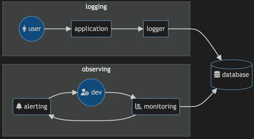
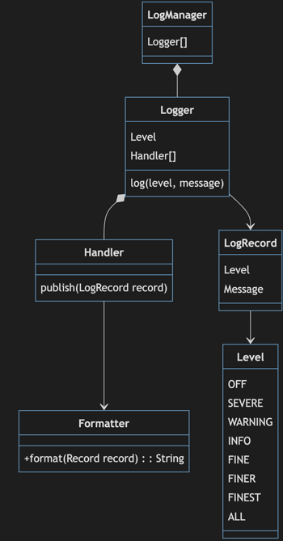

# Logging

🖥️ [Slides](https://docs.google.com/presentation/d/1KuCyhYfKQEuvJZRddhfjwxZvSfOZjWxa/edit?usp=sharing&ouid=114081115660452804792&rtpof=true&sd=true)

📖 **Required Reading**: Core Java for the Impatient

- Chapter 5: Exceptions, Assertions, and Logging. _Only Section 5.3 Logging - Section 5.3.7 Filters and Formatters_

🖥️ [Lecture Videos](#videos)

Logging is a critical piece of advanced software construction. Without logging your application is a black box where only your users know if it is working or not. By recording, or logging, what is happening within your application you create a persistent record of what users are doing and how the application is responding to their requests. Logging works by recording entries in a log that describes what is happening at key points in your application. Typically this includes the request and response of HTTP endpoints, authentication and authorization requests, and exceptional errors. You can then query your logs to view events, graphs, and reports that give you insight into what the system is doing. You can also set up your logging system to automatically alert you when things seem exceptional.



Logging provides the following benefits:

1. **Debugging** - You can't put breakpoints into a production system in order to debug all of a user's requests. You can however, log out an entry that describes what a user requested and what the response was. You can the look at all of the requests of a specific user and get a good picture of where failures are happening.
1. **Security** - By logging records that represent authentication, authorization, purchase, and payment attempts you can get a clear pictures of when someone is trying to abuse critical pieces of your application.
1. **Auditing** - By aggregating log records you can determine what parts of your application are being used, who is using them, and how often. This allows you to adust resource allocations, determine new features, and reassess existing features of your application.
1. **Performance Monitoring** - By aggregating timing measurements associated with requests, you can create graphs that visualize the performance characteristics of you application. You can see where the hot spots are and where optimization of the system needs to take place. You can also determine when your system is failing to satisfy user requests and automatically alert you to take corrective action.

Typically application logs are persistently recorded in a system that is independent of your production system. Otherwise when your production system fails you will also lose your logging data. This makes it more difficult to diagnose what went wrong with the application.

## java.util.logging

The Java Development Kit (JDK) provides support for logging with the `java.util.logging` package. To create, or get an existing, `Logger` you call the static method `Logger.getLogger` and supply a logger name. It will automatically associate your name with the calling class and so the name doesn't have to be unique from other `getLogger` requests.

```java
Logger logger = Logger.getLogger(LoggingExample.class.getName());
```

With a `Logger` you can then register a `Handler` that knows where to publish, or store, log records that represent some sort of event message. The JDK provides several useful implementations of the Handler abstract class. This includes the `ConsoleHandler` that publishes to the console window, the `FileHandler` that publishes to a given file, and a `SocketHandler` that publishes log records over a network connection.

```java
FileHandler fileHandler = new FileHandler("example.log", true);
logger.addHandler(fileHandler);
```

### Log Levels

Each log record specifies a `Level` that defines how important the record is. This can be anything from `SEVERE`, `WARNING`, or `INFO` down to the `FINEST` detail. You can then use the log levels to filter out details when you are looking for problems in your logs, or when you are generating alerts. For example, you might want to automatically send an alert for anything that is `SEVERE`.

The level that you assign to your log records is dependent on what each log level means in the context of your application. With the chess program you might never publish a `SEVERE` log record. That is because the application could always fall back to some reasonable level of functionality. However, with an application that is protecting human safety, you might want to publish `SEVERE` log records for anything that might conceivably endanger life.

You can also control how much logging your application is publishing by specifying a level on your logger. For example, when you are debugging you want to log the `FINEST` detail, but when you are running in production you only want to log `SEVERE`, `WARNING`, or `INFO`. When you restrict the handler to a certain level it will ignore any log requests that are below that level. This allows you to control how much logging is happening based upon an application configuration parameter. To set the level on a logger you use the `setLevel` method.

```java
logger.setLevel(Level.INFO);
```

### Logging Records

A logger has several methods for actually logging a record. This includes the simple `log(Level, String msg)` method that takes a message and a level, or methods that represent the different log levels. For example, `severe(String msg)` or `info(String msg)`. The following example show two equivalent ways of logging an informational HTTP endpoint request.

```java
var msg = String.format("[%s] %s", method, path);
logger.log(Level.INFO, msg);
logger.info(msg);
```

Remember that the logger might be restricted on what it will output based upon the log level that is set for the logger. That means that your code can log all it wants, but if the logger is set to log at a certain level, you log record will be discarded.

### Logging Classes



## Full Example

The following demonstrates the major logging functionality by creating a logger, registering a handler and formatter, and then logging out messages.

```java
import java.io.IOException;
import java.util.logging.*;

public class LoggingExample {

    static Logger logger = Logger.getLogger("myLogger");

    public static void main(String[] args) throws IOException {

        FileHandler fileHandler = new FileHandler("example.log", true);
        logger.addHandler(fileHandler);

        logger.setLevel(Level.INFO);

        logger.finest("Ignored because it is lower than the logger level");
        logger.log(Level.INFO, "This will be logged");
    }
}
```

Typically loggers are created as global singletons in your application. That way you don't have to pass the logger all around your application. Instead you just reference the global logger whenever you want to log something.

## Writing Your Own Handler

You can write your own handlers by extending the `Handler` class. Here is an example of a logger that simply outputs a string to the console.

```java
class MyHandler extends Handler {

    public void publish(LogRecord record) {
        System.out.printf("MyHandler - [%s] %s%n", record.getLevel(), record.getMessage());
    }

    public void flush() {}

    public void close() throws SecurityException {}
}
```

### Database Handler

In order for logging to be useful it needs to store the log records in a location that is accessible and queryable. One possible solution is to use a relational database. The following code demonstrates a simple handler that writes out to a database.

```java
record DatabaseConfig(String url, String dbName, String user, String password) {}

class DatabaseHandler extends Handler {
    private final DatabaseConfig config;

    DatabaseHandler(DatabaseConfig config) throws SQLException {
        this.config = config;
        configureDatabase();
    }

    public void publish(LogRecord record) {
        try {
            try (var conn = getConnection()) {
                var stm = String.format("INSERT INTO `%s`.log (level, message, date) VALUES(?, ?, now())", config.dbName);
                try (var preparedStatement = conn.prepareStatement(stm)) {
                    preparedStatement.setString(1, record.getLevel().toString());
                    preparedStatement.setString(2, record.getMessage());

                    preparedStatement.executeUpdate();
                }
            }
        } catch (Exception ex) {
            System.out.printf("Failed to log: %s%n", ex.getMessage());
        }
    }

    public void flush() {}

    public void close() throws SecurityException {}

    Connection getConnection() throws SQLException {
        return DriverManager.getConnection(config.url, config.user, config.password);
    }

    void configureDatabase() throws SQLException {
        try (var conn = getConnection()) {
            var stm = String.format("CREATE DATABASE IF NOT EXISTS `%s`", config.dbName);
            var createDbStatement = conn.prepareStatement(stm);
            createDbStatement.executeUpdate();

            var createPetTable = String.format("""
                    CREATE TABLE  IF NOT EXISTS `%s`.log (
                        id INT NOT NULL AUTO_INCREMENT,
                        message VARCHAR(4096) NOT NULL,
                        level VARCHAR(16) NOT NULL,
                        date DATETIME NOT NULL,
                        PRIMARY KEY(id),
                        INDEX(date)
                    )""", config.dbName);
            try (var createTableStatement = conn.prepareStatement(createPetTable)) {
                createTableStatement.executeUpdate();
            }
        }
    }
}
```

With a database logging handler you could then write an HTTP server that records all of your HTTP requests to a database by just adding a few lines of code.

```java
public class ServerLoggingExample {
    public static void main(String[] args) throws Exception {
        new ServerLoggingExample().run();
    }

    static Logger logger = Logger.getLogger("myLogger");

    private void run() throws Exception {
        Spark.port(8080);

        var config = new DatabaseConfig("jdbc:mysql://localhost:3306", "pet_store", "root", "monkeypie");
        logger.addHandler(new DatabaseHandler(config));

        Spark.get("/*", (req, res) -> "<p>OK</p>");
        Spark.after(this::log);
    }

    private void log(Request req, Response res) {
        logger.info(String.format("[%s]%s - %d", req.requestMethod(), req.pathInfo(), res.status()));
    }
}
```

You can then query your database for requests that match a given time range or level.

```sql
> SELECT * FROM log WHERE date > '2023-10-20' AND level='INFO';

+----+-------------------------------+-------+---------------------+
| id | message                       | level | date                |
+----+-------------------------------+-------+---------------------+
|  1 | [GET]/data - 200              | INFO  | 2023-10-25 11:21:46 |
|  3 | [GET]/cow/joe/name/fish - 200 | INFO  | 2023-10-25 11:21:58 |
|  4 | [GET]/home/provo - 200        | INFO  | 2023-10-25 11:23:40 |
|  5 | [GET]/home/provo - 200        | INFO  | 2023-10-25 11:27:52 |
|  6 | [POST]/home/provo - 200       | INFO  | 2023-10-25 11:42:33 |
|  7 | [DELETE]/home/provo - 200     | INFO  | 2023-10-25 11:42:48 |
+----+-------------------------------+-------+---------------------+
```

## Log4J

Java's direct support for logging, with the `java.util.logging` package, was not introduced until 2002. Before that developers had to implement their own logging. The most common solution was to use the 3rd party package `Log4J`. In fact `java.util.logging` was modeled based upon the functionality of `Log4J`. For that reason it is very common to still see production Java code using `Log4J`.

## Things to Understand

- What is logging and why do we need it?
- How do you log messages at different levels?
- Why do we need different levels?
- How do you configure logging from a configuration file?
- Why do we have Log4J is Java has a built-in logging API?

## <a name="videos"></a>Videos

- 🎥 [Logging](https://byu.hosted.panopto.com/Panopto/Pages/Viewer.aspx?id=014ade75-f4ad-4119-95c1-ad6d0147c217&start=0)
- 🎥 [Logging: Configuration](https://byu.hosted.panopto.com/Panopto/Pages/Viewer.aspx?id=5c08583a-579d-452e-88d6-ad6d0149e2cc&start=0)
- 🎥 [Logging: Messages](https://byu.hosted.panopto.com/Panopto/Pages/Viewer.aspx?id=e1afdb4c-bb5f-42cc-ad6c-ad6d014dd97d&start=0)

## Demonstration code

📁 [FileConfigurationExample](example-code/FileConfigurationExample.java)

📁 [logging](example-code/logging.properties)

📁 [ProgrammaticConfigurationExample](example-code/ProgrammaticConfigurationExample.java)
