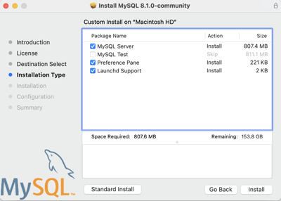
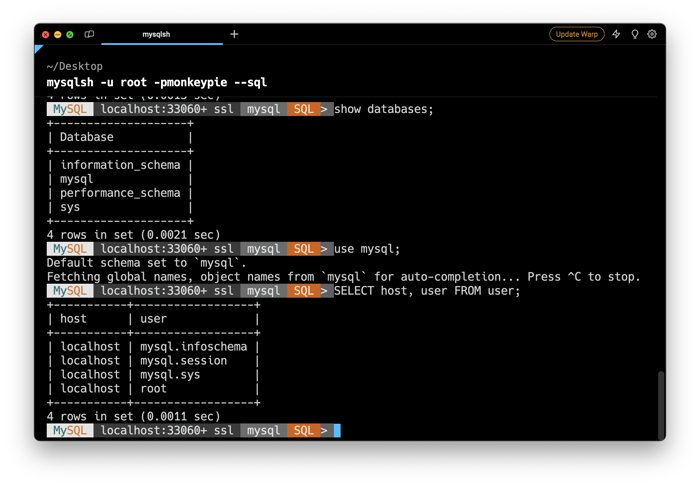
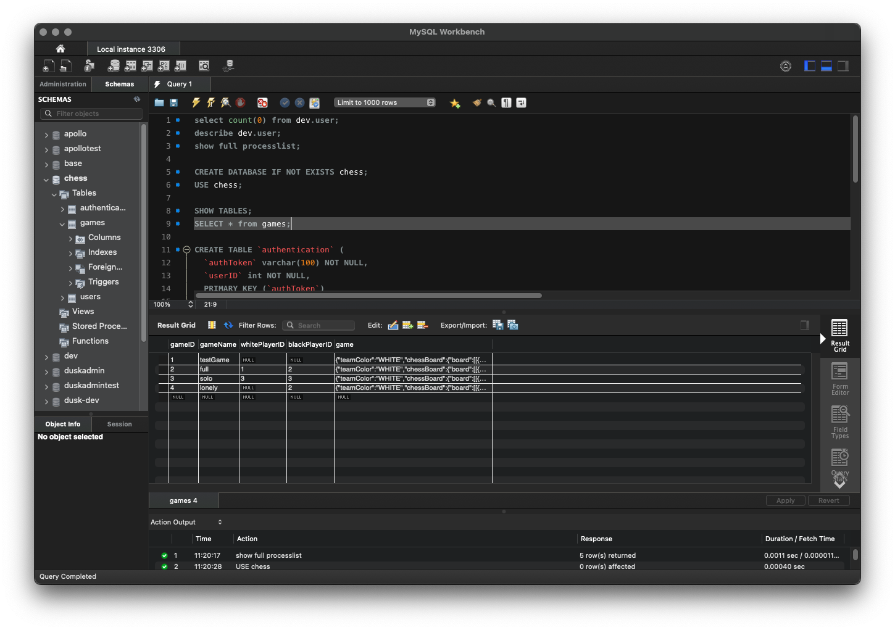

# MySQL

🖥️ [Slides](https://docs.google.com/presentation/d/1w5bcntrExgMnB92uLJL52uuutLLQABSt/edit?usp=sharing&ouid=114081115660452804792&rtpof=true&sd=true)

`MySQL` is an open source relational database that commonly powers many popular applications and websites. Learning how MySQL works will help you understand the relational data model, give you experience with an industry standard tool, and teach you |how to use it to power your applications.

## SQL Server Installation

In order to get started you will need to install MySQL to your development environment. You can install the latest free MySQL Community Server version from [MySQL.com](https://dev.mysql.com/downloads/mysql/).



## SQL Clients

Once you have installed MySQL it is time to start executing SQL statements. To do this you need a SQL client application that can talk to the SQL server that is now running in your development environment.

There are several free and paid for options that you can choose from when looking for a client application to execute MySQL statements. One popular tool is the MySQL console client program called the MySQl Shell (`mysqlsh`). You can download shell from [MySQL.com](https://dev.mysql.com/downloads/shell/).

Once you have downloaded the shell, you can start it by opening a command console window and type the following (substituting the username and password that you provided when you installed MySQL).

```sh
mysqlsh -u yourusername -pyourpassword --sql
```

For example, if you created your root user with the password `edgarcobb` you would execute:

```sh
mysqlsh -u root -pedgarcobb --sql
```

Once the shell starts up you can get help by typing `/help` or exit the shell using `/exit`. You can now start typing SQL queries. For example, try the following:

```sql
SHOW databases;
USE mysql;
SHOW tables;
SELECT host, user FROM user;
/exit
```



Alternatively, if you are looking for a visual MySQL client you might try [MySQL workbench](https://www.mysql.com/products/workbench/).



## Common Commands

Here are a list of common SQL commands that you can use to administrate a database.

| Command                | Purpose                                                     | Example                                       |
| ---------------------- | ----------------------------------------------------------- | --------------------------------------------- |
| show databases         | Lists all of the databases                                  | show databases                                |
| use `name`             | Open database                                               | use student                                   |
| show tables            | Lists all of the tables for the currently selected database | show tables                                   |
| describe `name`        | List fields for a table                                     | describe student                              |
| show index from `name` | List indexes for a table                                    | show index from student                       |
| show full processlist  | List currently executing queries                            | show full processlist                         |
| create database `name` | Create a new database                                       | create database student                       |
| drop database `name`   | Delete a database                                           | drop database student                         |
| create table `name`    | Create a new table                                          | create table pet (name varchar(128), age int) |
| Insert into `name`     | Insert data into a table                                    | insert into pet values ("zoe", 3)             |
| select \_ from `name`  | Query a table                                               | select \_ from pet                            |
| drop table `name`      | Delete a table                                              | drop table pet                                |

## Experimenting

Spend some time working with your SQL client program to make requests. You can use some of the commands described above, or if you are worried about messing up your server, you can try some simple queries that don't actually manipulate table data. This includes queries that just do simple math or get the current time.

```sql
> select 1+1;
+-----+
| 1+1 |
+-----+
|   2 |
+-----+
1 row in set (0.0008 sec)

> select now();
+---------------------+
| now()               |
+---------------------+
| 2023-10-07 12:34:56 |
+---------------------+
1 row in set (0.0008 sec)

> select now(), now() + 1;
+---------------------+----------------+
| now()               | now() + 1      |
+---------------------+----------------+
| 2023-10-07 12:34:56 | 20231007123457 |
+---------------------+----------------+
1 row in set (0.0008 sec)
```

In future topics you will learn how to create tables, as well as insert and query the data. After that, you will learn how to connect to your database and execute queries from your Java code.

At this point you should just make sure your MySQL server is up and running, and that you can access using a client program.
