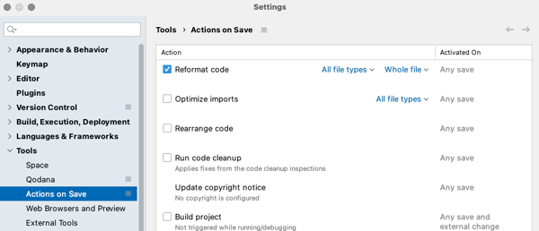
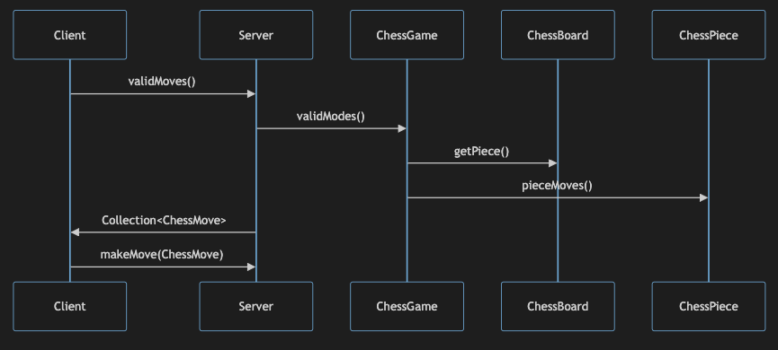

# Writing Quality Code

🖥️ [Slides](https://docs.google.com/presentation/d/13wQKz2ZLsqJVFDuoy0IJ_wLspmSpipS0/edit?usp=sharing&ouid=114081115660452804792&rtpof=true&sd=true)

📖 **Optional Reading**: [Clean Code](https://www.oreilly.com/library/view/clean-code-a/9780136083238/)

Despite stereotypes to the contrary, software engineering is an art form. It requires significant creativity to envision, architect, and create quality user experiences. That same care and artistic expression should be reflected in how your organize and write your code. One quality of a distinguished engineer is that they write code that is easy to discover, read, comprehend, manipulate, and extend. Take for example the following two small programs.

**Example 1**

```java
public class ComputeIt {
    public static void main(String[] args) {
        System.out.println(doIt(Integer.parseInt(args[0]), 0));
    }

    static int doIt(int ipt, int ftr)
    {
        // initialize the base cases
        var a = 0;
        var othr = 0;
        // for each x make sure it is less than ipt otherwise break
        for (var x = 0; x < ipt; x++)
        {
            if (x == 1) othr = 1;
            else { var t = a + othr;
                a = othr; ftr = ftr++; othr = t;
            }
        }
        return a + othr;
    }
}
```

**Example 2**

```java
public class Fibonacci {
    public static void main(String[] args) {
        if (args.length == 1) {
            try {
                var sequencePosition = Integer.parseInt(args[0]);
                var fibonacciNumber = computeFibonacci(sequencePosition);

                System.out.println(fibonacciNumber);
                return;
            } catch (NumberFormatException ignored) {
            }
        }

        System.out.println("Invalid input.\nSyntax: java Fibonacci <Sequence Position>");

    }

    /**
     * Computes the Fibonacci number for a given position in the Fibonacci
     * sequence. A <a href="https://en.wikipedia.org/wiki/Fibonacci_sequence">Fibonacci</a>
     * number is a sum of the two previous Fibonacci numbers based upon a starting value
     * of 0 and 1 for the first two positions in the sequence.
     *
     * @param sequencePosition for the Fibonacci number to calculate.
     * @return the Fibonacci number for the given sequence position.
     */
    private static int computeFibonacci(int sequencePosition) {
        var n2Value = 0;
        var n1Value = 0;
        for (var currentPosition = 1; currentPosition <= sequencePosition; currentPosition++) {
            if (currentPosition == 1) {
                n1Value = 1;
            } else {
                var currentValue = n2Value + n1Value;
                n2Value = n1Value;
                n1Value = currentValue;
            }
        }
        return n2Value + n1Value;
    }
}
```

Both of these examples correctly compute the Fibonacci number for a given Fibonacci sequence position. However, the first example, while shorter, seems to go to great lengths to obfuscate its purpose and mix different coding styles. The second example seeks to intentionally define its purpose and match the Fibonacci algorithm with clarity.

Quality coding extends well beyond writing clear functions. It begins with a design that clearly expresses the problem from the user's perspective. Its structure naturally fits the real world objects contained in the problem. It considers the code base as a whole (including build, testing, and delivery systems), instead of narrowly focusing on the code that is currently under development. It relies on proper naming of objects, methods, variables, and resources. It uses documentation and comments to clarify intent rather than duplicate code. When performance is not a critical factor, simplicity is valued over brevity or performance. Each piece of the code does one thing, and does one thing well. It does not repeat itself. It values the ability to enhance or extend the code without impacting the larger context. It sets up safeguards that enable rapid enhancement without prolonged regression testing.

Just like good art, quality code is often a subjective opinion. There are lots of good guidelines, but there are no absolute rules. A true artist knows when to break rules for the sake of a larger goal. However, if you cannot understand your own code the week after you wrote it, or if your definition of quality does not match that of your team, then there is definitely a problem.

Learning to write quality code requires effort and experience. One way to accelerate your mastery is to study quality code that others have written. Many open source projects found on GitHub provide examples of industrial quality code. You can also debug into the libraries that you commonly use, in order to learn from what they have done. Consider all of these examples with a critical eye. Ask yourself if there is a better way to structure and represent the problem.

## Names

You should give appropriate consideration to the names that you use for your classes, methods, and variables. A good name will convey meaning that makes your code more maintainable and less of a cognitive load to read. Consider the following example where you have to read the docs in order to know what is happening.

```java
/**
 * Compute the mean of the numbers and
 * ignore any values that are outliers.
 */
public int calc(int[] x, boolean ignore);
```

Because the names are terse and nondescript it encourages the reader to trust the docs, which might not actually reflect what the code actually does. It also means that as the code is altered, the programmer may feel no responsibility to be true to the original intent of the name. Before long this function may be doing much more than `calc` and the meaning of `ignore` may stray far from excluding outliers.

Instead, if reasonable function and parameter names were chosen, the code becomes self documenting and a future programmer will think twice before changing the obvious intent conveyed by the name.

```java
public int calculateMean(int[] numbers, boolean ignoreOutliers);
```

A good name will encourage the following:

1. Self documenting code
1. Cohesion
1. Encapsulation
1. Decomposition
1. Reduction of code duplication
1. Reduction of nested statements

There are standard conventions that should be followed when choosing names. For the Java language, these conventions include the following.

1. Object names are nouns
1. Method names are verbs
1. Objects begin with uppercase
1. Methods begin with lowercase
1. Variables begin with lowercase
1. Package names begin with lowercase and should be separated by dots
1. Constants are all uppercase
1. CamelCase should be used for all names, except constants

## Parameters

When declaring a method's parameters you want to make sure you consider their complexity. Having too many parameters, parameters that interact in complex ways, or parameters that are ambiguous in their meaning are a common source of bugs. Here are some suggestions to keeping your parameters clean.

| Concept               | Description                                                                                                                                        | Example                                                                                  |
| --------------------- | -------------------------------------------------------------------------------------------------------------------------------------------------- | ---------------------------------------------------------------------------------------- |
| **Use symbols**       | Use Enum instead of String, Integer, or Boolean                                                                                                    | `ChessPiece.KING` instead of `"king"`, `AutoSave.ENABLED`, instead of `true`             |
| **Reduce parameters** | Pass configuration objects, use setters, or have valid defaults, rather than long parameter lists                                                  | `new Game(config)` instead of `new Game(3, "white", initialBoard, true, true, false, 9)` |
| **Be consistent**     | Use consistent ordering (e.g. input params followed by output params)                                                                              | `scoreGame(players, board, result)` instead of `scoreGame(players, result, board)`       |
| **Single return**     | Use return values that mutate a copy of the input parameter instead of manipulating the value of a parameter that acts as both an input and output | `Board makeMove(Board boardIn)` instead of `void makeMove(Board boardInAndOut)`          |

## Code Layout

You want your code to read like a news website. The most interesting things should be on the front page in a very short concise representation. You then can move to a section of the paper that is of interest, and turn to the following pages if you want the details of a story.

Likewise, in your code you want to follow an intuitive and consistent ordering.

### Application Structure

At the application level, you want to use a consistent structure for your code. Some common principles for defining application structure include the following.

1. Keep all your application code in a single directory
1. Include an application README.md file
1. Include a .gitignore file
1. Include a license file
1. Have an obvious entry point to your code base. For example, a `Main` class in your top level package.
1. Decompose sub packages into lower level classes and concrete implementations
1. Maintain cohesion within a package
1. Include package level JavaDocs as useful

### Class Layout

Within a class you also want to follow a consistent structure. One common class layout includes the following order.

1.  Class JavaDocs
1.  Public fields
1.  Private fields
1.  Constructors
1.  Public methods
1.  Public override methods
1.  Private methods

```java
/**
 * Provides an example of how to properly lay out your code so
 * that it reads like a newspaper story, with the important
 * details at the top, with increasing decomposition towards
 * the bottom.
 *
 * @see FibonacciGood for a real example
 */
public class LayoutExample {
    /**
     * Fields declared first
     */
    private String field1;

    /**
     * Then constructors
     */
    public LayoutExample() {

    }

    /**
     * Then public methods
     */
    public void publicMethod() {

    }

    /**
     * Then private methods
     */
    private void privateMethod() {

    }
}
```

## Method Characteristics

Methods are a powerful coding abstraction. You can maximize the value of methods by applying the following principles.

| Principle                            | Description                                                                                                                                                                                 |
| ------------------------------------ | ------------------------------------------------------------------------------------------------------------------------------------------------------------------------------------------- |
| **Appropriate method length**        | The method should be short enough that you can understand it with a quick scan. Usually this means less than 20 lines.                                                                      |
| **Appropriate line length**          | Keep your line lengths short enough that you can understand it without scrolling or parsing complex expressions                                                                             |
| **Embrace Decomposition**            | A method that contains code for doing multiple things should be broken into multiple submethods.                                                                                            |
| **Self documentation**               | Decomposing a method into submethods reduces the need to insert comments. Instead create a method and allow the name of the method to document what the code does.                          |
| **Avoiding duplication**             | If the same code appears in multiple places with slight variations, you should consider creating a method to replace the duplication and pass in a parameter that represents the variation. |
| **Avoiding expression nesting**      | Nested expressions, (`if` inside `while`, inside `for`, inside 'switch', ...), can make code difficult to follow. Instead break the nested expressions into submethods.                     |
| **Prefer a single return statement** | Having multiple return statements in different express blocks forces the reader to carefully examine the code in order to understand the flow                                               |
| **Don't recycle**                    | If `time` is used to represent the time of day, don't reuse it later to represent the time spent executing a method                                                                         |
| **Whitespace**                       | Use whitespace to separates related bodies of code.                                                                                                                                         |

## Style

In the early days of programming there were endless debates about where to put your curly braces, how much whitespace to put between functions, and if your code should be indented with tabs or spaces.

```java
void style1()
{
}

void style2() {}

void style3() {
}

void style4()
    {
    }
```

```java
if (true) x++;

if (true)
    x++;

if (true) {
    x++;
}

if (true)
{
    x++;
}

(true) ? x++ : x;
```

However, now days, most professionals agree that stylistic differences are not as important as consistency. This is true both within a team, and across the industry. For that reason, most teams choose an industry, or language, idiomatic formatter and just let it do its job. Within IntelliJ, you can enable automatic formatting, by modifying the IDE settings and enabling the `Reformat code` option in the `Tools > Actions on Save` configuration pane.



The key point with styling, is to drop the ego and focus on the team when picking a style, and preferably let your tool enforce the style.

## Refactoring

The term `refactoring` refers to improving the internal quality of your code without modify the external representation. There are many common refactoring techniques that will significantly increase the quality of your code. The following table briefly describes some of the more common ones.

| Name                          | Description                                                                                                                                                                                                                                                                                                                                                                                                     |
| ----------------------------- | --------------------------------------------------------------------------------------------------------------------------------------------------------------------------------------------------------------------------------------------------------------------------------------------------------------------------------------------------------------------------------------------------------------- |
| **Function Extraction**       | Moving complex expressions in one function, into a cohesive subfunction. This clarifies the flow of the code by reducing the number of expressions in the function and makes it self documenting with the subfunctions name. This can also be used if you have a complex conditional. Instead of having a handful of boolean predicates, simply replace it with one function that represents the boolean logic. |
| **Function Inline**           | Moving a simple subfunction into an express in the parent function. This could be a lambda function or simply a single expression. This reduces the overhead of the code and increases readability by placing everything necessary to comprehend the function in one place.                                                                                                                                     |
| **Inline Temp Variables**     | Instead of creating a temp variable in one expression and then passing the temp variable as a parameter to a second expression, you simplify code by putting the first expression as an inline parameter and dropping the temporary variable. Note that this may make debugging more difficult if examining the temporary variable is commonly desired.                                                         |
| **Method Relocation**         | When classes lack cohesion it is helpful to move methods around or even create new classes to contain a non-cohesive function.                                                                                                                                                                                                                                                                                  |
| **Renaming**                  | Renaming methods or variables often leads to better code clarity. Don't be afraid to rename something and see how it sounds.                                                                                                                                                                                                                                                                                    |
| **Abstraction**               | Abstraction includes things like consolidating duplicate code into a common method, using generics/templates, creating abstract base classes, or implementing multiple concrete classes with an interface.                                                                                                                                                                                                      |
| **Parameter Objectification** | Replace a long list of parameters with a configuration object.                                                                                                                                                                                                                                                                                                                                                  |

The following is an example of refactoring the Fibonacci example that was given above. To get to this result we did the following refactorings:

1. Created a new abstraction to represent the Fibonacci number as a Java record.
1. Extracted the function to iteratively calculate the sequence into the `increment` and `value` methods on the `Fibonacci` record.
1. Inlined temp variables in the `increment` method.
1. Renamed the variables.

```java
    private record Fibonacci(int n2, int n1) {
        public int value() {
            return n2 + n1;
        }

        private Fibonacci increment() {
            if (n1 == 0) {
                return new Fibonacci(0, 1);
            }

            return new Fibonacci(n1, value());
        }
    }

    private static int refactoredFibonacci(int sequencePosition) {
        var fib = new Fibonacci(0, 0);
        for (var currentPosition = 1; currentPosition <= sequencePosition; currentPosition++) {
            fib = fib.increment();
        }
        return fib.value();
    }
```

Having a good set of unit tests is key to successful refactoring. That way you can quickly determine if you introduced a bug during the refactoring process.

We can verify that our new Fibonacci does the same thing as the old version with a test like the following.

```java
for (var i : Arrays.asList(0, 1, 2, 3, 4, 5, 6, 7)) {
    assertEquals(originalFibonacci(i), refactoredFibonacci(i));
}
```

## Model Before Coding

Thinking through what you are trying to code before you start coding often leads to better quality code. You can do this by creating class or sequence diagrams and then verbally stepping through the common use cases.



You can also use a technique called pseudo-code, where you write out what the code does in plain text. For example:

```text

client make move
   user specifies a move
   call server to get the valid moves
   validate the user's move is a valid
   call server with the validated move

```

## Things to Understand

- The importance of a good name.
- Three reasons to create methods.
- How to decompose a complex algorithm into sub methods.
- How the use of good names and decomposition can reduce or eliminate the need to write inline comments.
- How to properly use parameters.
- How to properly layout your code to maximize readability.
- How to make expressions easy to read and understand.
- How to refactor your code.
- Writing pseudo-code.

## Videos

- 🎥 [Introduction](https://byu.hosted.panopto.com/Panopto/Pages/Viewer.aspx?id=ea73fd31-9c36-40d5-9e46-ad6b0151100a&start=0)
- 🎥 [Cohesion and Method Naming](https://byu.hosted.panopto.com/Panopto/Pages/Viewer.aspx?id=776f9b2c-49ce-4645-93eb-ad6b015221a7&start=0)
- 🎥 [Three Reasons for Creating Methods](https://byu.hosted.panopto.com/Panopto/Pages/Viewer.aspx?id=22c699ef-4f72-4d58-9e29-ad6b0153913d&start=0)
- 🎥 [Method Parameters](https://byu.hosted.panopto.com/Panopto/Pages/Viewer.aspx?id=d1a57a5c-9408-4b14-b1f6-ad8e014aa62d&start=0)
- 🎥 [Initializing Data](https://byu.hosted.panopto.com/Panopto/Pages/Viewer.aspx?id=db14c566-28cf-4635-944f-ad6b01573031&start=0)
- 🎥 [Code Layout](https://byu.hosted.panopto.com/Panopto/Pages/Viewer.aspx?id=89391851-a002-40f4-8740-ad6b015871b5&start=0)
- 🎥 [Pseudo-Code](https://byu.hosted.panopto.com/Panopto/Pages/Viewer.aspx?id=56a43caf-5554-4d6d-a845-ad6d013f861a&start=0)
- 🎥 [Variable Names](https://byu.hosted.panopto.com/Panopto/Pages/Viewer.aspx?id=6297fb45-e525-4e3b-a8a6-ad6d0140afb3&start=0)
