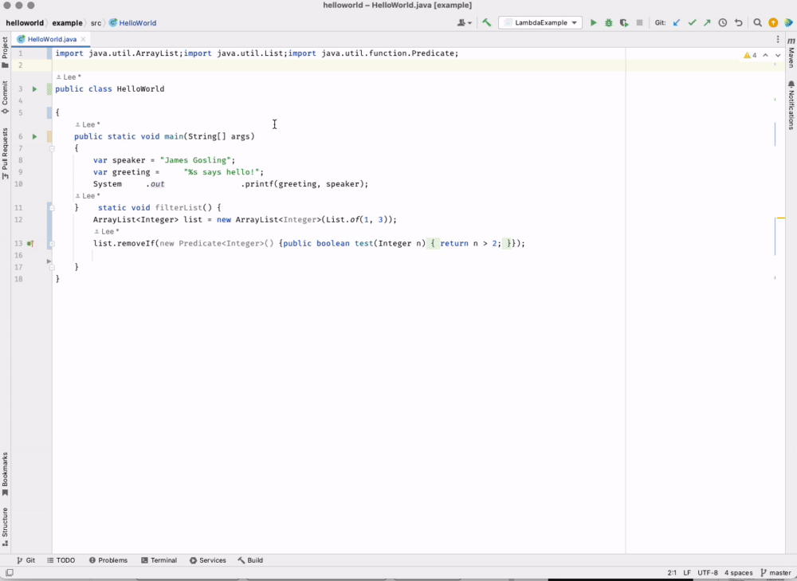
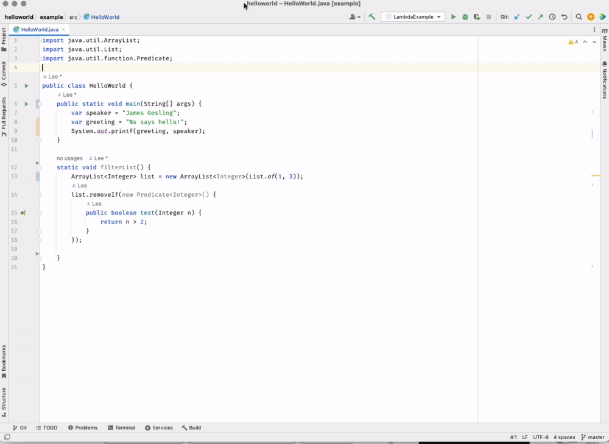

# Style Checking

🖥️ [Slides](https://docs.google.com/presentation/d/1xy5WXrwQuZLEOtAX7W9B9ZgICc047wQz/edit?usp=sharing&ouid=114081115660452804792&rtpof=true&sd=true)

Adhering to best practices and being consistent in your code structure, styles, and formatting is a hallmark of a professional developer. Historically, a proficient development team, would develop a document that outlined the standards that the team was expected to adhere to. This included common idioms to follow, anti-patterns to avoid, and a description of proper formatting and coding layout. As an example, you can reference [Google's style guide for Java](https://google.github.io/styleguide/javaguide.html). You will see that it describes very basic things like how you indent your code, how you order your import statements, and what is the limit on line length.

Style guides are usually very opinionated. This is because they are attempting to create a common representation of code that enables the team to focus on what the code does, and not what the code looks like. Being willing to put the team first is an important part of what is called [Egoless Development](https://blog.codinghorror.com/the-ten-commandments-of-egoless-programming/), and should be a quality that you strive to refine as part of your professional development.

One of the easiest ways to drop the ego, and conform to the team, is to simply use automated tools for organizing, formatting, and styling your code. Modern programming languages such as `Go` and `Rust` actually deploy linters and formatters as part of their language toolkit. This makes it so that any code written in that language is always formatted in a similar way. `Python` takes it a step further and actually makes the formatting part of the language.

When using IntelliJ, there is a built in action to reformat your code when you save a file. You can also enable a style checker that runs before you push your code to GitHub. Tools like this also help you discover features of Java that you might not be familiar with.

You can either use the format command to format the current file, or you can enable automatic formatting in IntelliJ so that it formats a file whenever it is saved. The following video show the use of both these formatting methods.

To have IntelliJ check your files for idiomatic problems and suggest ways to clean up your code, you can invoke the `Problem` checker, or click on the yellow light bulbs when they appear next to your code. IntelliJ will also automatically run the `Problem` checker when you push your code to GitHub.

It is important to get in the habit of consistently using these tools while you are developing your code. Otherwise, you end up with hundreds of problems that need to be corrected and the temptation will increase to just ignore them all.
