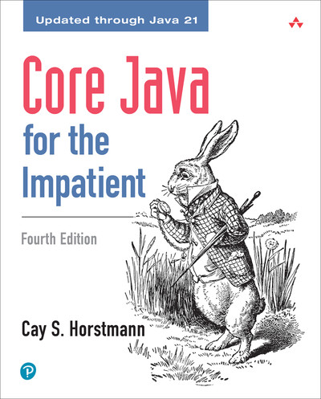

# C S 240 Syllabus - Advanced Software Construction

## Course Description

Advanced software development with an object-oriented focus. Design, implementation, and testing of medium-sized programs including a server program.

## Course Content

All of the content for this course is found here, in this GitHub repository. We use GitHub to host the content so that we can rapidly enhance and correct the content. Using GitHub also makes it so that you can get more familiar with this essential professional development tool.

You can always reach the root of the content repository with this link:

[https://github.com/softwareconstruction240](https://github.com/softwareconstruction240)

We suggest that you bookmark the link for easy access to the content.

If you find errors in the content then we encourage you to fork the content repository and [create a pull request](https://docs.github.com/en/pull-requests/collaborating-with-pull-requests/proposing-changes-to-your-work-with-pull-requests/creating-a-pull-request-from-a-fork). That way everyone benefits from your work, and you are listed as a contributor on a significant open source project.

##  Prerequisites

CS 235

In CS 240 we assume you have previously taken introductory programming courses in which you learned the basic concepts of object-oriented programming and that you have previously taken an introductory data structures and algorithms course where you learned about linked lists, binary search trees, hashing, sorting, etc.

##  Course Learning Outcomes

The goal of CS 240 is to help students learn a variety of computer programming concepts and skills that are essential in developing realistic software systems. Specifically, the objectives of the course are to:

1.  Learn to construct a medium-scale server program with data persistence in a principled way by applying relevant engineering techniques such as up-front design, quality code construction, unit testing, assertions, and error handling.
2.  Learn and apply basic software design principles such as single responsibility, low coupling, avoidance of code duplication and information/data hiding to create modular code.
3.  Learn and apply the basics of relational database design, modeling and programmatic access.
4.  Learn and apply basic security principles and concepts.
5.  Learn to validate a program’s behavior against its specification using testing practices.
6.  Use modern software tools including integrated development environments, testing frameworks, debuggers, version control, and documentation processing tools.

##  Course Materials

###   Suggested Textbook

|                        |                                                                                                                                                                                                                        |
| ---------------------- | ---------------------------------------------------------------------------------------------------------------------------------------------------------------------------------------------------------------------- |
| **Title:**             | Core Java for the Impatient (4th Edition)                                                                                                                                                                              |
| **Author(s):**         | Cay S. Hostmann                                                                                                                                                                                                        |
| **Publisher:**         | Addison-Wesley                                                                                                                                                                                                         |
| **Approved Editions:** | 4th Edition                                                                                                                                                                                                            |
| **Print ISBN:**        | 9780135404522                                                                                                                                                                                                         |
| **Online Option:**     | Access through the [BYU library](https://lib.byu.edu/remoteauth/?url=https://go.oreilly.com/byu-edu/library/view/-/9780135404522/?ar). If for some reason the link does not work, come speak with a professor or a TA. |

##  Technology Needs

You will need a reasonably current computer to complete the programming projects for this course. A minimum of 8 gigabytes of RAM is recommended, as well several gigabytes of free disk space.

If you do not have a computer of your own, you can rent one from the [BYU Office of Information Technology (OIT)](https://itsurplus.byu.edu/rentals).

## Programming Exam

One of the major goals of CS 240 is to ensure that all students have sufficiently strong programming skills to succeed in upper-division computer science courses. One mechanism for ensuring this is the Programming Exam.

All programming exams will be proctored by a program called Honorlock which records video and audio of you taking the exam. You must be able to take the programming exam on a computer that meets the following minimum requirements:

- Has a reliable Internet connection
- Has a working video camera
- Has a working microphone
- Has a recent version of the Chrome or Firefox web browser (Honorlock is only supported by Chrome or Firefox, and Firefox is not supported when taking the exam on a Chromebook)
  - You will be required to install the Honorlock extension in your web browser
- Only has one screen (if multiple screens are connected, you will need to disconnect them before starting the exam)
- Will be in a room free from distractions (i.e. people talking to you during the exam is not allowed)

There is no partial credit on the Programming Exam; you either finish, or you don't. During the exam you will have access to the Java API documentation, all project specifications and files, and the pass off driver test cases.

**You must pass the Programming Exam in order to pass CS240.**  The key to passing the exam is to implement _Phase 0: Chess Moves_ ahead of time. Please note that if you do not implement the program beforehand, it is highly unlikely that you will pass the exam. Because passing the Programming Exam is required to pass the class, you may take the exam up to three times.  See the class schedule for exam dates. Your maximum score for the exam will go down each time you retake it according to the following schedule.

| Attempt | Maximum Score |
| :------ | :------------ |
| 1       | 100%          |
| 2       | 80%           |
| 3       | 60%           |

**If you fail the exam twice, you should meet with your instructor to discuss your situation.**  You will only be allowed to take the exam a third time after meeting with your instructor and after passing off the _Phase 0: Chess Moves_ with the TAs (i.e., you can't take the exam a third time unless the program has been passed off).

## TAs

### TA Office Hours

As TAs, we are here to help you complete the projects and answer your questions. However, we are often given tasks by your instructor that may be time-sensitive. If you come into the TA lab, do not be shy in interrupting us to ask for help. However, please understand if we ask you to wait for a moment if we are trying to complete another CS 240 task.

Also, please understand that even though the TAs have taken the class and passed with very high marks they do not know everything, nor can they explain every bug. We will try to help you, but if we do not understand the bug, we might refer you to another TA or the instructor. We might even offer suggestions (guesses) on what we would do if we ran into that bug.

In summary, TAs are here to help but not to hold your hand and take away the learning experience of programming and debugging. But when you are stuck, do not hesitate to come in and ask for help.

When you need help, please join our [help queue](https://help.cs240.click). To see when TAs are working, check [here](https://docs.google.com/document/d/12ZrcsQAfVirCuCwzI0TKX_tSPyBOjqB9vDE-sx1n_S0/edit?tab=t.0#heading=h.cp6dfptbk5p3).

Please go over the TA Help Policies before you come in to ask for help.

### Schedule Disclaimer

Please remember that the TAs are students too and have classes of their own.

They might need to leave 10 minutes before the end of the hour to get to class on time.

Also, if they are in the labs other than during their posted hours, they're doing homework for other classes.

### TA Help Policies

If you would like to get some help from the TA's, please make sure that you have read these policies to ensure that we can help everyone and give you all the help you need. Remember that we are "Assistants". We are more than willing to assist you as you learn, but we need you to do your part as well. Because of this, the help queue has a limit of 3 times per day (except for passing off).

Students Seeking TA Help Should First:

- Have read project specifications thoroughly. Sometimes this means 3 – 4 times.
- Be up to date on their reading assignments.
- Consulting the Java documentation and know what the code you are calling is supposed to do.
- Work for at least 30 min. on your own.
- Use the [debugger](../debugging/debugging.md) to step through the code and validate your assumptions.
- Write your own unit tests to narrow down the reproduction of a problem.
- Use System.out.println when appropriate to help debug your code.
- Review and try to understand relative coding examples and lecture slides.
- Have a well-formed question to ask the TA.
- Put yourself in a frame of mind to accept new ideas.
- We will only help students if they get on the queue and come to the TA lab first. We will not go to the labs to find you.
- Do not attempt to pass off with the TA's unless your program already passes all required unit tests.
- Remember one purpose of this class is for you to learn how to learn. If we feel you are not putting forth your full effort or for any other reason we may ask you to return later when you have fulfilled these requirements.

Email the TAs at cs240ta@cs.byu.edu

##  Assignments, Grading and Course Policies

### **Large Projects**

A major goal of CS 240 is to ensure that all students are able to design, implement, test, and debug large programs. To this end, there is a large programming project in CS 240 (Multiplayer Chess). This project is large and requires several weeks of consistent effort to complete. There are multiple deliverables for the project, the due dates for which are listed in the class schedule.

One of the deliverables is the _Phase 2: Chess Server Design_ assignment. The grading policy for this is as follows: 100% is given for perfect or near perfect submissions that meet the requirements of the assignment. 50% is given for submissions that need a few changes made, and where clear effort is made to meet the requirements of the assignment.  Assignments given a 50% can be re-submitted with the required changes made for a grade change to 100%. 0% is given when it is clear that little or no effort was made to fulfill the requirements of the assignment by the due date.  These submissions will be treated as if nothing was submitted. The late policy will apply for any re-submission of a design graded as a 0.

Since the Chess phases build on top of each other, the previous phase must be completed before the next phase is attempted.

In addition to getting your code to "work", a significant part of your project grade will be based on the quality of your work. Our class autograder will check for code quality and unit tests. Your code and automated test cases can be reviewed by a TA, and we may change your grade based on how well you have followed the good coding and testing practices discussed in class. Therefore, it is in your best interest to tidy up your code and test cases as you go along.

### **Final Exam**

The final exam is taken online during the university final exam period. Just like the programming exam, it will be proctored with Honorlock.

### **Late Policies**

The late penalty for all assignments is 10% off per school day (school day = Monday through Friday except for holidays). Non-school days count the same as the following school day (for example, if an assignment is due on a Wednesday and the next day (Thursday) is a holiday, Thursday and Friday would both have a 10% penalty and Saturday, Sunday, and Monday would all have a 20% penalty).

The maximum late penalty on all assignments is 50% off (i.e., you will never lose more than 50% for being late on an assignment).

For assignments with multiple independently graded rubric items, this late penalty is per rubric item as long as the main functionality of the assignment is complete and your pre-penalty score for that rubric item does not decrease. For example, if you submit Phase 3 on the due date with full points on the "Web API Works" item (the main functionality of the assignment) but with less than full points on the other two rubric items and then resubmit the next day with full points on all three, the "Web API Works" item would remain at full points while the other two would receive the 10% late penalty.

### **Grade Appeals**

The TA's and the instructor are imperfect and may make a mistake when grading assignments and exams. We want you to receive the grade you deserve, but some of this responsibility lies with you. You are welcome to appeal any grades you receive, but grade appeals for any assignments or exams must be requested within seven calendar days of the time the score for the item being appealed is posted. You may not receive an email or an in-class announcement about when scores are posted, so you should check regularly.

We have found that some students are satisfied with their grades until they find at the end of the semester that a few more points would make a difference in the grade they receive. Then a "fishing for points" expedition begins. We are unable to accommodate this, so if you are unsatisfied with a grade, appeal it early. Grade appeals made at the end of the semester on items that were graded more than a week previously will not be considered.

If appealing a grade, start by discussing the item(s) in question with a TA during office hours (preferably the TA who did the original grading). Be prepared to give a detailed explanation of why you think the grade is incorrect. If you are not able to come to a satisfactory conclusion with the TA, contact the instructor. Keep in mind that although rare, re-grades can, and sometimes do, result in a lower score.

### **Doing Your Own Work**

This class is about individual competence, not teamwork. Therefore, all assignments you turn in must be your own work. You are encouraged to study with other students, and you may discuss concepts, ideas, and general approaches with others (e.g. at a whiteboard), but when it comes time to create your actual design documentation or source code, you must work alone. You may not share electronic files or hard-copy printouts containing designs or source code with other students, either as giver or receiver. You may not work in close synchronization with other students in a side-by-side fashion. **Violations of this policy will result in all involved students failing the course and the possibility of further action at the university level.**

Be aware that we use plagiarism detection software to ensure that the source code you submit was not derived from code written by other current or past CS 240 students. Specifically, it is not appropriate to search the Web for solutions published by other students, or to otherwise obtain source code from other students. If you do this, you are likely to get caught, which will result in (at least) failing the class. Of course, we know that most of you would not do this, but sometimes people make mistakes when the pressure is high.

You may not use AI systems such as ChatGPT to write your code. Such systems merely repeat content they found on the Web, and, in effect, are just an indirect way of copying other students' solutions from the Web. This is not acceptable. **If you use AI to write your code, it is highly likely that your code will be flagged by our plagiarism detection system**. The code it writes for you will be very similar to code it writes for other students, and that code will be similar to student solutions found on the Web.

However, you may use AI chat systems (such as ChatGPT) as a personal tutor. You may use it to ask questions and review responses, but you may not use it to analyze or write your code. You may not use any AI system that has access to your code. Copying code into or out of any AI system (including looking at code in an AI system while typing it into your project) is a violation of this policy and will be treated as plagiarism.

### **Children in the Classroom**

The serious study of the physical and mathematical sciences requires uninterrupted concentration and focus in the classroom. Having small children in class is often a distraction that degrades the educational experience for the entire class. Please make other arrangements for child care rather than bringing children to class with you. If there are extenuating circumstances, please talk with your instructor in advance.

##   Grade Scheme

The following grading standards will be used in this class:

| Grade | Range             |
| :---- | :---------------- |
| A     | 100 % to 93.0%    |
| A-    | < 93.0 % to 90.0% |
| B+    | < 90.0 % to 87.0% |
| B     | < 87.0 % to 83.0% |
| B-    | < 83.0 % to 80.0% |
| C+    | < 80.0 % to 77.0% |
| C     | < 77.0 % to 73.0% |
| C-    | < 73.0 % to 70.0% |
| D+    | < 70.0 % to 67.0% |
| D     | < 67.0 % to 63.0% |
| D-    | < 63.0 % to 60.0% |
| F     | < 60.0 % to 0.0%  |

## CS 240 Flag

In order to register for CS classes beyond CS 240, the "CS 240 flag" must be set in your student record (this is enforced by the BYU class registration system).

For CS majors, you must meet with Lynnette Nelson in the CS Dept. office to get your CS 240 flag set. When you meet with her, Lynnette will give you some important information about the CS major. A meeting time with Lynnette can be arranged by contacting her at lnelson@cs.byu.edu.

For non-CS majors, your CS 240 flag will be set automatically after the add/drop deadline. You do not need to meet with Lynnette.

##  BYU Online Policies

### Statement on Belonging 

We are united by our common primary identity as children of God (Acts 17:29; Psalm 82:6) and our commitment to the truths of the restored gospel of Jesus Christ (BYU Mission Statement). We strive to create a community of belonging composed of students, faculty, and staff whose hearts are knit together in love (Mosiah 18:21) where

- all relationships reflect devout love of God and a loving, genuine concern for the welfare of our neighbor (BYU Mission Statement);
- we value and embrace the variety of individual characteristics, life experiences and circumstances, perspectives, talents, and gifts of each member of the community and the richness and strength they bring to our community (1 Corinthians 12:12–27);
- our interactions create and support an environment of belonging (Ephesians 2:19); and
- the full realization of each student’s divine potential is our central focus (BYU Mission Statement).

### Honor Code

In keeping with the principles of the BYU Honor Code, students are expected to be honest in all of their academic work. Academic honesty means, most fundamentally, that any work you present as your own must in fact be your own work and not that of another. Violations of this principle may result in a failing grade in the course and additional disciplinary action by the university. Students are also expected to adhere to the Dress and Grooming Standards. Adherence demonstrates respect for yourself and others and ensures an effective learning and working environment. It is the university's expectation, and my own expectation in class, that each student will abide by all Honor Code standards. Please call the Honor Code Office at [801-422-2847](tel:8014222847) if you have questions about those standards.

### Preventing and Responding to Sexual Misconduct

Brigham Young University prohibits all forms of sexual harassment—including sexual assault, dating violence, domestic violence, and stalking on the basis of sex—by its personnel and students and in all its education programs or activities. University policy requires all faculty members to promptly report incidents of sexual harassment that come to their attention in any way and encourages reports by students who experience or become aware of sexual harassment. Incidents should be reported to the Title IX Coordinator at [title9@byu.edu](mailto:title9@byu.edu) or [801-422-8692](tel:8014228692) or 1320 WSC. Reports may also be submitted online to the [Title IX Office](https://titleix.byu.edu/report) or by calling [1-888-238-1062](tel:18882381062) (24 hours a day). BYU offers a number of resources and services for those affected by sexual harassment. If you or someone you know has experienced sexual assault, BYU’s Sexual Assault Survivor Advocacy Services (SASAS) can help. SASAS can provide information, support, and connection to the resources you may need. SASAS services are free and confidential.

SASAS Contact Information

- Phone: 801.422.9071
- Email: advocate@byu.edu
- Web: https://advocates.byu.edu/
- Location: 1500 WSC
- National Sexual Assault Hotline: 1-800-656-4673

Additional information about sexual harassment, the university's Sexual Harassment Policy, reporting requirements, and resources can be found in the University Catalog, by visiting [the Title IX Office website](http://titleix.byu.edu/), or by contacting the university's Title IX Coordinator.

### Student Disability

Brigham Young University is committed to providing a working and learning atmosphere that reasonably accommodates qualified persons with disabilities. If you have any disability which may impair your ability to complete this course successfully, please contact the University Accessibility Center (UAC) located at 2170 WSC, or call [801-422-2767](tel:8014222767). Reasonable academic accommodations are reviewed for all students who have qualified, documented disabilities. The UAC can also assess students for learning, attention, and emotional concerns. Services are coordinated with the student and instructor by the UAC. If you need assistance or if you feel you have been unlawfully discriminated against on the basis of disability, you may seek resolution through established grievance policy and procedures by contacting the Equal Employment Office at [801-422-5895](tel:8014225895), D-285 ASB.

In this spirit, BYU Online aspires to improve web accessibility for users. While not required by law, the Web Content Accessibility Guidelines (WCAG) 2.0 Levels A and AA provide a wide range of helpful recommendations to make web content more accessible. BYU Online strives to apply WCAG 2.0 recommendations where feasible but may deviate from any recommendations that would result in an undue hardship to BYU Online or alterations to program and course content and objectives. If you have questions about accessibility, or if you need to report problems with any accessibility features, please see our [Accessibilities and Accommodations Web Page.](https://is.byu.edu/support/accommodations&sa=D&ust=1567809961599000)

### Academic Honesty

The first injunction of the Honor Code is the call to _be honest_. Students come to the university not only to improve their minds, gain knowledge, and develop skills that will assist them in their life's work, but also to build character. "President David O. McKay taught that character is the highest aim of education" ("The Aims of a BYU Education," p. 6). It is the purpose of the BYU Academic Honesty Policy to assist in fulfilling that aim. BYU students should seek to be totally honest in their dealings with others. They should complete their own work and be evaluated based on that work. They should avoid academic dishonesty and misconduct in all its forms, including but not limited to plagiarism, fabrication or falsification, cheating, and other academic misconduct.

### Online Exams and Proctoring (If Applicable)

Maintaining academic integrity is a fundamental expectation at BYU and in this course, and all students are required to uphold honesty and ethical behavior in their work. To ensure a fair and secure testing environment, this course may utilize remote online proctoring software to monitor and record online exams. The proctoring software is designed to verify your identity, monitor the testing environment, and ensure no unauthorized materials or supports are used during the exam.

By taking this course, you agree to comply with the proctoring guidelines and all BYU Academic policies. It is the student’s responsibility to ensure a quiet, distraction-free environment during exams and to adhere to all rules and instructions provided. Please be aware that any violations of academic honesty, including but not limited to cheating or the use of unauthorized resources, will be addressed and may result in penalties, including failing the exam or course in accordance with the BYU's Academic Honesty Policy.

**Honorlock**

If your course has online proctored exams, your course will utilize Honorlock to proctor these exams.  Honorlock provides remote proctoring services that uses artificial intelligence (AI) software and live proctors. The blend of AI remote proctoring software and live proctors aim to protect academic integrity and to support students through a successful completion of the exam. If the AI detects potential issues, it alerts a live test proctor to review the situation and intervene if needed.

**Preparing for your exam**

Honorlock does not require students to create an account, download a separate web browser, or schedule an appointment with Honorlock in advance. Students are responsible for ensuring their computer, browser and internet meet the [minimum system requirement](https://honorlock.com/support)s necessary for the completion of the online exam.

Before you begin your exam, you will be required to have the following:

- Computer or Chromebook
- Working webcam and microphone
- Stable internet connection
- Google Chrome browser
- Download the Honorlock Browser Extenstion
- Some form of picture ID (e.g. School ID, driver’s license, etc.)

When you are ready to complete your exam Honorlock will walk you through an authentication process which includes the following:

- Taking a picture of yourself and showing some form of ID
- Complete a 360-degree room scan of your testing environment

Honorlock records your exam session through your webcam, microphone, and recording your screen. Honorlock can detect violations on exam rules and instructions, suspicious eye movement, dual monitors and search-engine use.

**Proctoring Acknowledgement Quiz**

Before accessing the academic course exams, you will complete a "Proctoring Acknowledgement" quiz. You will be required to acknowledge that you have read and understand the [BYU Academic Honesty Policy](https://policy.byu.edu/view/academic-honesty-policy) as well as exam rules and guidelines. The acknowledgment quiz will also serve as an opportunity to help you navigate taking your exam through Honorlock.

**Honorlock Support and Resources**

Honorlock support is available 24/7/365. If you encounter any issues, you may contact them through live chat on the [support page](https://honorlock.com/support 'https://honorlock.com/support') or within the exam itself. Some guides you should review are [Honorlock System Requirements](https://honorlock.kb.help/minimum-system-requirements/ 'https://honorlock.kb.help/minimum-system-requirements/'), [Honorlock FAQs for Test Takers](https://honorlock.kb.help/honorlock-faqs-for-test-takers/ 'https://honorlock.kb.help/honorlock-faqs-for-test-takers/'), and [How to Use Honorlock](https://honorlock.kb.help/how-to-use-honorlock-test-takers/ 'https://honorlock.kb.help/how-to-use-honorlock-test-takers/').

### Plagiarism

Intentional plagiarism is a form of intellectual theft that violates widely recognized principles of academic integrity as well as the Honor Code. Such plagiarism may subject the student to appropriate disciplinary action administered through the university Honor Code Office, in addition to academic sanctions that may be applied by an instructor. Inadvertent plagiarism, which may not be a violation of the Honor Code, is nevertheless a form of intellectual carelessness that is unacceptable in the academic community. Plagiarism of any kind is completely contrary to the established practices of higher education where all members of the university are expected to acknowledge the original intellectual work of others that is included in their own work. In some cases, plagiarism may also involve violations of copyright law. Intentional plagiarism is the deliberate act of representing the words, ideas, or data of another as one's own without providing proper attribution to the author through quotation, reference, or footnote. Inadvertent plagiarism involves the inappropriate, but non-deliberate, use of another's words, ideas, or data without proper attribution. Inadvertent plagiarism usually results from an ignorant failure to follow established rules for documenting sources or from simply not being sufficiently careful in research and writing. Although not a violation of the Honor Code, inadvertent plagiarism is a form of academic misconduct for which an instructor can impose appropriate academic sanctions. Students who are in doubt as to whether they are providing proper attribution have the responsibility to consult with their instructor and obtain guidance. Examples of plagiarism include the following:

- **Direct Plagiarism**: The verbatim copying of an original source without acknowledging the source.
- **Paraphrased Plagiarism**: The paraphrasing, without acknowledgment, of ideas from another that the reader might mistake for the author's own.
- **Plagiarism Mosaic**: The borrowing of words, ideas, or data from an original source and blending this original material with one's own without acknowledging the source.
- **Insufficient Acknowledgement**: The partial or incomplete attribution of words, ideas, or data from an original source.

Plagiarism may occur with respect to unpublished as well as published material. Copying another student's work and submitting it as one's own individual work without proper attribution is a serious form of plagiarism.

### Respectful Environment

> "Sadly, from time to time, we do hear reports of those who are at best insensitive and at worst insulting in their comments to and about others. . . . We hear derogatory and sometimes even defamatory comments about those with different political, athletic, or ethnic views or experiences. Such behavior is completely out of place at BYU, and I enlist the aid of all to monitor carefully and, if necessary, correct any such that might occur here, however inadvertent or unintentional. I worry particularly about demeaning comments made about the career or major choices of women or men either directly or about members of the BYU community generally. We must remember that personal agency is a fundamental principle and that none of us has the right or option to criticize the lawful choices of another."
>
> — President Cecil O. Samuelson, Annual University Conference, August 24, 2010

> "Occasionally, we . . . hear reports that our female faculty feel disrespected, especially by students, for choosing to work at BYU, even though each one has been approved by the BYU Board of Trustees. Brothers and sisters, these things ought not to be. Not here. Not at a university that shares a constitution with the School of the Prophets."
>
> — Vice President John S. Tanner, Annual University Conference, August 24, 2010

### Mental Health Concerns

Mental health concerns and stressful life events can affect students' academic performance and quality of life. BYU Counseling and Psychological Services (1500 WSC, [801-422-3035](tel:8014223035)) provides individual, couples, and group counseling, as well as stress management services. These services are confidential and are provided by the university at no cost to full-time students. For general information please visit the [BYU Counseling and Psychological Services website](https://caps.byu.edu); for more immediate concerns please visit the [Helping Distressed Students at BYU web page](http://help.byu.edu/).

### Inappropriate Use of Course Materials

All course materials (e.g., outlines, handouts, syllabi, exams, quizzes, PowerPoint presentations, lectures, or audio and video recordings) are proprietary. Students are prohibited from posting or selling any such course materials without the express written permission of the professor teaching this course. To do so is a violation of the Brigham Young University Honor Code.

The materials used in connection with this online course are only for the use of students enrolled in this course for purposes associated with this course and may not be retained or further disseminated. Any copying or further dissemination of these materials may be subject to applicable U.S. copyright laws. For questions or more information, please visit the [BYU Copyright Licensing Office](https://sites.lib.byu.edu/copyright/&sa=D&ust=1567809961601000) website.

"Members of the BYU community who willfully disregard this Copyright Policy or the BYU Copyright Guidelines place themselves individually at risk of legal action and may incur personal liability for their conduct. The unauthorized use or distribution of copyrighted material, including unauthorized peer-to-peer file sharing, may subject individuals to civil and criminal liabilities, including actual and statutory damages, costs and fees of litigation, fines, and imprisonment. . . .

Violations of the Copyright Policy may result in university disciplinary action including termination of university enrollment or employment" (Excerpt taken from the [BYU Copyright Policy](https://policy.byu.edu/view/index.php?p=36)).
