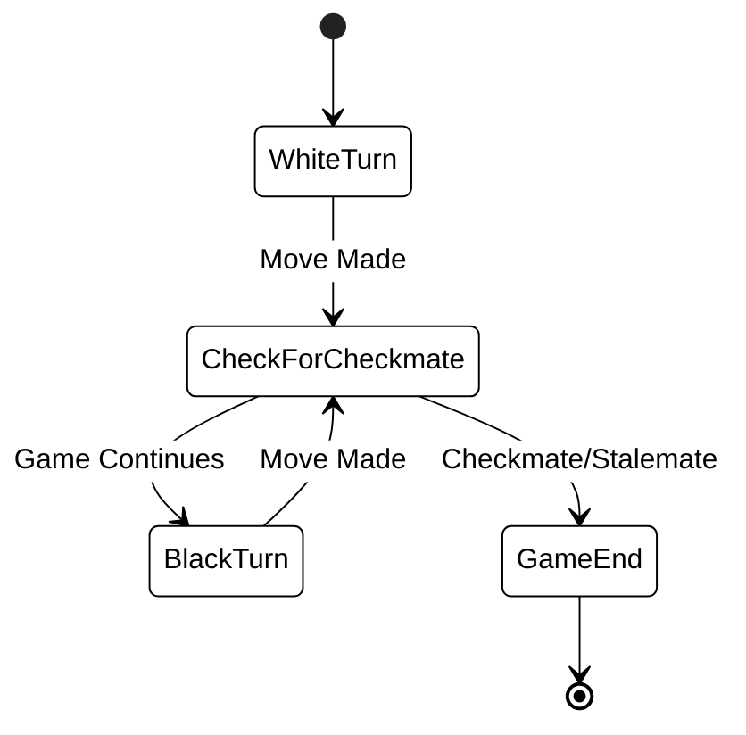

# The Game of Chess

Chess is often described as the "Gymnasium of the Mind." For centuries, it has served as a benchmark for human intelligence, strategic depth, and more recently, the capabilities of artificial intelligence. In this course, we explore chess not just as a pastime, but as a perfect system for studying logic, state management, and complex rule-based architectures. Understanding the mechanics of chess is the first step toward modeling these same systems in software.

## A Brief History of Strategy

The origins of chess trace back nearly 1,500 years to 6th-century India, where it was known as *Chaturanga*. This early version represented the four divisions of the Indian military: infantry, cavalry, elephants, and chariots. As the game traveled along the Silk Road to Persia and eventually Europe, the pieces evolved to reflect medieval society—turning chariots into rooks and elephants into bishops.

By the late 15th century, the rules were refined into the modern version we play today. The "Mad Queen" era saw the Queen become the most powerful piece on the board, significantly speeding up the pace of the game. Today, chess is a global phenomenon, governed by FIDE (the International Chess Federation) and played by millions of people and computers alike.

## The Board and Setup

The game is played on an 8x8 grid of 64 squares, alternating between light and dark colors. When setting up the board, players must ensure that a "light" square is in the bottom-right corner for both sides.

In software engineering terms, we often represent this board as a 2D array or a bitboard. Each square is identified by a coordinate system known as algebraic notation: files are labeled **a** through **h**, and ranks are numbered **1** through **8**.

## How the Pieces Move

Each piece has a unique movement profile, dictating its value and strategic utility on the board.

### The King
The King is the most important piece but also one of the most vulnerable. It can move exactly one square in any direction: horizontally, vertically, or diagonally. While it lacks the range of other pieces, its safety is the primary objective of the game.

### The Queen
The Queen is the most powerful piece, combining the movement capabilities of the Rook and the Bishop. She can move any number of squares along a rank, file, or diagonal, provided no other pieces are in her path.

### The Rook
Rooks move any number of squares horizontally or vertically. They are particularly powerful in the "endgame" when the board is clear and they can control open files.

### The Bishop
Bishops move any number of squares diagonally. Because they stay on the same color throughout the game, a player starts with one "light-squared" bishop and one "dark-squared" bishop.

### The Knight
The Knight moves in an "L" shape: two squares in one cardinal direction and then one square perpendicularly. Uniquely, the Knight is the only piece that can "jump" over other pieces, making it a dangerous tool in crowded, closed positions.

### The Pawn
Pawns are the "soul of chess." They move forward one square at a time, but they capture diagonally. On their very first move, a pawn has the option to move forward two squares. Pawns also have two special rules:
- **Promotion:** If a pawn reaches the 8th rank, it must be promoted to any other piece (usually a Queen).
- **En Passant:** A complex capture rule that occurs when a pawn moves two squares forward and lands horizontally adjacent to an opponent's pawn.

## Check, Checkmate, and Stalemate

The game of chess revolves around the status of the King. Understanding the distinction between these three states is critical for both players and programmers.

**Check** occurs when the King is under immediate attack by an opponent's piece. A player in check must immediately move their King, block the attack, or capture the attacking piece. You cannot move into check or remain in check.

**Checkmate** is the goal of the game. It occurs when a King is in check and there are no legal moves available to escape the threat. When checkmate is delivered, the game ends immediately.

**Stalemate** is a unique type of draw. It occurs when the player whose turn it is has no legal moves, but their King is **not** currently in check. In competitive play, this results in a split point, often frustrating the player who had the material advantage.

## Winning the Game

While checkmate is the most common way to win, a game can also end if:
- A player **resigns**, acknowledging that their position is hopeless.
- A player **runs out of time** (in timed matches).
- A **draw** is agreed upon by both players.
- A **draw by repetition** occurs (the same board position appears three times).

## Strategic Foundations

To transition from knowing the rules to playing effectively, consider these three core principles:

1.  **Control the Center:** The squares d4, d5, e4, and e5 are the most important on the board. Pieces placed in the center have the greatest mobility and control.
2.  **Develop Your Pieces:** Do not simply move pawns. Bring your Knights and Bishops out early to active squares where they can influence the game.
3.  **King Safety:** Usually achieved through **castling**, a special move involving the King and a Rook. An uncastled King in the center is an easy target for an organized attack.

## Common Challenges and Solutions

**Challenge: Forgetting "En Passant" or Castling Rights.**
When beginners model chess in code, they often forget that "state" includes more than just piece positions. It includes move history.
*Solution:* Always track whether Kings and Rooks have moved, and record the last pawn move to validate en passant captures.

**Challenge: Tunnel Vision.**
Players often focus so much on their own attack that they ignore their opponent's threats.
*Solution:* After your opponent moves, ask yourself: "What is the threat? What did that move just open up or close down?"

## Summary

Chess is a game of perfect information; nothing is hidden, and there is no luck involved. By understanding the movement of the pieces, the conditions of checkmate, and basic strategic positioning, you lay the groundwork for more advanced study. In our next sessions, we will look at how to translate these physical movements into logical constraints within a GitHub repository, preparing you for the architectural challenges of the Programming Exam.

### External Resources
- [Lichess.org - Learn Chess](https://lichess.org/learn): An excellent interactive tool for practicing piece movements.
- [Chess.com - Rules and Basics](https://www.chess.com/learn-how-to-play-chess): Comprehensive guides on opening theory and tactics.
- [FIDE Laws of Chess](https://handbook.fide.com/chapter/E012023): The official handbook for competitive play.