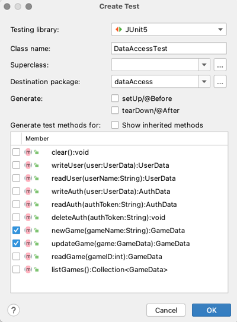

# Unit Testing

🖥️ [Slides](https://docs.google.com/presentation/d/1gRoHgp1j28GHaJvzHJlqnrqtwfWfZz3F/edit?usp=sharing&ouid=114081115660452804792&rtpof=true&sd=true)

📖 **Required Reading**: [JUnit 5 User Guide](https://junit.org/junit5/docs/current/user-guide/)

- Sections 1 through 1.4.3
- Sections 2 through 2.2
- Section 2.4

🖥️ [Lecture Videos](#videos)

Test driven development ([TDD](https://en.wikipedia.org/wiki/Test-driven_development)) was popularized in the 1990s as part of the [extreme programming](https://en.wikipedia.org/wiki/Extreme_programming) wave. The idea is that you begin writing software by creating tests that represent the consumer of your software. You then use the tests to drive the development of your code. When the tests pass you know that your code is complete.

TDD has been proven to decrease development time, provide documentation and examples for your code, result in less bugs, and prevent against the introduction of future bugs. Additionally, by writing your tests by focusing on the consumer of your code, you tend to design better interfaces and accurate domain models.

Today, TDD is a common industry practice that you will be expected to use on a daily basis. However, it takes effort to learn how to write tests that are effective and efficient. Making this a standard part of your development process will give you a significant advantage as you progress in your professional career.

## Creating Unit Tests

The process of test driven development follows a specific process that includes the following steps.

1. **Add a test** - When a new feature is added to the requirements, or a bug is discovered, you first write a test that demonstrates the correct execution of the code. A simple test is usually a function that exists outside of the code that you would release to production. The test function is then executed by some testing framework. When you execute your new test it should fail because you have not implemented the code that satisfies the test.
1. **Implement the functionality** - With the test in place you write the functionality necessary to implement the feature or correct the bug.
1. **Run all tests** - You then run all of the tests to make sure your new code hasn't introduced new errors.
1. **Refactor** - With your test safely passing you can safely refactor your code to improve the quality of the code.

This process is then repeated for each additional feature or bug.

There are several characteristics that you want to strive for when creating tests.

| Characteristic        | Description                                                                                                                                                                                                                                                                                                           |
| --------------------- | --------------------------------------------------------------------------------------------------------------------------------------------------------------------------------------------------------------------------------------------------------------------------------------------------------------------- |
| Cohesive | The test only tests one thing. That doesn't mean it doesn't require other code to execute before the test asserts are made, but the test should not be making unrelated assertions. Instead create an additional test.                                                                                                |
| Quick                 | You want your tests to run as quickly as possible. Ideally, you would write a little bit of production code and then run all the tests so that you can quickly discover if you broke something. When tests take a long time to run you will be discouraged from executing them.                                       |
| Do not repeat         | You are not exercising the same code over and over again with different tests.                                                                                                                                                                                                                                        |
| Stable                | If the test passes once, and the production code does not change, then the test should always pass. Unstable tests suggest a problem with the production or testing code. Unstable tests decrease the value of your tests because you no longer trust them, or have to rerun them multiple times to get them to pass. |
| Automated             | No human should be involved in the execution process of the tests. Automation allows you to run the tests as part of your continuous delivery pipeline or check in process.                                                                                                                                           |
| Easy                  | It should be easy to introduce new tests. If the process requires significant effort then it discourages people from writing them.                                                                                                                                                                                    |

## JUnit

JUnit is a common library that is used for testing Java code. JUnit uses a combination of annotations and assertion functions to provide its basic functionality.

When JUnit starts up it scans the code for any function that has a `@Test` annotation and marks it as a unit test. Once all the tests have been discovered, JUnit executes each function. Usually your test will have one or more assertion functions that assert that your code is working correctly. JUnit provides the ability to assert that something is true, not null, equals something, or that it throws an exception. Take some time to get familiar with all the [assertions functions](https://junit.org/junit5/docs/5.0.1/api/org/junit/jupiter/api/Assertions.html) that JUnit provides.

If any assertion fails, an exception will be thrown and that test is aborted and marked as failing. The following is an example of a JUnit test with some trivial assertions.

```java
import org.junit.jupiter.api.Test;
import static org.junit.jupiter.api.Assertions.*;

public class ExampleTests {
    @Test
    public void simpleAssertionTest() {
        assertEquals(200, 100 + 100);
        assertTrue(100 == 2 * 50);
        assertNotNull(new Object(), "Response did not return authentication String");
        assertThrows(InvalidArgumentException.class, () -> {
            throw new InvalidArgumentException();
        });
    }
}
```

## JUnit Annotation

In addition to annotating a function as a unit test, JUnit has several other useful annotations.

| Annotation        | Description                                                                                      |
| ----------------- | ------------------------------------------------------------------------------------------------ |
| AfterAll          | Run after all tests execute.                                                                     |
| AfterEach         | Run after each test executes.                                                                    |
| BeforeAll         | Run before all tests execute.                                                                    |
| BeforeEach        | Run before each test executes.                                                                   |
| Disabled          | Disable this test. Use this when you are working on a test that is not yet ready for production. |
| DisplayName       | The name to show for the unit test. This will default to the function name if not specified.     |
| Order             | The order that tests should execute in. Use this if your tests have dependencies between tests.  |
| Test              | A simple unit test.                                                                              |
| ParameterizedTest | A parameterized unit test. This test is called once for each supplied parameter.                 |

## Parameterization

When testing interfaces it is desireable to create one set of tests for all implementations of the interface instead of duplicating the tests for each implementation. In order to accomplish this you care a `ParameterizedTest` instead of a simple `Test`. There are different ways to parameterize a test using JUnit, but one way is to use the `ValueSource` annotation to provide multiple alternate values to pass into the test. JUnit then repeatedly invokes the test with the different provided values.

In the following example we parameterize our test to pass in different implementations of the `List` interface. The test function is called three times, once for an ArrayList, once for a LinkedList, and once for a Stack.

```java
@ParameterizedTest
@ValueSource(classes = {ArrayList.class, LinkedList.class, Stack.class})
public void addAndGetToList(Class<? extends List> listClass) throws Exception {
    var list = listClass.getDeclaredConstructor().newInstance();
    var expectedItem = "item";

    list.add(expectedItem);
    Assertions.assertEquals(1, list.size());
    Assertions.assertEquals(expectedItem, list.get(0));
}
```

## Autogenerate Unit Tests

With IntelliJ, you can autogenerate your unit tests. To use this tool open up any class and select the `generate|tests` option from the right click menu.



## Things to Understand

- Why unit testing is important
- How to write unit tests using the JUnit testing framework
- How to run Junit tests from Intellij
- Special considerations for testing database code

## <a name="videos"></a>Videos (25:05)

- 🎥 [Why We Need Unit Testing (4:30)](https://byu.hosted.panopto.com/Panopto/Pages/Viewer.aspx?id=c5707c4c-77d9-43d7-b96b-ad6b014612ca&start=0)
- 🎥 [Unit Testing Overview (5:10)](https://byu.hosted.panopto.com/Panopto/Pages/Viewer.aspx?id=bb1884b3-55ab-4a8b-be05-ad6b01477df8&start=0)
- 🎥 [The JUnit Testing Framework (15:25)](https://byu.hosted.panopto.com/Panopto/Pages/Viewer.aspx?id=071e47be-a746-4e74-afd5-ad6b0149b2b8&start=0)


## Demonstration code

📁 [main](example-code/main/)

📁 [test](example-code/test/)
