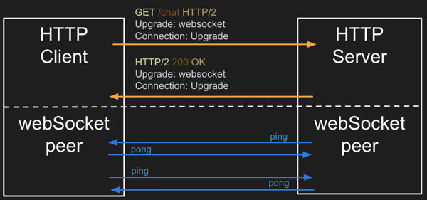
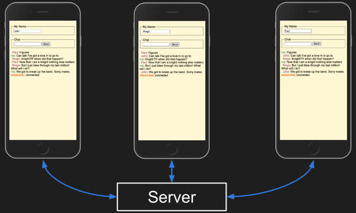

# WebSocket

🖥️ [Slides](https://docs.google.com/presentation/d/1jNPLDXYxK7kMvui4WvK0bshU076_OTQ1/edit?usp=sharing&ouid=114081115660452804792&rtpof=true&sd=true)

🖥️ [Lecture Videos](#videos)


HTTP is based on a client-server architecture. A client always initiates the request and the server responds. This is great if you are building a global document library connected by hyperlinks, but for many other use cases it just doesn't work. Applications for notifications, distributed task processing, peer-to-peer communication, or asynchronous events need communication that is initiated by two or more connected devices.

For years, web developers created hacks to work around the limitation of the client/server model. This included solutions like having the client frequently pinging the server to see if the server had anything to say, or keeping client-initiated connections open for a very long time as the client waited for some event to happen on the server. Needless to say, none of these solutions were elegant or efficient.

Finally, in 2011 the communication protocol WebSocket was created to solve this problem. The core feature of WebSocket is that it is fully duplexed. This means that after the initial connection is made from a client, using vanilla HTTP, and then upgraded by the server to a WebSocket connection, the relationship changes to a peer-to-peer connection where either party can efficiently send data at any time.



WebSocket connections are still only between two parties. So if you want to facilitate a conversation between a group of users, the server must act as the intermediary. Each peer first connects to the server, and then the server forwards messages amongst the peers.



## Creating a WebSocket Server Connection

Here is an example of a basic HTTP server that uses the `JavaSpark` package to support upgrading to the WebSocket protocol when the `/ws` endpoint is called by a client.

```java
import org.eclipse.jetty.websocket.api.annotations.*;
import org.eclipse.jetty.websocket.api.*;
import spark.Spark;

@WebSocket
public class WSServer {
    public static void main(String[] args) {
        Spark.port(8080);
        Spark.webSocket("/ws", WSServer.class);
        Spark.get("/echo/:msg", (req, res) -> "HTTP response: " + req.params(":msg"));
    }

    @OnWebSocketMessage
    public void onMessage(Session session, String message) throws Exception {
        System.out.printf("Received: %s", message);
        session.getRemote().sendString("WebSocket response: " + message);
    }
}
```

The key parts of this code include the call to `Spark.webSocket` to register the upgrade endpoint and the `onMessage` function that receives incoming WebSocket message from a peer.

## Creating a WebSocket Client Connection

In order to initiate a WebSocket connection to a server from a client in Java you need a library that implements the `javax.websocket.WebSocketContainer` interface. In this course we use the `glassfish.tyrus` library to implement `WebSocketContainer`.

> Install: org.glassfish.tyrus.bundles:tyrus-standalone-client:1.15

Next, you then need to implement the `onOpen` method on the `javax.websocket.Endpoint` abstract class in order to create the class that will handle sending and receiving WebSocket messages.

Now you are ready to create your connection by calling the `connectToServer` method on the container and providing a reference to an object for the class that extends the `Endpoint` class. This will return a `Session` object that you can use to send messages over your WebSocket connection.

You receive messages by registering an `onMessage` listener with the session's `addMessageHandler`.

The following code gives you a full example.

```java
import javax.websocket.*;
import java.net.URI;
import java.util.Scanner;

public class WSClient extends Endpoint {

    public static void main(String[] args) throws Exception {
        var ws = new WSClient();
        Scanner scanner = new Scanner(System.in);

        System.out.println("Enter a message you want to echo");
        while (true) ws.send(scanner.nextLine());
    }

    public Session session;

    public WSClient() throws Exception {
        URI uri = new URI("ws://localhost:8080/ws");
        WebSocketContainer container = ContainerProvider.getWebSocketContainer();
        this.session = container.connectToServer(this, uri);

        this.session.addMessageHandler(new MessageHandler.Whole<String>() {
            public void onMessage(String message) {
                System.out.println(message);
            }
        });
    }

    public void send(String msg) throws Exception {
        this.session.getBasicRemote().sendText(msg);
    }

    public void onOpen(Session session, EndpointConfig endpointConfig) {
    }
}
```

## Demonstration code

📁 [Simple echo Client and Server](example-code)

This code provides an IntelliJ project that contains modules for a WebSocket Client and Server. Examples for both HTTP and WebSocket communication is provided. This allows you to compare and contrast how to use these protocols.

## <a name="videos"></a>Videos (1:11:36)

- 🎥 [WebSocket Introduction (10:45)](https://byu.hosted.panopto.com/Panopto/Pages/Viewer.aspx?id=fcd3b045-d06e-41f7-8a0e-b1a1014a7b97)
- [CS_240_WebSocket_Introduction_Transcript.pdf](https://github.com/user-attachments/files/17753884/CS_240_WebSocket_Introduction_Transcript.pdf)
- 🎥 [WebSocket Protocol (7:06)](https://byu.hosted.panopto.com/Panopto/Pages/Viewer.aspx?id=91c23bc0-410b-4848-be81-b1a1014dab96)
- [CS_240_WebSocket_Protocol_Transcript.pdf](https://github.com/user-attachments/files/17753890/CS_240_WebSocket_Protocol_Transcript.pdf)
- 🎥 [Simple WebSocket Example (12:39)](https://byu.hosted.panopto.com/Panopto/Pages/Viewer.aspx?id=5ea47462-3100-4597-a7ce-b1a1014ffd34)
- [CS_240_Simple_WebSocket_Example_Transcript.pdf](https://github.com/user-attachments/files/17753898/CS_240_Simple_WebSocket_Example_Transcript.pdf)
- 🎥 [Pet Shop WebSocket Example (26:08)](https://byu.hosted.panopto.com/Panopto/Pages/Viewer.aspx?id=155aeaa0-e35e-40fe-94bd-b1a10153d812)
- [CS_240_Petshop_WebSocket_Example_Transcript.pdf](https://github.com/user-attachments/files/17753916/CS_240_Petshop_WebSocket_Example_Transcript.pdf)
- 🎥 [Chess WebSocket (14:58)](https://byu.hosted.panopto.com/Panopto/Pages/Viewer.aspx?id=fe962f4a-4e75-47f4-ba91-b1a1015b7928)
- [CS_240_Chess_WebSocket_Transcript.pdf](https://github.com/user-attachments/files/17753934/CS_240_Chess_WebSocket_Transcript.pdf)
