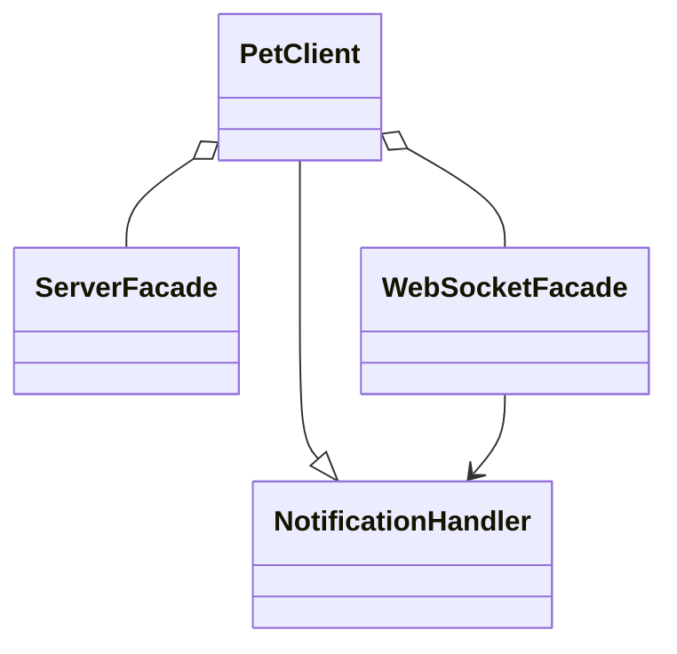
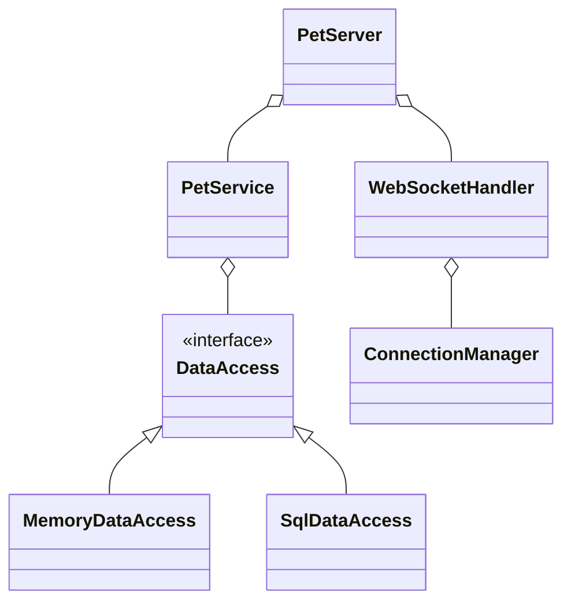
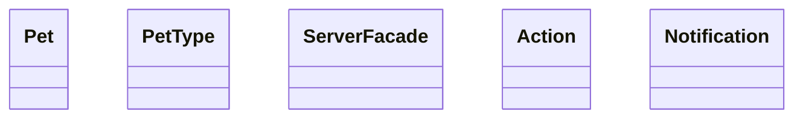
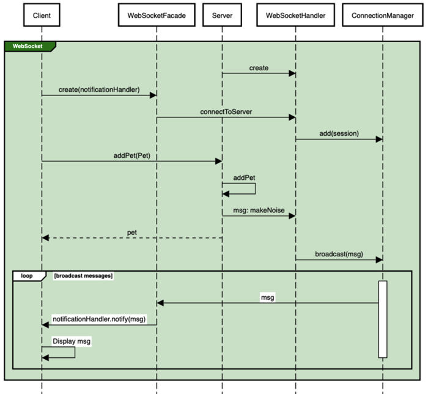

# 🐶 Pet Shop

The Pet Shop application demonstrates many of the topics presented in this course and serves as an example of how the concepts work together as a complete application.

**Concepts Demonstrated**

- Console client
- Client HTTP and WebSocket facade
- HTTP and WebSocket Server using Javalin
- Service with application logic
- JSON serialization using GSON
- Model objects
- Data persistence with memory and MySQL implementations
- Shared code
- Tests at the client, server, service, and data layers

> [!IMPORTANT]
>
> You can use Pet Shop for inspiration on how to build your chess application, but be careful to **fully understand the code** before you reuse anything that it provides. Many of the representations are simplified and will not directly translate to what is required in the chess application.

## Source Code

The [Pet Shop source code](https://github.com/softwareconstruction240/softwareconstruction/tree/main/petshop) is found in the course instruction repository that you are currently viewing. If you haven't already cloned the repository to your development environment, then you should do so now. You can then open the IntelliJ Pet Shop project, study, run and debug the code.

## Architecture

The following diagram demonstrates the different components that make up the Pet Shop application. This includes all of the layers starting with the client interface all the way down to the data that is persisted in the Database.


It is important to note that each layer only talks to the layer that it is adjacent to. For example, the Client layer does not directly talk to the Service or DataAccess layers. This level of abstraction encourages the decoupling of the components and makes the application easier to understand and maintain.

| Layer          | Implemented By            | Description                                                      |
| -------------- | ------------------------- | ---------------------------------------------------------------- |
| **Client**     | PetClient                 | Interact with users and send requests to the server.             |
| **Network**    | PetServer                 | Converts HTTP requests into Java objects.                        |
| **Service**    | PetService                | Performs validation and implements the logic of the application. |
| **DataAccess** | DataAccess (Memory/MySQL) | Converts Java objects into database requests                     |
| **Database**   | MySQL                     | Persists application objects.                                    |

## Class Diagrams

### Client

The client is invoked from the **ClientMain** class when handling user requests, or by the **PetClientTest** when executing unit tests.

The **PetClient** controls the REPL (Read, Execute, Print, Loop) interaction with the application user. It also sends requests to the Server using both the HTTP and WebSocket network protocols.

**PetClient** implements the **NotificationHandler** interface that allows the **WebSocketFacade** to pass messages that it receives to the **PetClient** for display to the user.



### Server

The server is invoked by the **ServerMain** class when handling client requests, or by the **PetServerTests** when executing unit tests.

**PetServer** handles HTTP communication. **WebSocketHandler** handles WebSocket communication. Together they form the `Network` layer for the server.

The PetServer passes the application objects, represented in network requests, to the `Service` layer represented by the **PetService**. The service layer performs necessary validation and business logic.

In order to persist data between service calls, the PetService reads and writes data to the `DataAccess` layer. The **DataAccess** interface is implemented by two different solutions. **MemoryDataAccess** stores data in memory. **SQLDataAccess** stores data in a relational database (MySQL).



#### Using Different DataAccess Implementations

The **DataAccessTests** call both the Memory and SQL implementations of **DataAccess** using JUnits parameterized testing functionality.

```java
@ParameterizedTest
@ValueSource(classes = {MySqlDataAccess.class, MemoryDataAccess.class})
void addPet(Class<? extends DataAccess> dbClass) throws ResponseException {
    DataAccess dataAccess = getDataAccess(dbClass);

    var pet = new Pet(0, "joe", PetType.FISH);
    assertDoesNotThrow(() -> dataAccess.addPet(pet));
}
```

Command line arguments control which implementation of **DataAccess** is used when **ServerMain** is invoked.

```java
DataAccess dataAccess = new MemoryDataAccess();
if (args.length >= 2 && args[1].equals("sql")) {
    dataAccess = new MySqlDataAccess();
}
```

For example, the following would use the memory persistency implementation.

```sh
java ServerMain memory
```

### Shared

The **ServerFacade** is located in the shared module so that it can be used by both the server tests and the client application.

**Pet** and **PetType** are the core data models for the application.

**Action** and **Notification** are used for WebSocket communication.



## Endpoint Sequence Diagrams

The [Pet Shop Sequence Diagram](https://sequencediagram.org/index.html#initialData=IYYwLg9gTgBAwgGwJYFMB2YBQAHYUxIhK4YwDKKUAbpTngUSWDABLBoAmCtu+hx7ZhWqEUdPo0EwAIsDDAAgiBAoAzqswc5wAEbBVKGBx2ZM6MFACeq3ETQBzGAAYAdAE5M9qBACu2AMQALADMABwATG4gMP7I9gAWYDoIPoZwUChyhgAKKFiIqKQAtAB85JQ0UABcMADa2QDyZAAqALowAPTYeQA6aADeAERIHIM1TgA0MINowAC2KGPTPYNTg2CW3UuDKwC+mMKVMKWs7FyUNUMjS5PTswvbK2sbWzU7g-tsnNywJ4eiNWAHA4uTAAApQQBKUw6DLAADWMCQqiMEEcZxg8X0MAAZtx9AcKqJjn8KhcYABRKDeaowNAQVH2FEAdyQYHiuPxGkOlBJZQK5hqgScTj6QwW6mA9kWbypNJq9MZLLZHLxmVUq2mqnkYB8GqFIv26A4pn+KmOZVk8iUKnUgOBoLB3TA0KtimUahRJ2MNQUwJgzpgoLdMEgQbyzV03Ewbptnr55REKhqoMJScMRROX3OtNT2Z+FtO33JAHUUDoyBAQPC8i45giUAA5CDIlBg+4oKaqXycaH53mZso82lXUbjNYdx6a9abGXLD5po6D+DIQUwcIisXDMfOCfzOfvZ6zqdGzimLy+ALQdjSmIAMTgFOkcAUMAAMsjmKCNALikOybStQAOIUm0nTOouA5lP2tKDIMmAwYWZooDUyDat+YLQshhaxh6dowGhYAYa62hxuohY+jAQF5DAwAIAgAZ5CiOLeHM4ZYLhtpeqS6YpnkH7aouxLLjBfFgAJWCIcuw41LU-TTNc453PuU5Hq884wLsrSQb8Jy-mANQbqKaByduNx7g8bxPNMLwHns2nGue3h+P4XgoOgMRxIkbkedIKDcGAOR5Jg+lIQBsnSBSb6gRS7RdHkHRVM6ACSJrDoWonTPBUn-rxMDSkReRgiMWFEuaJycZ6NQFY6JUxqReFemUlHUV+eQhqy7IwMl0i4qx7H1dajUJshYlCeVWZnD8Y2YHRbXMCgAAen4aDliZUACRj+XkKC1RwpXpjhDVcTUHDbYFe0kUNXEUToNR+QFhg9X1EBsam2EiVN5JUC2JprZlZYVlWNZgHWDbNq27b7l2Pb7QhX26bllRWfB6XLvphlOIEfTzqY-kGOxqJqGgADkC3LYJUk8cjuNo3pq4YAa2NoO8ZhnmzJpOZe-gZBwMTYEgaCIg9O0wAo9HsT+DPMNT5K1JF0XNLF4HBWj0EI282UI2FeVnY94sIMR40Zpax1VVt+v0UblXkd6d0yOdhgG5LL1varZUZpNxa0j9Izw97I3hbTAEJhj65Y30rOOZgQA) shows each of the Pet Shop service endpoints and the flow of each request through the server layers. Each element on the diagram corresponds directly to the source code, making it a valuable reference for understanding the underlying server logic.

For example, the following diagrams the flow from the client to the database layers when a **Create Pet** requests is made.


## WebSocket Sequence Diagrams

The endpoint sequence diagrams demonstrate the generation of a WebSocket message with the call to `WebSocket.makeNoise(name, sound)` when a pet is created or deleted.

Pet Shop uses the WebSocket protocol to broadcast events that happen on one client to other clients. When the client starts up it creates a WebSocket session with the server through the **WebSocketFacade**. The client also registers itself as an observer for when WebSocket messages are received.

The server tracks all of the connected clients in the **ConnectionManager**. Then when a message needs to be broadcast, it calls the `broadcast` method on the ConnectionManager and that sends out all of the messages to the connected clients.

The Pet Shop [WebSocket Communication Diagram](https://sequencediagram.org/index.html#initialData=A4QwTgLglgxloDsIAIDCAbKBTJAoUks8ISyA6lgEYDKA9jANZYQBiIMIAJlvuNHIhTUsYAG4jcuHBDABPAM6g4CAObIADADoAnLhVhaAV2ABiWVnTpaAd2QnMKgBYRzlm+Sp1GzScLEjkAFoAPg8aeiYIAAkSTnQRAC5kGDAsEAgeSQxsUhCwr0i2Dm4klLSMgAoEWmgAM1h0qFoEGIQ4kQBKXApw71Z2Liwg0J6C5lb2sFLmhCwYCAAVWj9xMElRiPHY+LBhtBm56GaAWRIQFUTkLk4K+Sx5eSaELqzMaT2Vy+uABWYK34gXU+uzywKSPx8wL2Gz6Ex2SQAtvIVIiQEwAHK0KB3XBQwJ5bLSJLAHzrTybaLbAIEg7zJ6nBDnS6UAxcDjyCAVJEqLpWWjAZAs2hskAc5AI+7yJnyXDsaCidJDVC0o4IBlMtbKhCzOknM4XEEjcl9IqDRHIsm9QoDbh7QlIJLVOoNVVwkSaJ1QWqyLnIl72lAEt4O5AAEWxwHQIFk4otkm4cqgCoy+21h3p+okkhwnEkUjaQA) visualizes how this all works.


