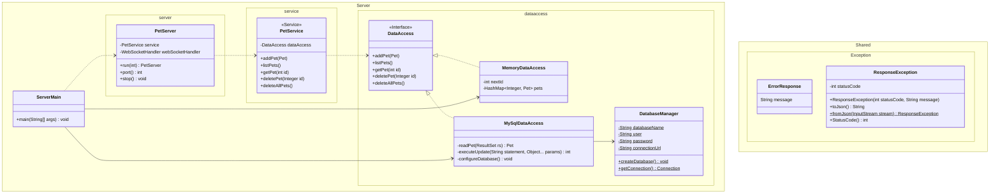

# PetShop Server Architecture

> [!TIP]
> View the [sequence diagram][sequence-diagram-link] directly.

The PetShop server architecture is designed to illustrate core patterns and principles of a well-structured server-side application. This documentation aims to provide CS 240 students with a clear understanding of the separation of responsibilities between different layers of the server, and how they interact to handle client requests.

At the heart of this architecture are various components, each with a distinct role in processing data and ensuring the reliability and scalability of the system. By adhering to strict [N-1 dependency](https://www.oreilly.com/library/view/software-architecture-patterns/9781491971437/ch01.html) rules, each layer only interacts with the layer directly beneath it, avoiding unnecessary complexity and promoting maintainability.

## Layer Overview

We’ve carefully structured the server architecture to keep things organized and manageable. Each layer has a clear job and handles a specific part of the app’s complexity, making the system easier to understand and maintain.

| Layer | Implemented By | Description |
| :---: | :------------- | :---------- |
| **Client** | Not necessarily a human, but the direct user of this Web API.   _This will typically be a client-facing application that forwards client intentions to this API._ | Send requests to be fulfilled. |
| **Server** | Library code: Spark. | Converts incoming HTTP requests into formats easily readable by Java code. |
| **Handler** | App code. Functions connected to endpoints. | Parses out information specific to a particular endpoint and wraps it in a format easily used by the `Service` layer. |
| **Service** | App code. Functions inside classes designated as "services" | Performs validation, logic, updates, and transformation particular to the application. |
| **DataAccess** | App code. Classes implementing interfaces. | Transforms data from an app-friendly format into the format required by a specific database. |
| **Database (db)** | External software: MySQL | Stores and queries data and acts as the source of truth. Supports multiple users changing data simultaneously. |

## Class Diagram

This class diagram shows the relationships between each of the classes and folders in the PetShop server package. This diagram shows the public & private methods and fields stored by each class.

The arrows of dependency reflect the layered architecture described above with the notable exception that the root ServerMain instantiates and choose which particular DataAccess implementation to use in the rest of the system.

## Sequence Diagram

Sequence diagrams are a powerful tool for visualizing the logical flow of a program as it executes. In this context, the sequence diagram for PetShop illustrates the function calls, parameters, and return types of key functions within the server architecture. As with any diagram, minor details are sometimes omitted to avoid distracting from the overall purpose of the diagram.

The PetShop sequence diagram shows each of the public PetShop HTTP endpoints and the internal organization of the PetServer that responds to each request. Each element on the diagram corresponds directly to the source code, making it a valuable reference for understanding the underlying server logic.

Click on the image to view the [full diagram][sequence-diagram-link]. A preview of the diagram is provided below for easy reference.

[][sequence-diagram-link]

<!-- The Actual Sequence Diagram link is provided below in only a single place.
  This anticipates that updates to the diagram will be likely.
  Multiple places in this document access it with
  [Reference Style Links](https://www.markdownguide.org/basic-syntax/#reference-style-links). -->

[sequence-diagram-link]: https://sequencediagram.org/index.html#initialData=IYYwLg9gTgBAwgGwJYFMB2YBQAHYUxIhK4YwDKKUAbpTngUSWDABLBoAmCtu+hx7ZhWqEUdPo0EwAIsDDAAgiBAoAzqswc5wAEbBVKGBx2ZM6MFACeq3ETQBzGAAYAdAE5M9qBACu2GADEXijo8FAocoYACijMAQDuABZIYGKIqKQAtAB85JQ0UABcMADaUQDyZAAqALowAPTYsQA6aADeAERIHB3FTgA0MB1owAC2KL1DzR2DHWCWTZMd0wC+mMIFMDms7FyUxZ3dkwNDI+NL07Pzi8XLHWtsnNyw2xuixcAcHDFgABQ-AEpTDpwsAANYwJCqIwQRy7GCJfQwABm3H063yoi2r3y+xgAFEoN4ijA0BAYfZofEUokUWiNBtKNjculzMUACxOJytTrjdTAewTW6E4nFMkUqk0ukRVQzIaqeRgHyyjlctboDimN4qLa5WTyJQqdQfL4-X5NMBA-WKZRqaHbYzFBRfGAWmA-a0wSDu2JVXTcTDWw125l5EQqYo-DHhwyZbaPPYkqMJ566nZPPEAdRQOjIEBAYNiLlG4JQADkIFCUL8zihBqpfJwgSmmXHcoySYcen1ZrWLnK5gshVN7tHNm34Mg2TAAExcnldbvOXtjYd3K5D-vqzimLy+fwBbA+KDYbgwAAyUOYP2hCWSqUwrKy7dxJJKAHF8bUGhax63ci2JIdB0mCAWm2ooMUyAKjevxAhBaZBraxowNBYCwVa2jBuoaaOjA76xDAwAIAgrqxNCyLeKMZFYEhRr2jiMbFHAEAkSg4BIBAaAADw-NkY5YhOgHMax3AcVxvGxPxYETh2BwdBakwlG0QxHD2pyrv2G43COMArDUawdqGT5gMUc7cu0QwWiqpRdscK7nLclxDNca6rHU26ap43h+IE4QcDIKDcKkPpxDoCCgGCj5Ts+YYFMUJTSPi55fvidSNLE9SFBaACSmpGfGuzPLcIEyS+TEwIK6GxL83TwZiOrbHRdrFFVZp1YGWHIfauR4QR16xJ61JgLSOXSCiVGhZ1BrdaGEGRrEAmNYVGZJotmDEQNzDYOEVCccqCCWDAKAAB5XigmplXF7xGEFsQoO1HD1TGiFdfRxQcHdqSPZhM30bhOjFNIX2GGNE0QNRUYIUJRV4lQlaXbDLwAUjxTZrm+aFmAxalhWVY1qu9aNk9oFI3Nr5OSBBXbCZZlOOyrQjqYQUGKFRjdKSEDbbt+2qIdx1nQqpOreT1B4ncf4vDTMWmTAnIM2gEsaszO67j5B5eMAR3A8FhgKCRoW3kkKRpDL4EU6USUpVUaU-otBUo6tJXC4m5sVZ9uv6wgGFLbGepvS1t2eyRPvNThDqA4FuswF7hvg5D9sNbGK2JsU8PdC7qayRbEvUyyMt0wrSuq0AA
