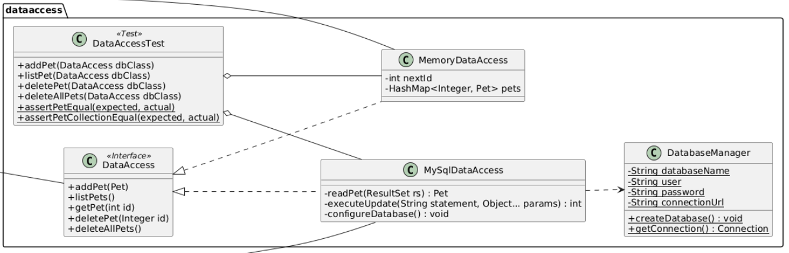

# PetShop Server Architecture

<!-- In this document, images/screenshots of diagrams are presented in order to be compatible with contexts where they would not be rendered live. Links to live/interactive forms of the diagram are also included. Since these screenshots and links are expected to change and evolve with the software application, care has been taken to ensure each is defined only once. Each link can be reference in multiple places in the document with [Reference Style Links](https://www.markdownguide.org/basic-syntax/#reference-style-links). -->

> [!TIP]
> View the key resources directly:
> - [Layer overview](#layer-overview)
> - [Class diagram][class-diagram-link]
> - [Sequence diagram][sequence-diagram-link]
> - [Videos](#videos)

The PetShop server architecture is designed to illustrate core patterns and principles of a well-structured server-side application. This documentation aims to provide CS 240 students with a clear understanding of the separation of responsibilities between different layers of the server, and how they interact to handle client requests.

At the heart of this architecture are various components, each with a distinct role in processing data and ensuring the reliability and scalability of the system. By adhering to strict [N-1 dependency](https://www.oreilly.com/library/view/software-architecture-patterns/9781491971437/ch01.html) rules, each layer only interacts with the layer directly beneath it, avoiding unnecessary complexity and promoting maintainability.

## Layer Overview

We’ve carefully structured the server architecture to keep things organized and manageable. Each layer has a clear job and handles a specific part of the app’s complexity, making the system easier to understand and maintain.

| Layer | Implemented By | Description |
| :---: | :------------- | :---------- |
| **Client** | Not necessarily a human, but the direct user of this Web API.   _This will typically be a client-facing application that forwards client intentions to this API._ | Send requests to be fulfilled. |
| **Server** | Library code: Spark. | Converts incoming HTTP requests into formats easily readable by Java code. |
| **Handler** | App code. Functions connected to endpoints. | Parses out information specific to a particular endpoint and wraps it in a format easily used by the `Service` layer. |
| **Service** | App code. Functions inside classes designated as "services" | Performs validation, logic, updates, and transformation particular to the application. |
| **DataAccess** | App code. Classes implementing interfaces. | Transforms data from an app-friendly format into the format required by a specific database. |
| **Database (db)** | External software: MySQL | Stores and queries data and acts as the source of truth. Supports multiple users changing data simultaneously. |

## Class Diagram

The class diagram provides a clear visual representation of how the classes and folders within the PetShop server package interact. It highlights the public and private methods and fields associated with each class.

The arrows in the diagram reflect the layered architecture we've discussed, with one key exception: the root `ServerMain` is responsible for instantiating and selecting the specific `DataAccess` implementation to be used throughout the system.

Click on the image to view the interactive form of the [full class diagram][class-diagram-link]. A sample of the diagram is provided below for easy reference.

<!-- An image of the class diagram generated by Mermaid.live. The source code for the diagram lives in `class-diagram.mermaid`. -->
[][class-diagram-link]

[class-diagram-link]: https://mermaid.live/view#pako:eNrFGG1T2zb4r-h89JaU2KQrKZD1esdIWtiVwDUw7rbsg2IpiYotuZJMwhj97Xsk2YnsmNLtw5Y7cPK8vz-SH4JYEBr0gzAMJ1wzndA-uqR6vBAZGlN5RyU6SbBSaMDwXOJ0wi3lhL94gc6pTDEjiCmEUYrlLRFLjhLM5zmeU6QXWCNJOaFSoXiBpVZoihUlSHCkWJolFKl7rvEqsuI-UUyAiSIi4jylgNAMKGdCotiaQJwJqo8WWmeqv7eXOguizyoScr7npO1Z6sLeaKHTxIo_EVwxsAVlWGnG53sioxyeoBIcmDGwhnGrv_TrI7ujiBKmhexsqUwAudexkq8EUpRaVucuuCipyhONWh-YPs2nUSxShBMl1vGwfjoTIRwJ47QdFWG9OR2O0NXp2RidnB6PPgzH6DKhEDeUZwRrp2cmkkQsjfUCfkqjTuQyppAJhZY0SfpWVOgiFxaaQoVN1KMM-FoZ8ECQTe7umMpxggRk-47RJdLCKlE6J4ai3SgLXAJZupCW4ns0BRNNerGROcNJMsXxLWIz31nIouA_lHXRLBmicYtagwvwfHRxhUbD4QBdXaCfh-j6cnB8NRz8hDLBjOmFoVOJebxAywWD_y5KxugJ9ythwgmTNLY19fGTwXKcUpXhGDx1lf4w4Qg-rtpc9Z9jKIoCbj67kHzeGmsJsf_9D4TlXLXRnWDEkTxO-GOT6KhJg-mzCth8wgLKCl54esgbOh2L-JbqU8xJApzLGsCzVOa8BVFqb_R4yExI3WpDxWsPqLTIWjV3Gsy9oko3mWx6q_y246Ed5D2OMSnj4aGVhsngSFrtClxkDeAYegEgGwAmBPT7EEJNXdaACVMaQMqHMX6HE2bYjwm0OVSGj90Fp6k0TMMv0B4tusqgfCjpIBxrALTRThPxCbSmK7Nn2J6plQhSq2xqq1UDc4wXZezXpStJ08pmXo1Apo-kShmG4umnHPqwKGeUqvmTyd9oPcccpnulZncBG-cSehrKUC3OcfbViex4fF9RvP6u_MCRtQGe8Z3SVgiKffqWufKmKQysBtYtyqkUmMQw9UtiuooTGG2_-upGQrMZi93O4d6PJ0Oy1Yt-S2zHq9l7wIN_QNCq-QsBKLLi8HWvQgg2tMa_iFxIV0x_T9xSfEtHgql1kKG7Cw3uN-wcTr57_JmJ1jT_PLj5vH1bAN-982weYI2PY1hwsEDWX6tVZBoe_vwObmr63Tk1MDMaESM-YjM3ziC2JmdN-OMk8UU-Nnv01Iz0xvo_G2pNrjQOurWVWY2ai4GYqxumF-_NecJzoDlnJs7YhbySNi8VlbSZoMkZribuf02Mb_U5jAt532x7aFRyutJnfpuUo6zQ2THZ_Wp6QDUruB9_SZ6QL-Foa8z_ZE-FYxjpUtm9XOlKGueaXtvjS9lxsBw1NWfhDrqYfobxEUURHGDNQaq2vOE8xmdsnktqbDDn7Pomr-fQ0DQM87BQTQoS0_E722g46ckGMByu1VJI0oDaDMBrmfirM4bw6LrZleU6N2u15AYCbwfuPOmfy0O9EcuC9AfK1F5xGurzGapNXX4PXVmf36b97w8dcDOjJBquYpr5pwoXyKGUQkLZZrC2KmO6up0ak1CybYle95wp71ydwBXUc2qLrVUl3dqMHq8WvyhbIY7Ew8ykSC3ujGe5BjSFm5eyj7ZnaVYtq-JoVar2T8xlJOEC42UUQnpr4-HB3v4FTVufPw0U1QHiE9giFmH4TSkborqg-mgKw3f1CVB4Uq6otRve2jKifalA7mHDUNTWn8-8tm0D8jTCALqsKQRQnXyD8XS524hvTHE_8biNdxvml4C42bo1mXt3_TwXhi99Eb655lo44d4VsaauhtlOW52gnrKqRZvwbJ8rjT8b6IRvuVElKNiCTjCXjAR9LXPaCYq3GkE_sC06CeBaDTeIoA9fCZ1h2FqTAAoe2DLMfxMiLTmlyOeLoA_XfQW_3OW7uHGvSexd_wQOizroH7y2IoL-Q7AK-kcHUbfXO_qx96bbPdx_9Wq_E9wH_cM30UGv23213-sevd4_6h0-doI_rc5udHjQ6wQ412J8z-NSg3tJc-5eZdk3Wo9_A5hxMGY

## Sequence Diagram

Sequence diagrams are a powerful tool for visualizing the logical flow of a program as it executes. In this context, the sequence diagram for PetShop illustrates the function calls, parameters, and return types of key functions within the server architecture. As with any diagram, minor details are sometimes omitted to avoid distracting from the overall purpose of the diagram.

The PetShop sequence diagram shows each of the public PetShop HTTP endpoints and the internal organization of the PetServer that responds to each request. Each element on the diagram corresponds directly to the source code, making it a valuable reference for understanding the underlying server logic.

Click on the image to view the [full sequence diagram][sequence-diagram-link]. A preview of the diagram is provided below for easy reference.

[][sequence-diagram-link]

[sequence-diagram-link]: https://sequencediagram.org/index.html#initialData=IYYwLg9gTgBAwgGwJYFMB2YBQAHYUxIhK4YwDKKUAbpTngUSWDABLBoAmCtu+hx7ZhWqEUdPo0EwAIsDDAAgiBAoAzqswc5wAEbBVKGBx2ZM6MFACeq3ETQBzGAAYAdAE5M9qBACu2GADEXijo8FAocoYACijMAQDuABZIYGKIqKQAtAB85JQ0UABcMADaUQDyZAAqALowAPTYsQA6aADeAERIHB3FTgA0MB1owAC2KL1DzR2DHWCWTZMd0wC+mMIFMDms7FyUxZ3dkwNDI+NL07Pzi8XLHWtsnNyw2xuixcAcHDFgABQ-AEpTDpwsAANYwJCqIwQRy7GCJfQwABm3H063yoi2r3y+xgAFEoN4ijA0BAYfZofEUokUWiNBtKNjculzMUACxOJytTrjdTAewTW6E4nFMkUqk0ukRVQzIaqeRgHyyjlctboDimN4qLa5WTyJQqdQfL4-X5NMBA-WKZRqaHbYzFBRfGAWmA-a0wSDu2JVXTcTDWw125l5EQqYo-DHhwyZbaPPYkqMJ566nZPPEAdRQOjIEBAYNiLlG4JQADkIFCUL8zihBqpfJwgSmmXHcoySYcen1ZrWLnK5gshVN7tHNm34Mg2TAAExcnldbvOXtjYd3K5D-vqzimLy+fwBbA+KDYbgwAAyUOYP2hCWSqUwrKy7dxJJKAHF8bUGhax63ci2JIdB0mCAWm2ooMUyAKjevxAhBaZBraxowNBYCwVa2jBuoaaOjA76xDAwAIAgrqxNCyLeKMZFYEhRr2jiMbFHAEAkSg4BIBAaAADw-NkY5YhOgHMax3AcVxvGxPxYETh2BwdBakwlG0QxHD2pyrv2G43COMArDUawdqGT5gMUc7cu0QwWiqpRdscK7nLclxDNca6rHU26ap43h+IE4QcDIKDcKkPpxDoCCgGCj5Ts+YYFMUJTSPi55fvidSNLE9SFBaACSmpGfGuzPLcIEyS+TEwIK6GxL83TwZiOrbHRdrFFVZp1YGWHIfauR4QR16xJ61JgLSOXSCiVGhZ1BrdaGEGRrEAmNYVGZJotmDEQNzDYOEVCccqCCWDAKAAB5XigmplXF7xGEFsQoO1HD1TGiFdfRxQcHdqSPZhM30bhOjFNIX2GGNE0QNRUYIUJRV4lQlaXbDLwAUjxTZrm+aFmAxalhWVY1qu9aNk9oFI3Nr5OSBBXbCZZlOOyrQjqYQUGKFRjdKSEDbbt+2qIdx1nQqpOreT1B4ncf4vDTMWmTAnIM2gEsaszO67j5B5eMAR3A8FhgKCRoW3kkKRpDL4EU6USUpVUaU-otBUo6tJXC4m5sVZ9uv6wgGFLbGepvS1t2eyRPvNThDqA4FuswF7hvg5D9sNbGK2JsU8PdC7qayRbEvUyyMt0wrSuq0AA

##  Videos (0:25:28)

> [!NOTE]
> The Class Diagram has been updated since some of the videos were recorded. Follow along by viewing the docs at the time the first videos were created: [commit 9b14fa](https://github.com/softwareconstruction240/softwareconstruction/blob/9b14fa94346d9c509cf06fbcc873150e25e4e346/petshop/server/docs/server-architecture.md).

These videos are intended to provide a high-level conceptual overview of the project's organization. While they offer valuable context, they may not reflect the most up-to-date code-level details. The written specifications are updated more frequently than the videos, but in the event of any discrepancies, the code itself serves as the definitive source of truth.

- 🎥 [PetShop Server Architecture — Class Diagram — Overview (4:04)](https://www.loom.com/share/d7fd49750bd54c33bc8f1af39630313b?sid=6157ba6e-3195-4841-a193-39afc5ff4162)
- 🎥 [PetShop Server Architecture — Class Diagram — Code Walkthrough 1 (3:03)](https://www.loom.com/share/056bd6a59adc43508aeb53e903a76bd5?sid=8b884422-1e6a-41ac-be50-f1cc339b24fd)
- 🎥 [PetShop Server Architecture — Class Diagram — Code Walkthrough 2 (3:51)](https://www.loom.com/share/a4e166a8d75144e9812398de61ececf6?sid=6e1702d0-d288-44bc-ab2f-de7580186218)
- 🎥 [PetShop Server Architecture — Class Diagram — Overview 2 (WebSocket) (2:45)](https://www.loom.com/share/112d7102cdef4913ba630284b7bed781?sid=3f172704-743f-496e-8b46-c3a3b1962e58)
- 🎥 [PetShop Server Architecture — Sequence Diagram — Overview (4:16)](https://www.loom.com/share/fc8b2a9b34044b03aa97487f7fe4435b?sid=9ec0d4f3-f10d-450c-9186-3b6dfaa36d61)
- 🎥 [PetShop Server Architecture — Sequence Diagram — Code Walkthrough (7:28)](https://www.loom.com/share/55bfb792c05d452a82773821fab7685a?sid=680934ed-3820-4066-b97a-ebf00d179840)
