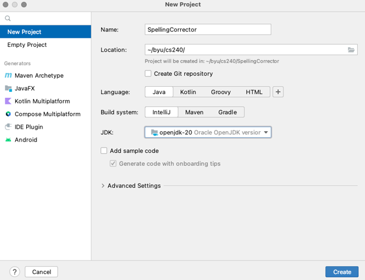
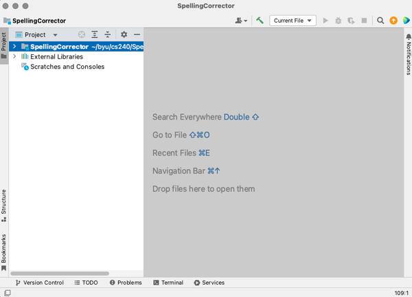
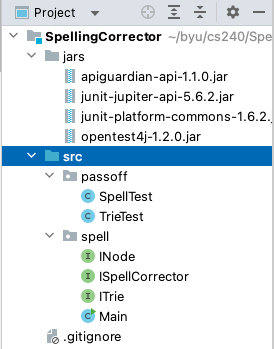
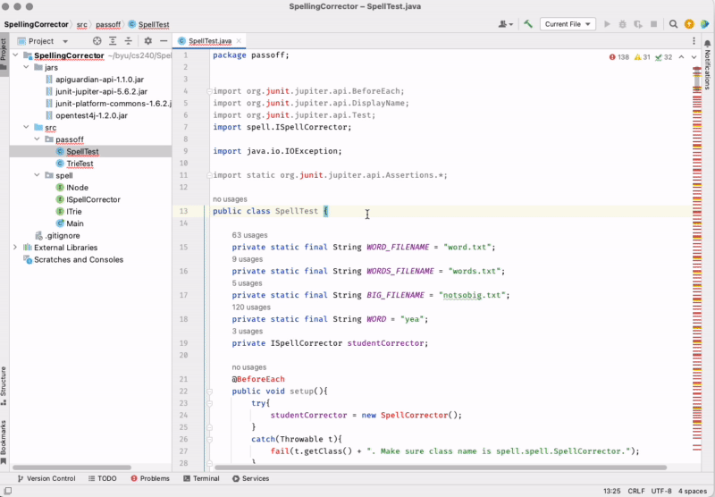
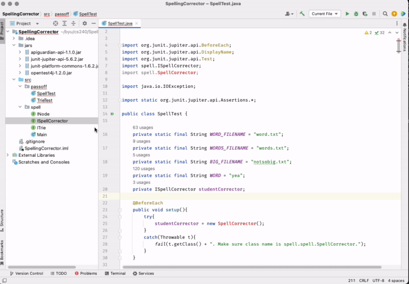
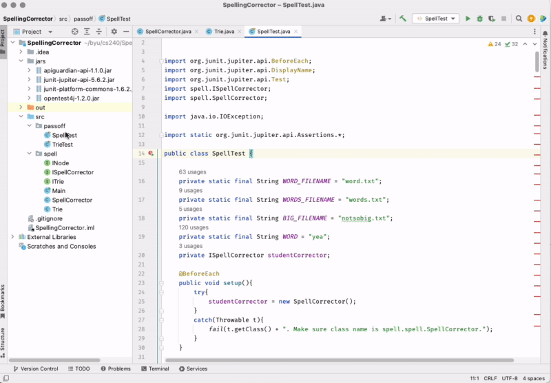

# Spelling Corrector IntelliJ Setup

📁 [Starter code](../starter-code): Application interfaces and testing code.

## Create a Project

Open IntelliJ and create a new Project by selecting the `File > New > Project...` from the main menu.

Create your project the location where you want to store you work for this course.



⚠ You may need to install a JDK version at this point if you have not already. You can use the option in the `New Project` dialog to do that for you.



## Copy the Starter Code

Copy the [Starter code](../starter-code) `jars` folder to the main folder of your project.

Copy the [Starter code](../starter-code) `spell` and `passoff` folders to the `src` folder of your project.

When you are done copying the starter code your project should look similar to the following. You’ll see a lot of red errors, but that is okay for now.



## Dependencies

The last step we need to do is add dependencies to your project. Since these tests run on JUnit you need to have the files for JUnit so that IntelliJ can access them and use them. The folder that is labeled `jars` is where all this code is stored as .jar files. So we will add dependencies to your project for these files so that your project knows where to go in order to access the code.

Select File > Project Structure. Click on `Modules` and then the `Dependencies` tab. Click the little `+` icon in the `Dependencies` pane and select `JARs or directories`. Navigate to the jars folder in your project and select all of the jar files then click `OK`.

⚠ Note: We will update jar versions occasionally, so the list of jars in the zip file may not match what you see in the screenshot.



All of the errors should be gone now except for one related to `new SpellCorrector()` in `SpellTest` and two related to `new Trie()` in `TrieTest`. We’ll fix those now by creating these classes.

## Implementing Interfaces

Right click on your spell package and select `New > Java Class` and name it `SpellCorrector`. Now we’ll make it implement the interface file that we have. After `public class SpellCorrector` write `implements ISpellCorrector`. You’ll see an error, click on the red lightbulb or click Alt+Enter to pull up suggestions. One of the suggestions will be `Implement Methods` click this and select all the interface methods. IntelliJ will automatically generate the needed code and the `SpellCorrector` error in `SpellTest` will be gone.



When you are done the `SpellCorrector` class should look like this:

```java
package spell;

import java.io.IOException;

public class SpellCorrector implements ISpellCorrector {
    @Override
    public void useDictionary(String dictionaryFileName) throws IOException {

    }

    @Override
    public String suggestSimilarWord(String inputWord) {
        return null;
    }
}
```

Go and do the same thing for the `ITrie` interface by creating a `Trie` class and implementing the interface methods. All of the errors will now be gone in TrieTest and SpellTest.

## Running the tests

With the required interfaces all implemented you can now run the tests. Open the `SpellTest` and click the icon to the left of the class declaration. Then select `Run SpellTest`.

This will run the tests. The tests will obviously fail because you have not written your code yet, but now you have the tests all ready to go so you can test as you code.



Do the same thing with the `TrieTest` class and observe them failing.

⚠ Note: You will also need to create a Node class, implement INode, and copy over the test `txt` files from the starter code. However, this will not affect the test from running.

## Implementing the code

Your job is to now write all the code necessary to get all of the tests to pass. Once they all pass then you know that you have a working spelling corrector.

Using tests to help implement your code not only makes it easier to write your code, but it helps you feel confident that you can change your code without breaking anything. In this case we wrote all of the tests for you. We will also provide many of the tests necessary for the rest of the course. However, you will want to practice writing your own tests in order to become proficient with the process of Test Driven Development (`TDD`).
